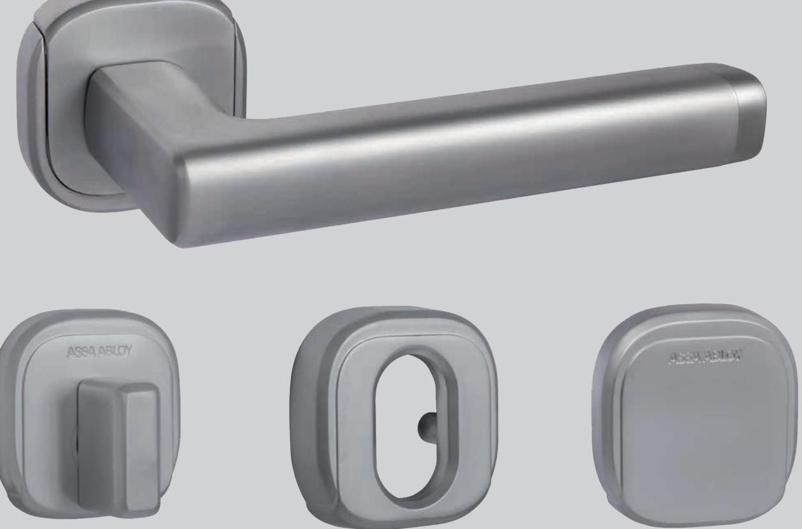
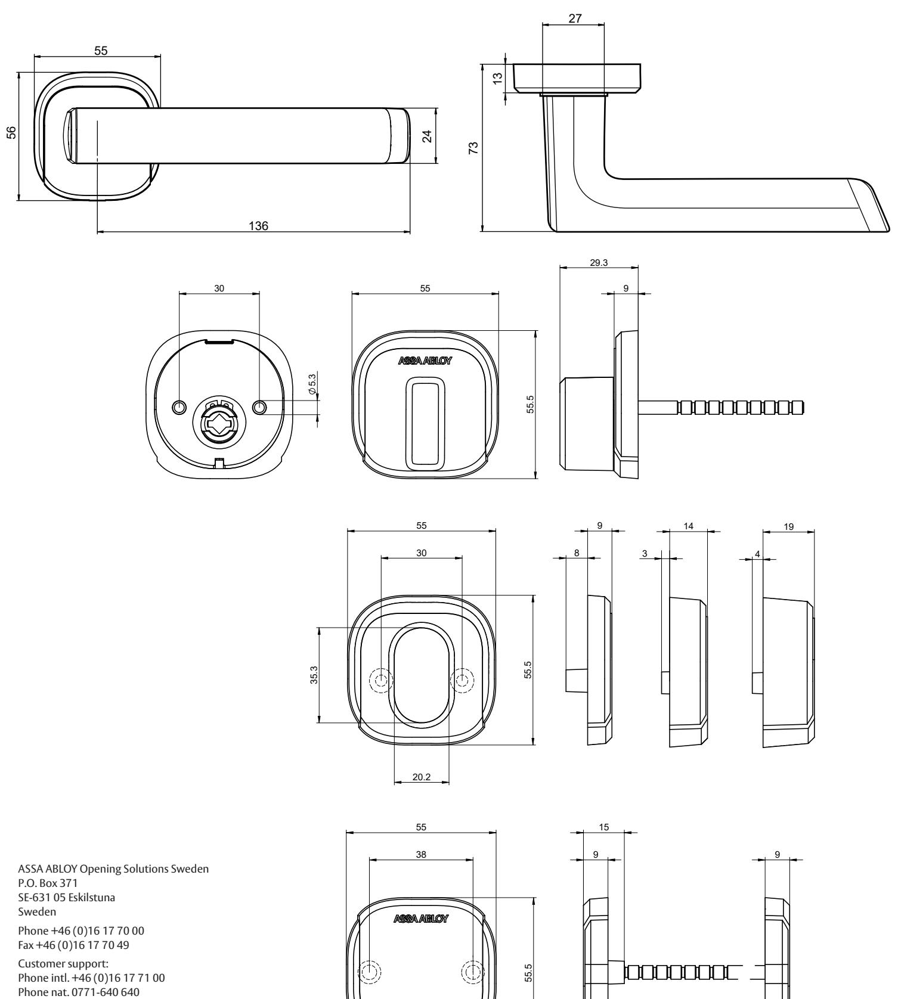

## Trycke Quadratum 9010 Cylinderbehör Quadratum

## **Quadratum trycke**

Mekaniskt trycke i modern, diskret och stilren design Passar skandinaviska låshus

Genomgående fastsättning med M5-skruv Montageskruvarna är dolda bakom rosettens täckskylt Returfjäder för att avlasta låshusets tryckesroddarfjäder och för att säkerhetsställa att trycket återgår till horisontalläge. Matchar i design bland annat Aperio R H100- trycket Grundmaterial: Zink

Finns i ytbehandling 011 Krom, 113 Satinkrom Dörrtjocklek: 40-75 mm, tryckespinne 8 mm.

## **Quadratum cylinderbehör**

En serie av cylinderbehör som utseendemässigt passar till trycke Quadratum 9010.

I sortimentet finns det täckskyltar, vred och cylinderingar i olika djup (6-11mm, 11-16mm, 16-21mm) för oval cylinder. Materialet är genomgående zink. Finns i Ytbehandling 011 Krom, 113 Satinkrom.

## Trycke Quadratum 9010 Cylinderbehör Quadratum

Fax +46 (0)16 17 73 72

www.assaabloyopeningsolutions.se

e-mail: helpdesk.se.openingsolutions@assaabloy.com

M4416.2101

We reserve the right to correct any printing errors and update the information after printing.