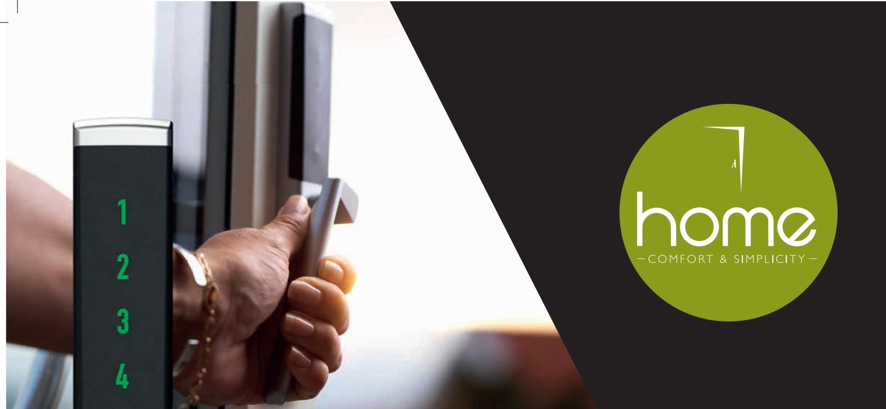
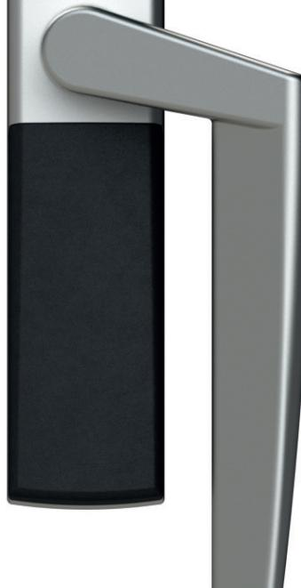
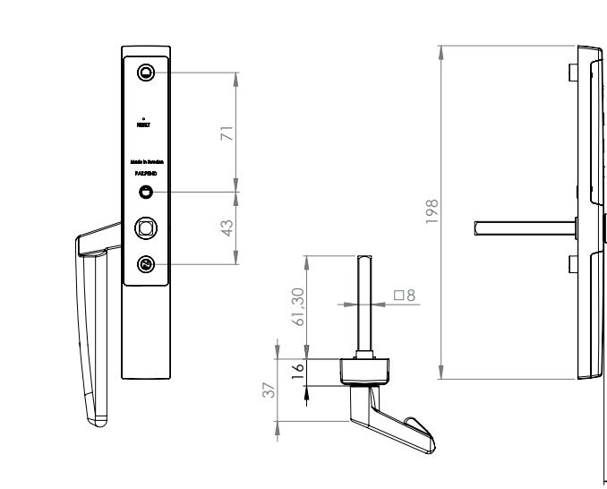

*Avbildat handtag är högersvängt, fi nns även rakt och vänstersvängt.*

29

42

8

61,30

16

37

Dok.nr.4.5-A4

CAD-model: 00109095, applies unless otherwise stated.

**Bekvämt och enkelt. Skandinavisk design. Det är Vision Home.**

**www.vision-home.se**

Dok.nr.4.5-A4

CAD-model: 00109095, applies unless otherwise stated.

## **DIGITALT HANDTAG Handtag med kodlås för altandörr och fönster**

- Elektromekaniskt handtag för montering invändigt på altandörr/fönster.
- Dolt skruvmontage.
- Standardmått skruvmontage.
- Bakgrundsbelyst touch-knappsats, väcks upp när ett fi nger dras från 1-4.
- Visuell feedback vid kodinmatning.
- Låses upp via en sexsiffrig användarkod.
- Låses när ett fi nger dras från 1-4.
- Användarkoden fi nns kvar vid batteribyte/ spänningsbortfall.
- Användarkoden kan enkelt ändras.
- Drivs av två st 1,5V AAA alkaliska batterier vilka räcker ca två år vid normal användning (ingår ej).
- Varning vid låg batterispänning.

29

42

41

8

Design

61,30

16

37

- Passar dörrar i de fl esta karmar. Passar även dörrar med låga dorn och snäva öppningsradier. Revision Note Appr. Date Appr. By
118

Dok.nr.4.5-A4

Handle EMH, complete

Handtag EMH, komplett

AL 2019-05-24 0.0 g

1:2

CAD-model: 00109095, applies unless otherwise stated.

- Fyrkantssprint 8×8 mm som standard – 7×7 mm sprint kan fås på beställning.
- Standardlängd på fyrkantssprinten är 60 mm – kan beställas i 43 mm och 110 mm.
- Blockeringsfunktion vid upprepad felslagen kod (fem gånger).
- Skydd mot kända manipulationsmetoder som t.ex. dyrkning, slag, vibration, tryckluft och magnetism.
- Tillverkat i mattkromaterad zink, rostfritt stål och nylon. 29
- Temperaturområde: 0-70 C.
- Godkänt enligt SS-3620:2017 klass B.
- Svensktillverkad produkt som är patentsökt.

71 43

198

41

Concept Development

Material (intl.)

Design

Article No. Revision Approved by Approved date Tolerances unless otherwise specified View orientation

1:2

Design

2019-09-26 13:46:28

**+46 (0)10-130 75 00**

http://www.industrilas.com Project article No.

Date Scale Weight Material (se) Surface treatment HANDTAG E

Handle EMH, complete

Handtag EMH, komplett

AL 2019-05-24 0.0 g

1:2

71 43

Revision Note Appr. Date Appr. By

Concept Development

Material (intl.)

http://www.industrilas.com Project article No.

**+46 (0)10-130 75 00**

Date Scale Weight Material (se) Surface treatment HANDTAG E

> Article No. Revision Approved by Approved date Tolerances unless otherwise specified View orientation

> > 2019-09-26 13:46:28

7404-01400-08060

Concept Development

Material (intl.)

Article No. Revision Approved by Approved date Tolerances unless otherwise specified View orientation

2019-09-26 13:46:28

7404-01400-08060

SS-ISO 2768-m

SS-ISO 2768-m

71 43

Revision Note Appr. Date Appr. By

7404-01400-08060

SS-ISO 2768-m

AL 2019-05-24 0.0 g

Handle EMH, complete

Handtag EMH, komplett

http://www.industrilas.com Project article No.

**+46 (0)10-130 75 00**

Handle EMH, complete

Article No. Revision Approved by Approved date Tolerances unless otherwise specified View orientation

2019-09-26 13:46:28

7404-01400-08060

Design

SS-ISO 2768-m

Handtag EMH, komplett

AL 2019-05-24 0.0 g

1:2

Date Scale Weight Material (se) Surface treatment HANDTAG E

41

29

61,30

Dok.nr.4.5-A4

16

http://www.industrilas.com Project article No.

Date Scale Weight Material (se) Surface treatment HANDTAG E

37

**+46 (0)10-130 75 00**

8

Concept Development

Material (intl.)