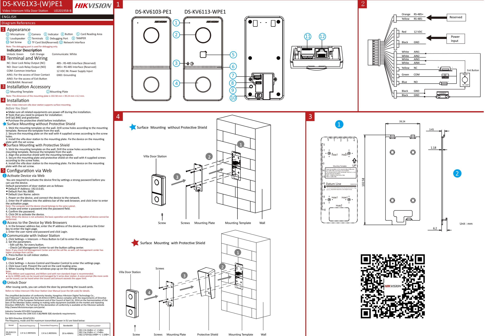
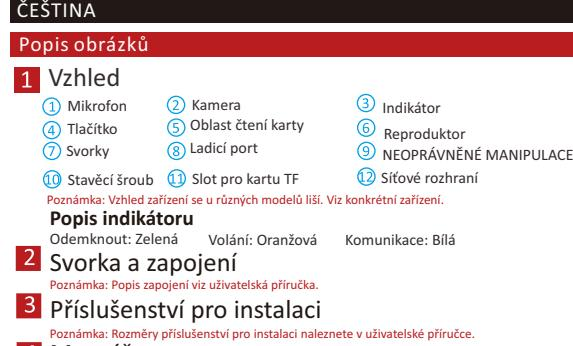

802.11n(ht40):12dBm +/- 1.5dBm

Remarque : l'apparence de l'appareil varie selon le modèle. Reportez-vous à l'appareil proprement dit. **Descripon de l'indicateur** Déverrouillage : Vert Borne et câblage Remarque : reportez-vous au manuel d'ulisaon pour une descripon du câblage. Accessoire d'installaon Remarque : pour connaître les dimensions des accessoires d'installaon, veuillez vous reporter au manuel d'ulisaon. Installaon *Avant de commencer* ● Assurez-vous que l'appareil dans son emballage est en bonne condion et que toutes les pièces de montage sont incluses. ● Assurez-vous que tous les équipements connexes sont hors tension pendant l'installaon. ● Vérifiez que les spécificaons du produit sont adéquates à l'environnement d'installaon. Microphone Indicateur Touche Zone de lecture de carte Haut-parleur Bornes Port de débogage Apparence SABOTAGE Caméra Vis de blocage Fente de carte TF Interface réseau Appeler : orange Communiquer : blanc FRANÇAIS Références du schéma

Remarque : pour l'installaon, reportez-vous à la figure et au manuel d'ulisaon.

# Configuraon

Acver un appareil Vous devrez d'abord acver l'appareil en définissant un mot de passe fort avant de pouvoir l'uliser.

- Acvez l'appareil à distance via le logiciel client iVMS-4200.
Configuraon à distance Remarque : Pour plus de détails sur la configuraon, consultez le manuel d'ulisaon. Diagram References Diagram References Hinweis: Der Auau des Geräts variiert je nach Modell. Beziehen Sie sich auf das tatsächliche Gerät. **Anzeigen** Entriegeln: Grün Anschlüsse und Verkabelung Hinweis: Die Beschreibung der Verkabelung finden Sie im Benutzerhandbuch. Installaonszubehör Hinweis: Entnehmen Sie den Umfang des Installaonszubehörs dem Benutzerhandbuch. Installaon *Bevor Sie beginnen* ● Achten Sie darauf, dass sich das Gerät in der Verpackung in gutem Zustand befindet und alle Montageteile enthalten sind. ● Achten Sie darauf, dass alle relevanten Geräte während der Montage ausgeschaltet sind. ● Überprüfen Sie die Produktspezifikaon für die Installaonsumgebung. Hinweis: Einzelheiten zur Installaon finden Sie in der Abbildung und im Benutzerhandbuch. Konfiguraon Gerät akvieren Bevor Sie das Gerät benutzen können, müssen Sie zunächst ein sicheres Passwort festlegen, um das Gerät zu akvieren. Akvierung aus der Ferne über das Web oder die iVMS-4200 Client-Soware. Fernkonfiguraon Hinweis: Weitere Informaonen zur Konfiguraon finden Sie im Benutzerhandbuch. Mikrofon Statusanzeige Taste Kartenlesebereich Lautsprecher Anschlussklemmen Debug-Anschluss Auau SABOTAGE Kamera Feststellschraube TF-Kartensteckplatz Netzwerkanschluss Anruf: Orange Kommunikaon: Weiß Verweise auf Schaubilder

ENGLISH

DEUTSCH

ENGLISH

NEDERLANDS

ENGLISH

ENGLISH

#### ENGLISH ENGLISH ESPAÑOL

| Diagram References Diagram References Referencias del diagrama                                                                                             |                                                                                                                        |                   |  |
|------------------------------------------------------------------------------------------------------------------------------------------------------------------|------------------------------------------------------------------------------------------------------------------------|-------------------|--|
| Apariencia Micrófono Botón                                                                                                                                 | Cámara Área de lectura de tarjetas                                                                                  | Piloto Altavoz |  |
| Terminales                                                                                                                                                       | Puerto de depuración                                                                                                   | MANIPULACIÓN      |  |
| Tornillo de presión Descripción del indicador                                                                                                                 | Ranura para tarjeta TF Nota: el aspecto del disposivo varía en función del modelo. Remítase al disposivo en cuesón. | Interfaz de red   |  |
| Desbloquear: Verde Comunicar: blanco Llamar: naranja Terminal y cableado Nota: Para ver una descripción del cableado, consulte el manual de usuario. |                                                                                                                        |                   |  |
| Accesorio de instalación Instalación Antes de comenzar                                                                                                     | Nota: consulte el manual de usuario para ver las dimensiones de los accesorios de instalación.                         |                   |  |
| ● Asegúrese de que el disposivo incluido esté en buenas condiciones y se incluyan todas las piezas de ensamblaje.                                             |                                                                                                                        |                   |  |

●Asegúrese de que todos los equipos relacionados estén apagados durante la instalación. ● Consulte las especificaciones del producto al realizar la instalación. Nota: Nota: consulte las ilustraciones y el manual de usuario para conocer el procedimiento de instalación.

# Configuración

Acvar disposivo Antes de poder ulizar el disposivo es necesario acvarlo estableciendo una

contraseña segura. Acvelo a distancia a través de la página web o el soware de cliente iVMS-4200.

Configuración remota Nota: consulte el manual de usuario para ver la configuración.

#### ENGLISH ENGLISH ITALIANO

#### Diagram References Diagram References Nota: l'aspeo del disposivo varia in base al modello. Fare riferimento al disposivo effevo. **Descrizione degli indicatori** Sblocco: Verde Terminale e cablaggio Nota: la descrizione del cablaggio fa riferimento al Manuale dell'utente. Microfono Indicatore Pulsante Area di leura schede Altoparlante Terminali Porta di debugging Aspeo MANOMISSIONE Telecamera Vite di arresto Slot per scheda TF Interfaccia di rete Chiamata: arancione Comunicazione: bianco Riferimento schemi

# Accessori per l'installazione

Nota: Per le dimensioni degli accessori di installazione, consultare il Manuale dell'utente. Installazione

# *Prima di iniziare*

- Verificare il disposivo contenuto nella confezione sia in buone condizioni e che tu gli elemen di assemblaggio siano presen.
- Verificare che durante l'installazione tue apparecchiature correlate siano spente. ● Controllare che le specifiche del prodoo corrispondano a quelle dell'ambiente di installazione.

### Nota: Per l'installazione, fare riferimento alla figura e al Manuale dell'utente. Configurazione

# Ava disposivo

Prima di ulizzare il disposivo è necessario avarlo impostando una password sicura. Avazione remota via Web o tramite il soware client iVMS-4200.

- Configurazione remota
- Nota: Per la configurazione, consultare il Manuale dell'utente.

#### ENGLISH ENGLISH PORTUGUÊS

| Diagram References Diagram References Referências do diagrama                 |                            |                   |  |
|-------------------------------------------------------------------------------------|----------------------------|-------------------|--|
| Aspeto                                                                              |                            |                   |  |
| Microfone                                                                           | Câmara                     | Indicador         |  |
| Botão                                                                               | Área de leitura de cartões | Alfalante         |  |
| Terminais                                                                           | Porta de depuração         | ADULTERAÇÃO       |  |
| Parafuso de fixação                                                                 | Ranhura Para Cartão TF     | Interface de rede |  |
| Nota: O aspeto do disposivo varia consoante o modelo. Consulte o próprio disposivo. |                            |                   |  |
| Descrição do indicador                                                              |                            |                   |  |
| Desbloqueado: Verde                                                                 | Chamada: Cor de laranja    | Comunicar: Branco |  |
| Terminal e cablagem                                                                 |                            |                   |  |
| Nota: Para obter a descrição da fiação, consulte o Manual de Ulizador.              |                            |                   |  |
|                                                                                     |                            |                   |  |

Acessório para instalação Nota: Para obter a dimensão dos acessórios para instalação, consulte o Manual do Ulizador.

## Instalação

*Antes de começar* ● Cerfique-se de que o disposivo na embalagem se encontra em boas condições e de

- que todas as peças de montagem estão incluídas. ● Cerfique-se de que, durante a instalação, todo o equipamento relacionado se encontra desligado.
- Verifique a especificação do produto para o ambiente de instalação. Nota: Para a instalação, consulte a figura e o Manual do Ulizador.

Nota: Para obter informações sobre a configuração remota, consulte o Manual do Ulizador.

## Configuração

Avar disposivo

Antes de poder ulizar o disposivo, é necessário avá-lo primeiro, definindo uma palavra-passe segura.

Ave o disposivo remotamente através da Web ou do soware iVMS-4200 do cliente. Configuração remota

Diagram References Diagram References Opmerking: De verschijningsvorm van het apparaat kan variëren naar gelang de verschillende modellen. Verwijst naar het daadwerkelijke apparaat. **Indicatorbeschrijving** Ontgrendelen: Groen Aansluingen en bedrading Opmerking: De omschrijving van de bedrading verwijst naar de gebruiksaanwijzing. Installae-accessoire Opmerking: Raadpleeg de gebruikershandleiding voor de afmengen van installae-accessoires. Installae *Voordat u begint* ● Zorg dat het verpakte apparaat zich in goede staat bevindt en er geen onderdelen ontbreken. ● Zorg dat alle bijbehorende apparatuur jdens de installae is uitgeschakeld. ● Controleer de productspecificae op geschiktheid in de installaeomgeving. Opmerking: Raadpleeg voor installae de aeeldingen en de gebruikershandleiding. Configurae Apparaat acveren Microfoon Pictogram Toets Kaartleesgedeelte Luidspreker Aansluingen Poort voor debuggen Uiterlijk MANIPULATIE Camera Stelschroef Sleuf TF-kaart Netwerkinterface Bellen: Oranje Communiceren: Wit Schemareferenes

- U dient het apparaat voor gebruik eerst te acveren door er een sterk wachtwoord voor in te stellen. Acveer op afstand via internet of iVMS-4200-clientsoware.
- Configurae op afstand
- Opmerking: Raadpleeg de gebruikershandleiding voor de configurae.

# Montáž

*Dříve než začnete* ●Ujistěte se, zda je zařízení v balení v dobrém stavu a zda jsou přítomny všechny dodávané součás.

● Ujistěte se, že veškerá příslušná zařízení jsou během instalace vypnutá. ● Zkontrolujte technické údaje produktu týkající se prostředí instalace. Poznámka: Při instalaci se řiďte obrázkem a uživatelskou příručkou.

# Konfigurace

Akvace zařízení

Před použim zařízení je musíte akvovat nastavením silného hesla. Zařízeníse akvuje vzdáleně na webu nebo prostřednictvím klientského sowaru iVMS-4200. Vzdálená konfigurace

Poznámka: Konfiguraci naleznete v uživatelské příručce.

- ENGLISH Diagram References ENGLISH Diagram References Bemærk: Enhedens udseende kan variere aængigt af model. Der henvises l den fakske enhed. **Beskrivelse af kontrollampe** Lås op: Grøn Terminal og ledningsføring Bemærk: For beskrivelse af kabelføring henvises l brugervejledningen. Installaonslbehør Bemærk: Find målene for installaonslbehør i brugervejledningen. Installaon *Før du starter* ● Kontrollér, at enheden i pakken er i god lstand, og at alle dele l samling medfølger. ● Kontrollér, at alt lknyet udstyr er slukket under installaonen. ● Kontrollér produktspecifikaonerne for installaonsmiljøet. Bemærk: Find oplysninger om installaonen i figuren og brugervejledningen. Konfiguraon Akvér enhed Du skal først akvere enheden ved at indslle en stærk adgangskode, før du kan anvende enheden. Akvér via ernbetjening på neet eller via iVMS-4200-klientsoware. Fjernbetjent konfiguraon Bemærk: Find oplysninger om konfiguraon i brugervejledningen. Mikrofon Kontrollampe Knap Område l kortlæsning Højaler Terminaler Port l fejlfinding Beskrivelse MANIPULATION Kamera Fastspændingsbolt TF-kortplads Netværkssk Opkald: Orange Kommunikér: Hvid DANSK Diagramoversigt
#### ENGLISH ENGLISH MAGYAR

#### Diagram References Diagram References Külső megjelenés Az ábra jelölései

| Mikrofon                                                                                              | Kamera                 | Jelző             |  |
|-------------------------------------------------------------------------------------------------------|------------------------|-------------------|--|
| Gomb                                                                                                  | Kártyaolvasó terület   | Hangszóró         |  |
| Csatlakozók                                                                                           | Hibakereső port        | SZABOTÁZSKAPCSOLÓ |  |
| Állítócsavar                                                                                          | TF- (SD-) kártyanyílás | Hálóza csatlakozó |  |
| Megjegyzés: Az eszköz megjelenése a különböző modellektől függően változik. Lásd az aktuális eszközt. |                        |                   |  |

### **Jelzés leírása**

Nyitás: Zöld Csatlakozó és vezetékek Hívás: Narancs Kommunikáció: Fehér

### Megjegyzés: A huzalozás leírása a használa útmutatóban leírtakra hivatkozik.

Szerelési eszköz Megjegyzés: A szerelési eszközök méretét a felhasználói útmutatóban találja.

- Telepítés
- *A kezdés elő*
- Győződjön meg arról, hogy a csomagban található eszköz kifogástalan állapotú, és egyetlen szerelési tartozék sem hiányzik.
- Bizonyosodjon meg arról, hogy minden kapcsolódó eszközt áramtalaníto a felszerelés ideje ala.
- A telepítési környezetre vonatkozóan ellenőrizze a termék műszaki adatait. Megjegyzés: A telepítéssel kapcsolatban lásd az ábrát, illetve a felhasználói útmutatót.

# Konfigurálás

Eszköz akválása

- Az eszköz használata elő egy erős jelszó beállításával akválnia kell az eszközt.
- Távoli akválás a weben vagy iVMS-4200 kliensszoveren keresztül. Távoli konfigurálás

Megjegyzés: A konfigurálással kapcsolatos tudnivalókat a felhasználói útmutatóban találja.

#### ENGLISH ENGLISH

| Diagram References Diagram References Opis diagramu |                                                                                                |                                                                                                      |
|-----------------------------------------------------------|------------------------------------------------------------------------------------------------|------------------------------------------------------------------------------------------------------|
| Elementy urządzenia                                       |                                                                                                |                                                                                                      |
| Mikrofon                                                  | Kamera                                                                                         | Wskaźnik                                                                                             |
| Przycisk                                                  | Czytnik kart                                                                                   | Głośnik                                                                                              |
| Złącze                                                    | Złącze do debugowania                                                                          | Zabezpieczenie antysabotażowe                                                                        |
| Śruba ustalająca                                          | Gniazdo karty TF                                                                               | Złącze sieciowe                                                                                      |
|                                                           | Uwaga: Wygląd urządzenia jest zależny od modelu. Skorzystaj ze specyfikacji danego urządzenia. |                                                                                                      |
| Opis wskaźników Odblokowanie: zielony                  | Połączenie: pomarańczowy                                                                       | Komunikacja: biały                                                                                   |
| Złącza i połączenia                                       |                                                                                                |                                                                                                      |
|                                                           | Uwaga: Opis połączeń jest dostępny w podręczniku użytkownika.                                  |                                                                                                      |
| Akcesoria instalacyjne                                    |                                                                                                |                                                                                                      |
| użytkownika.                                              |                                                                                                | Uwaga: Aby uzyskać informacje dotyczące wymiarów akcesoriów instalacyjnych, skorzystaj z podręcznika |

- Instalacja
- *Zanim rozpoczniesz*

POLSKI

- Upewnij się, że urządzenie w pakiecie nie jest uszkodzone i dostarczono wszystkie elementy montażowe.
- Upewnij się, że zasilanie powiązanego wyposażenia jest wyłączone podczas instalacji. ● Sprawdź specyfikacje produktu dotyczące warunków otoczenia w miejscu instalacji.

### Uwaga: Aby uzyskać informacje dotyczące instalacji, skorzystaj z rysunku w podręczniku użytkownika. Konfiguracja

### Aktywuj urządzenie

Przed użyciem urządzenia należy je aktywować, ustawiając silne hasło dla urządzenia. Aktywuj urządzenie zdalnie przy użyciu przeglądarki internetowej lub oprogramowania klienckiego iVMS-4200.

- Konfiguracja zdalna
# Uwaga: Aby uzyskać informacje dotyczące konfiguracji, skorzystaj z podręcznika użytkownika.

Uproszczona deklaracja zgodności Niniejszym Hangzhou Hikvision Digital Technology Co., Ltd.("Hikvision") oświadcza, że urządzenie DS-KV6113- WPE1 spełnia wymagania dyrektywy Parlamentu Europejskiego i Rady 2014/53/UE z dnia 16 kwietnia 2014 r. w sprawie harmonizacji ustawodawstw państw członkowskich dotyczących udostępniania na rynku urządzeń radiowych i uchylającą dyrektywę 1999/5/WE. Pełny tekst deklaracji zgodności jest dostępny pod adresem internetowy[m hp://www.hikvisioneurope.com/portal](http://www.hikvisioneurope.com/portal)

Zgodność z Industry Canada ICES-003 To urządzenie spełnia wymagania norm CAN ICES-3 (B)/NMB-3(B).

| Dotyczy dyrektywy RED 2014/53 / UE Zakres częstotliwości pracy urządzenia oraz maksymalna moc częstotliwości emitowanej została podana poniżej |                                             |                                            |                                      |                                                                                                                          |
|---------------------------------------------------------------------------------------------------------------------------------------------------|---------------------------------------------|--------------------------------------------|--------------------------------------|--------------------------------------------------------------------------------------------------------------------------|
| Model                                                                                                                                             | Zakres częstotliwości (odbierany sygnał) | Zakres częstotliwości (nadawany sygnał) | Przepustowość ( (szerokość pasma) | Moc częstotliwości                                                                                                       |
| DS-KV6113- WPE1                                                                                                                                | 2.4 to 2.4835GHz                            | 2.4 to 2.4835GHz                           | 20 to 40MHz                          | 802.11b:16dBm +/- 1.5dBm 802.11g:15dBm +/- 1.5dBm 802.11n(ht20):14dBm +/- 1.5dBm 802.11n(ht40):12dBm +/- 1.5dBm |

| ENGLISH ENGLISH | BAHASA INDONESIA |  |
|--------------------|------------------|--|
|                    |                  |  |

| Diagram References Diagram References Referensi Diagram |                   |                                                                                                     |
|---------------------------------------------------------------|-------------------|-----------------------------------------------------------------------------------------------------|
| Tampilan                                                      |                   |                                                                                                     |
| Mikrofon                                                      | Kamera            | Indikator                                                                                           |
| Tombol                                                        | Area Baca Kartu   | Pengeras Suara                                                                                      |
| Terminal                                                      | Port Debugging    | PERUSAKAN                                                                                           |
| Sekrup Setelan                                                | Slot Kartu TF     | Antarmuka Jaringan                                                                                  |
|                                                               |                   | Catatan: Tampilan perangkat beragam tergantung model. Silakan merujuk ke perangkat yang sebenarnya. |
| Deskripsi Indikator                                           |                   |                                                                                                     |
| Buka: Hijau                                                   | Panggilan: Oranye | Komunikasi: Puh                                                                                     |

Terminal dan Perkabelan

Catatan: Untuk deskripsi perkabelan, silakan merujuk ke Manual Pengguna.

## Aksesori Pemasangan

Catatan: Untuk dimensi aksesori pemasangan, silakan merujuk ke Manual Pengguna.

# Pemasangan

- *Sebelum Anda Memulai* ● Paskan perangkat dalam kemasan kondisinya bagus dan semua bagian-bagiannya disertakan.
- Paskan semua peralatan yang terkait dinonakan selama pemasangan. ● Periksa spesifikasi produk terhadap lingkungan pemasangan.
- Catatan: Untuk cara pemasangan, silakan merujuk ke gambar dan Manual Pengguna.

# Konfigurasi

Akan Perangkat

- Pertama Anda harus mengakan perangkat dengan membuat kata sandi yang kuat sebelum perangkat dapat digunakan.
- Akan dari jarak jauh melalui web atau perangkat lunak klien iVMS-4200.

Konfigurasi Jarak Jauh

- Catatan: Untuk konfigurasi, silakan merujuk ke Manual Pengguna.

| ပုံသ႑ာန္                                                                                    |                                     |                                                                                                 |  |  |  |  |
|---------------------------------------------------------------------------------------------|-------------------------------------|-------------------------------------------------------------------------------------------------|--|--|--|--|
| မိုက္က႐ိုဖုန္း                                                                              | ကင္မရာ                              | အခ်က္ျပမီး                                                                                      |  |  |  |  |
| ခလုတ္                                                                                       | ကဒ္ ဖတ္သည့္ ဧရိယာ                   | စပီကာ                                                                                           |  |  |  |  |
| တာမီနယ္မ်ား                                                                                 | အမွားရွာေဖြဖယ္ရွားျခင္း လိုင္းေပါက္ | ေျပာင္းလဲမႈ အကာအကြယ္                                                                            |  |  |  |  |
| ဆက္တင္ ၀က္အူ                                                                                | TF ကတ္ေပါက္                         | ကြန္ရက္ အင္တာေဖ့စ္                                                                              |  |  |  |  |
|                                                                                             |                                     | မွတ္ခ်က္- ကိရိယာအသြင္အျပင္သည္ ေမာ္ဒယ္အမ်ိဳးအစားေပၚမူတည္ျပီးကြဲျပားသည္။ ပကတိကိရိယာကို ၾကည့္႐ႈပါ။ |  |  |  |  |
| အညႊန္းေဖာ္ျပခ်က္                                                                            |                                     |                                                                                                 |  |  |  |  |
| ေသာ့ဖြင့္ရန္ - အစိမ္းေရာင္                                                                  | ေခၚဆိုရန္ - လိေမၼာ္ေရာင္            | ဆက္သြယ္ရန္ - အျဖဴေရာင္                                                                          |  |  |  |  |
| တာမီနယ္ႏွင့္ ၀ါယာသြယ္တန္းမႈ                                                                 |                                     |                                                                                                 |  |  |  |  |
| မွတ္ခ်က္- ေဖာ္ျပခ်က္မ်ားအတြက္ အသုံးျပဳသူလမ္းညြန္ကို ဖတ္႐ႈပါ။                                |                                     |                                                                                                 |  |  |  |  |
| အပိုပစၥည္း တပ္ဆင္ျခင္း                                                                      |                                     |                                                                                                 |  |  |  |  |
| မွတ္ခ်က္- အပိုပစၥည္း တပ္ဆင္ျခင္း အတိုင္းအတာအတြက္ ေက်းဇူးျပဳ၍ သံုးစြဲသူ လက္စြဲကို ကိုးကားပါ။ |                                     |                                                                                                 |  |  |  |  |
|                                                                                             |                                     |                                                                                                 |  |  |  |  |

- တပ္ဆင္ျခင္း
- မစတင္မီ
- အထုပ္သည္ အေျခအေန ေကာင္းေသာ အေနအထားတြင္ ရွိၿပီး တပ္ဆင္ရမည့္ အစိတ္အပိုင္း အားလံုး ပါ၀င္သည္။
- တပ္ဆင္စဥ္အတြင္း သက္ဆိုင္ရာ ကိရိယာမ်ားအားလံုးကို ေသခ်ာစြာ ပါ၀ါ ပိတ္ထားပါ။
- တပ္ဆင္မႈ ပတ္၀န္းက်င္အတြက္ ထုတ္ကုန္ သတ္မွတ္ေဖာ္ျပခ်က္မ်ားကို စစ္ေဆးပါ။ မွတ္ခ်က္- တပ္ဆင္ျခင္းအတြက္ ကိန္းဂဏန္းမ်ားႏွင့္ သံုးစြဲသူ လက္စြဲကို ကိုးကားပါ။

## ပံုစံခ်ျခင္း

ENGLISH

ျမန္မာ ပံုအညြန္း

ENGLISH

Diagram References

Diagram References

### ကိရိယာကို စတင္ပါ

- သင္သည္ ကိရိယာကို အသံုးမျပဳႏိုင္ေသးမီ အားေကာင္းခိုင္မာေသာ စကား၀ွက္ကို ထည့္သြင္းျခင္းျဖင့္ ကိရိယာကို စတင္အသက္သြင္းရန္ လိုအပ္သည္။
- ၀က္ဘ္ဆိုဒ္မွ သို႔မဟုတ္ iVMS-4200 သံုးစြဲသူ ေဆာ့ဖ္၀ဲမွ တဆင့္ အသက္သြင္းစတင္ပါ။
- အေ၀းထိန္း ကိန္းဂဏန္းမ်ား
- မွတ္ခ်က္- ကိန္းဂဏန္းမ်ားအတြက္ ေက်းဇူးျပဳ၍ သံုးစြဲသူ လက္စြဲကို ကိုးကားပါ။

#### ENGLISH ENGLISH ROMÂNĂ

#### Diagram References Diagram References Notă: Aspectul dispozivului variază în funcţie de diferite modele. Se referă la dispozivul actual. **Descriere indicator** Deblocare: Verde Microfon Indicator Buton Zonă cire card Difuzor Terminale Port de corectare a erorilor Aspect FURT Cameră Şurub de fixare Slot Card TF Interfaţă de reţea Apelare: Portocaliu Comunicare: Alb Referinţe diagramă

Terminal şi cablare Notă: Descrierea cablării face referire la manualul de ulizare.

# Accesoriu pentru instalare

Notă: Pentru dimensiunile accesoriilor de instalare, vă rugăm să consultaţi manualul de ulizare. Instalarea

### *Înainte sa incepeţi*

- Asiguraţi-vă că dispozivul din pachet este în stare bună şi că toate piesele pentru asamblare sunt incluse.
### ● Asiguraţi-vă că toate echipamentele aferente sunt oprite în mpul instalării. ● Verificaţi specificaţiile produsului pentru mediul de instalare. Notă: Pentru instalare, consultaţi figura şi manualul de ulizare.

# Configurare

Acvarea dispozivului Pentru a putea uliza dispozivul, trebuie mai întâi să acvaţi dispozivul setând o parolă

#### puternică. Acvaţi de la distanţă prin web sau soware-ul client iVMS-4200.

Configurare la distanţă

Notă: Pentru configurare, consultaţi manualul de ulizare.

### Poznámka: Vzhľad zariadenia sa líši v závislos od modelu. Porovnajte so skutočným zariadením. **Popis kontrolky** Otvorenie: Zelená Terminál a kabeláž Hovor: Oranžová Komunikácia: Biela

### Poznámka: Popis kabeláže nájdete v používateľskej príručke. Inštalačné príslušenstvo

Poznámka: Rozmery inštalačného príslušenstva nájdete v používateľskej príručke.

# Montáž

ENGLISH

SLOVENČINA Referenčné schémy

ENGLISH

Diagram References

Vzhľad

Diagram References

- *Pred spustením* ● Uiste sa, že zariadenie v balení je v dobrom stave a všetky montážne čas sú súčasťou
### ● Počas inštalácie sa uiste, že sú všetky súvisiace zariadenia vypnuté. ● Naštudujte si špecifikáciu výrobku a vhodné prostredie inštalácie.

- 
- Pred použim zariadenia ho musíte najskôr akvovať nastavením silného hesla. Zariadenie akvujte na diaľku prostredníctvom webu alebo klientskeho sovéru iVMS-4200.
- Poznámka: Informácie o konfigurácii nájdete v používateľskej príručke.
### ENGLISH Diagram References ENGLISH Diagram References Примечание. Внешний вид устройства может отличаться в зависимости от модели. См. фактическое устройство. **Описание индикатора** Открытие: зеленый Терминал и схема соединения Примечание. Описание электрических подключений см. в руководстве пользователя. Вспомогательные инструменты для установки Примечание. Размеры вспомогательных инструментов для установки см. в руководстве пользователя. Установка *Перед началом работы* ● Убедитесь, что устройство в упаковке находится в исправном состоянии, и все составляющие комплекта поставки имеются в наличии. ● Убедитесь, что во время установки все сопутствующее оборудование отключено. ● Изучите технические требования к установке устройства. Примечание. Для получения информации об установке см. рисунки и руководство пользователя. Конфигурация Активировать устройство Перед использованием устройства необходимо сначала его активировать и установить надежный пароль. Активируйте удаленно через сеть Интернет или с помощью клиентского программного обеспечения iVMS-4200. Микрофон Индикатор Кнопка Область считывателя карты Динамик Разъемы Порт отладки Внешний вид ВЗЛОМ Камера Установочный винт Слот для карты TF сетевой интерфейс Вызов: оранжевый Связь: белый РУССКИЙ Пояснения к рисункам

- Удаленная настройка Примечание. Сведения о настройке см. в руководстве пользователя.
- 
Mikrofón Indikátor

Nastavovacia skrutka Zásuvka na kartu TF Sieťové rozhranie

Kamera

Reproduktor

SNÍMAČ MANIPULÁCIE

Tlačidlo Miesto čítania kariet

Svorky Ladiaci port

- balenia.
- Poznámka: Informácie o správnej inštalácii nájdete na obrázku a v používateľskej príručke.
# Konfigurácia

Akvácia zariadenia

- Konfigurácia na diaľku
#### ENGLISH Diagram References ENGLISH Diagram References Not: Cihazın görünümü farklı modellere göre değişiklik gösterir. Asıl cihaza bakın. **Gösterge Açıklaması** Kilidini aç: Yeşil Terminal ve Kablolama Not: Kablo bağlan açıklaması için Kullanım Kılavuzuna bakın. Kurulum Aksesuarı Mikrofon Gösterge Düğme Kart Okuma Alanı Hoparlör Terminaller Hata Ayıklama Portu Görünüm KURCALAMA Kamera Ayar Vidası TF Kart Yuvası Ağ Arayüzü Çağrı: Turuncu İleşim: Beyaz TÜRKÇE Şema Referansları

- Not: Kurulum aksesuarlarının boyutları için lüen Kullanım Kılavuzuna bakın. Kurulum
Web veya iVMS-4200 istemci yazılımı ile uzaktan etkinleşrin.

# *Başlamadan Önce*

- Pakeeki cihazın iyi durumda olduğundan ve tüm montaj parçalarının bulunduğundan emin olun.
Cihazı kullanabilmeniz için önce güçlü bir parola ayarlayarak cihazı etkinleşrmeniz gerekir.

### ● Kurulum esnasında ilgili tüm ekipmanların kapalı olduğundan emin olun. ● Kurulum ortamı için ürün teknik özelliklerini kontrol edin. Not: Kurulum için şekle ve Kullanım Kılavuzuna bakın.

### Yapılandırma Cihazı Etkinleşr

Uzaktan Yapılandırma Not: Yapılandırma için lüen Kullanım Kılavuzuna bakın.

| Please use this Manual with the guidance and assistance of professionals trained in supporng the Product. and other Hikvision's trademarks and logos are the properes of Hikvision in various jurisdicons. Other trademarks and logos menoned are the properes of their respecve owners. Disclaimer TO THE MAXIMUM EXTENT PERMITTED BY APPLICABLE LAW, THIS MANUAL AND THE PRODUCT DESCRIBED, WITH ITS HARDWARE, SOFTWARE AND FIRMWARE, ARE PROVIDED "AS IS" AND "WITH ALL FAULTS AND ERRORS". HIKVISION MAKES NO WARRANTIES, EXPRESS OR IMPLIED, INCLUDING WITHOUT LIMITATION, MERCHANTABILITY, SATISFACTORY QUALITY, OR FITNESS FOR A PARTICULAR PURPOSE. THE USE OF THE PRODUCT BY YOU IS AT YOUR OWN RISK. IN NO EVENT WILL HIKVISION BE LIABLE TO YOU FOR ANY SPECIAL, CONSEQUENTIAL, INCIDENTAL, OR INDIRECT DAMAGES, INCLUDING, AMONG OTHERS, DAMAGES FOR LOSS OF BUSINESS PROFITS, BUSINESS INTERRUPTION, OR LOSS OF DATA, CORRUPTION OF SYSTEMS, OR LOSS OF DOCUMENTATION, WHETHER BASED ON BREACH OF CONTRACT, TORT (INCLUDING NEGLIGENCE), PRODUCT LIABILITY, OR OTHERWISE, IN CONNECTION WITH THE USE OF THE PRODUCT, EVEN IF HIKVISION HAS BEEN ADVISED OF THE POSSIBILITY OF SUCH DAMAGES OR LOSS. YOU ACKNOWLEDGE THAT THE NATURE OF THE INTERNET PROVIDES FOR INHERENT SECURITY RISKS, AND HIKVISION SHALL NOT TAKE ANY RESPONSIBILITIES FOR ABNORMAL OPERATION, PRIVACY LEAKAGE OR OTHER DAMAGES RESULTING FROM CYBER-ATTACK, HACKER ATTACK, VIRUS INFECTION, OR OTHER INTERNET SECURITY RISKS; HOWEVER, HIKVISION WILL PROVIDE TIMELY TECHNICAL SUPPORT IF REQUIRED. YOU AGREE TO USE THIS PRODUCT IN COMPLIANCE WITH ALL APPLICABLE LAWS, AND YOU ARE SOLELY RESPONSIBLE FOR ENSURING THAT YOUR USE CONFORMS TO THE APPLICABLE LAW. ESPECIALLY, YOU ARE RESPONSIBLE, FOR USING THIS PRODUCT IN A MANNER THAT DOES NOT INFRINGE ON THE RIGHTS OF THIRD PARTIES, INCLUDING WITHOUT LIMITATION, RIGHTS OF PUBLICITY, INTELLECTUAL PROPERTY RIGHTS, OR DATA PROTECTION AND OTHER PRIVACY RIGHTS. YOU SHALL NOT USE THIS PRODUCT FOR ANY PROHIBITED END-USES, INCLUDING THE DEVELOPMENT OR PRODUCTION OF WEAPONS OF MASS DESTRUCTION, THE DEVELOPMENT OR PRODUCTION OF CHEMICAL OR BIOLOGICAL WEAPONS, ANY ACTIVITIES IN THE CONTEXT RELATED TO ANY NUCLEAR EXPLOSIVE OR UNSAFE NUCLEAR FUEL-CYCLE, OR IN SUPPORT OF HUMAN RIGHTS ABUSES. IN THE EVENT OF ANY CONFLICTS BETWEEN THIS MANUAL AND THE APPLICABLE LAW, THE LATER PREVAILS. This product and - if applicable - the supplied accessories too are marked with "CE" and comply therefore with the applicable harmonized European standards listed under the Radio Equipment - Direcve 2014/53/EU, the Electromagnetic Compatibility - Directive 2014/30/EU, Restriction of the Use of Certain Hazardous Substances in Electrical and Electronic | Veuillez uliser ce mode d'emploi avec les conseils et l'assistance de professionnels spécialement formés dans la prise en charge de ce produit. et les autres marques et logos de Hikvision sont la propriété de Hikvision dans diverses juridicons. Toutes les autres marques et tous les logos menonnés apparennent à leurs propriétaires respecfs. Clause d'exclusion de responsabilité DANS LES LIMITES AUTORISÉES PAR LA LOI EN VIGUEUR, LE PRÉSENT MANUEL ET LE PRODUIT DÉCRIT, AINSI QUE SON MATÉRIEL, SES LOGICIELS ET SES MICROLOGICIELS, SONT FOURNIS « EN L'ÉTAT » ET « AVEC TOUS LES DÉFAUTS ET ERREURS ». HIKVISION NE FAIT AUCUNE GARANTIE, EXPLICITE OU IMPLICITE, Y COMPRIS, MAIS SANS S'Y LIMITER, DE QUALITÉ MARCHANDE, DE QUALITÉ SATISFAISANTE, OU D'ADÉQUATION À UN USAGE PARTICULIER. VOUS UTILISEZ LE PRODUIT À VOS PROPRES RISQUES. EN AUCUN CAS HIKVISION NE SERA TENU RESPONSABLE POUR TOUT DOMMAGE SPÉCIAL, CONSÉCUTIF, ACCESSOIRE OU INDIRECT, Y COMPRIS, ENTRE AUTRES, LES DOMMAGES RELATIFS À LA PERTE DE PROFITS D'ENTREPRISE, À L'INTERRUPTION D'ACTIVITÉS COMMERCIALES, OU LA PERTE DES DONNÉES, LA CORRUPTION DES SYSTÈMES, OU LA PERTE DES DOCUMENTS, S'ILS SONT BASÉS SUR UNE VIOLATION DE CONTRAT, UNE FAUTE (Y COMPRIS LA NÉGLIGENCE), LA RESPONSABILITÉ EN MATIÈRE DE PRODUITS, OU AUTRE, EN RAPPORT AVEC L'UTILISATION DU PRODUIT, MÊME SI HIKVISION A ÉTÉ INFORMÉ DE LA POSSIBILITÉ D'UN TEL DOMMAGE OU D'UNE TELLE PERTE. VOUS RECONNAISSEZ QUE LA NATURE D'INTERNET EST SOURCE DE RISQUES DE SÉCURITÉ INHÉRENTS, ET HIKVISION SE DÉGAGE DE TOUTE RESPONSABILITÉ EN CAS DE FONCTIONNEMENT ANORMAL, DIVULGATION D'INFORMATIONS CONFIDENTIELLES OU AUTRES DOMMAGES DÉCOULANT D'UNE CYBERATTAQUE, D'UN PIRATAGE INFORMATIQUE, D'UNE INFECTION PAR DES VIRUS, OU AUTRES RISQUES DE SÉCURITÉ LIÉS À INTERNET ; TOUTEFOIS, HIKVISION FOURNIRA UNE ASSISTANCE TECHNIQUE DANS LES DÉLAIS, LE CAS ÉCHÉANT. VOUS ACCEPTEZ D'UTILISER CE PRODUIT CONFORMÉMENT À L'ENSEMBLE DES LOIS EN VIGUEUR. IL EST DE VOTRE RESPONSABILITÉ EXCLUSIVE DE VEILLER À CE QUE VOTRE UTILISATION SOIT CONFORME À LA LOI APPLICABLE. IL VOUS APPARTIENT SURTOUT D'UTILISER CE PRODUIT D'UNE MANIÈRE QUI NE PORTE PAS ATTEINTE AUX DROITS DE TIERS, Y COMPRIS, MAIS SANS S'Y LIMITER, LES DROITS DE PUBLICITÉ, LES DROITS DE PROPRIÉTÉ INTELLECTUELLE, OU LA PROTECTION DES DONNÉES ET D'AUTRES DROITS À LA VIE PRIVÉE. VOUS NE DEVEZ PAS UTILISER CE PRODUIT POUR TOUTE UTILISATION FINALE INTERDITE, NOTAMMENT LA MISE AU POINT OU LA PRODUCTION D'ARMES DE DESTRUCTION MASSIVE, LA MISE AU POINT OU LA FABRICATION D'ARMES CHIMIQUES OU BIOLOGIQUES, LES ACTIVITÉS DANS LE CONTEXTE LIÉ AUX EXPLOSIFS NUCLÉAIRES OU AU CYCLE DU COMBUSTIBLE NUCLÉAIRE DANGEREUX, OU SOUTENANT LES VIOLATIONS DES DROITS DE L'HOMME. EN CAS DE CONFLIT ENTRE CE MANUEL ET LES LOIS EN VIGUEUR, CES DERNIÈRES PRÉVALENT. Ce produit et, le cas échéant, les accessoires qui l'accompagnent, sont estampillés « CE » et sont donc conformes aux normes européennes harmonisées | (hps://www.hikvision.com/). Bie verwenden Sie diese Bedienungsanleitung unter Anleitung und Unterstützung von Fachleuten, die für den Support des Produkts geschult sind. und andere Marken und Logos von Hikvision sind das Eigentum von Hikvision in verschiedenen Ländern. Andere hier erwähnte Marken und Logos sind Eigentum ihrer jeweiligen Inhaber. Haungsausschluss DIESE BEDIENUNGSANLEITUNG UND DAS BESCHRIEBENE PRODUKT MIT SEINER HARDWARE, SOFTWARE UND FIRMWARE WERDEN, SOWEIT GESETZLICH ZULÄSSIG, IN DER "VORLIEGENDEN FORM" UND MIT "ALLEN FEHLERN UND IRRTÜMERN" BEREITGESTELLT. HIKVISION ÜBERNIMMT KEINE AUSDRÜCKLICHEN ODER STILLSCHWEIGENDEN GARANTIEN, EINSCHLIEßLICH, ABER NICHT BESCHRÄNKT AUF DIE MARKTGÄNGIGKEIT, ZUFRIEDENSTELLENDE QUALITÄT ODER EIGNUNG FÜR EINEN BESTIMMTEN ZWECK. DIE NUTZUNG DES PRODUKTS DURCH SIE ERFOLGT AUF IHRE EIGENE GEFAHR. IN KEINEM FALL IST HIKVISION IHNEN GEGENÜBER HAFTBAR FÜR BESONDERE, ZUFÄLLIGE, DIREKTE ODER INDIREKTE SCHÄDEN, EINSCHLIEßLICH, JEDOCH NICHT DARAUF BESCHRÄNKT, VERLUST VON GESCHÄFTSGEWINNEN, GESCHÄFTSUNTERBRECHUNG, DATENVERLUST, SYSTEMBESCHÄDIGUNG, VERLUST VON DOKUMENTATIONEN, SEI ES AUFGRUND VON VERTRAGSBRUCH, UNERLAUBTER HANDLUNG (EINSCHLIEßLICH FAHRLÄSSIGKEIT), PRODUKTHAFTUNG ODER ANDERWEITIG, IN VERBINDUNG MIT DER VERWENDUNG DIESES PRODUKTS, SELBST WENN HIKVISION ÜBER DIE MÖGLICHKEIT DERARTIGER SCHÄDEN ODER VERLUSTE INFORMIERT WAR. SIE ERKENNEN AN, DASS DIE NATUR DES INTERNETS DAMIT VERBUNDENE SICHERHEITSRISIKEN BEINHALTET. HIKVISION ÜBERNIMMT KEINE VERANTWORTUNG FÜR ANORMALEN BETRIEB, DATENVERLUST ODER ANDERE SCHÄDEN, DIE SICH AUS CYBERANGRIFFEN, HACKERANGRIFFEN, VIRUSINFEKTION ODER ANDEREN SICHERHEITSRISIKEN IM INTERNET ERGEBEN. HIKVISION WIRD JEDOCH BEI BEDARF ZEITNAH TECHNISCHEN SUPPORT LEISTEN. SIE STIMMEN ZU, DIESES PRODUKT IN ÜBEREINSTIMMUNG MIT ALLEN GELTENDEN GESETZEN ZU VERWENDEN, UND SIE SIND ALLEIN DAFÜR VERANTWORTLICH, DASS IHRE VERWENDUNG GEGEN KEINE GELTENDEN GESETZE VERSTÖßT. INSBESONDERE SIND SIE DAFÜR VERANTWORTLICH, DIESES PRODUKT SO ZU VERWENDEN, DASS DIE RECHTE DRITTER NICHT VERLETZT WERDEN, EINSCHLIEßLICH, ABER NICHT BESCHRÄNKT AUF VERÖFFENTLICHUNGSRECHTE, DIE RECHTE AN GEISTIGEM EIGENTUM ODER DEN DATENSCHUTZ UND ANDERE PERSÖNLICHKEITSRECHTE. SIE DÜRFEN DIESES PRODUKT NICHT FÜR VERBOTENE ENDANWENDUNGEN VERWENDEN, EINSCHLIESSLICH DER ENTWICKLUNG ODER HERSTELLUNG VON MASSENVERNICHTUNGSWAFFEN, DER ENTWICKLUNG ODER HERSTELLUNG CHEMISCHER ODER BIOLOGISCHER WAFFEN, JEGLICHER AKTIVITÄTEN IM ZUSAMMENHANG MIT EINEM NUKLEAREN SPRENGKÖRPER ODER UNSICHEREN NUKLEAREN BRENNSTOFFKREISLAUF BZW. ZUR UNTERSTÜTZUNG VON MENSCHENRECHTSVERLETZUNGEN. IM FALL VON WIDERSPRÜCHEN ZWISCHEN DIESER BEDIENUNGSANLEITUNG UND GELTENDEM RECHT IST LETZTERES MAßGEBLICH. Dieses Produkt und – sofern zutreffend – das mitgelieferte Zubehör sind mit "CE" gekennzeichnet und entsprechen daher den geltenden harmonisierten | Ulice este manual con la guía y asistencia de profesionales capacitados en el soporte del producto. logopos mencionados son propiedad de sus respecvos dueños. Descargo de responsabilidad NOTIFICACIÓN DE LA POSIBILIDAD DE DICHOS DAÑOS O PÉRDIDAS. NECESARIO. LOS DERECHOS HUMANOS. EN CASO DE HABER CONFLICTO ENTRE ESTE MANUAL Y LA LEGISLACIÓN VIGENTE, ESTA ÚLTIMA PREVALECERÁ.                                                                                                                                                                                                                                                                                                                                                                                                                                                                                                                                                                                                                                                                                     |
|---------------------------------------------------------------------------------------------------------------------------------------------------------------------------------------------------------------------------------------------------------------------------------------------------------------------------------------------------------------------------------------------------------------------------------------------------------------------------------------------------------------------------------------------------------------------------------------------------------------------------------------------------------------------------------------------------------------------------------------------------------------------------------------------------------------------------------------------------------------------------------------------------------------------------------------------------------------------------------------------------------------------------------------------------------------------------------------------------------------------------------------------------------------------------------------------------------------------------------------------------------------------------------------------------------------------------------------------------------------------------------------------------------------------------------------------------------------------------------------------------------------------------------------------------------------------------------------------------------------------------------------------------------------------------------------------------------------------------------------------------------------------------------------------------------------------------------------------------------------------------------------------------------------------------------------------------------------------------------------------------------------------------------------------------------------------------------------------------------------------------------------------------------------------------------------------------------------------------------------------------------------------------------------------------------------------------------------------------------------------------------------------------------------------------------------------------------------------------------------------------------------------------------------------------------------------------------------------------------------------------------------------------------------------------------------------------------------------------------------------------------------------------------------------------------------------------------------------------------------------------------------------|---------------------------------------------------------------------------------------------------------------------------------------------------------------------------------------------------------------------------------------------------------------------------------------------------------------------------------------------------------------------------------------------------------------------------------------------------------------------------------------------------------------------------------------------------------------------------------------------------------------------------------------------------------------------------------------------------------------------------------------------------------------------------------------------------------------------------------------------------------------------------------------------------------------------------------------------------------------------------------------------------------------------------------------------------------------------------------------------------------------------------------------------------------------------------------------------------------------------------------------------------------------------------------------------------------------------------------------------------------------------------------------------------------------------------------------------------------------------------------------------------------------------------------------------------------------------------------------------------------------------------------------------------------------------------------------------------------------------------------------------------------------------------------------------------------------------------------------------------------------------------------------------------------------------------------------------------------------------------------------------------------------------------------------------------------------------------------------------------------------------------------------------------------------------------------------------------------------------------------------------------------------------------------------------------------------------------------------------------------------------------------------------------------------------------------------------------------------------------------------------------------------------------------------------------------------------------------------------------------------------------------------------------------------------------------------------------------------------------------------------------------------------------------------------------------------------------------------------------------------------------------------------------------------------------------------------------------------------------------------------------------------------------------------------------------------------------------------------------------------------------------------------------|-------------------------------------------------------------------------------------------------------------------------------------------------------------------------------------------------------------------------------------------------------------------------------------------------------------------------------------------------------------------------------------------------------------------------------------------------------------------------------------------------------------------------------------------------------------------------------------------------------------------------------------------------------------------------------------------------------------------------------------------------------------------------------------------------------------------------------------------------------------------------------------------------------------------------------------------------------------------------------------------------------------------------------------------------------------------------------------------------------------------------------------------------------------------------------------------------------------------------------------------------------------------------------------------------------------------------------------------------------------------------------------------------------------------------------------------------------------------------------------------------------------------------------------------------------------------------------------------------------------------------------------------------------------------------------------------------------------------------------------------------------------------------------------------------------------------------------------------------------------------------------------------------------------------------------------------------------------------------------------------------------------------------------------------------------------------------------------------------------------------------------------------------------------------------------------------------------------------------------------------------------------------------------------------------------------------------------------------------------------------------------------------------------------------------------------------------------------------------------------------------------------------------------------------------------------------------------------------------------------------------------------------------------------------------------------------------------------------------------------------------------------------------------------------------------------------------------------------------------------------------------------------------------------------------------------------------------------------------------------------------------------------------------------------------------------------------------------|----------------------------------------------------------------------------------------------------------------------------------------------------------------------------------------------------------------------------------------------------------------------------------------------------------------------------------------------------------------------------------------------------------------------------------------------------------------------------------------------------------------------------------------------------------------------------------------------------------------------------------------------------------------------------------------------------------------------------------------------------------------------------------------------------------------------------------------------------------------------------------------------------------------------------------------------------------------------------------------------------------------------------------------------------------------------------------------------|
| Equipment 2011/65/EU Annex II and its amendment Directive (EU) 2015/863. 2012/19/EU (WEEE direcve): Products marked with this symbol cannot be disposed of as unsorted municipal waste in the European Union. For proper recycling, return this product to your local supplier upon the purchase of equivalent new equipment, or dispose of it at designated collecon points. For more informaon see: www.recyclethis.info 2006/66/EC (baery direcve): This product contains a baery that cannot be disposed of as unsorted municipal waste in the European Union. See the product documentaon for specific baery informaon. The baery is marked with this symbol, which may include leering to indicate cadmium (Cd), lead (Pb), or mercury (Hg). For proper recycling, return the baery to your supplier or to a designated collecon point. For more informaon see:www.recyclethis.info                                                                                                                                                                                                                                                                                                                                                                                                                                                                                                                                                                                                                                                                                                                                                                                                                                                                                                                                                                                                                                                                                                                                                                                                                                                                                                                                                                                                                                                                                                                                                                                                                                                                                                                                                                                                                                                                                                                                                                              | en vigueur répertoriées sous la direcve relave aux équipements radioélectriques 2014/53/UE, la direcve sur les émissions électromagnéques 2014/30/UE et la direcve RoHS 2011/65/UE. 2012/19/UE (direcve DEEE) : Dans l'Union européenne, les produits portant ce pictogramme ne doivent pas être déposés dans une décharge municipale où le tri des déchets n'est pas praqué. Pour un recyclage adéquat, remeez ce produit à votre revendeur lors de l'achat d'un nouvel équipement équivalent, ou déposez-le dans un lieu de collecte prévu à cet effet. Pour de plus amples informaons, consultez : www.recyclethis.info. 2006/66/CE (direcve sur les baeries) : Ce produit renferme une baerie qui ne doit pas être déposée dans une décharge municipale où le tri des déchets n'est pas praqué, dans l'Union européenne. Pour plus de précisions sur la baerie, reportez-vous à sa documentaon. La baerie porte le pictogramme ci-contre, qui peut inclure la menon Cd (cadmium), Pb (plomb) ou Hg (mercure). Pour la recycler correctement, renvoyez la baerie à votre revendeur ou déposez-la dans un point de collecte prévu à cet effet. Pour de plus amples informaons, visitez le site Web : www.recyclethis.info.                                                                                                                                                                                                                                                                                                                                                                                                                                                                                                                                                                                                                                                                                                                                                                                                                                                                                                                                                                                                                                                                                                                                                                                                                                                                                                                                                                                                                                                                                                                                                                                                                                                                                                                                                                                                                                                                                              | europäischen Normen gemäß der RE-Richtlinie 2014/53/EU, der EMV-Richtlinie 2014/30/EU und der RoHS-Richtlinie 2011/65/EU. 2012/19/EU (Elektroaltgeräte-Richtlinie): Produkte, die mit diesem Symbol gekennzeichnet sind, dürfen innerhalb der Europäischen Union nicht mit dem Hausmüll entsorgt werden. Für korrektes Recycling geben Sie dieses Produkt an Ihren örtlichen Fachhändler zurück oder entsorgen Sie es an einer der Sammelstellen. Weitere Informaonen finden Sie unter: www.recyclethis.info 2006/66/EC (Baerierichtlinie): Dieses Produkt enthält eine Baerie, die innerhalb der Europäischen Union nicht mit dem Hausmüll entsorgt werden darf. Siehe Produktdokumentaon für spezifische Hinweise zu Baerien. Die Baerie ist mit diesem Symbol gekennzeichnet, das zusätzlich die Buchstaben Cd für Cadmium, Pb für Blei oder Hg für Quecksilber enthalten kann. Für korrektes Recycling geben Sie die Baerie an Ihren örtlichen Fachhändler zurück oder entsorgen Sie sie an einer der Sammelstellen. Weitere Informaonen finden Sie unter: www.recyclethis.info.                                                                                                                                                                                                                                                                                                                                                                                                                                                                                                                                                                                                                                                                                                                                                                                                                                                                                                                                                                                                                                                                                                                                                                                                                                                                                                                                                                                                                                                                                                                                                                                                                                                                                                                                                                                                                                                                                                                                                                           | restricción del uso de sustancias peligrosas 2011/65/UE. www.recyclethis.info                                                                                                                                                                                                                                                                                                                                                                                                                                                                                                                                                                                                                                                                                                                                                                                                                                                                                                                                                                                                             |
| WARNING ●All the electronic operaon should be strictly compliance with the electrical safety regulaons, fire prevenon regulaons and other related regulaons in your local region. ●Do not connect several devices to one power adapter as adapter overload may cause over-heat or fire hazard. ●Please make sure that the power has been disconnected before you wire, install or dismantle the device. ●When the product is installed on wall or ceiling, the device shall be firmly fixed. ●If smoke, odors or noise rise from the device, turn off the power at once and unplug the power cable, and then please contact the service center. ●If the product does not work properly, please contact your dealer or the nearest service center. Never aempt to disassemble the device yourself. (We shall not assume any responsibility for problems caused by unauthorized repair or maintenance.) CAUTION ●Do not drop the device or subject it to physical shock, and do not expose it to high electromagnesm radiaon. Avoid the equipment installaon on vibraons surface or places subject to shock (ignorance can cause equipment damage). ●Do not place the device in extremely hot (refer to the specificaon of the device for the detailed operang temperature), cold, dusty or damp locaons, and do not expose it to high electromagnec radiaon. ●The device cover for indoor use shall be kept from rain and moisture. ●Exposing the equipment to direct low venlaon or heat source such as heater or radiator is forbidden (ignorance can cause fire danger). ●Do not aim the device at the sun or extra bright places. A blooming or smear may occur otherwise (which is not a malfuncon however), and affecng the endurance of sensor at the same me. ●Please use a so and dry cloth when clean inside and outside surfaces of the device cover, do not use alkaline detergents. Please keep all wrappers aer unpack them for future use. In case of any failure occurred, you need to return the device to the factory with the original wrapper. Transportaon without the original wrapper may result in damage on the device and lead to addional costs.                                                                                                                                                                                                                                                                                                                                                                                                                                                                                                                                                                                                                                                      | Averssements : ●Tous les éléments électroniques doivent respecter à la lere la réglementaon locale sur la sécurité des installaons électriques, sur la prévenon des incendies et des réglementaons connexes en vigueur. ●Ne branchez pas plusieurs appareils sur un même adaptateur ; toute surcharge de l'adaptateur pouvant entraîner sa surchauffe ou provoquer un incendie. ●Veillez à bien déconnecter la source d'alimentaon avant de câbler, installer ou démonter l'appareil. ●Lors de l'installaon au mur ou au plafond, assurez-vous que l'appareil est bien fixé. ●Si l'appareil dégage de la fumée ou une odeur suspecte, ou s'il émet des bruits inhabituels, éteignez-le et débranchez le câble d'alimentaon, puis contactez le SAV. ●Si le produit ne fonconne pas correctement, contactez votre revendeur ou le SAV le plus proche. Vous ne devez en aucun cas essayer de démonter le produit vous-même. (Nous déclinons toute responsabilité en cas de problèmes découlant d'une intervenon ou d'une réparaon effectuée sans autorisaon.) Précauons ●Évitez de faire tomber l'appareil, de le heurter et de l'exposer à des rayonnements électromagnéques de forte intensité. Évitez d'installer l'équipement sur des surfaces vibrantes ou à des emplacements subissant des chocs fréquents (au risque de l'endommager). ●N'installez pas l'appareil à un emplacement trop chaud ou trop froid (reportez-vous à la spécificaon de l'appareil pour connaître la température de fonconnement précise), poussiéreux ou humide. Ne l'exposez pas non plus à des rayonnements électromagnéques élevés. ●Le capot de l'appareil pour installaon intérieure ne doit pas être exposé à la pluie, ni à l'humidité. ●Il est formellement interdit d'exposer l'équipement directement au soleil, à un environnement mal venlé ou à une source de chaleur telle qu'une chaudière ou un radiateur (au risque de provoquer un incendie). ●N'orientez pas l'appareil vers le soleil ou des sources de lumière très vive. Dans le cas contraire, un voile ou des traînées risquent de se former (ce qui ne constue toutefois pas un dysfonconnement) et la résistance du capteur peut également être affectée. ●Ulisez un chiffon doux et sec pour neoyer les surfaces intérieures et extérieures du capot de l'appareil. N'ulisez pas de détergents alcalins.                                                                                                                                                                                                                                                                                                                                                                                                                                                                                                                                                                                                                                                                                                                | Warnung ●Alle elektronischen Einrichtungen müssen den geltenden Sicherheitsvorschrien, Brandschutzbesmmungen und anderen relevanten Vorschrien für den Installaonsort entsprechen. ●Schließen Sie nicht mehrere Geräte an einen Netzadapter an, weil eine Überlastung des Adapters zur Überhitzung und dadurch zur Brandgefahr führen kann. ●Achten Sie bie darauf, die Stromversorgung zu unterbrechen, bevor Sie das Gerät verdrahten, installieren oder demoneren. ●Im Fall einer Wand- oder Deckenmontage muss das Produkt sicher befesgt werden. ●Sollte das Gerät Rauch, Geruch oder Geräusche abgeben, unterbrechen Sie sofort die Stromversorgung und wenden sich an den Kundendienst. ●Sollte das Produkt nicht einwandfrei funkonieren, wenden Sie sich bie an den Händler oder nächstgelegenen Kundendienst. Versuchen Sie keinesfalls, das Gerät selbst zu demoneren. (Wir haen nicht für Probleme, die auf unbefugte Reparatur- oder Instandhaltungsmaßnahmen zurückzuführen sind.) Vorsicht ●Lassen Sie das Gerät nicht fallen und setzen Sie sie weder Stoßeinwirkung noch hoher elektromagnescher Strahlung aus. Installieren Sie das Gerät nicht auf schwingenden Flächen oder an Stellen, die Stoßeinwirkungen ausgesetzt sind (andernfalls könnte das Gerät beschädigt werden). ●Schützen Sie das Gerät vor extrem heißen oder kalten Temperaturen (genaue Angaben hierzu enthält das technische Datenbla), staubigen oder feuchten Umgebungsbedingungen sowie hoher elektromagnescher Strahlung. ●Die Geräteabdeckung für Inneninstallaonen muss vor Regen und Feuchgkeit geschützt werden. ●Schützen Sie das Gerät vor direkter Sonneneinstrahlung, geringer Luzirkulaon oder Wärmequellen wie Heizstrahlern oder Heizkörpern (andernfalls besteht Brandgefahr). ●Richten Sie das Gerät nicht auf die Sonne oder besonders helle Stellen aus. Es kann dadurch zu Spiegelungseffekten oder Bildschlieren kommen (was im Übrigen keine Fehlfunkon darstellt), wobei möglicherweise auch der Sensor in seiner Funkonsdauer beeinträchgt wird. ●Benutzen Sie bie keine alkalischen Reinigungsmiel, sondern ein weiches, trockenes Tuch, um die Innen- und Außenflächen der Geräteabdeckung zu reinigen. ●Bewahren Sie bie das gesamte Verpackungsmaterial für zukünige Zwecke auf. Im Fall einer Fehlfunkon schicken Sie das Gerät bie in der                                                                                                                                                                                                                                                                                                                                                                                                                                                                                                                                                                                                                                                 | su vendedor o llévela al punto de recogida de basuras designado a tal efecto. Para más información visite: www.recyclethis.info. Advertencias: incendios y otras normavas relavas de su región. producirse riesgo de incendio. ●Asegúrese de que ha desconectado la alimentación antes de colocar los cables, instalar o desmontar el disposivo. ●Cuando el producto se instale en la pared o en el techo, debe fijar el disposivo firmemente. con el centro de servicio. mantenimiento no autorizados). Precauciones superficies vibratorias o en lugares somedos a golpes (pasar por alto esta precaución podría provocar daños en el equipo). funcionamiento detallada), fríos, ni en lugares con polvo o humedad y No lo exponga a radiación electromagnéca intensa. ●La cubierta del disposivo para uso en interiores debe mantenerse alejada de la lluvia y la humedad. o un radiador (pasar por alto esta precaución podría provocar un incendio). (que, no obstante, no es una avería) y, al mismo empo, afectar a la resistencia del sensor. |
| ©2020 Hangzhou Hikvision Digital Technology Co., Ltd. Tu i diri riserva. Informazioni sul presente Manuale Il presente Manuale conene le istruzioni per l'uso e la gesone del prodoo. Le illustrazioni, i grafici e tue le altre informazioni di seguito riportate hanno solo scopi illustravi ed esplicavi. Le informazioni contenute nel Manuale sono soggee a modifiche senza preavviso in seguito ad aggiornamen del firmware o per altri movi. Scaricare la versione più recente del presente Manuale dal sito web di Hikvision (hps://www.hikvision.com/). Ulizzare il presente Manuale con la supervisione e l'assistenza di personale qualificato nel supporto del prodoo.                                                                                                                                                                                                                                                                                                                                                                                                                                                                                                                                                                                                                                                                                                                                                                                                                                                                                                                                                                                                                                                                                                                                                                                                                                                                                                                                                                                                                                                                                                                                                                                                                                                                                                                                                                                                                                                                                                                                                                                                                                                                                                                                                                                           | ●Conservez tous les emballages ; ils pourront vous resservir ultérieurement. En cas de panne, renvoyez l'appareil à l'usine dans son emballage d'origine. Si l'appareil est transporté hors de son emballage d'origine, il risque d'être abîmé, entraînant des frais supplémentaires. ©2020 Hangzhou Hikvision Digital Technology Co., Ltd. Todos os direitos reservados.                                                                                                                                                                                                                                                                                                                                                                                                                                                                                                                                                                                                                                                                                                                                                                                                                                                                                                                                                                                                                                                                                                                                                                                                                                                                                                                                                                                                                                                                                                                                                                                                                                                                                                                                                                                                                                                                                                                                                                                                                                                                                                                                                                                                                                                                                                                                                                                                                                                                                                                                                                                                                                                                                                                                                                   | Originalverpackung an den Hersteller zurück. Der Transport ohne die Originalverpackung kann zu Schäden am Gerät führen und zusätzliche Kosten nach sich ziehen.                                                                                                                                                                                                                                                                                                                                                                                                                                                                                                                                                                                                                                                                                                                                                                                                                                                                                                                                                                                                                                                                                                                                                                                                                                                                                                                                                                                                                                                                                                                                                                                                                                                                                                                                                                                                                                                                                                                                                                                                                                                                                                                                                                                                                                                                                                                                                                                                                                                                                                                                                                                                                                                                                                                                                                                                                                                                                                                  | recargo adicional.                                                                                                                                                                                                                                                                                                                                                                                                                                                                                                                                                                                                                                                                                                                                                                                                                                                                                                                                                                                                                                                                           |

#### ©2020 Hangzhou Hikvision Digital Technology Co., Ltd. Todos os direitos reservados. Acerca deste Manual O Manual inclui instruções para ulizar e gerir o produto. As fotografias, os gráficos, as imagens e todas as outras informações doravante apresentadas desnamse apenas a fins de descrivos e informavos. As informações que constam do Manual estão sujeitas a alteração, sem aviso prévio, devido a atualizações de firmware ou a outros movos. Pode encontrar a versão mais recente deste Manual no website da Hikvision (hps://www.hikvision.com/). Ulize este Manual sob orientação e com a assistência de profissionais formados neste Produto. e outros logópos e marcas comerciais da Hikvision são propriedade da Hikvision em vários territórios. Outras marcas comerciais e logópos

Ce manuel fournit des instrucons d'ulisaon et de geson du produit. Les images, les tableaux, les figures et toutes les autres informaons ci-après ne sont donnés qu'à tre de descripon et d'explicaon. Les informaons contenues dans ce manuel sont modifiables sans préavis, en raison d'une mise à jour d'un micrologiciel ou pour d'autres raisons. Veuillez trouver la dernière version de ce manuel sur le site Internet de Hikvision (hps://www.hikvision.com/).

©2020 Hangzhou Hikvision Digital Technology Co., Ltd. Tous droits réservés.

À propos de ce manuel

e gli altri marchi e loghi di Hikvision sono di proprietà di Hikvision in varie giurisdizioni. Gli altri marchi registra e loghi menziona appartengono ai

The Manual includes instrucons for using and managing the Product. Pictures, charts, images and all other informaon hereinaer are for descripon and explanaon only. The informaon contained in the Manual is subject to change, without noce, due to firmware updates or other reasons. Please find the

O ALTRIMENTI IN RELAZIONE ALL'USO DEL PRODOTTO, ANCHE QUALORA HIKVISION SIA STATA INFORMATA DELLA POSSIBILITÀ DI TALI DANNI O PERDITE. L'UTENTE RICONOSCE CHE LA NATURA DI INTERNET PREVEDE RISCHI DI SICUREZZA INTRINSECHI E CHE HIKVISION DECLINA QUALSIASI RESPONSABILITÀ IN

PARTICOLARE, L'UTENTE È RESPONSABILE DEL FATTO CHE L'UTILIZZO DEL PRODOTTO NON VIOLI DIRITTI DI TERZI COME, SOLO A TITOLO DI ESEMPIO, DIRITTI DI PUBBLICITÀ, DIRITTI DI PROPRIETÀ INTELLETTUALE O DIRITTI RELATIVI ALLA PROTEZIONE DEI DATI E ALTRI DIRITTI RIGUARDANTI LA PRIVACY. L'UTENTE NON

CHIMICHE O BIOLOGICHE, QUALSIASI ATTIVITÀ SVOLTA IN CONTESTI CORRELATI A ESPLOSIVI NUCLEARI O COMBUSTIBILI NUCLEARI NON SICURI O ATTIVITÀ CHE

Per lo smalmento correo, restuire il prodoo al rivenditore in occasione dell'acquisto di un nuovo disposivo o smalrlo nei pun di raccolta

●Non collegare più disposivi allo stesso alimentatore, per evitare di sovraccaricarlo e causare un surriscaldamento o il rischio di incendio.

●Ulizzare un panno morbido e asciuo per pulire le superfici interne ed esterne del disposivo, non usare detergen alcalini. ●Conservare tue le confezioni una volta aperte per riulizzarle eventualmente in futuro In caso di guasto, è necessario inviare spedire il disposivo in fabbrica, nella sua confezione originale. Il trasporto senza la confezione originale può provocare danni al disposivo e comportare cos aggiunvi.

●Se il disposivo emee fumo, odore o rumore anomalo, interrompere immediatamente l'alimentazione e scollegare il cavo di alimentazione, poi

●Fare non far cadere il disposivo né sooporlo a impa e non esporlo a radiazioni eleromagneche intense. Evitare l'installazione di disposivi su superfici soggee a vibrazioni o in luoghi a rischio di impa (l'inosservanza di questo avviso può causare danni all'apparecchio). ●Non esporre il disposivo a temperature estreme (fare riferimento alle specifiche del disposivo per informazioni deagliate sulla temperatura

●Non esporre in alcun caso l'apparecchio alla luce solare direa, a bassa venlazione o fon di calore come radiatori o caloriferi (l'inosservanza di questo

●Non puntare il disposivo verso il sole o for fon di luce. Ciò potrebbe causare una sovraesposizione o la comparsa di aloni (non si traa di un

Vejledningen indeholder anvisninger om brug og håndtering af produktet. Billeder, diagrammer, illustraoner og alle øvrige oplysninger hereer tjener kun som beskrivelse og forklaring. Oplysningerne i vejledningen er med forbehold for ændring uden varsel på grund af opdateringer af firmware eller andre årsager. Du

og andre af Hikvisions varemærker og logoer lhører Hikvision i forskellige jurisdikoner. Andre nævnte varemærker og logoer lhører deres

VEJLEDNINGEN OG DET HERI BESKREVNE PRODUKT, INKL. HARDWARE, SOFTWARE OG FIRMWARE, LEVERES I STØRST MULIGT OMFANG, DER ER TILLADT VED LOV, "SOM DET ER OG FOREFINDES" OG "MED ALLE DEFEKTER OG FEJL". HIKVISION UDSTEDER INGEN GARANTIER, UDTRYKKELIGE ELLER UNDERFORSTÅEDE, INKL. UDEN BEGRÆNSNING, VEDRØRENDE SALGBARHED, TILFREDSSTILLENDE KVALITET ELLER EGNETHED TIL ET BESTEMT FORMÅL. DIN BRUG AF PRODUKTET SKER PÅ DIN EGEN RISIKO. UNDER INGEN OMSTÆNDIGHEDER ER HIKVISION ANSVARLIG OVER FOR DIG FOR SÆRLIGE SKADER, HÆNDELIGE SKADER, FØLGESKADER ELLER INDIREKTE SKADER, INKL. BL.A., SKADER SOM FØLGE AF DRIFTSTAB, DRIFTSFORSTYRRELSER ELLER TAB AF DATA, BESKADIGELSE AF SYSTEMER ELLER TAB AF DOKUMENTATION, UANSET OM DET ER BASERET PÅ KONTRAKTBRUD, SKADEVOLDENDE HANDLINGER (HERUNDER UAGTSOMHED), PRODUKTANSVAR ELLER PÅ ANDEN MÅDE I FORBINDELSE MED BRUGEN AF PRODUKTET, SELVOM HIKVISION ER BLEVET UNDERRETTET OM MULIGHEDEN FOR SÅDANNE SKADER. DU ANERKENDER, AT INTERNETTET INDEHOLDER INDBYGGEDE SIKKERHEDSRISICI. HIKVISION PÅTAGER SIG INTET ANSVAR FOR UNORMAL DRIFT, LÆKAGE AF PERSONLIGE OPLYSNINGER ELLER ANDRE SKADER SOM FØLGE AF CYBERANGREB, HACKERANGREB, VIRUSANGREB ELLER ANDRE INTERNETSIKKERHEDSRISICI.

DU ERKLÆRER DIG INDFORSTÅET MED AT BRUGE PRODUKTET I OVERENSSTEMMELSE MED ALLE GÆLDENDE LOVE, OG DU ER ENEANSVARLIG FOR AT SIKRE, AT DIN BRUG OVERHOLDER AL GÆLDENDE LOVGIVNING. DU ER ISÆR ANSVARLIG FOR AT BRUGE PRODUKTET PÅ EN MÅDE, DER IKKE KRÆNKER TREDJEPARTERS RETTIGHEDER, HERUNDER, UDEN BEGRÆNSNINGER, RETTIGHEDER VEDRØRENDE OFFENTLIG OMTALE, INTELLEKTUELLE EJENDOMSRETTIGHEDER ELLER RETTIGHEDER VEDRØRENDE DATABESKYTTELSE OG ANDRE RETTIGHEDER VEDRØRENDE PERSONLIGE OPLYSNINGER. DU MÅ IKKE BRUGE PRODUKTET TIL FORBUDTE SLUTANVENDELSER, HERUNDER UDVIKLING ELLER FREMSTILLING AF MASSEØDELÆGGELSESVÅBEN, UDVIKLING ELLER PRODUKTION AF KEMISKE ELLER BIOLOGISKE VÅBEN, AKTIVITETER I DEN KONTEKST, DER ER KNYTTET TIL ATOMBOMBER ELLER USIKKERT REAKTORBRÆNDSEL, ELLER SOM STØTTE TIL

Produktet og eventuelt medfølgende lbehør er mærket "CE" og opfylder derfor gældende harmoniserede europæiske standarder anført i RE-direkvet

2012/19/EU (WEEE-direkvet): Produkter, der er mærket med dee symbol, kan ikke bortskaffes som almindeligt husholdningsaffald i EU. Med henblik på korrekt genbrug skal du aflevere produktet l din lokale leverandør ved køb af lsvarende nyt udstyr eller aflevere det på et derl indreet

●Al dri af elektronisk udstyr skal finde sted under nøje overholdelse af elektriske sikkerhedsbestemmelser, bestemmelser om brandforebyggelse og

●Hvis enheden afgiver røg, lugt eller støj, skal du straks slukke for strømmen og trække netledningen ud. Dereer skal du kontakte servicecentret. ●Hvis produktet ikke virker korrekt, skal du kontakte din forhandler eller dit nærmeste servicecenter. Forsøg ikke selv at adskille enheden. (Vi påtager

●Udstyret må ikke tabes eller udsæes for fysiske stød. Udsæt ikke udstyret for høj elektromagnesk stråling. Undgå at installere enheden på overflader med vibraoner eller steder, der udsæes for stød. Manglende overholdelse kan forårsage skade på enheden. ●Placér ikke enheden på steder med stærk varme (se specifikaonerne for enheden med oplysninger om dristemperatur), kulde, støv eller fugghed.

Táto príručka obsahuje pokyny na používanie a správu produktu. Obrázky, grafy, nákresy a všetky ďalšie informácie, ktoré sú v ňom uvedené, slúžia len na opis a vysvetlenie. Informácie uvedené v návode sa môžu zmeniť bez predchádzajúceho upozornenia v dôsledku aktualizácií firmvéru alebo iných príčin. Najnovšiu

a iné ochranné známky a logá spoločnos Hikvision sú vlastníctvom spoločnos Hikvision v rôznych jurisdikciách. Iné ochranné známky a logá sú

V MAXIMÁLNOM MOŽNOM ROZSAHU, KTORÝ POVOĽUJÚ PRÍSLUŠNÉ PRÁVNE PREDPISY, SA TÁTO PRÍRUČKA A OPÍSANÝ PRODUKT SPOLU S JEHO HARDVÉROM, SOFTVÉROM A FIRMVÉROM, DODÁVAJÚ V STAVE "AKO SÚ" A "SO VŠETKÝMI PORUCHAMI A CHYBAMI". SPOLOČNOSŤ HIKVISION NEPOSKYTUJE ŽIADNE VÝSLOVNÉ ANI PREDPOKLADANÉ ZÁRUKY, OKREM INÉHO VRÁTANE ZÁRUKY PREDAJNOSTI, USPOKOJIVEJ KVALITY ALEBO VHODNOSTI NA KONKRÉTNY ÚČEL. POUŽÍVANIE PRODUKTU JE NA VAŠE VLASTNÉ RIZIKO. SPOLOČNOSŤ HIKVISION V ŽIADNOM PRÍPADE NENESIE ZODPOVEDNOSŤ ZA ŽIADNE OSOBITNÉ, NÁSLEDNÉ, NÁHODNÉ ALEBO NEPRIAME ŠKODY, OKREM INÉHO VRÁTANE ŠKÔD Z UŠLÉHO PODNIKATEĽSKÉHO ZISKU, PRERUŠENIA PODNIKANIA, STRATY ÚDAJOV, POŠKODENIA SYSTÉMOV ALEBO STRATY DOKUMENTÁCIE, ČI UŽ NA ZÁKLADE PORUŠENIA ZMLUVY, PREČINU (VRÁTANE NEDBALOSTI), ZODPOVEDNOSTI ZA PRODUKT ALEBO INAK V SÚVISLOSTI S POUŽÍVANÍM PRODUKTU, A TO ANI V PRÍPADE, AK BOLA SPOLOČNOSŤ HIKVISION UPOZORNENÁ NA MOŽNOSŤ

UZNÁVATE, ŽE POVAHA INTERNETU UMOŽŇUJE INHERENTNÉ BEZPEČNOSTNÉ RIZIKÁ A SPOLOČNOSŤ HIKVISION NENESIE ŽIADNU ZODPOVEDNOSŤ ZA NEŠTANDARDNÚ PREVÁDZKU, ÚNIK OSOBNÝCH ÚDAJOV ANI ZA INÉ ŠKODY V DÔSLEDKU KYBERNETICKÉHO ÚTOKU, HAKERSKÉHO ÚTOKU, VÍRUSOVEJ INFEKCIE ALEBO INÝCH BEZPEČNOSTNÝCH RIZÍK SIETE INTERNET; V PRÍPADE POTREBY VŠAK SPOLOČNOSŤ HIKVISION POSKYTNE VČASNÚ TECHNICKÚ PODPORU. SÚHLASÍTE S POUŽÍVANÍM TOHTO PRODUKTU V SÚLADE SO VŠETKÝMI PRÍSLUŠNÝMI ZÁKONMI A NESIETE VÝHRADNÚ ZODPOVEDNOSŤ ZA ZABEZPEČENIE, ABY VAŠE POUŽÍVANIE BOLO V SÚLADE S PRÍSLUŠNÝMI ZÁKONMI. STE OBZVLÁŠŤ ZODPOVEDNÍ ZA POUŽÍVANIE TOHTO PRODUKTU SPÔSOBOM, KTORÝ NEPORUŠUJE PRÁVA TRETÍCH STRÁN, OKREM INÉHO PRÁVA PUBLICITY, PRÁVA DUŠEVNÉHO VLASTNÍCTVA, PRÁVA NA OCHRANU ÚDAJOV A INÉ PRÁVA NA OCHRANU SÚKROMIA. TENTO PRODUKT NESMIETE POUŽÍVAŤ NA ŽIADNE ZAKÁZANÉ ÚČELY VRÁTANE VÝVOJA ALEBO VÝROBY ZBRANÍ HROMADNÉHO NIČENIA, VÝVOJA ALEBO VÝROBY CHEMICKÝCH ALEBO BIOLOGICKÝCH ZBRANÍ, AKÝCHKOĽVEK AKTIVÍT V SÚVISLOSTI S AKOUKOĽVEK JADROVOU VÝBUŠNINOU ALEBO

V PRÍPADE AKÉHOKOĽVEK NESÚLADU MEDZI TOUTO PRÍRUČKOU A PRÍSLUŠNÝMI PRÁVNYMI PREDPISMI MAJÚ PREDNOSŤ PRÍSLUŠNÉ PRÁVNE PREDPISY. Tento výrobok a dodané príslušenstvo, ak je to relevantné, sú takisto označené značkou "CE", takže sú v súlade s príslušnými harmonizovanými európskymi normami uvedenými v smernici o rádiových zariadeniach 2014/53/EÚ, smernici o elektromagneckej kompabilite 2014/30/EÚ a smernici

2012/19/EÚ (smernica o odpade z elektrických a elektronických zariadení): Produkty označené týmto symbolom sa v rámci Európskej únie nesmú likvidovať spolu s netriedeným komunálnym odpadom. Po zakúpení ekvivalentného nového zariadenia zrecyklujte produkt tým, že ho odovzdáte miestnemu dodávateľovi alebo ho zlikvidujete na určených zberných miestach. Ďalšie informácie nájdete na: www.recyclethis.info 2006/66/ES (smernica o batériách): Tento produkt obsahuje batériu, ktorá sa v rámci Európskej únie nesmie likvidovať spolu s netriedeným komunálnym odpadom. Konkrétne informácie o batérii nájdete v dokumentácii produktu. Batéria je označená týmto symbolom, ktorý môže obsahovať písmená označujúce obsah kadmia (Cd), olova (Pb) alebo ortu (Hg). Zrecyklujte batériu tým, že ju odovzdáte dodávateľovi alebo ju zlikvidujete na určenom

●Akákoľvek prevádzka elektronických zariadení musí byť dôsledne v súlade s predpismi o elektrických zariadeniach, propožiarnymi predpismi a inými

●Zabezpečte, aby zariadenie nespadlo ani nebolo vystavené fyzickým nárazom, a nevystavujete ho silnému elektromagneckému žiareniu. Zariadenie neinštalujte na vibrujúcich povrchoch ani na miestach vystavených nárazom (v opačnom prípade môže dôjsť k poškodeniu zariadenia). ●Zariadenie neumiestňujte na miesta, ktoré sú mimoriadne horúce (podrobnos o prevádzkovej teplote si pozrite v špecifikácii zariadenia), chladné,

●Je zakázané vystavovať zariadenie priamemu slnečnému žiareniu, prostrediu s nedostatočným vetraním alebo zdrojom tepla, ako je ohrievač alebo

●Zariadením nemierte na slnko ani na veľmi jasné miesta. V opačnom prípade môže dôjsť k deformácii alebo vzniku škvŕn (nepredstavuje to však

●Pri čistení vnútorných a vonkajších povrchov krytu zariadenia používajte jemnú a suchú handričku a nepoužívajte alkalické čisace prostriedky. ●Po rozbalení si všetky obaly odložte na budúce použie. V prípade výskytu poruchy bude potrebné, aby ste zariadenie vráli do výrobcovi v pôvodnom obale. Pri preprave bez pôvodného obalu môže dôjsť k poškodeniu zariadenia a vzniku dodatočných nákladov.

●Nepripájajte viacero zariadení k jednému napájaciemu adaptéru. Mohlo byť dôjsť k preťaženiu adaptéra s rizikom prehriaa a vzniku požiaru.

●Ak zo zariadenia vychádza dym, zápach alebo hluk, ihneď vypnite napájanie a odpojte napájací kábel a potom sa obráťte na servisné stredisko. ●Ak produkt nepracuje správne, obráťte sa na predajcu alebo na najbližšie servisné stredisko. Nikdy sa nepokúšajte zariadenie sami rozoberať.

o obmedzení používania určitých nebezpečných látok v elektrických a elektronických zariadeniach 2011/65/EÚ.

●Pred pripájaním, inštaláciou alebo demontážou zariadenia sa uiste, že je odpojené napájanie. ●Keď sa zariadenie inštaluje na stenu alebo strop, musí byť bezpečne upevnené.

(Nepreberáme žiadnu zodpovednosť za problémy spôsobené neoprávnenou opravou alebo údržbou.)

●Udsæt ikke enheden for direkte sollys eller varmekilder såsom varmeapparater eller radiatorer. Anbring ikke enheden et sted med ringe udluning.

●Ret ikke enheden mod solen eller stærkt oplyste steder. Der kan opstå reflekser eller sløring (dee er ikke en fejl), og endvidere kan sensorens leved

●Gem al emballage eer udpakningen l senere brug. Du skal bruge den originale emballage l at returnere enheden l fabrikken, hvis der opstår fejl.

●Slut ikke flere enheder l én strømadapter. Overbelastning af adapteren kan forårsage overophedning eller fare for brand. ●Kontrollér, at strømmen er arudt, før du trækker ledninger l, installerer eller afmonterer enheden. ●Enheden skal fastgøres forsvarligt, hvis den installeres på en væg eller i loet.

2006/66/EF (baeridirekvet): Dee produkt indeholder et baeri, som ikke kan bortskaffes sammen med almindeligt husholdningsaffald i EU. Find specifikke oplysninger om baeriet i produktdokumentaonen. Baeriet er mærket med dee symbol, som kan indeholde bogstaver, der indikerer indhold af kadmium (Cd), bly (Pb) eller kviksølv (Hg). Med henblik på korrekt genbrug skal du aflevere baeriet l din leverandør eller l et derl

●Se il prodoo non funziona correamente, si prega di contaare il proprio rivenditore o il centro assistenza di zona. Non tentare di smontare

Questo prodoo e gli eventuali accessori in dotazione sono contrassegna con il marchio "CE" e sono quindi conformi alle norme europee armonizzate

RISCHI LEGATI ALLA SICUREZZA SU INTERNET; TUTTAVIA, HIKVISION FORNIRÀ TEMPESTIVO SUPPORTO TECNICO, SE NECESSARIO.

vigen di cui alla Direva RE 2014/53/UE, alla Direva EMC 2014/30/UE, alla Direva RoHS 2011/65/UE.

nei pun di raccolta autorizza. Ulteriori informazioni sono disponibili sul sito: www.recyclethis.info

 ●Assicurarsi di aver scollegato l'alimentazione prima di cablare, installare o smontare il disposivo. ●Fissare saldamente il prodoo in caso di montaggio a parete o soffio.

operava), ambien polverosi o umidi e a radiazioni eleromagneche intense. ●Il coperchio del disposivo è per uso in interni e non deve essere esposto a pioggia e umidità.

malfunzionamento) ed influenzare contemporaneamente la durata del sensore.

©2020 Hangzhou Hikvision Digital Technology Co., Ltd. Alle regheder forbeholdes.

HIKVISION VIL DOG YDE EVENTUEL NØDVENDIG OG RETTIDIG TEKNISK BISTAND.

2014/53/EU, EMC-direkvet 2014/30/EU og RoHS-direkvet 2011/65/EU.

indreet indleveringssted. Du kan få flere oplysninger her: www.recyclethis.info

indleveringssted. For yderligere oplysninger se: www.recyclethis.info.

øvrige relevante bestemmelser i dit lokalområde.

Udsæt ikke enheden for høj elektromagnesk stråling. ●Udsæt ikke kabineet l enheden l indendørs brug for regn og fugt.

©2020 Hangzhou Hikvision Digital Technology Co., Ltd. Všetky práva vyhradené.

verziu tohto návodu nájdete na webovej stránke spoločnos Hikvision (hps://www.hikvision.com/). Používajte tento návod v súlade s pokynmi a radami odborníkov, ktorí sú vyškolení na obsluhu produktu.

NEBEZPEČNÝM CYKLOM JADROVÉHO PALIVA, ALEBO NA PODPORU ZNEUŽÍVANIA ĽUDSKÝCH PRÁV.

prašné alebo vlhké, a nevystavujete ho silnému elektromagneckému žiareniu. ●Kryt zariadenia na vnútorné použie chráňte pred dažďom a vlhkosťou.

zbernom mieste. Ďalšie informácie nájdete na: www.recyclethis.info

radiátor (v opačnom prípade môže vzniknúť riziko požiaru).

poruchu) a zároveň to môže ovplyvniť životnosť snímača.

súvisiacimi predpismi vo vašom regióne.

Manglende overholdelse kan forårsage brandfare.

OVERTRÆDELSE AF MENNESKERETTIGHEDER.

kan finde den seneste udgave af vejledning på Hikvisions websted (hps://www.hikvision.com/). Brug brugervejledningen under vejledning af og med hjælp fra fagfolk, der er uddannet i understøelse af produktet.

I TILFÆLDE AF UOVERENSSTEMMELSE MELLEM VEJLEDNINGEN OG GÆLDENDE LOVGIVNING GÆLDER SIDSTNÆVNTE.

os ikke noget ansvar for problemer, der er forårsaget af uautoriseret reparaon eller vedligeholdelse).

●Brug en blød og tør klud l indvendig og udvendig rengøring af kabineet. Brug ikke alkaliske rengøringsmidler.

Forsendelse uden den originale emballage kan forårsage skade på enheden og medføre øgede udgier.

IN CASO DI CONFLITTO TRA IL PRESENTE MANUALE E LA LEGGE VIGENTE, PREVARRÀ QUEST'ULTIMA.

autorizza. Ulteriori informazioni sono disponibili sul sito www.recyclethis.info

ulteriore norma in vigore nella propria regione.

©2020 Hangzhou Hikvision Digital Technology Co., Ltd. All rights reserved.

latest version of this Manual at the Hikvision website (hps://www.hikvision.com/).

About this Manual

contaare il centro assistenza.

avviso può causare rischi di incendio).

NELLA MISURA MASSIMA CONSENTITA DALLA LEGGE VIGENTE, QUESTO MANUALE E IL PRODOTTO DESCRITTO, CON IL SUO HARDWARE, SOFTWARE E FIRMWARE, SONO FORNITI "COSÌ COME SONO" E "CON TUTTI I DIFETTI E GLI ERRORI". HIKVISION NON RILASCIA ALCUNA GARANZIA, NÉ ESPRESSA NÉ IMPLICITA COME, SOLO A TITOLO DI ESEMPIO, GARANZIE DI COMMERCIABILITÀ, QUALITÀ SODDISFACENTE O IDONEITÀ PER UN USO SPECIFICO. L'UTENTE UTILIZZA IL PRODOTTO A PROPRIO RISCHIO. HIKVISION DECLINA QUALSIASI RESPONSABILITÀ VERSO L'UTENTE IN RELAZIONE A DANNI SPECIALI, CONSEQUENZIALI E INCIDENTALI, COMPRESI, TRA GLI ALTRI, I DANNI DERIVANTI DA MANCATO PROFITTO, INTERRUZIONE DELL'ATTIVITÀ O PERDITA DI DATI, DANNEGGIAMENTO DI SISTEMI O

rispevi tolari. Esclusione di responsabilità

CAUSINO VIOLAZIONI DEI DIRITTI UMANI.

europea.

Avvertenze:

Precauzioni

Om denne vejledning

respekve ejere. Ansvarsfraskrivelse

Advarsler

Forsigg

påvirkes.

Informácie o tomto návode

TAKÝCHTO ŠKÔD.

Výstrahy:

Upozornenia

vlastníctvom príslušných majiteľov. Odmietnue zodpovednos

PERDITA DI DOCUMENTAZIONE, DERIVANTI DA INADEMPIENZA CONTRATTUALE, ILLECITO (COMPRESA LA NEGLIGENZA), RESPONSABILITÀ PER DANNI AI PRODOTTI RELAZIONE A FUNZIONAMENTI ANOMALI, VIOLAZIONE DELLA RISERVATEZZA O ALTRI DANNI RISULTANTI DA ATTACCHI INFORMATICI, INFEZIONE DA VIRUS O ALTRI L'UTENTE ACCETTA DI UTILIZZARE IL PRODOTTO IN CONFORMITÀ A TUTTE LE LEGGI VIGENTI E DI ESSERE IL SOLO RESPONSABILE DI TALE UTILIZZO CONFORME. IN UTILIZZERÀ IL PRODOTTO IN MODI PROIBITI, COME, TRA GLI ALTRI, LA PRODUZIONE DI ARMI DI DISTRUZIONE DI MASSA, LO SVILUPPO O LA PRODUZIONE DI ARMI 2012/19/UE (Direva RAEE): i prodo contrassegna con il presente simbolo non possono essere smal come rifiu domesci indifferenzia nell'Unione 2006/66/CE (Direva baerie): questo prodoo conene una baeria e non è possibile smalrlo con i rifiu domesci indifferenzia nell'Unione europea. Fare riferimento alla documentazione del prodoo per le informazioni specifiche sulla baeria. La baeria è contrassegnata con il presente simbolo, che potrebbe includere le sigle di cadmio (Cd), piombo (Pb) o mercurio (Hg). Per lo smalmento correo, restuire la baeria al rivenditore locale o smalrla ●L'installazione elerica deve essere rigorosamente conforme alle disposizioni di sicurezza elerica, alle norme per la prevenzione incendi e a qualsiasi personalmente il disposivo. (Il produore non si assume alcuna responsabilità per problemi derivan da riparazioni o manutenzioni non autorizzate.) mencionados são propriedade dos respevos proprietários. Aviso legal NA MEDIDA MÁXIMA PERMITIDA PELA LEI APLICÁVEL, ESTE MANUAL E O PRODUTO DESCRITO, COM O SEU HARDWARE, SOFTWARE E FIRMWARE, SÃO FORNECIDOS "TAL COMO ESTÃO" E "COM TODAS AS SUAS FALHAS E ERROS". A HIKVISION EXCLUI, DE FORMA EXPLÍCITA OU IMPLÍCITA, GARANTIAS DE, INCLUINDO E SEM LIMITAÇÃO, COMERCIABILIDADE, QUALIDADE DO SERVIÇO OU ADEQUAÇÃO A UMA FINALIDADE ESPECÍFICA. A SUA UTILIZAÇÃO DESTE PRODUTO É FEITA POR SUA CONTA E RISCO. EM NENHUMA CIRCUNSTÂNCIA, A HIKVISION SERÁ RESPONSÁVEL POR SI EM RELAÇÃO A QUAISQUER DANOS ESPECIAIS, CONSEQUENCIAIS, INCIDENTAIS OU INDIRETOS, INCLUINDO, ENTRE OUTROS, DANOS PELA PERDA DE LUCROS COMERCIAIS, INTERRUPÇÃO DA ATIVIDADE, PERDA DE DADOS, CORRUPÇÃO DE SISTEMAS OU PERDA DE DOCUMENTAÇÃO SEJA COM BASE NUMA VIOLAÇÃO DO CONTRATO, ATOS ILÍCITOS (INCLUÍNDO NEGLIGÊNCIA), RESPONSABILIDADE PELO PRODUTO OU, DE OUTRO MODO, RELACIONADA COM A UTILIZAÇÃO DO PRODUTO, AINDA QUE A HIKVISION TENHA SIDO AVISADA SOBRE A POSSIBILIDADE DE TAIS DANOS OU PERDAS. O UTILIZADOR RECONHECE QUE A NATUREZA DA INTERNET OFERECE RISCOS DE SEGURANÇA INERENTES E QUE A HIKVISION NÃO SERÁ RESPONSABILIZADA POR UM FUNCIONAMENTO ANORMAL, PERDA DE PRIVACIDADE OU OUTROS DANOS RESULTANTES DE ATAQUES INFORMÁTICOS, ATAQUES DE PIRATARIA, INFEÇÃO POR VÍRUS OU OUTROS RISCOS ASSOCIADOS À SEGURANÇA DA INTERNET. NO ENTANTO, A HIKVISION PRESTARÁ APOIO TÉCNICO ATEMPADO, SE SOLICITADO. O UTILIZADOR ACEITA UTILIZAR ESTE PRODUTO EM CONFORMIDADE COM TODAS AS LEIS APLICÁVEIS E SER O ÚNICO RESPONSÁVEL POR GARANTIR QUE A SUA UTILIZAÇÃO É CONFORME À LEI APLICÁVEL. PARTICULARMENTE, O UTILIZADOR É O RESPONSÁVEL PELA UTILIZAÇÃO DESTE PRODUTO DE MODO QUE NÃO INFRINJA OS DIREITOS DE TERCEIROS, INCLUINDO, ENTRE OUTROS, OS DIREITOS DE PUBLICIDADE, DIREITOS DE PROPRIEDADE INTELECTUAL OU DE PROTEÇÃO DE DADOS, OU QUAISQUER OUTROS DIREITOS DE PRIVACIDADE. O UTILIZADOR NÃO PODERÁ UTILIZAR ESTE PRODUTO PARA QUAISQUER UTILIZAÇÕES FINAIS PROIBIDAS, INCLUINDO O DESENVOLVIMENTO OU PRODUÇÃO DE ARMAS DE DESTRUIÇÃO MACIÇA, DESENVOLVIMENTO OU PRODUÇÃO DE QUÍMICOS OU ARMAS BIOLÓGICAS, QUAISQUER ATIVIDADES DESENVOLVIDAS NO ÂMBITO DE EXPLOSIVOS NUCLEARES OU CICLOS DE COMBUSTÍVEL NUCLEAR INSEGURO OU PARA APOIAR ABUSOS AOS DIREITOS HUMANOS. NA EVENTUALIDADE DA OCORRÊNCIA DE ALGUM CONFLITO ENTRE ESTE MANUAL E A LEGISLAÇÃO APLICÁVEL, ESTA ÚLTIMA PREVALECE. Este produto e, se aplicável, os acessórios fornecidos, apresentam a marcação "CE" e, por isso, cumprem as normas europeias harmonizadas aplicáveis listadas na Direva 2014/53/UE relava aos equipamentos de rádio, na Direva 2014/30/UE sobre compabilidade eletromagnéca (CEM) e na Direva 2011/65/UE relava à restrição do uso de determinadas substâncias perigosas em equipamentos elétricos e eletrónicos (EEE). 2012/19/UE (Direva REEE): Os produtos com este símbolo não podem ser eliminados como resíduos urbanos indiferenciados na União Europeia. Para uma reciclagem adequada, devolva este produto ao seu fornecedor local quando adquirir um novo equipamento equivalente ou elimine-o através dos pontos de recolha adequados. Para mais informações, consulte: www.recyclethis.info. 2006/66/CE (direva relava a baterias): Este produto contém uma bateria que não pode ser eliminada como resíduo urbano indiferenciado na União Europeia. Consulte a documentação do produto para obter informações específicas acerca da bateria. A bateria está marcada com este símbolo, que poderá incluir inscrições para indicar a presença de cádmio (Cd), chumbo (Pb), ou mercúrio (Hg). Para reciclar o produto de forma adequada, devolva a bateria ao seu fornecedor ou coloque-a num ponto de recolha apropriado. Para mais informações, consulte: www.recyclethis.info. Aviso: ●Todas as operações eletrónicas devem encontrar-se em rigorosa conformidade com os regulamentos de segurança elétrica, regulamentos de prevenção de incêndio e outros regulamentos relacionados na sua região. ●Não ligue vários disposivos a um único adaptador de energia, pois a sobrecarga do mesmo pode provocar um sobreaquecimento ou risco de incêndio. ●Cerfique-se de que a energia foi desligada antes de ligar, instalar ou desmontar o disposivo. ●Se o produto for instalado numa parede ou no teto, o disposivo deve ficar bem fixo. ●Se o disposivo deitar fumo ou emir odores ou ruídos, desligue-o de imediato, rere o cabo de alimentação e contacte o centro de assistência.

> assistência. (Não assumimos qualquer responsabilidade por problemas causados por reparações ou manutenções não autorizadas.) Advertência ●Não deixe cair o disposivo nem o sujeite a impactos sicos e não o exponha a radiações eletromagnécas elevadas. Evite a instalação do equipamento em supercies com vibração ou em locais sujeitos a impacto (ignorar esta instrução pode provocar danos no equipamento). ●Não coloque o disposivo em locais extremamente quentes (consulte as especificações do disposivo para obter informações detalhadas sobre a temperatura de funcionamento), frios, poeirentos ou húmidos, nem o exponha a radiações eletromagnécas elevadas. ●A cobertura do disposivo para ulização interna deve ser manda afastada de chuva e de humidade. ●É proibido expor o equipamento a luz solar direta, baixa venlação ou a fonte de calor como, por exemplo, aquecedores ou radiadores (ignorar esta instrução pode provocar risco de incêndio). ●Não direcione o disposivo para o sol nem para locais extremamente brilhantes. Caso contrário, podem ocorrer brilhos ou manchas (não se tratando, contudo, de nenhuma avaria), que afetam também a resistência do sensor. ●Ulize um pano seco e macio para limpar as supercies interiores e exteriores da cobertura do disposivo; não ulize detergentes alcalinos. ●Guarde todos os invólucros depois de os desembalar, para ulização futura. Em caso de qualquer avaria, deve devolver o disposivo à fábrica com o invólucro original. O transporte sem o invólucro original pode resultar em danos no disposivo e acarretar custos adicionais.

●Se o produto não funcionar corretamente, contacte o seu fornecedor ou o seu centro de serviços local. Nunca tente desmontar o disposivo sem

Az útmutató a termék használatára és kezelésére vonatkozó utasításokat tartalmaz. Az i szereplő képek, diagramok, ábrák és minden további információ csupán leírásként és magyarázatként szolgál. Az Útmutatóban szereplő információk a firmware-frissítések és egyéb okok mia előzetes értesítés nélkül változhatnak. Az

Az Útmutatót a termékkel kapcsolatos támogatáshoz megfelelő képesítéssel rendelkező szakemberek támogatásával és útmutatásával együ használja. A(z) , valamint a Hikvision egyéb védjegyei és logói a Hikvision tulajdonát képezik különböző joghatóságokban. Az említe egyéb védjegyek és

EZT A KÉZIKÖNYVET, VALAMINT A BENNE SZEREPLŐ TERMÉKET ANNAK HARDVER-, SZOFTVER-ÖSSZETEVŐIVEL ÉS FIRMWARE-ÉVEL EGYÜTT "EREDETI FORMÁBAN" BIZTOSÍTJUK, "BELEÉRTVE AZOK ÖSSZES ESETLEGES HIBÁJÁT". A HIKVISION NEM VÁLLAL SEM KIFEJEZETT, SEM TÖRVÉNY ÁLTAL VÉLELMEZETT JÓTÁLLÁST, TÖBBEK KÖZÖTT – DE NEM KORLÁTOZVA – A TERMÉK ÉRTÉKESÍTHETŐSÉGÉRE, MEGFELELŐ MINŐSÉGÉRE, VALAMINT ADOTT CÉLRA VALÓ ALKALMASSÁGÁRA. A TERMÉKET KIZÁRÓLAG SAJÁT FELELŐSSÉGÉRE HASZNÁLHATJA. A HIKVISION SEMMILYEN ESETBEN SEM VÁLLAL FELELŐSSÉGET ÖN FELÉ SEMMILYEN KÜLÖNLEGES, KÖVETKEZMÉNYES, JÁRULÉKOS VAGY KÖZVETETT KÁRÉRT, BELEÉRTVE TÖBBEK KÖZÖTT A TERMÉK HASZNÁLATÁVAL ÖSSZEFÜGGÉSBEN AZ ÜZLETI HASZON ELVESZTÉSÉBŐL, AZ ÜZLETMENET MEGSZAKADÁSÁBÓL, VALAMINT AZ ADATOK VAGY DOKUMENTUMOK ELVESZTÉSÉBŐL EREDŐ KÁROKAT, TÖRTÉNJEN EZ SZERZŐDÉSSZEGÉS VAGY KÁROKOZÁS (BELEÉRTVE A GONDATLANSÁGOT) EREDMÉNYEKÉNT, MÉG AKKOR SEM, HA A HIKVISION VÁLLALATOT

ÖN TUDOMÁSUL VESZI, HOGY AZ INTERNET TERMÉSZETÉBŐL FAKADÓAN REJT KOCKÁZATOKAT, ÉS A HIKVISION SEMMILYEN FELELŐSSÉGET NEM VÁLLAL A RENDELLENES MŰKÖDÉSÉRT, A SZEMÉLYES ADATOK KISZIVÁRGÁSÁÉRT VAGY MÁS OLYAN KÁROKÉRT, AMELYEKET KIBERTÁMADÁSOK, HACKERTÁMADÁSOK, VÍRUSFERTŐZÉSEK VAGY MÁS INTERNETES BIZTONSÁGI VESZÉLYEK OKOZTAK; A HIKVISION AZONBAN KÉRÉSRE IDŐBEN MŰSZAKI TÁMOGATÁST NYÚJT. ÖN ELFOGADJA, HOGY EZT A TERMÉKET KIZÁRÓLAG A VONATKOZÓ TÖRVÉNYI ELŐÍRÁSOK BETARTÁSÁVAL HASZNÁLJA, ÉS HOGY A VONATKOZÓ TÖRVÉNYEKNEK MEGFELELŐ HASZNÁLAT KIZÁRÓLAG AZ ÖN FELELŐSSÉGE. KÜLÖNÖSKÉPPEN AZ ÖN FELELŐSSÉGE, HOGY A TERMÉK HASZNÁLATA SORÁN NE SÉRTSE HARMADIK FÉL JOGAIT, BELEÉRTVE, DE NEM KORLÁTOZVA A NYILVÁNOSSÁGRA, SZELLEMI TULAJDONRA, ADATOK VÉDELMÉRE ÉS EGYÉB SZEMÉLYES ADATOKRA VONATKOZÓ JOGOKAT. A TERMÉKET NEM HASZNÁLHATJA TILTOTT CÉLRA, BELEÉRTVE A TÖMEGPUSZTÍTÓ FEGYVEREK FEJLESZTÉSÉT VAGY GYÁRTÁSÁT, A VEGYI VAGY BIOLÓGIAI FEGYVEREK FEJLESZTÉSÉT VAGY GYÁRTÁSÁT, VALAMINT BÁRMILYEN, ROBBANÁSVESZÉLYES VAGY NEM BIZTONSÁGOS NUKLEÁRIS HASADÓANYAG-CIKLUSSAL KAPCSOLATOS TEVÉKENYSÉGET, ILLETVE EMBERI JOGI VISSZAÉLÉSEKET TÁMOGATÓ MÓDON TÖRTÉNŐ FELHASZNÁLÁST. HA A JELEN KÉZIKÖNYV ÉS A HATÁLYOS TÖRVÉNY KÖZÖTT ELLENTMONDÁS TAPASZTALHATÓ, AKKOR AZ UTÓBBI A MÉRVADÓ.

Ez a termék és tartozékai (amennyiben vannak) "CE" jelöléssel vannak ellátva, ezáltal megfelelnek a következő irányelvekben foglalt harmonizált európai

2012/19/EU (WEEE-irányelv): Az ezzel a jelzéssel elláto termékeket nem lehet szelektálatlan kommunális hulladékként elhelyezni az Európai Unióban. A megfelelő újrahasznosítás érdekében vigye vissza ezt a terméket helyi beszállítójához, amikor új, egyenértékű berendezést vásárol, vagy adja le a kijelölt

2006/66/EC (akkumulátorokról szóló irányelv): Ez a termék olyan akkumulátort tartalmaz, amelyet nem lehet szelektálatlan kommunális hulladékként elhelyezni az Európai Unióban. A termékdokumentációban további információkat talál az akkumulátorról. Az akkumulátor ezzel a jelzéssel van ellátva. A jelzésen megtalálhatók lehetnek a kadmiumot (Cd), ólmot (Pb) vagy higanyt (Hg) jelző betűjelek. A megfelelő újrahasznosítás érdekében vigye vissza ezt a terméket a beszállítójához, vagy vigye egy kijelölt gyűjtőhelyre. További információért keresse fel az alábbi honlapot: www.recyclethis.info

●Az elektromosságot érintő műveleteket az elektromos érintésvédelmi előírások, tűzvédelmi előírások és más, hatályos helyi előírások szigorú

●Ne ejtse le a készüléket és ne tegye ki fizikai rázkódásnak, valamint ne tegye kierős elektromágneses sugárzásnak. Ne szerelje a készüléket rezgő

●Ne helyezze a készüléket rendkívül forró (az üzemi hőmérsékleel kapcsolatban lásd a készülék műszaki adatait), hideg, poros vagy nedves helyre, és

●Ne irányítsa a készüléket a Nap, vagy rendkívül fényes felületek felé. Reflexfény vagy elmosódás lehet az eredmény (ez azonban nem hibát jelez), ami

●Ne tegye ki a készüléket közvetlen napfénynek, ne helyezze rosszul szellőző helyre vagy hőforrás, például fűtőtest közelébe (ennek be nem tartása

Manual ini berisi petunjuk untuk menggunakan dan mengelola produk. Foto, diagram, gambar, dan semua informasi lain di dalam dokumen ini hanya untuk gambaran dan penjelasan. Informasi yang ada di dalam Manual ini dapat berubah, tanpa pemberitahuan, akibat adanya pembaruan firmware atau sebab lain.

dan merek dagang serta logo Hikvision lainnya adalah milik Hikvision di berbagai wilayah hukum. Merek dagang dan logo lain yang disebutkan

ANDA MENGAKUI BAHWA SIFAT INTERNET MENGHADIRKAN RISIKO KEAMANAN TIDAK TERLIHAT, DAN HIKVISION TIDAK BERTANGGUNG JAWAB ATAS ABNORMALITAS PENGOPERASIAN, KEBOCORAN PRIVASI, ATAU KERUSAKAN LAIN AKIBAT SERANGAN SIBER, SERANGAN PERETAS, INFEKSI VIRUS, DAN RISIKO KEAMANAN INTERNET LAINNYA; AKAN TETAPI, KAMI AKAN MENYEDIAKAN DUKUNGAN TEKNIS SECARA BERKALA JIKA DIBUTUHKAN. ANDA SETUJU UNTUK MENGGUNAKAN PRODUK INI DENGAN MEMATUHI SEMUA PERATURAN YANG BERLAKU DAN ANDA SECARA PRIBADI BERTANGGUNG

SEPANJANG DIPERBOLEHKAN OLEH PERATURAN YANG BERLAKU, MANUAL INI DAN PRODUK YANG DIJELASKAN, BESERTA PERANGKAT KERAS, PERANGKAT LUNAK, DAN FIRMWARE, DISEDIAKAN "SEPERTI ADANYA" DAN "DENGAN SEMUA CACAT DAN KESALAHAN". HIKVISION TIDAK MEMBERIKAN JAMINAN TERSURAT ATAUPUN TERSIRAT, TERMASUK TIDAK TERBATAS PADA, JAMINAN KOMERSIAL, KUALITAS MEMUASKAN, ATAUPUN KECOCOKAN UNTUK TUJUAN TERTENTU. PENGGUNAAN PRODUK OLEH ANDA ADALAH ATAS RISIKO ANDA SENDIRI. DALAM SEGALA HAL, HIKVISION TIDAK BERTANGGUNG JAWAB KEPADA ANDA ATAS KERUSAKAN KHUSUS, IKUTAN, INSIDENTIL, ATAU TIDAK LANGSUNG, TERMASUK, ANTARA LAIN, KERUGIAN AKIBAT HILANGNYA LABA USAHA, TERGANGGUNYA USAHA, ATAU HILANGNYA DATA, KERUSAKAN SISTEM, ATAU HILANGNYA DOKUMEN, BAIK BERDASARKAN PELANGGARAN ATAS KONTRAK, TINDAKAN MELAWAN HUKUM (TERMASUK KELALAIAN), KEWAJIBAN PRODUK, ATAU LAINNYA, TERKAIT PENGGUNAAN PERANGKAT LUNAK, MESKIPUN HIKVISION SUDAH DIBERITAHU

●Ne csatlakoztasson több eszközt egy tápegységhez, mert az túlterhelhe a tápegységet, ami túlmelegedést vagy tüzet okozhat.

●A készülék belsejének és külsejének sztásához használjon puha és száraz kendőt, ne használjon lúgos sztószereket. ●Minden csomagolóelemet őrizzen meg, később szüksége lehet rá. Hiba esetén az erede csomagolásában kell a készüléket visszaküldenie a gyártónak.

●Ha az eszköz füstöt, furcsa szagot vagy zajt bocsát ki, azonnal áramtalanítsa, húzza ki a tápkábelt, majd forduljon a szervizközponthoz. ●Ha a termék nem működik megfelelően, forduljon a kereskedőhöz vagy a legközelebbi szervizközponthoz. Soha ne próbálja meg saját maga szétszerelni

©2020 Hangzhou Hikvision Digital Technology Co., Ltd. Minden jog fenntartva.

TÁJÉKOZTATTÁK AZ ILYEN KÁROK BEKÖVETKEZÉSÉNEK LEHETŐSÉGÉRŐL.

Útmutató legfrissebb változatáért keresse fel a Hikvision weboldalát (hps://www.hikvision.com/).

szabványoknak: 2014/53/EU (RE-irányelv), 2014/30/EU (EMC-irányelv), 2011/65/EU (RoHS-irányelv).

a készüléket. (Nem vállalunk felelősséget az illetéktelen javításból vagy karbantartásból eredő károkért.)

Az erede csomagolás nélküli szállítás a készülék sérülését okozhatja, ami további költségekhez vezethet.

felületre, vagy olyan helyre, ahol rázkódás érhe (ellenkező esetben a készülék károsodhat).

●A beltéri használatra terveze készülék burkolatát ne tegye ki esőnek és nedvességnek.

©2020 Hangzhou Hikvision Digital Technology Co., Ltd. Hak cipta dilindungi undang-undang.

Anda dapat menemukan versi terbaru Manual ini di situs web Hikvision (hps://www.hikvision.com/). Harap gunakan Manual ini dengan panduan dan bantuan tenaga profesional yang terlah dalam mendukung Produk ini.

gyűjtőhelyeken. További információért keresse fel az alábbi honlapot: www.recyclethis.info

●Vezetékezés, telepítés, vagy szétszerelés elő mindig áramtalanítsa a készüléket. ●Ha a terméket falra vagy mennyezetre szereli, stabilan rögzítse.

Az útmutatóval kapcsolatos tudnivalók

Felelősségkizárás

Figyelmeztetések:

tűzveszélyes).

Tentang Manual ini

Penafian

ASASI MANUSIA.

Peringatan

Perhaan

kebakaran.

Vigyázat!

logók a megfelelő tulajdonosok tulajdonát képezik.

figyelembe vételével kell elvégezni.

ne tegye ki erős elektromágneses sugárzásnak.

dalam dokumen ini adalah milik pemilik yang bersangkutan.

ADANYA POTENSI KERUSAKAN ATAU KERUGIAN SEMACAM ITU.

terkait lainnya di wilayah setempat Anda.

ugyanakkor hatással van az érzékelő éleartamára is.

#### HET GEBRUIK VAN HET PRODUCT DOOR U IS OP EIGEN RISICO. IN GEEN GEVAL IS HIKVISION VERANTWOORDELIJK VOOR SPECIALE, BIJKOMENDE, INCIDENTELE OF INDIRECTE SCHADE, WAARONDER, ONDER ANDERE, SCHADE VAN VERLIES AAN ZAKELIJKE WINST, ZAKELIJKE ONDERBREKING OF VERLIES VAN GEGEVENS, CORRUPTIE OF SYSTEMEN, OF VERLIES VAN DOCUMENTATIE, ONGEACHT OF DIT VOORTVLOEIT UIT CONTRACTBREUK, BENADELING (INCLUSIEF NALATIGHEID), PRODUCTAANSPRAAKELIJKHEID OF ANDERS, MET BETREKKING TOT HET PRODUCT, ZELFS ALS HIKVISION OP DE HOOGTE IS GEBRACHT VAN ZULKE SCHADE OF VERLIES. U ERKENT DAT DE AARD VAN INTERNET INHERENTE VEILIGHEIDSRISICO'S MET ZICH MEE BRENGT, EN HIKVISION GEEN ENKELE VERANTWOORDELIJKHEID NEEMT VOOR ABNORMALE WERKING, PRIVACYLEKKEN OF ANDERE SCHADE DIE VOORTVLOEIT UIT CYBERAANVAL, HACKERAANVAL, VIRUSINFECTIE, OF ANDERE INTERNETVEILIGHEIDSRISICO'S; HIKVISION BIEDT INDIEN NODIG ECHTER TIJDELIJK TECHNISCHE ONDERSTEUNING. U GAAT AKKOORD MET HET GEBRUIK VAN DIT PRODUCT IN OVEREENSTEMMING MET ALLE TOEPASBARE WETTEN EN UITSLUITEND U BENT VERANTWOORDELIJK VOOR DE GARANTIE DAT UW GEBRUIK OVEREENSTEMT MET DE TOEPASBARE WET. U BENT VOORAL VERANTWOORDELIJK DAT HET GEBRUIK VAN DIT PRODUCT GEEN INBREUK MAAKT OP DE RECHTEN VAN DERDEN, INCLUSIEF EN ZONDER BEPERKING DE RECHTEN VAN PUBLICITEIT, INTELLECTUEEL EIGENDOM, OF GEGEVENSBESCHERMING EN ANDERE PRIVACYRECHTEN. U MAG DIT PRODUCT NIET GEBRUIKEN VOOR ENIGE ONWETTIG EINDGEBRUIK, MET INBEGRIP VAN DE ONTWIKKELING OF DE PRODUCTIE VAN MASSAVERNIETIGINGSWAPENS, DE ONTWIKKELING OF DE PRODUCTIE VAN CHEMISCHE OF BIOLOGISCHE WAPENS, ALLE ACTIVITEITEN IN HET KADER VAN EVENTUELE NUCLEAIRE EXPLOSIEVEN OF ONVEILIGE NUCLEAIRE BRANDSTOFCYCLUS, OF TER ONDERSTEUNING VAN MENSENRECHTENSCHENDINGEN. IN HET GEVAL VAN ENIGE CONFLICTEN TUSSEN DEZE HANDLEIDING EN DE TOEPASSELIJKE WETGEVING, PREVALEERT DE LAATSTE. Dit product en, indien van toepassing, de meegeleverde accessoires, zijn gemarkeerd met "CE" en voldoen daardoor aan de toepasbare geharmoniseerde Europese normen zoals vermeld onder de RE-richtlijn 2014/53/EU, de EMC-richtlijn 2014/30/EU, de RoHS-richtlijn 2011/65/EU. 2012/19/EU (WEEE-richtlijn): Producten die met dit symbool zijn gemarkeerd mogen binnen de Europese Unie niet worden weggegooid als ongesorteerd huishoudelijk afval. Lever dit product voor een juiste recycling in bij uw plaatselijke leverancier bij aankoop van soortgelijke nieuwe apparatuur, of breng het naar daarvoor aangewezen inzamelpunten. Raadpleeg www.recyclethis.info voor meer informae 2006/66/EG (Baerijrichtlijn): Dit product bevat een baerij die binnen de Europese Unie niet mag worden weggegooid als ongesorteerd huishoudelijk

Opis podręcznika

www.recyclethis.info.

Over deze handleiding

zijn het eigendom van hun respeceve eigenaren. Vrijwaringsclausule

©2020 Hangzhou Hikvision Digital Technology Co., Ltd. Alle Rechte vorbehalten.

©2020 Hangzhou Hikvision Digital Technology Co., Ltd. Alle rechten voorbehouden.

Die Bedienungsanleitung beinhaltet Anleitungen zur Verwendung und Verwaltung des Produkts. Bilder, Diagramme, Abbildungen und alle sonsgen Informaonen dienen nur der Beschreibung und Erklärung. Die Änderung der in der Bedienungsanleitung enthaltenen Informaonen ist aufgrund von Firmware-Aktualisierungen oder aus anderen Gründen vorbehalten. Die neueste Version dieser Bedienungsanleitung finden Sie auf der Hikvision-Website

Hinweise zu dieser Bedienungsanleitung

afval. Zie de productdocumentae voor specifieke informae over de baerij. De baerij is gemarkeerd met dit symbool, dat leers kan bevaen die cadmium (Cd), lood (Pb) of kwik (Hg) aanduiden. Lever de baerij voor een juiste recycling in bij uw leverancier of bij een daarvoor aangewezen inzamelpunt. Raadpleeg www.recyclethis.info voor meer informae Waarschuwingen ●Elk gebruik van elektronische apparatuur moet exact voldoen aan de lokale voorschrien voor elektrische veiligheid, de voorschrien ter voorkoming van brand en andere op de locae geldende regels. ●Sluit niet meerdere apparaten aan op één voedingsadapter. Overbelasng van de adapter kan leiden tot oververhing en brandgevaar. ●Zorg dat de voeding is losgekoppeld voordat u de bedrading aansluit of het apparaat installeert of verwijdert. ●Wanneer het product op een muur of plafond wordt geplaatst, moet het apparaat stevig worden vastgezet. ●Als het apparaat rook, geurtjes of geluid produceert, moet u het direct uitschakelen en de voedingskabel verwijderen. Neem vervolgens contact op met het servicecentrum. ●Als het product niet naar behoren werkt, neemt u contact op met uw dealer of het dichtstbijzijnde servicecentrum. Probeer nooit zelf het apparaat uit elkaar te halen. (Wij nemen geen verantwoordelijkheid voor problemen die zijn veroorzaakt door ongeautoriseerde reparaes of onderhoudswerkzaamheden.) Voorzichgheden

De handleiding bevat instruces voor het gebruik en beheer van het product. Foto's, grafieken, aeeldingen en alle andere informae hierna worden verstrekt voor beschrijving en uitleg. De informae in de handleiding is onderhevig aan verandering, zonder voorafgaande kennisgeving, als gevolg van firmware-updates of

VOOR ZOVER MAXIMAAL TOEGESTAAN OP GROND VAN HET TOEPASSELIJK RECHT, WORDEN DEZE HANDLEIDING EN HET OMSCHREVEN PRODUCT, INCLUSIEF HARDWARE, SOFTWARE EN FIRMWARE, GELEVERD 'ZOALS ZE ZIJN', INCLUSIEF 'FOUTEN EN GEBREKEN'. HIKVISION GEEFT GEEN GARANTIES, EXPLICIET NOCH IMPLICIET, INCLUSIEF ZONDER BEPERKING OMTRENT VERKOOPBAARHEIED, TEVREDENHEID OMTRENT KWALITEIT OF GESCHIKTHEID VOOR EEN BEPAALD DOEL.

andere redenen. U kunt de nieuwste versie van deze handleiding vinden op de Hikvision-website (hps://www.hikvision.com/). Gebruik deze handleiding onder begeleiding en ondersteuning van professionals die zijn opgeleid voor het ondersteunen van het product. en andere handelsmerken en logo's van Hikvision zijn eigendom van Hikvision in de verschillende jurisdices. Andere handelsmerken en logo's

●Laat het apparaat niet vallen en stel het niet bloot aan schokken of sterke elektromagnesche straling. Installeer de apparatuur nooit op een trillend oppervlak of plaatsen waar trillingen kunnen optreden (hierdoor kan de apparatuur beschadigd raken). ●Plaats het apparaat niet op extreem warme (raadpleeg de specificae van het apparaat voor meer informae over de bedrijfstemperatuur), koude, stoffige of vochge locaes en stel het niet bloot aan sterke elektromagnesche straling. ●De apparaatkap voor gebruik binnenshuis mag niet worden blootgesteld aan regen en vocht. ●Stel de apparatuur niet bloot aan direct zonlicht, slechte venlae of hiebronnen (zoals hiebranders en radiotoren). Als deze meldingen worden genegeerd, kan dit brandgevaar veroorzaken. ●Richt het apparaat niet op de zon of extreem heldere lichtbronnen. Als u dat wel doet, kan dit leiden tot overbelichng of vlekken (wat niet betekent dat het product niet goed werkt) en kan dit een nadelige invloed hebben op de levensduur van de sensor. ●Gebruik een zachte en droge doek om het binnen- en buitenoppervlak van de apparaatkap schoon te maken. Gebruik geen basische schoonmaakmiddelen. Bewaar alle verpakkingsmaterialen. U hebt deze nodig om bij een eventueel defect het apparaat in de originele verpakking terug te sturen naar de fabrikant. Transport zonder de originele verpakking kan schade aan het apparaat en extra kosten veroorzaken.

#### © 2020 Hangzhou Hikvision Digital Technology Co., Ltd. Wszelkie prawa zastrzeżone. Podręcznik zawiera instrukcje dotyczące korzystania z produktu i obchodzenia się z nim. Zdjęcia, rysunki, wykresy i pozostałe informacje zamieszczono w podręczniku wyłącznie dla celów informacyjnych i opisowych. Informacje zamieszczone w podręczniku mogą ulec zmianie bez powiadomienia w związku z aktualizacjami oprogramowania układowego lub w innych okolicznościach. Najnowsza wersja tego podręcznika jest dostępna w witrynie internetowej firmy Hikvision (hps://www.hikvision.com/). Oprócz tego podręcznika należy korzystać z porad i pomocy specjalistów z działu pomocy technicznej związanej z produktem. oraz inne znaki towarowe i logo Hikvision są własnością firmy Hikvision w różnych jurysdykcjach. Inne znaki towarowe i logo użyte w podręczniku należą do odpowiednich właścicieli.

Zastrzeżenia prawne W PEŁNYM ZAKRESIE DOZWOLONYM PRZEZ OBOWIĄZUJĄCE PRAWO TEN PODRĘCZNIK, OPISANY PRODUKT I ZWIĄZANE Z NIM WYPOSAŻENIE ORAZ OPROGRAMOWANIE APLIKACYJNE I UKŁADOWE SĄ UDOSTĘPNIANE BEZ GWARANCJI. FIRMA HIKVISION NIE UDZIELA ŻADNYCH WYRAŹNYCH ANI DOROZUMIANYCH GWARANCJI, TAKICH JAK GWARANCJE DOTYCZĄCE PRZYDATNOŚCI HANDLOWEJ, JAKOŚCI LUB PRZYDATNOŚCI DO OKREŚLONEGO CELU. UŻYTKOWNIK KORZYSTA Z PRODUKTU NA WŁASNE RYZYKO. NIEZALEŻNIE OD OKOLICZNOŚCI FIRMA HIKVISION NIE PONOSI ODPOWIEDZIALNOŚCI ZA STRATY SPECJALNE, WYNIKOWE, PRZYPADKOWE LUB POŚREDNIE, TAKIE JAK STRATA OCZEKIWANYCH ZYSKÓW Z DZIAŁALNOŚCI BIZNESOWEJ, PRZERWY W DZIAŁALNOŚCI BIZNESOWEJ, USZKODZENIE SYSTEMÓW ALBO STRATA DANYCH LUB DOKUMENTACJI, WYNIKAJĄCE Z NARUSZENIA UMOWY, PRZEWINIENIA (ŁĄCZNIE Z ZANIEDBANIEM), ODPOWIEDZIALNOŚCI ZA PRODUKT LUB INNYCH OKOLICZNOŚCI, ZWIĄZANE Z UŻYCIEM TEGO PRODUKTU, NAWET JEŻELI FIRMA HIKVISION ZOSTAŁA POINFORMOWANA O MOŻLIWOŚCI WYSTĄPIENIA TAKICH SZKÓD LUB STRAT. UŻYTKOWNIK PRZYJMUJE DO WIADOMOŚCI, ŻE KORZYSTANIE Z INTERNETU JEST ZWIĄZANE Z ZAGROŻENIAMI DLA BEZPIECZEŃSTWA, A FIRMA HIKVISION NIE PONOSI ODPOWIEDZIALNOŚCI ZA NIEPRAWIDŁOWE FUNKCJONOWANIE, WYCIEK POUFNYCH INFORMACJI LUB INNE SZKODY WYNIKAJĄCE Z ATAKU CYBERNETYCZNEGO, ATAKU HAKERA, DZIAŁANIA WIRUSÓW LUB INNYCH ZAGROŻEŃ DLA BEZPIECZEŃSTWA W INTERNECIE. FIRMA HIKVISION ZAPEWNI JEDNAK TERMINOWĄ POMOC TECHNICZNĄ, JEŻELI BĘDZIE TO WYMAGANE. UŻYTKOWNIK ZOBOWIĄZUJE SIĘ DO KORZYSTANIA Z PRODUKTU ZGODNIE Z OBOWIĄZUJĄCYMI PRZEPISAMI I PRZYJMUJE DO WIADOMOŚCI, ŻE JEST ZOBOWIĄZANY DO ZAPEWNIENIA ZGODNOŚCI UŻYCIA PRODUKTU Z OBOWIĄZUJĄCYMI PRZEPISAMI. W SZCZEGÓLNOŚCI UŻYTKOWNIK JEST ZOBOWIĄZANY DO KORZYSTANIA Z PRODUKTU W SPOSÓB, KTÓRY NIE NARUSZA PRAW STRON TRZECICH, DOTYCZĄCYCH NA PRZYKŁAD WIZERUNKU KOMERCYJNEGO, WŁASNOŚCI INTELEKTUALNEJ LUB OCHRONY DANYCH I PRYWATNOŚCI. UŻYTKOWNIK NIE BĘDZIE UŻYWAĆ PRODUKTU DO CELÓW ZABRONIONYCH, TAKICH JAK OPRACOWANIE LUB PRODUKCJA BRONI MASOWEGO RAŻENIA ALBO BRONI CHEMICZNEJ LUB BIOLOGICZNEJ ORAZ DZIAŁANIA ZWIĄZANE Z MATERIAŁAMI WYBUCHOWYMI NUKLEARNYMI, NIEBEZPIECZNYM CYKLEM PALIWOWYM LUB ŁAMANIEM PRAW CZŁOWIEKA.

W PRZYPADKU NIEZGODNOŚCI NINIEJSZEGO PODRĘCZNIKA Z OBOWIĄZUJĄCYM PRAWEM, WYŻSZY PRIORYTET BĘDZIE MIAŁO OBOWIĄZUJĄCE PRAWO. Ten produkt i ewentualnie dostarczone z nim akcesoria oznaczono symbolem "CE" potwierdzającym zgodność z odpowiednimi ujednoliconymi normami europejskimi, Dyrektywa Radiowa - RED 2014/30/EU, Dyrektywa kompatybilności elektromagnetycznej - EMC 2014/30/EU, Dyrektywa 2015/863 zmieniająca załącznik II do dyrektywy Parlamentu Europejskiego i Rady 2011/65/UE w sprawie ograniczenia stosowania niektórych niebezpiecznych substancji w sprzęcie elektrycznym i elektronicznym. Dyrektywa 2012/19/UE w sprawie zużytego sprzętu elektrycznego i elektronicznego (WEEE): Produktów oznaczonych tym symbolem nie wolno utylizować na obszarze Unii Europejskiej jako niesegregowane odpady komunalne. Aby zapewnić prawidłowy recykling, należy zwrócić ten produkt do lokalnego dostawcy przy zakupie równoważnego nowego urządzenia lub utylizować go w wyznaczonym punkcie zbiórki. Aby uzyskać więcej informacji, skorzystaj ze strony internetowej www.recyclethis.info. Dyrektywa 2006/66/WE w sprawie baterii i akumulatorów: Ten produkt zawiera baterię, której nie wolno utylizować na obszarze Unii Europejskiej jako niesegregowane odpady komunalne. Szczegółowe informacje dotyczące baterii zamieszczono w dokumentacji produktu. Bateria jest oznaczona tym symbolem, który może także zawierać litery wskazujące na zawartość kadmu (Cd), ołowiu (Pb) lub rtęci (Hg). Aby zapewnić prawidłowy recykling, należy zwrócić baterię do dostawcy lub przekazać ją do wyznaczonego punktu zbiórki. Aby uzyskać więcej informacji, skorzystaj ze strony internetowej

Ostrzeżenia ●Wszelkie prace związane z podzespołami elektronicznymi należy wykonywać zgodnie z przepisami BHP dotyczącymi, między innymi, instalacji elektrycznych i ochrony przeciwpożarowej, obowiązującymi w danym regionie. ●Nie wolno podłączać kilku urządzeń do jednego zasilacza, ponieważ jego przeciążenie może spowodować przegrzanie lub zagrożenie pożarowe. ●Przed podłączeniem, instalowaniem lub demontażem urządzenia należy odłączyć zasilanie urządzenia. ●W przypadku instalacji ściennej lub sufitowej należy upewnić się, że urządzenie jest prawidłowo zamocowane. ●Jeżeli urządzenie wydziela dym lub intensywny zapach albo emituje hałas, należy niezwłocznie wyłączyć zasilanie i odłączyć przewód zasilający, a następnie skontaktować się z centrum serwisowym. ●Jeżeli urządzenie nie działa prawidłowo, należy skontaktować się z dystrybutorem lub najbliższym centrum serwisowym. Nie wolno samodzielnie demontować urządzenia. (Firma Hikvision nie ponosi żadnej odpowiedzialności za problemy spowodowane przez prace naprawcze lub konserwacyjne przeprowadzone przez nieautoryzowany serwis). Uwagi

●Należy chronić urządzenie przed upadkiem, udarami mechanicznymi i silnym promieniowaniem elektromagnetycznym. Nie wolno instalować urządzenia w lokalizacjach, w których występują wibracje lub udary mechaniczne (ignorowanie tego zalecenia może spowodować uszkodzenie wyposażenia). ●Należy chronić urządzenie przed bardzo wysokimi temperaturami (zalecaną temperaturę otoczenia w miejscu użytkowania urządzenia podano w specyfikacjach), niskimi temperaturami, pyłem, wilgocią i silnym promieniowaniem elektromagnetycznym. ●Pokrywę urządzenia przeznaczoną do użytku w budynkach należy chronić przed deszczem i wilgocią. ●Należy chronić urządzenie przed bezpośrednim światłem słonecznym, niedostateczną wentylacją i źródłami ciepła, takimi jak grzejniki lub kaloryfery (ignorowanie tego zalecenia może spowodować zagrożenie pożarowe). ●Nie wolno kierować urządzenia w stronę słońca ani innego źródła intensywnego światła. Ignorowanie tego zalecenia może spowodować niedostateczną ostrość lub rozmycie wyświetlanego obrazu (nie oznacza to jednak nieprawidłowego funkcjonowania urządzenia) i ograniczenie trwałości czujnika. ●Wewnętrzne i zewnętrzne elementy pokrywy urządzenia należy czyścić miękką, suchą ściereczką. Nie wolno używać detergentów o odczynie zasadowym. ●Należy zachować opakowanie urządzenia. W przypadku wystąpienia usterki urządzenia należy zwrócić je do zakładu produkcyjnego w oryginalnym

opakowaniu. Transport bez oryginalnego opakowania może spowodować uszkodzenie urządzenia i dodatkowe koszty.

©2020 Hangzhou Hikvision Dijital Teknoloji Co, Ltd Tüm hakları saklıdır. Bu Kılavuz hakkında

Kılavuz, Ürünün kullanımı ve yönemi ile ilgili talimatları içerir. Resimler, çizelgeler, görüntüler ve buradaki diğer tüm bilgiler, yalnızca tanımlama ve açıklama amaçlıdır. Kılavuzda bulunan bilgiler, yazılım güncellemeleri veya başka nedenlerden dolayı önceden haber verilmeksizin değişrilebilir. Bu Kılavuzun en son sürümünü Hikvision web sitesinde (hps://www.hikvision.com/) bulabilirsiniz. Lüen bu Kılavuzu, Ürünü destekleme konusunda eğilmiş profesyonellerin rehberliği ve yardımı ile kullanın. ve diğer Hikvision'un cari markaları ve logoları Hikvision'un çeşitli yargı mercilerindeki mülkleridir. Bahsedilen diğer cari markalar ve logolar ilgili sahiplerinin mülkiyendedir. Yasal Uyarı YÜRÜRLÜKTEKİ YASALARIN İZİN VERDİĞİ AZAMİ ÖLÇÜDE, BU KILAVUZ VE AÇIKLANAN ÜRÜN, DONANIMI, YAZILIMI VE ÜRÜN YAZILIMI İLE "OLDUĞU GİBİ" VE

"TÜM ARIZALAR VE HATALAR İLE " SAĞLANIR. HIKVISION, SINIRLANDIRMA, TİCARİ OLABİLİRLİK, MEMNUNİYET KALİTESİ VEYA BELİRLİ BİR AMACA UYGUN OLMAKSIZIN AÇIK VEYA ZIMNİ HİÇBİR GARANTİ VERMEZ. ÜRÜNÜN SİZİN TARAFINIZDAN KULLANIMI KENDİ SORUMLULUĞUNUZDADIR. HIKVISION HİÇBİR DURUMDA, BU ÜRÜNÜN KULLANIMI İLE BAĞLANTILI OLARAK, HIKVISION BU TÜR HASARLARIN OLASILIĞI HAKKINDA BİLGİLENDİRİLMİŞ OLSA BİLE, İŞ KARLARININ KAYBI, İŞ KESİNTİSİ, VERİ KAYBI, SİSTEM KESİNTİSİ, BELGE KAYBI, SÖZLEŞMENİN İHLALİ (İHMAL DAHİL), ÜRÜN SORUMLULUĞU GİBİ ZARARLAR DA DAHİL OLMAK ÜZERE, ÖZEL, SONUÇSAL, TESADÜFİ VEYA DOLAYLI ZARARLAR İÇİN SİZE KARŞI SORUMLU OLMAYACAKTIR. İNTERNETİN DOĞASININ DOĞAL GÜVENLİK RİSKLERİ BARINDIRDIĞINI KABUL EDİYORSUNUZ VE HIKVISION, SİBER SALDIRI, HACKER SALDIRISI, VİRÜS BULAŞMASI VEYA DİĞER İNTERNET GÜVENLİK RİSKLERİNDEN KAYNAKLANAN ANORMAL KULLANIM, GİZLİLİK SIZINTISI VEYA DİĞER ZARARLAR İÇİN HERHANGİ BİR SORUMLULUK KABUL ETMEZ; ANCAK, HIKVISION GEREKİRSE ZAMANINDA TEKNİK DESTEK SAĞLAYACAKTIR. BU ÜRÜNÜ GEÇERLİ TÜM YASALARA UYGUN OLARAK KULLANMAYI KABUL EDİYORSUNUZ VE KULLANIMINIZIN GEÇERLİ YASALARA UYGUN OLMASINI SAĞLAMAKTAN YALNIZCA SİZ SORUMLUSUNUZ. ÖZELLİKLE, BU ÜRÜNÜ, SINIRLAMA OLMAKSIZIN, TANITIM HAKLARI, FİKRİ MÜLKİYET HAKLARI VEYA VERİ KORUMA VE DİĞER GİZLİLİK HAKLARI DA DAHİL OLMAK ÜZERE ÜÇÜNCÜ TARAFLARIN HAKLARINI İHLAL ETMEYECEK ŞEKİLDE KULLANMAKTAN SİZ SORUMLUSUNUZ. BU ÜRÜNÜ, KİTLE İMHA SİLAHLARININ GELİŞTİRİLMESİ VEYA ÜRETİMİ, KİMYASAL VEYA BİYOLOJİK SİLAHLARIN GELİŞTİRİLMESİ VEYA ÜRETİMİ,

HERHANGİ BİR NÜKLEER PATLAYICI VEYA GÜVENLİ OLMAYAN NÜKLEER YAKIT DÖNGÜSÜ İLE İLGİLİ HERHANGİ BİR FAALİYETTE VEYA İNSAN HAKLARI İHLALLERİNİ DESTEKLEMEK DE DAHİL YASAKLANMIŞ SON KULLANIMLAR İÇİN KULLANAMAZSINIZ. BU KILAVUZ İLE İLGİLİ YASA ARASINDA HERHANGİ BİR ÇELİŞKİ OLMASI DURUMUNDA, YENİ OLAN GEÇERLİDİR. Bu ürün ve -varsa-birlikte verilen aksesuarlar "CE" ile işaretlenmişr ve bu nedenle RE Direkfi 2014/53/EU, EMC Direkfi 2014/30/EU, RoHS Direkfi 2011/65/EU alnda listelenen geçerli uyumlaşrılmış Avrupa standartlarına uygundur. 2012/19 / EU (WEEE direkfi): Bu simgeyle işaretlenen ürünler, Avrupa Birliği'nde ayrışrılmamış belediye ağı olarak yok edilemez. Doğru geri dönüşüm için, eşdeğer yeni ekipman san aldıktan sonra bu ürünü yerel tedarikçinize iade edin veya belirlen toplama noktalarında imha edin. Daha fazla bilgi için bkz: www.recyclethis.info

2006/66/EC (pil direkfi): Bu ürün, Avrupa Birliği'nde ayrışrılmamış belediye ağı olarak imha edilemeyen bir pil içerir. Özel pil bilgileri için ürün belgelerine bakın. Pil, kadmiyum (Cd), kurşun (Pb) veya cıva (Hg) içerebildiğini belirtmek bu simgeyle işaretlenmişr. Doğru geri dönüşüm için pili tedarikçinize veya belirlenmiş bir toplama noktasına iade edin. Daha fazla bilgi için bkz: www.recyclethis.info ●Tüm elektronik işlemler elektrik güvenliği düzenlemeleri, yangın önleme düzenlemeleri ve yerel bölgenizdeki diğer ilgili düzenlemelere tamamen

uygun olmalıdır. ●Adaptörün aşırı yüklenmesi aşırı ısınma veya yangın tehlikesine neden olabileceği için tek bir güç adaptörüne birden fazla ekipman bağlamayın. ●Ekipmanı bağlamadan, kurmadan veya sökmeden önce lüen güç bağlansının kesildiğinden emin olun. ●Ürün duvara veya tavana monte edildiğinde ekipman sıkıca sabitlenmelidir. ●Ekipmandan duman, koku veya gürültü geliyorsa derhal gücü kapap güç kablosunu çekin ve ardından lüen servis merkeziyle ileşime geçin. ●Ürün düzgün şekilde çalışmıyorsa lüen sacınızla veya en yakın servis merkeziyle ileşime geçin. Ekipmanı kendi başınıza sökmeye çalışmayın. (Yetkisiz onarım veya bakımdan kaynaklanan sorunlar için herhangi bir sorumluluk kabul etmeyiz.)

●Ekipmanı düşürmeyin veya fiziksel darbeye ve yüksek elektromanyek radyasyona maruz bırakmayın. Ekipmanı, treşimli yüzeylere veya darbelere açık yerlere takmaktan kaçının (aksi takdirde ekipmanda hasar oluşabilir). ●Ekipmanı aşırı sıcak (ayrınlı çalışrma sıcaklığı için ekipmanın teknik özelliklerine başvurun), soğuk, tozlu veya nemli yerlere yerleşrmeyin ve ekipmanı yüksek elektromanyek radyasyona maruz bırakmayın. ●İç mekanda kullanım için tasarlanmış ekipman kapağı yağmurdan ve nemden uzak tutulmalıdır. ●Ekipmanın doğrudan güneş ışığına, düşük havalandırma koşullarına ya da ısıcı veya radyatör gibi ısı kaynaklarına maruz bırakılmasına izin verilmez (aksi takdirde yangın tehlikesi ortaya çıkabilir). ●Ekipmanı güneşe veya ekstra parlak yerlere doğrultmayın. Aksi takdirde ekranda parlama veya lekelenme meydana gelebilir (bu bir arıza değildir) ve aynı zamanda sensörün dayanıklılığı etkilenebilir. ●Ekipman kapağının iç ve dış yüzeylerini temizlerken yumuşak ve kuru bir bez kullanın, alkalin deterjanlar kullanmayın. ●Lüen ambalajından çıkarılan tüm sargıları gelecekte kullanım için saklayın. Herhangi bir arıza meydana gelmesi durumunda ekipmanı orijinal sargısıyla birlikte fabrikaya iade etmeniz gerekir. Ekipmanın orijinal sargısı olmadan taşınması ekipmanda hasara yol açabilir ve ek maliyetlere neden

Sobre este manual Este manual incluye las instrucciones de ulización y gesón del producto. Las figuras, gráficos, imágenes y cualquier otra información que encontrará en lo sucesivo enen únicamente fines descripvos y aclaratorios. La información incluida en el manual está sujeta a cambios, sin aviso previo, debido a las actualizaciones de soware u otros movos. Visite el sio web de Hikvision —hps://www.hikvision.com/— para acceder a la úlma versión de este manual. Ulice este manual con la guía y asistencia de profesionales capacitados en el soporte del producto. y otras marcas comerciales y logopos de Hikvision son propiedad de Hikvision en diferentes jurisdicciones. Las demás marcas comerciales y logopos mencionados son propiedad de sus respecvos dueños. Descargo de responsabilidad EN LA MEDIDA MÁXIMA PERMITIDA POR LAS LEYES APLICABLES, ESTE MANUAL Y EL PRODUCTO DESCRITO —INCLUIDOS SU HARDWARE, SOFTWARE Y FIRMWARE— SE SUMINISTRAN «TAL CUAL» Y «CON TODOS SU FALLOS Y ERRORES». HIKVISION NO OFRECE GARANTÍAS, EXPLÍCITAS O IMPLÍCITAS, INCLUIDAS, A MODO ENUNCIATIVO, COMERCIABILIDAD, CALIDAD SATISFACTORIA O IDONEIDAD PARA UN PROPÓSITO EN PARTICULAR. EL USO QUE HAGA DEL PRODUCTO CORRE BAJO SU ÚNICO RIESGO. EN NINGÚN CASO, HIKVISION PODRÁ CONSIDERARSE RESPONSABLE ANTE USTED DE NINGÚN DAÑO ESPECIAL, CONSECUENTE, INCIDENTAL O INDIRECTO, INCLUYENDO, ENTRE OTROS, DAÑOS POR PÉRDIDAS DE BENEFICIOS COMERCIALES, INTERRUPCIÓN DE LA ACTIVIDAD COMERCIAL, PÉRDIDA DE DATOS, CORRUPCIÓN DE LOS SISTEMAS O PÉRDIDA DE DOCUMENTACIÓN, YA SEA POR INCUMPLIMIENTO DEL CONTRATO, AGRAVIO (INCLUYENDO NEGLIGENCIA), RESPONSABILIDAD DEL PRODUCTO O EN RELACIÓN CON EL USO DEL PRODUCTO, INCLUSO CUANDO HIKVISION HAYA RECIBIDO UNA NOTIFICACIÓN DE LA POSIBILIDAD DE DICHOS DAÑOS O PÉRDIDAS. USTED RECONOCE QUE LA NATURALEZA DE INTERNET IMPLICA RIESGOS DE SEGURIDAD INHERENTES Y HIKVISION NO TENDRÁ NINGUNA RESPONSABILIDAD POR EL FUNCIONAMIENTO ANORMAL, FILTRACIONES DE PRIVACIDAD U OTROS DAÑOS RESULTANTES DE ATAQUES CIBERNÉTICOS, ATAQUES DE HACKERS, INFECCIONES DE VIRUS U OTROS RIESGOS DE SEGURIDAD DE INTERNET; SIN EMBARGO, HIKVISION PROPORCIONARÁ APOYO TÉCNICO OPORTUNO DE SER USTED ACEPTA USAR ESTE PRODUCTO DE CONFORMIDAD CON TODAS LAS LEYES APLICABLES Y SOLO USTED ES EL ÚNICO RESPONSABLE DE ASEGURAR QUE EL USO CUMPLA CON DICHAS LEYES. EN ESPECIAL, USTED ES RESPONSABLE DE USAR ESTE PRODUCTO DE FORMA QUE NO INFRINJA LOS DERECHOS DE TERCEROS, INCLUYENDO, DE MANERA ENUNCIATIVA MAS NO LIMITATIVA, DERECHOS DE PUBLICIDAD, DERECHOS DE PROPIEDAD INTELECTUAL, DERECHOS RELATIVOS A LA PROTECCIÓN DE DATOS Y OTROS DERECHOS RELATIVOS A LA PRIVACIDAD. NO UTILIZARÁ ESTE PRODUCTO PARA NINGÚN USO FINAL PROHIBIDO, INCLUYENDO EL DESARROLLO O LA PRODUCCIÓN DE ARMAS DE DESTRUCCIÓN MASIVA, EL DESARROLLO O PRODUCCIÓN DE ARMAS QUÍMICAS O BIOLÓGICAS, NINGUNA ACTIVIDAD EN EL CONTEXTO RELACIONADO CON ALGÚN EXPLOSIVO NUCLEAR O EL CICLO DE COMBUSTIBLE NUCLEAR INSEGURO O EN APOYO DE ABUSOS DE LOS DERECHOS HUMANOS.

Este producto, y en su caso también los accesorios suministrados, enen la marca "CE" y por tanto cumplen con las normas europeas armonizadas aplicables enumeradas en la Direcva de equipos de radio 2014/53/UE, la Direcva de compabilidad electromagnéca 2014/30/UE y la Direcva de restricción del uso de sustancias peligrosas 2011/65/UE. 2012/19/UE (direcva RAEE, residuos de aparatos eléctricos y electromagnécos): En la Unión Europea, los productos marcados con este símbolo no pueden ser desechados en el sistema de basura municipal sin recogida selecva. Para un reciclaje adecuado, entregue este producto en el lugar de compra del equipo nuevo equivalente o deshágase de él en el punto de recogida designado a tal efecto. Para ver más información, visite: www.recyclethis.info 2006/66/CE (direcva sobre baterías): Este producto lleva una batería que no puede ser desechada en el sistema municipal de basuras sin recogida selecva dentro de la Unión Europea. Consulte la documentación del producto para ver la información específica de la batería. La batería lleva marcado este símbolo, que incluye unas letras indicando si conene cadmio (Cd), plomo (Pb), o mercurio (Hg). Para un reciclaje adecuado, entregue la batería a su vendedor o llévela al punto de recogida de basuras designado a tal efecto. Para más información visite: www.recyclethis.info. Advertencias: ●Todas las operaciones de electrónica deben respetar estrictamente los reglamentos de seguridad eléctrica, los reglamentos de prevención de

incendios y otras normavas relavas de su región. ●No conecte varios disposivos en un solo adaptador de corriente ya que la sobrecarga del adaptador podría provocar un sobrecalentamiento y producirse riesgo de incendio. ●Asegúrese de que ha desconectado la alimentación antes de colocar los cables, instalar o desmontar el disposivo. ●Cuando el producto se instale en la pared o en el techo, debe fijar el disposivo firmemente. ●Si el disposivo despide humo, olores o ruido, apáguelo de inmediato y desenchufe el cable de alimentación; a connuación, póngase en contacto con el centro de servicio. ●Si este producto deja de funcionar con normalidad, póngase en contacto con el proveedor o el servicio técnico más cercano. Nunca intente desmontar el disposivo por su cuenta. (No asumiremos ningún po de responsabilidad por problemas provocados por una reparación o

●No deje caer el disposivo ni lo someta a golpes fuertes y no lo exponga a radiación electromagnéca elevada. Evite la instalación del equipo sobre superficies vibratorias o en lugares somedos a golpes (pasar por alto esta precaución podría provocar daños en el equipo). ●No coloque el disposivo en lugares extremadamente cálidos (consulte las especificaciones del disposivo para ver la temperatura de funcionamiento detallada), fríos, ni en lugares con polvo o humedad y No lo exponga a radiación electromagnéca intensa. ●La cubierta del disposivo para uso en interiores debe mantenerse alejada de la lluvia y la humedad. ●No se permite exponer el equipo a la luz solar directa, en zonas de poca venlación o cerca de una fuente de calor como, por ejemplo, un calentador o un radiador (pasar por alto esta precaución podría provocar un incendio). ●No dirija el disposivo hacia el sol o hacia fuentes de luz muy intensa. De lo contrario se podría producir un deslumbramiento o emborronamiento (que, no obstante, no es una avería) y, al mismo empo, afectar a la resistencia del sensor. ●Ulice un trapo seco y suave para limpiar las superficies internas y externas de la cubierta del disposivo, no ulice detergentes alcalinos. Se recomienda conservar todos los envoltorios después del desembalaje para su uso futuro. En caso de que se haya producido alguna avería, ene que devolver el disposivo a la fábrica con el envoltorio original. El transporte sin el envoltorio original podría producir daños en el disposivo y suponer un recargo adicional. ●Se recomienda conservar todos los envoltorios después del desembalaje para su uso futuro. En caso de que se haya producido alguna avería, ene que devolver el disposivo a la fábrica con el envoltorio original. El transporte sin el envoltorio original podría producir daños en el disposivo y

©2020 Hangzhou Hikvision Digital Technology Co., Ltd. Všechna práva vyhrazena. Informace o tomto návodu V návodu jsou obsaženy pokyny k používání a obsluze výrobku. Obrázky, schémata, snímky a veškeré ostatní zde uvedené informace slouží pouze jako popis a

suponer un recargo adicional.

©2020 Hangzhou Hikvision Digital Technology Co., Ltd. Todos los derechos reservados.

vysvětlení. Informace obsažené v tomto návodu podléhají vzhledem k aktualizacím firmwaru nebo z jiných důvodů změnám bez upozornění. Nejnovější verzi tohoto návodu naleznete na webových stránkách společnos Hikvision (hps://www.hikvision.com/). Tento návod používejte s vedením a pomocí odborníků vyškolených v oblas podpory výrobku. a ostatní ochranné známky a loga společnos Hikvision jsou vlastnictvím společnos Hikvision v různých jurisdikcích. Ostatní ochranné známky a loga uvedené v této příručce jsou majetkem příslušných vlastníků. Prohlášení o vyloučení odpovědnos TATO PŘÍRUČKA A POPISOVANÉ PRODUKTY VČETNĚ PŘÍSLUŠNÉHO HARDWARU, SOFTWARU A FIRMWARU JSOU V MAXIMÁLNÍM ROZSAHU PŘÍPUSTNÉM PODLE

ZÁKONA POSKYTOVÁNY, "JAK STOJÍ A LEŽÍ", A "SE VŠEMI VADAMI A CHYBAMI". SPOLEČNOST HIKVISION NEPOSKYTUJE ŽÁDNÉ VÝSLOVNÉ ANI PŘEDPOKLÁDANÉ ZÁRUKY ZARNUJÍCÍ MIMO JINÉ PRODEJNOST, USPOKOJIVOU KVALITU NEBO VHODNOST KE KONKRÉTNÍM ÚČELŮM. POUŽÍVÁNÍ TOHOTO PRODUKTU JE NA VAŠE VLASTNÍ RIZIKO. SPOLEČNOST HIKVISION V ŽÁDNÉM PŘÍPADĚ NENESE ODPOVĚDNOST ZA JAKÉKOLI ZVLÁŠTNÍ, NÁSLEDNÉ, NÁHODNÉ NEBO NEPŘÍMÉ ŠKODY ZAHRNUJÍCÍ MIMO JINÉ ŠKODY ZE ZTRÁTY OBCHODNÍHO ZISKU, PŘERUŠENÍ OBCHODNÍ ČINNOSTI NEBO ZTRÁTY DAT, POŠKOZENÍ SYSTÉMŮ NEBO ZTRÁTY DOKUMENTACE V SOUVISLOSTI S POUŽÍVÁNÍM TOHOTO VÝROBKU BEZ OHLEDU NA TO, ZDA TAKOVÉ ŠKODY VZNIKLY Z DŮVODU PORUŠENÍ SMLOUVY, OBČANSKOPRÁVNÍHO PŘEČINU (VČETNĚ NEDBALOSTI) ČI ODPOVĚDNOSTI ZA PRODUKT, A TO ANI V PŘÍPADĚ, ŽE SPOLEČNOST HIKVISION BYLA NA MOŽNOST TAKOVÝCHTO ŠKOD NEBO ZTRÁTY UPOZORNĚNA. BERETE NA VĚDOMÍ, ŽE INTERNET SVOU PODSTATOU PŘEDSTAVUJE SKRYTÁ BEZPEČNOSTNÍ RIZIKA A SPOLEČNOST HIKVISION PROTO NEPŘEBÍRÁ ŽÁDNOU ODPOVĚDNOST ZA NESTANDARDNÍ PROVOZNÍ CHOVÁNÍ, ÚNIK OSOBNÍCH ÚDAJŮ NEBO JINÉ ŠKODY VYPLÝVAJÍCÍ Z KYBERNETICKÉHO ČI HACKERSKÉHO ÚTOKU, NAPADENÍ VIREM NEBO ŠKODY ZPŮSOBENÉ JINÝMI INTERNETOVÝMI BEZPEČNOSTNÍMI RIZIKY; SPOLEČNOST HIKVISION VŠAK V PŘÍPADĚ POTŘEBY POSKYTNE VČASNOU TECHNICKOU PODPORU. SOUHLASÍTE S TÍM, ŽE TENTO PRODUKT BUDE POUŽÍVÁN V SOULADU SE VŠEMI PLATNÝMI ZÁKONY A VÝHRADNĚ ODPOVÍDÁTE ZA ZAJIŠTĚNÍ, ŽE VAŠE UŽÍVÁNÍ BUDE V SOULADU S PLATNOU LEGISLATIVOU. ODPOVÍDÁTE ZEJMÉNA ZA POUŽÍVÁNÍ PRODUKTU ZPŮSOBEM, KTERÝ NEPORUŠUJE PRÁVA TŘETÍCH STRAN, COŽ ZAHRNUJE MIMO JINÉ PRÁVO NA OCHRANU OSOBNOSTI, PRÁVO DUŠEVNÍHO VLASTNICTVÍ NEBO PRÁVO NA OCHRANU OSOBNÍCH ÚDAJŮ A DALŠÍ PRÁVA NA OCHRANU SOUKROMÍ. TENTO PRODUKT NESMÍTE POUŽÍVAT K JAKÝMKOLI NEDOVOLENÝM KONCOVÝM ÚČELŮM VČETNĚ VÝVOJE ČI VÝROBY ZBRANÍ HROMADNÉHO NIČENÍ, VÝVOJE NEBO VÝROBY CHEMICKÝCH ČI BIOLOGICKÝCH ZBRANÍ NEBO JAKÝCHKOLI ČINNOSTÍ SOUVISEJÍCÍCH S JADERNÝMI VÝBUŠNINAMI NEBO NEBEZPEČNÝM JADERNÝM PALIVOVÝM CYKLEM ČI K PODPOŘE PORUŠOVÁNÍ LIDSKÝCH PRÁV. V PŘÍPADĚ JAKÉHOKOLI ROZPORU MEZI TÍMTO NÁVODEM A PŘÍSLUŠNÝMI ZÁKONY PLATÍ DRUHÉ ZMÍNĚNÉ.

Tento výrobek a dodávané příslušenství, je-li použito, jsou označeny značkou "CE" a proto splňují platné harmonizované evropské normy uvedené v rámci směrnice RE 2014/53/EU, směrnice EMC 2014/30/EU a směrnice RoHS 2011/65/EU. Směrnice 2012/19/ES (WEEE): Výrobky označené mto symbolem nelze v Evropské unii likvidovat společně s netříděným domovním odpadem. Při zakoupení nového ekvivalentního výrobku tento výrobek řádně zrecyklujte vrácením svému místnímu dodavateli, nebo jej zlikvidujte odevzdáním v určených sběrných místech. Další informace naleznete na adrese: www.recyclethis.info Směrnice 2006/66/ES (týkající se baterií): Tento výrobek obsahuje baterii, kterou nelze v Evropské unii likvidovat společně s netříděným domovním odpadem. Konkrétní informace o baterii naleznete v dokumentaci výrobku. Baterie je označena mto symbolem, který může obsahovat písmena značící kadmium (Cd), olovo (Pb) nebo rtuť (Hg). Za účelem řádné recyklace baterii odevzdejte svému dodavateli nebo na určené sběrné místo. Další informace naleznete na adrese: www.recyclethis.info

Výstrahy ●Veškeré elektronické operace musí být v přísném souladu s předpisy ohledně elektrické bezpečnos, propožárními předpisy a dalšími souvisejícími předpisy ve vašem regionu. ●K jednomu napájecímu adaptéru nepřipojujte více zařízení, protože by přežení adaptéru mohlo způsobit přehřá nebo nebezpečí požáru. ●Před připojením, instalací a demontáží zařízení se ujistěte, že bylo napájení odpojeno. ●Je-li produkt montován na zeď nebo strop, musí být zařízení pevně upevněno. ●Pokud ze zařízení vychází kouř, zápach nebo hluk, zařízení okamžitě vypněte a odpojte napájecí kabel. Poté se obraťte na servisní středisko. ●V případě, že produkt nefunguje správně, obraťte se na prodejce nebo na nejbližší servisní středisko. Nikdy se nepokoušejte zařízení sami rozebírat. (Neneseme žádnou odpovědnost za problémy způsobené neoprávněnými opravami nebo údržbou). Upozornění

●Nikdy zařízení neupusťte ani jej nevystavujte fyzickému nárazu nebo silnému elektromagneckému záření. Neinstalujte zařízení na vibrující povrchy ani do míst vystavených nárazu (nedodržení tohoto pokynu může vést k poškození zařízení). ●Zařízení neumísťujte na místa s extrémně vysokými nebo nízkými teplotami (podrobné informace o provozní teplotě viz specifikace zařízení), do prašného nebo vlhkého prostředí a nevystavujte jej silnému elektromagneckému záření. ●Kryt zařízení pro vnitřní použi musí být chráněn před deštěm a vlhkos. ●Vystavení zařízení přímému slunečnímu záření, nedostatečnému větrání nebo zdroji tepla, například topnému tělesu nebo radiátoru, je zakázáno (nedodržení tohoto pokynu může vyvolat nebezpečí požáru). ●Nemiřte zařízením do slunce ani jiných zdrojů jasného světla. V opačném případě se může objevit rozmazání nebo šmouhy (což však není porucha) a bude to mít zároveň dopad na životnost snímače. ●Při čištění vnitřních a vnějších povrchů krytu zařízení používejte měkký a suchý hadřík a nepoužívejte alkalické čiscí prostředky. ●Veškeré obaly uchovávejte pro budoucí použi. V případě jakékoli poruchy je třeba vrát zařízení výrobci v původním obalu. Přeprava bez původního obalu může zapříčinit poškození zařízení a další náklady.

©2020 Hangzhou Hikvision Digital Technology Co., Ltd. Toate drepturile rezervate. Despre acest manual

PIERDERI.

www.recyclethis.info တြင္ၾကည့္ပါ။ သတိေပးခ်က္မ်ား

သယ္ယူပို႔ေဆာင္ခဲ့ပါက ကိရိယာ ပ်က္စီးႏိုင္ၿပီး ထပ္တိုးကုန္က်စားရိတ္မ်ား ရွိလာႏိုင္ပါသည္။

သတိျပဳရန္

Manualul include instrucţiunile pentru ulizarea şi gesonarea produsului. Fotografiile, graficele şi imaginile, precum şi celelalte informaţii expuse în connuare sunt prezente exclusiv în scop descripv şi explicav. Informaţiile din Manual pot fi modificate fără noficare, ca urmare a actualizărilor de firmware sau din alte move. Vă rugăm să găsiţi cea mai recentă versiune a acestui manual pe site-ul web Hikvision (hps://www.hikvision.com/). Vă rugăm să ulizaţi acest manual cu îndrumarea şi asistenţa profesionişlor instruiţi în asistenţa pentru acest produs. şi alte mărci comerciale şi logo-uri ale Hikvision sunt proprietăţile Hikvision în diferite jurisdicţii. Alte mărci comerciale şi logo-uri men ionate reprezintă proprietatea de inătorilor resepcvi.

Declinarea răspunderii legale ÎN LIMITA LEGII APLICABILE, ACEST MANUAL ŞI PRODUSUL DESCRIS, ÎMPREUNĂ CU HARDWARE-UL, SOFTWARE-UL ŞI FIRMWARE-UL AFERENTE, SUNT OFERITE "AŞA CUM SUNT" ŞI "CU TOATE DEFEC IUNILE ŞI ERORILE". HIKVISION NU OFERA NICIO GARANTIE, NICI IN MOD EXPRES SI NICI IMPLICIT, IN CEEA CE PRIVESTE INCLUSIV, DAR FARA LIMITARE LA COMERCIABILITATEA, CALITATEA SATISFĂCĂTOARE, SAU UTILITATEA PENTRU UN ANUMIT SCOP. DVS. VEŢI UTILIZA ACEST PRODUS PE PROPRIUL DVS. RISC. ÎN NICIUN CAZ, HIKVISION NU VA FI RĂSPUNZĂTOARE FA Ă DE DVS. PENTRU ORICE DAUNE INDIRECTE, INCIDENTALE,

SPECIALE, DAUNE PENTRU PIERDEREA PROFITULUI, INTRERUPEREA AFACERII SAU PIERDEREA DE DATE, DEFECTAREA SISTEMELOR SAU PIERDEREA DOCUMENTA IEI, PE BAZA ÎNCĂLCĂRII CONTRACTULUI, UNEI INFRAC IUNI (INCLUSIV NEGLIJEN Ă), RĂSPUNDEREA PENTRU PRODUSE SAU PRINTR-UN ALT MOD LEGAT DE UTILIZAREA PRODUSULUI, CHIAR DACĂ HIKVISION A FOST INFORMATĂ ÎN PREALABIL DESPRE POSIBILITATEA APARI IEI UNOR ASTFEL DE DAUNE SAU SUNTEŢI DE ACORD CĂ INTERNETUL, PRIN NATURA SA, PRESUPUNE RISCURI INERENTE CU PRIVIRE LA SECURITATE, IAR HIKVISION NU ÎŞI ASUMĂ NICIO

RESPONSABILITATE PENTRU OPERARE NESATISFACATOARE, ABATERI PRIVIND CONFIDENŢIALITATEA SAU ALTE DAUNE REZULTATE ÎN URMA UNUI ATAC CIBERNETIC, ATAC AL HACKERILOR, INFECŢII CU VIRUŞI SAU ALTOR RISCURI PRIVIND SECURITATEA PE INTERNET; CU TOATE ACESTEA, HIKVISION VA OFERI SUPORT TEHNIC ÎN TIMP UTIL, DACĂ ESTE NECESAR. SUNTEŢI I DE ACORD SĂ UTILIZA I ACEST PRODUS ÎN CONFORMITATE CU TOATE LEGILE APLICABILE, DEVENIND RESPONSABIL PENTRU UTILIZAREA ÎN

CONFORMITATECU LEGEA APLICABILĂ. SUNTE I, DE ASEMENEA, RESPONSABIL PENTRU UTILIZAREA ACESTUI PRODUS FĂRĂ A ÎNCĂLCA DREPTURILE TER ILOR, INCLUSIV, DAR FĂRĂ A SE LIMITA LA DREPTURILE PUBLICITĂ II, DREPTURILE DE PROPRIETATE INTELECTUALĂ SAU DREPTUL LA PROTEC IA DATELOR ŞI ALTE DREPTURI PRIVATE. NU UTILIZA I ACEST PRODUS PENTRU UTILIZĂRI FINALE INTERZISE, INCLUSIV DEZVOLTAREA SAU PRODUC IA DE ARME DE DISTRUGERE ÎN MASĂ, DEZVOLTAREA SAU PRODUC IA DE ARME CHIMICE SAU BIOLOGICE, ACTIVITĂ I LEGATE DE ORICE EXPLOZIBIL NUCLEAR SAU CICLU DE COMBUSTIBIL NUCLEAR CARE AR PRODUCE LIPSĂ DE SIGURAN Ă SAU ÎN SPRIJINUL ABUZURILOR ASUPRA DREPTURILOR OMULUI. ÎN EVENTUALITATEA UNUI CONFLICT ÎNTRE ACEST MANUAL ŞI LEGISLA IA APLICABILĂ, VA AVEA PRIORITATE ULTIMA DINTRE ACESTEA. Acest produs şi, dacă este cazul, accesoriile furnizate sunt însemnate cu marcajul "CE" şi, drept urmare, este conform cu standardele europene armonizate aplicabile, enumerate în Direcva 2014/53/UE privind echipamentele radio, Direcva CEM 2014/30/UE şi Direcva RoHS 2011/65/UE. 2012/19/UE (Direcva WEEE): Produsele marcate cu acest simbol nu pot fi eliminate ca deşeu municipal nesortat în Uniunea Europeană. Pentru o

reciclare adecvată, returna i acest produs furnizorului dvs. local la achizi ionarea unui nou echipament echivalent sau elimina i-l în punctele de colectare indicate. Pentru mai multe informaţii, a se vedea: www.recyclethis.info 2006/66/CE (Direcva pentru baterii): Acest produs con ine o baterie care nu poate fi eliminată ca deşeu municipal nesortat în Uniunea Europeană. Consulta i documenta ia produsului pentru informa ii specifice cu privire la baterie. Bateria este marcată cu acest simbol, care poate include litere pentru a indica substan ele cadmiu (Cd), plumb (Pb) sau mercur (Hg). Pentru o reciclare adecvată, returna i bateria furnizorului dvs. sau la un punct de colectare adecvat. Pentru mai multe informaţii, consultaţi:www.recyclethis.info

Aversmente: ●Toate operaţiunile electronice trebuie să respecte cu stricteţe normele de siguranţă electrică, regulamentele de prevenire a incendiilor şi alte regulamente conexe din regiunea dvs. locală. ●Nu conectaţi mai multe dispozive la un adaptor de alimentare, deoarece supraîncărcarea adaptorului poate genera pericol de supraîncălzire sau de incendiu. ●Asiguraţi-vă că alimentarea a fost deconectată înainte de a vă conecta, instala sau demonta dispozivul. ●Când produsul este instalat pe perete sau pe tavan, dispozivul trebuie să fie bine fixat. ●Dacă aparatul emite fum, miros sau zgomot, decuplaţi imediat curentul electric şi scoateţi cablul de alimentare, iar apoi contactaţi centrul de

service. ●Dacă produsul nu funcţionează corespunzător, vă rugăm să contactaţi distribuitorul sau cel mai apropiat centru de service. Nu încercaţi să dezasamblaţi dispozivul de sinestătător. (Nu ne asumăm responsabilitatea pentru problemele cauzate de lucrările de reparaţii sau întreţinere neautorizate). Atenţionări ●Nu scăpaţi aparatul şi nu îl supuneţi şocului fizic şi nu-l expuneţi la radiaţii electromagnece ridicate. Evitaţi instalarea echipamentului pe suprafeţe

cu vibraţii sau în locuri supuse şocului (ignoranţa poate cauza deteriorarea echipamentului). ●Nu aşezaţi dispozivul la temperaturi extrem de ridicate (consultaţi specificaţiile dispozivului pentru temperatura de funcţionare detaliată), locuri cu temperatură scăzută, cu praf sau umezeală şi nu îl expuneţi la radiaţii electromagnece ridicate. ●Capacul dispozivului pentru ulizare în interior trebuie să fie ferit de ploaie şi umiditate. ●Expunerea echipamentului la lumina directă a soarelui, venlaţie redusă sau sursă de căldură, cum ar fi încălzitorul sau radiatorul, este interzisă (ignoranţa poate provoca un pericol de incendiu). ●Nu focalizaţi dispozivul la locurile de soare sau în locuri foarte strălucitoare. În caz contrar, poate apărea o pată sau o urmă (care totuşi nu reprezintă o defecţiune) şi afectează în acelaşi mp rezistenţa senzorului. ●Vă rugăm să folosiţi o cârpă moale şi uscată când curăţaţi suprafeţele interioare şi exterioare ale capacului dispozivului, nu ulizaţi detergenţi alcalini. ●Păstraţi toate ambalajele după ce le despachetaţi pentru ulizare ulterioară. În cazul în care a apărut vreun defect, trebuie să returnaţi dispozivul în fabrică cu ambalajul original. Transportul fără ambalajul original poate duce la deteriorarea dispozivului şi poate duce la costuri suplimentare.

©2020 Hangzhou Hikvision Digital Technology Co., Ltd. မူပိုင္ခြင့္အားလံုး ရယူထားသည္။ ဤလမ္းၫႊန္အေၾကာင္း ဤလမ္းၫႊန္တြင္ ထုတ္ကုန္ပစၥည္းအား အသုံးျပဳျခင္းႏွင့္ စီမံျခင္းဆိုင္ရာ ၫႊန္ၾကားခ်က္မ်ား ပါရွိသည္။ ဤလမ္းၫႊန္ပါ ႐ုပ္ပုံမ်ား၊ ပုံျပကားခ်ပ္မ်ား၊ ဓာတ္ပုံမ်ားႏွင့္ အျခားသတင္းအခ်က္အလက္ အားလုံးသည္ ေဖာ္ျပရန္၊ ရွင္းျပရန္အတြက္သာ ထည့္သြင္းထားျခင္း ျဖစ္ပါသည္။ ဤလမ္းၫႊန္ပါ သတင္းအခ်က္အလက္မ်ားကို ဖမ္းဝဲလ္ အပ္ဒိပ္လုပ္ျခင္းေၾကာင့္ျဖစ္ေစ၊ အျခားအေၾကာင္းရင္းမ်ားေၾကာင့္ျဖစ္ေစ ႀကိဳတင္အသိေပးျခင္း မရွိဘဲ ေျပာင္းလဲႏိုင္သည္။ ဤလမ္းၫႊန္၏ ေနာက္ဆုံးရဗားရွင္းကို (https://www.hikvision.com/) Hikvision အင္တာနက္စာမ်က္ႏွာတြင္ ရႏိုင္ပါသည္။ ယခုထုတ္ကုန္ပစၥည္းအားကူညီေထာက္မရာတြင္ ေလ့က်င့္မႈရရွိထားေသာ ကြၽမ္းက်င္သူမ်ား၏ လမ္းၫႊန္မႈႏွင့္ အေထာက္အပံ့တို႔ႏွင့္အညီ ဤလမ္းၫႊန္ကို အသုံးျပဳပါ။ အမ်ဳိးမ်ဳိးေသာ စီရင္ဆံုးျဖတ္ပိုင္ခြင့္မ်ားတြင္ Hikvision ၏ ကုန္သြယ္ အမွတ္တံဆိပ္ႏွင့္ လိုဂို တံဆိပ္မ်ားမွာ Hikvision ၏ ပိုင္ဆိုင္မႈမ်ား ျဖစ္သည္။ ေဖာ္ျပထားသည့္ အျခား ကုန္ပစၥည္း အမွတ္တံဆိပ္မ်ားႏွင့္

လိုဂိုမ်ားသည္ ၎တို႔၏ သက္ဆိုင္ရာ ပိုင္ရွင္မ်ား၏ ပိုင္ဆိုင္မႈမ်ား ျဖစ္ၾကပါသည္။ ျငင္းဆိုခ်က္ အက်ဳံး ဝင္သည့္သက္ဆငို ေ္သာဥပေဒက ခငြ ျ့္ပဳထားသည့္အျမငဆ့္ းုံအတငို း္အတာျဖင့္ဤလက္စစြဲ ာအပု ႏ္ ငွ ့္ေဖာျ္ပထားေသာ ထတု ္ကနု ္က ို၎၏ စက္ပစညၥ း္မ်ား၊ ေဆာဖ့ ္ဝဲႏငွ ့္ဖမး္ဝမဲ ်ားနငွ အ့္ တ ူ"ယငး္အတငို း္" ႏငွ ့္ "အမွားအယငြ း္မ်ားအားလးုံႏငွ အ့္ တ"ူ ေဖာျ္ပထားသည။္ HIKVISION သည ္ကန႔္သတ္မ၊ႈ ကနု ္သယြ ႏ္ငုိ ္စမြ း္၊ ေက်နပေ္လာက္ဖယြ ္အရည္အေသြး၊ သမ႔ို ဟတု ္သီးျခားရည္ရယြ ္ခ်က ္တစ္စတုံ စ္ခအု တကြ ္ၾကခံ့ ငို ္မမႈ ်ား မရျွိခငး္ အပါအဝင ္ မည္သည့္အာမခခံ ်က္မ်ားက ိုအတအိ လငး္ ျဖစေ္ စ သယြ ္ဝကို ၍္ ျဖစေ္ စ ေပးထားျခငး္ မရပွိ ါ။ ကနု ္ပစညၥ း္အား အသးုံျပဳပါက သငဘ့္ ာသာသင ္တာဝန္ယရူ မည။္ မည္သညအ့္ ေျခအေနတငြ ္မဆ ိုစာခ်ဳပ္ခ်ိဳးေဖာက္မေႈ ၾကာငျ့္ဖစေ္ စ၊ အက်ိဳးပ်က္စီး၍ျဖစေ္ စ (ေပါေ့ လ်ာမ့ ႈအပါအဝင)္၊ ထတု ္ကနု ္ပစညၥ း္ ျပႆနာေၾကာငျ့္ဖစေ္ စ၊ သမ႔ို ဟတု ္ပါက ဤထတု ္ကနု ္ပစညၥ း္အား အသုံးျပဳမေႈ ၾကာငျ့္ဖစေ္ စ စီးပြားေရးလပု ္ငနး္ အက်ိဳးအျမတ ္ဆုံးရးံႈမ ႈသမ႔ို ဟတု ္အခ်က္အလက ္ ဆုံးရးံႈမ၊ႈ စနစ္မ်ား ယယို ငြ း္ပ်က္စီးမ ႈသမ႔ို ဟတု ္စာ႐ကြ ္စာတမး္ ပ်က္စီးေပ်ာက္ဆုံးမေႈ ၾကာင့္ထခိကို ္မမႈ ်ား အပါအဝင ္အထူးတလည၊္ အက်ိဳးဆက္စပ၍္ ၊ မေတာတ္ ဆ သမ႔ို ဟတု ္တကို ႐္ကို ္ထခိကို ္မမႈ ်ားအတကြ ္ထထို ခိကို ္မ ႈသမ႔ို ဟတု ္ ဆုံးရးံႈမမႈ ်ားအေၾကာငး္ HIKVISION အား အႀကျံပဳ အသေိ ပးၿပီး ျဖစေ္ စကာမ ူHIKVISION မ ွတာဝန္ယမူ ည ္မဟတု ္ပါ။ အင္တာနက္ သေဘာသဘာဝအရ တည္ရွိဆဲ လံုၿခံဳေရး ေဘးအႏၱရာယ္မ်ား ေပးႏိုင္သည္ကို သင္ အသိအမွတ္ျပဳၿပီး ပံုမွန္မဟုတ္ေသာ လုပ္ငန္းလည္ပတ္မႈ၊ ပုဂၢိဳလ္ေရးဆိုင္ရာ အခ်က္အလက္ ေပါက္ၾကားမႈ သို႔မဟုတ္ ဆိုင္ဘာ

တိုက္ခိုက္မႈမ်ား၊ ဟက္ကာ တိုက္ခိုက္မႈမ်ား၊ ဗိုင္းရပ္စ္ ကူးစက္မႈ သို႔မဟုတ္ အျခား အင္တာနက္ လံုၿခံဳေရး အႏၱရာယ္မ်ား၏ ရလဒ္အျဖစ္ ျဖစ္ေပၚလာေသာ အျခားပ်က္စီးမႈမ်ား၊ အေပၚ HIKVISION သည္ တာဝန္ယူလိမ့္မည္မဟုတ္ပါ။ သို႔ရာတြင္ HIKVISION သည္ လိုအပ္ပါက နည္းပညာပံ့ပိုးမႈကို အခ်ိန္ႏွင့္ တစ္ေျပးညီေပးသြားမည္။ သင္သည္ အက်ံဳးဝင္ေသာ ဥပေဒမ်ားနွင့္ အညီ ဤကုန္ပစၥည္းကို အသံုးျပဳရန္ သေဘာတူညီၿပီး သင္၏ အသံုးျပဳမႈသည္ အက်ံဳးဝင္ေသာ ဥပေဒႏွင့္ ကိုက္ညီေစရန္ သင္က လံုးဝ တာဝန္ခံရမည္ ျဖစ္သည္။ အထူးသျဖင့္ သင္သည္ ဤကုန္ပစၥည္းကို အသံုးျပဳရာတြင္ အမ်ားျပည္သူ၏ အခြင့္အေရးမ်ား၊ အသိပညာ ပိုင္ဆိုင္မႈ အခြင့္အေရးမ်ား သို႔မဟုတ္ အခ်က္အလက္ ကာကြယ္ေရး နွင့္ အျခား ပုဂၢိဳလ္ေရး ဆိုင္ရာ အခ်က္အလက္ လံုၿခံဳမႈ အခြင့္အေရးမ်ား အပါအဝင္ျဖစ္ေသာ္လည္း ယင္းတို႔သာ အကန္႔အသတ္မဟုတ္ပဲ အျပင္အပ လူပုဂၢိဳလ္မ်ား၏ အခြင့္အေရးမ်ားကို ခ်ဳိးေဖာက္ေသာ ပံုစံျဖင့္ အသံုးျပဳျခင္း မျပဳရန္ သင့္တြင္ တာဝန္ရွိသည္။ လူအစုအၿပံဳလိုက္ ေသေၾကပ်က္စီးေစႏိုင္ေသာ လက္နက္မ်ား တီထြင္ ဖန္တီးျခင္း သို႔မဟုတ္ ထုတ္လုပ္ျခင္း၊ ဓါတု သို႔မဟုတ္ ဇီဝ လက္နက္မ်ား တီထြင္ဖန္တီးျခင္း သို႔မဟုတ္ ထုတ္လုပ္ျခင္း၊ မည္သည့္ ေပါက္ကြဲေစတတ္ေသာ ႏ်ဴးကလီးယား လက္နက္ သို႔မဟုတ္ ေဘးကင္းလံုၿခံဳမႈ မရွိေသာ ႏ်ဴကလီးယား ေလာင္စာ သံသရာတို႔ႏွင့္ သက္ဆိုင္ေသာ အေျခအေနတြင္ သို႔မဟုတ္ လူ႔အခြင့္အေရး ခ်ဳိးေဖာက္မႈကို ပံ့ပိုးေသာ လုပ္ေဆာင္မႈ တစ္စံုတရာ တို႔ အပါအဝင္ မည္သည့္ အဆံုးသတ္ အသံုးျပဳမႈအတြက္ကို မဆို သင္သည္ ဤကုန္ပစၥည္းကို အသံုးျပဳျခင္း မျပဳရပါ။

ဤလမ္းၫႊန္ႏွင့္ သက္ဆိုင္ရာ ဥပေဒတို႔အၾကား ကြဲလြဲမႈမ်ား ရွိခဲ့ပါက ဥပေဒပါ ျပဌာန္းခ်က္ကိုသာ အတည္ယူရမည္။ ဤထုတ္ကုန္ပစၥည္းႏွင့္ - သက္ဆိုင္ပါက- ေပးထားေသာ အပိုပစၥည္းမ်ားသည္လည္း "CE" အမွတ္အသား မွတ္သားထားေသာေၾကာင့္ RE ညႊန္ၾကားခ်က္ 2014/53/EU၊ EMC ညႊန္ၾကားခ်က္ 2014/30/EU၊ RoHC ညႊန္ၾကားခ်က္ 2011/65/EU တို႔ေအာက္တြင္ ေဖာ္ျပထားေသာ သက္ဆိုင္ရာ ဟန္ခ်က္ညီ ဥေရာပ စံခ်ိန္စံညႊန္းမ်ားကို လိုက္နာရမည္။ 2012/19/EU (WEEE ညႊန္ၾကားခ်က္)- ဤသေကၤတ ကပ္ထားသည့္ ထုတ္ကုန္မ်ားကို ဥေရာပသမဂၢအတြင္း ေရာေႏွာစည္ပင္အမႈိက္အေနျဖင့္ စြန႔္ပစ္ႏိုင္ျခင္း မရွိပါ။ ေသခ်ာစြာ ရီဆိုင္ကယ္လုပ္ရန္အတြက္ ဤထုတ္ကုန္ပစၥည္းကို အလားတူ ပစၥည္းအသစ္တစ္ခု ဝယ္ယူခ်ိန္တြင္ သင့္နယ္ခံ ပစၥည္းေရာင္းခ်သူထံ ျပန္ေပးပါ သို႔မဟုတ္ သတ္မွတ္ထားသည့္ ပစၥည္းစုေဆာင္းေသာ ေနရာမ်ား၌ စြန႔္ပစ္ပါ။ ပိုမိုသိရွိလိုပါက www.recyclethis.info တြင္ၾကည့္ပါ။ 2006/66/EC (ဘက္ထရီဆိုင္ရာ ညႊန္ၾကားခ်က္)- ဤထုတ္ကုန္ပစၥည္းတြင္ ဥေရာပသမဂၢအတြင္း ေရာေႏွာစည္ပင္အမႈိက္အေနျဖင့္ စြန႔္ပစ္ႏိုင္ျခင္း မရွိသည့္ ဘက္ထရီတစ္လုံး ပါဝင္ေနပါသည္။ ဘက္ထရီအတြက္ သီးသန႔္အခ်က္အလက္မ်ားကို ထုတ္ကုန္ပစၥည္းပါ စာ႐ြက္စာတမ္းမ်ား၌ ၾကည့္ပါ။ ဤဘက္ထရီကို ကတ္ဒမီယမ္ (Cd)၊ ခဲ (Pb) သို႔မဟုတ္ ျပဒါး (Hg) ဟု ၫႊန္ျပမည့္ စြန္႔ပစ္ျခင္းပါဝင္ႏိုင္ေၾကာင္း ဤသေကၤတျဖင့္ မွတ္သားထားပါသည္။ ေသခ်ာစြာ ရီဆိုင္ကယ္လုပ္ရန္အတြက္ ဤဘက္ထရီကို သင့္နယ္ခံ ပစၥည္းေရာင္းခ်သူထံ ျပန္ေပးပါ သို႔မဟုတ္ သတ္မွတ္ထားသည့္ စုေဆာင္းေသာ ေနရာ၌ စြန႔္ပစ္ပါ။ ပိုမိုသိရွိလိုပါက

●အီလက္ထေရာနစ္လည္ပတ္အသုံးျပဳပုံအားလုံးသည္သင့္ေဒသတြင္းမွလွ်ပ္စစ္ပစၥည္းဆိုင္ရာ ေဘးကင္းလုံၿခဳံေရး စည္းမ်ဥ္းမ်ား၊ မီးေဘးကာကြယ္ေရး စည္းကမ္းခ်က္မ်ားႏွင့္အျခားဆက္ႏြယ္ရာ စည္းကမ္းခ်က္မ်ားႏွင့္အလုံးစုံကိုက္ညီရမည္။ ●ပါဝါအဒပ္ပတာ တစ္ခုတည္းတြင္ကိရိယာ အမ်ားအျပား ထိုးထားပါက ဝန္ပိုလြန္ကဲၿပီး အပူလြန္ျခင္း သို႔မဟုတ္မီးေလာင္ျခင္းမ်ား ျဖစ္ႏိုင္သည့္အတြက္ထိုသို႔ထိုးခ်ိတ္ျခင္း မျပဳပါႏွင့္။

●ကိရိယာအား ဝါယာခ်ိတ္ဆက္ျခင္း၊ တပ္ဆင္ျခင္း သို႔မဟုတ္ျဖဳတ္ျခင္းမ်ား မလုပ္မီပါဝါေသခ်ာျဖဳတ္ထားပါ။ ●ကိရိယာကိုနံရံသို႔မဟုတ္မ်က္ႏွာက်က္တြင္တပ္ဆင္ထားပါက ေသခ်ာခိုင္ၿမဲစြာ တပ္ဆင္ေပးရန္လိုအပ္ပါသည္။ ●ကိရိယာမွမီးခိုး၊ ေညႇာ္နံ႔/အျခားအနံ႔သို႔မဟုတ္ဆူညံသံမ်ား ထြက္လာပါက ပါဝါခ်က္ခ်င္းပိတ္ၿပီး ပါဝါႀကိဳးကို ျဖဳတ္လိုက္ပါ၊ ထို႔ေနာက္တြင္ႀကံ့ခိုင္မႈစစ္ေဆးေရးစင္တာသို႔ဆက္သြယ္ပါ။ ●ကိရိယာ ေသခ်ာအလုပ္မလုပ္ပါက အေရာင္းဆိုင္သို႔မဟုတ္အနီးဆုံး ႀကံ့ခိုင္မႈစစ္ေဆးေရး စင္တာသို႔ဆက္သြယ္ပါ။ အစိတ္အပိုင္းမ်ားကိုသင္ကိုယ္တိုင္တပ္ဆင္ရန္ဘယ္ေသာအခါမွ် မႀကိဳးပမ္းပါႏွင့္။ (ခြင့္ျပဳခ်က္မရွိဘဲ ျပင္ဆင္ျခင္း သို႔မဟုတ္ထိန္းသိမ္းျပင္ဆင္ျခင္းေၾကာင့္ျဖစ္ပြါးရသည့္မည္သည့္ျပႆနာအတြက္မဆိုလုံးဝတာဝန္ယူမည္မဟုတ္ပါ။)

●ကိရိယာကို ေအာက္လႊတ္ခ်ျခင္း သို႔မဟုတ္ ထိခိုက္တုန္ခါေစျခင္း မလုပ္ပါႏွင့္၊ ၎ကို အားေကာင္းေသာ လွ်ပ္စစ္သံလိုက္လႈိင္းမ်ားႏွင့္ ထိေတြ႕မႈ လုံးဝမရွိပါေစႏွင့္။ ကိရိယာအား တုန္ခါေနသည့္ မ်က္ႏွာျပင္မ်ား သို႔မဟုတ္ ထိခိုက္တုန္ခါမႈ ျဖစ္ႏိုင္ေသာ ေနရာမ်ားတြင္ တပ္ဆင္ျခင္း မျပဳပါႏွင့္ (လစ္လ်ဴရႈခဲ့ပါ ကိရိယာ ပ်က္စီးႏိုင္ပါသည္)။ ●ကိရိယာကို အလြန္ပူေသာ (အသုံးျပဳရန္ အပူခ်ိန္အေသးစိတ္ႏွင့္ ပတ္သက္ၿပီး ကိရိယာဆိုင္ရာ အေသးစိတ္အခ်က္မ်ားတြင္ ၾကည့္ရႈပါ)၊ အလြန္ေအးေသာ၊ ဖုန္ထူေသာ သို႔မဟုတ္ စိုထိုင္းေသာ ေနရာမ်ားတြင္ မထားပါႏွင့္။ ၎ကို လွ်ပ္စစ္သံလိုက္လႈိင္းျဖာထြက္မႈ ျမင့္မားသည့္ ေနရာမ်ားတြင္ မထားပါႏွင့္။ ●အခန္းတြင္း အသုံးျပဳမည့္ ကိရိယာအဖုံးကို မိုးေရႏွင့္ ေရေငြ႕မ်ားမွ ေဝးရာတြင္ ထားပါ။ ●ကိရိယာအား ေနေရာင္တိုက္႐ိုက္တြင္ထားျခင္း၊ ေလဝင္ေလထြက္နည္းေသာ ေနရာ သို႔မဟုတ္ အပူေပးစက္၊ ေရဒီေယတာတို႔ ကဲ့သို႔ေသာ အပူရင္းျမစ္မ်ား အနီးတြင္ ထားျခင္းမ်ားကို လုံးဝေရွာင္ရွားပါ (မလိုက္နာပါက မီးေဘးအႏၲရာယ္ ျဖစ္ႏိုင္သည)္။ ●ကိရိယာကို ေနသို႔ျဖစ္ေစ၊ အလြန္ေတာက္ပေသာ ေနရာမ်ားသို႔ျဖစ္ေစ မခ်ိန္႐ြယ္ပါႏွင့္။ ထိုသို႔ခ်ိန္႐ြယ္မိပါက အလင္းကြက္ သို႔မဟုတ္ အေရာင္ပ်က္မႈမ်ား ျဖစ္ႏိုင္ၿပီး (၎သည္ စက္ခ်ိဳ႕ယြင္းမႈ မဟုတ္ပါ) တစ္ခ်ိန္တည္းမွာပင္ အာ႐ုံခံဆင္ဆာ၏ သက္တမ္းကို ထိခိုက္ႏိုင္ပါသည္။ ●ပစၥည္းအဖံုး၏ မ်က္ႏွာျပင္ အတြင္းႏွင့္ အျပင္တုိ႔ကို သန္႔ရွင္းေရးလုပ္ေသာအခါ ႏူးညံ့၍ ေျခာက္ေသြ႕ေသာ အဝတ္ကို အသံုးျပဳၿပီး အယ္လ္ကာလိုင္းပါဝင္ေသာ ဆပ္ျပာရည္ကို အသံုးမျပဳပါႏွင့္။

●အထုတ္အပိုးမ်ားကို အထုတ္ေျဖၿပီးေနာက္တြင္ ေနာင္တြင္သုံးႏိုင္ရန္ ဆက္သိမ္းထားပါ။ ပ်က္စီးယိုယြင္းမႈ ရွိခဲ့ပါက ကိရိယာကို မူရင္းအထုတ္အပိုးျဖင့္ စက္႐ုံသို႔ ျပန္ပို႔ရန္ လိုအပ္ပါသည္။ မူရင္းအထုတ္မပိုး မပါဘဲ

Європейським стандартам, переліченим у директиві щодо радіообладнання (RE) 2014/53/ЄС, директиві щодо електромагнітної сумісності (EMC) 2014/30/ЄС та директиві щодо обмеження використання шкідливих речовин (RoHS) 2011/65/ЄС. 2012/19/EU (Директива з утилізації електричного й електронного обладнання, WEEE): Вироби, помічені цим символом, не можна утилізувати у Європейському Союзі як несортовані побутові відходи. Щоб забезпечити правильну переробку цього виробу, поверніть його місцевому постачальнику під час придбання аналогічного нового обладнання, або здайте його до спеціально призначеного пункту збирання відходів. Більше інформації див. на сайті: www.recyclethis.info 2006/66/EC (Директива щодо акумуляторів). Цей виріб містить батарейку, яку не можна утилізувати у Європейському Союзі як несортовані побутові відходи. Інформацію щодо батарейки див. у документації до виробу. Батарейка помічена цим символом, який може включати букви, які вказують на наявність кадмію (Cd), свинцю (Pb) або ртуті (Hg). Щоб забезпечити правильну переробку батарейки, поверніть її постачальнику або здайте до спеціально призначеного пункту збирання відходів. Більше інформації див. на сайті: www.recyclethis.info ●Усі електронні операції мають повністю відповідати електротехнічним нормам, правилам протипожежної безпеки та іншимвідповідним нормам у вашому регіоні. ●Не підключайте декілька одиниць обладнання до одного адаптера живлення, оскільки перевантаження адаптера може призвести до ●Переконайтесь, що обладнання від'єднано від живлення, перш ніж підключати кабелі, встановлювати чи розбирати його. ●Якщо виріб встановлено на стіні або стелі, його слід надійно зафіксувати. ●Якщо із обладнання виділяється дим, запах чи воно шумить, спочатку вимкніть живлення, від'єднайте кабель живлення, а потім зверніться ●Якщо виріб не працює належним чином, зверніться до вашого дилера або найближчого сервісного центру. Ніколи не намагайтесь розбирати обладнання власноруч. (Ми не несемо жодної відповідальності за проблеми, які виникли внаслідок недозволеного ремонту чи ●Не кидайте обладнання й захищайте його від ударів, та не піддавайте його впливу сильного електромагнітного випромінювання. Не встановлюйте обладнання на поверхнях, що вібрують, чи у місцях, що можуть зазнавати ударів (незнання може призвести до пошкодження ●Не встановлюйте обладнання у місцях із надзвичайно високою температурою (детальну інформацію про робочу температуру дивіться в технічних характеристиках обладнання), низькою температурою, високим рівнем пилу або вологості, та не піддавайте його впливу сильного електромагнітного випромінювання. ●Кришка обладнання призначена для використання у приміщенні, і її слід захищати від дощу та вологи. ●Забороняється розміщувати обладнання під прямим сонячним світлом та у місцях з недостатньою вентиляцією або поблизу джерел тепла, як-от обігрівач чи радіатор (незнання може призвести до пожежі). ●Не спрямовуйте обладнання на сонце або інші дуже яскраві об'єкти. Це може призвести до помутніння або появи плям (що не є несправністю) та одночасно вплинути на термін служби датчика.

УКРАЇНСЬКА

обладнання та додаткових витрат.

©2020 Hangzhou Hikvision Digital Technology Co., Ltd. Все права защищены.

ЕСЛИ КОМПАНИИ HIKVISION БЫЛО ИЗВЕСТНО О ВОЗМОЖНОСТИ ТАКОГО УЩЕРБА.

Используйте Руководство под наблюдением специалистов, обученных обслуживанию Изделия.

EMC и Директиве по ограничению использования опасных веществ 2011/65/EU RoHS.

получения дополнительной информации посетите веб-сайт www.recyclethis.info

пожарной безопасности и других нормативов, действующих в вашем регионе.

несанкционированного ремонта или технического обслуживания).

Використовуйте Інструкцію під наглядом фахівців, які навчені обслуговувати Виріб.

ПАЛИВНИМ ЦИКЛОМ, АБО НА ПІДТРИМКУ ПОРУШЕНЬ ПРАВ ЛЮДИНИ.

В Руководстве содержатся инструкции по эксплуатации Изделия. Фотографии, схемы, иллюстрации и прочие материалы приведены исключительно в качестве описаний и пояснений. Информация, приведенная в Руководстве, может быть изменена без предварительного уведомления в связи с обновлением микропрограммы или по другим причинам. Используйте последнюю редакцию Руководства. Ее можно найти на веб-сайте компании

 и другие товарные знаки и логотипы компании Hikvision являются собственностью компании Hikvision в различных юрисдикциях. Другие товарные знаки и логотипы, упоминаемые в Руководстве, являются собственностью соответствующих владельцев.

В МАКСИМАЛЬНОЙ СТЕПЕНИ, РАЗРЕШЕННОЙ ДЕЙСТВУЮЩИМ ЗАКОНОДАТЕЛЬСТВОМ, ДАННОЕ РУКОВОДСТВО И ОПИСАНИЕ ИЗДЕЛИЯ, ВМЕСТЕ С АППАРАТНОЙ ЧАСТЬЮ, ПРОГРАММНЫМ ОБЕСПЕЧЕНИЕМ И ВСТРОЕННОЙ МИКРОПРОГРАММОЙ ПРЕДОСТАВЛЯЕТСЯ «КАК ЕСТЬ» И «СО ВСЕМИ НЕПОЛАДКАМИ И ОШИБКАМИ». HIKVISION НЕ ДАЕТ НИКАКИХ ЯВНЫХ ИЛИ ПОДРАЗУМЕВАЕМЫХ ГАРАНТИЙ, В ТОМ ЧИСЛЕ, БЕЗ ОГРАНИЧЕНИЙ, ГАРАНТИЙ ТОВАРНОЙ ПРИГОДНОСТИ, УДОВЛЕТВОРИТЕЛЬНОГО КАЧЕСТВА ИЛИ ПРИГОДНОСТИ ДЛЯ КОНКРЕТНЫХ ЦЕЛЕЙ. ПОТРЕБИТЕЛЬ ИСПОЛЬЗУЕТ ИЗДЕЛИЕ НА СВОЙ СТРАХ И РИСК. НИ ПРИ КАКИХ ОБСТОЯТЕЛЬСТВАХ КОМПАНИЯ HIKVISION НЕ НЕСЕТ ОТВЕТСТВЕННОСТИ ПЕРЕД ПОТРЕБИТЕЛЕМ ЗА КАКОЙ-ЛИБО СЛУЧАЙНЫЙ ИЛИ КОСВЕННЫЙ УЩЕРБ, ВКЛЮЧАЯ, СРЕДИ ПРОЧЕГО, УБЫТКИ ИЗ-ЗА ПОТЕРИ ПРИБЫЛИ, ПЕРЕРЫВОВ В ДЕЯТЕЛЬНОСТИ, ПОТЕРИ ДАННЫХ ИЛИ ДОКУМЕНТАЦИИ, ПОВРЕЖДЕНИЯ СИСТЕМ, БУДЬ ТО ПО ПРИЧИНЕ НАРУШЕНИЯ ДОГОВОРА, ПРОТИВОПРАВНЫХ ДЕЙСТВИЙ (В ТОМ ЧИСЛЕ ХАЛАТНОСТИ), УЩЕРБА ВСЛЕДСТВИЕ ИСПОЛЬЗОВАНИЯ ИЗДЕЛИЯ ИЛИ ИНОГО В СВЯЗИ С ИСПОЛЬЗОВАНИЕМ ДАННОГО ИЗДЕЛИЯ, ДАЖЕ

ПОТРЕБИТЕЛЬ ОСОЗНАЕТ, ЧТО ИНТЕРНЕТ ПО СВОЕЙ ПРИРОДЕ ЯВЛЯЕТСЯ ИСТОЧНИКОМ ПОВЫШЕННОГО РИСКА БЕЗОПАСНОСТИ И КОМПАНИЯ HIKVISION НЕ НЕСЕТ ОТВЕТСТВЕННОСТИ ЗА СБОИ В РАБОТЕ ОБОРУДОВАНИЯ, УТЕЧКУ ИНФОРМАЦИИ И ДРУГОЙ УЩЕРБ, ВЫЗВАННЫЙ КИБЕРАТАКАМИ, ХАКЕРАМИ, ВИРУСАМИ ИЛИ СЕТЕВЫМИ УГРОЗАМИ; ОДНАКО НАША КОМПАНИЯ ОБЕСПЕЧИВАЕТ СВОЕВРЕМЕННУЮ ТЕХНИЧЕСКУЮ ПОДДЕРЖКУ, ЕСЛИ

ПОТРЕБИТЕЛЬ СОГЛАШАЕТСЯ ИСПОЛЬЗОВАТЬ ДАННОЕ ИЗДЕЛИЕ В СООТВЕТСТВИИ СО ВСЕМИ ПРИМЕНИМЫМИ ЗАКОНАМИ И НЕСЕТ ЛИЧНУЮ ОТВЕТСТВЕННОСТЬ ЗА СОБЛЮДЕНИЕ ВСЕХ ПРИМЕНИМЫХ ЗАКОНОВ. В ЧАСТНОСТИ, ПОТРЕБИТЕЛЬ НЕСЕТ ОТВЕТСТВЕННОСТЬ ЗА ИСПОЛЬЗОВАНИЕ ЭТОГО ИЗДЕЛИЯ ТАКИМ СПОСОБОМ, КОТОРЫЙ НЕ НАРУШАЕТ ПРАВА ТРЕТЬИХ ЛИЦ, В ТОМ ЧИСЛЕ, БЕЗ ОГРАНИЧЕНИЙ, ПРАВА ПУБЛИЧНОСТИ, ИНТЕЛЛЕКТУАЛЬНОЙ СОБСТВЕННОСТИ И ЗАЩИТЫ ДАННЫХ. ПОТРЕБИТЕЛЬ ОБЯЗУЕТСЯ НЕ ИСПОЛЬЗОВАТЬ ЭТО ИЗДЕЛИЕ В ЗАПРЕЩЕННЫХ ЦЕЛЯХ, В ТОМ ЧИСЛЕ ДЛЯ РАЗРАБОТКИ ИЛИ ПРОИЗВОДСТВА ОРУЖИЯ МАССОВОГО УНИЧТОЖЕНИЯ, ХИМИЧЕСКОГО ИЛИ БИОЛОГИЧЕСКОГО ОРУЖИЯ, ОСУЩЕСТВЛЕНИЯ КАКОЙ-ЛИБО ДЕЯТЕЛЬНОСТИ В КОНТЕКСТЕ ЯДЕРНОГО ОРУЖИЯ, НЕБЕЗОПАСНЫХ ОПЕРАЦИЙ С ЯДЕРНЫМ ТОПЛИВОМ ИЛИ ДЛЯ

В СЛУЧАЕ РАЗНОЧТЕНИЙ МЕЖДУ НАСТОЯЩИМ РУКОВОДСТВОМ И ДЕЙСТВУЮЩИМ ЗАКОНОДАТЕЛЬСТВОМ, ПОСЛЕДНЕЕ ИМЕЕТ ПРИОРИТЕТ. Этот продукт и (если применимо) поставляемые аксессуары имеют маркировку "CE" и соответствуют применимым согласованным стандартам, перечисленным в Директиве по радиооборудованию 2014/53/EU RE, Директиве по электромагнитной совместимости 2014/30/EU

ДИРЕКТИВА WEEE 2012/19/EU (по утилизации отходов электрического и электронного оборудования): продукты, отмеченные этим символом, запрещено утилизировать в Европейском союзе в качестве несортированных муниципальных отходов. Для надлежащей переработки возвратите этот продукт местному поставщику после покупки эквивалентного нового оборудования или утилизируйте его в предназначенных для этого пунктах сбора отходов. Для получения дополнительной информации посетите веб-сайт www.recyclethis.info Директива 2006/66/EC по обращению с батареями: этот продукт содержит батарею, которую запрещено утилизировать в Европейском союзе в качестве несортированных муниципальных отходов. Для получения точной информации о батарее см. документацию к продукту. Маркировка батареи может включать символы, которые определяют ее химический состав: кадмий (CD), свинец (Pb) или ртуть (Hg). Для надлежащей утилизации отправьте батарею местному поставщику или утилизируйте ее в специальных пунктах приема отходов. Для

●Все операции c электронным оборудованием должны выполняться при строгом соблюдении правил техники безопасности, правил

●Если устройство издает дым или шум, немедленно отключите питание, извлеките вилку кабеля из розетки и свяжитесь с сервисным

●Если изделие не работает должным образом, обратитесь к дилеру или к специалистам ближайшего сервисного центра. Не пытайтесь разбирать устройство самостоятельно. (Компания-изготовитель не несет ответственности за неисправности, возникшие в результате

●Не роняйте устройство, не подвергайте его механическим ударам или воздействию сильного электромагнитного излучения. Не устанавливайте оборудование на вибрирующих поверхностях или в местах, подверженных воздействию ударов (это может привести к

●Не устанавливайте устройство в помещениях с очень высокой или очень низкой температурой (см. спецификацию устройства для получения сведений о рабочей температуре), а также в местах с повышенной влажностью. Не подвергайте устройство воздействию сильного

●Крышка устройства, предназначенного для использования в помещении, не должна подвергаться воздействию дождя или влаги. ●Не допускайте воздействия на оборудование прямых солнечных лучей или источников тепла, таких как нагреватели или радиаторы. Кроме того, запрещено использовать изделие при недостаточной вентиляции (несоблюдение этих правил может привести к пожару). ●Не направляйте объектив устройства на солнце или на очень яркие источники света. Яркий свет может привести к потере четкости изображения (что, впрочем, не является признаком неисправности), а также повлиять на долговечность матрицы. ●Для очистки внутренних и внешних поверхностей крышки устройства используйте мягкую сухую ткань,

Ця Інструкція містить вказівки з використання Виробу та керування ним. Рисунки, діаграми, зображення та вся інша інформація в цьому документі надається лише для опису та пояснення. Інформація, що міститься в Інструкції, може змінюватися без попередження внаслідок оновлення прошивки чи з інших причин. Використовуйте останню редакцію Інструкції. Її можна знайти на веб-сайті компанії Hikvision (hps://www.hikvision.com/).

та інші торгові марки й логотипи компанії Hikvision є власністю компанії Hikvision у різних юрисдикціях. Інші наведені торгові марки та

В МАКСИМАЛЬНИХ МЕЖАХ, ДОЗВОЛЕНИХ ЗАСТОСОВУВАНИМ ЗАКОНОМ, ЦЕ КЕРІВНИЦТВО ТА ОПИСАНИЙ ВИРІБ, З ЙОГО АПАРАТНИМ, ПРОГРАМНИМ ТА МІКРОПРОГРАМНИМ ЗАБЕЗПЕЧЕННЯМ, НАДАЮТЬСЯ «ЯК Є» ТА «ЗІ ВСІМА НЕДОЛІКАМИ ТА ПОМИЛКАМИ». HIKVISION НЕ НАДАЄ ЖОДНИХ ГАРАНТІЙ, ЯВНИХ АБО ОЧІКУВАНИХ, ВКЛЮЧАЮЧИ, БЕЗ ОБМЕЖЕНЬ, КОМЕРЦІЙНІ ЯКОСТІ, ЗАДОВІЛЬНУ ЯКІСТЬ АБО ПРИДАТНІСТЬ ДЛЯ ХАРАКТЕРНОЇ МЕТИ. ВИКОРИСТАННЯ ВИРОБУ ВІДБУВАЄТЬСЯ НА ВАШ ВЛАСНИЙ РИЗИК. КОМПАНІЯ HIKVISION НІ В ЯКОМУ РАЗІ НЕ НЕСЕ ВІДПОВІДАЛЬНОСТІ ПЕРЕД ВАМИ ЗА БУДЬ-ЯКІ СПЕЦІАЛЬНІ, ЛОГІЧНО ВИТІКАЮЧІ, ВИПАДКОВІ АБО НЕПРЯМІ ЗБИТКИ, ВКЛЮЧАЮЧИ, КРІМ ІНШОГО, ПОШКОДЖЕННЯ, ЩО ВЕДУТЬ ДО ВТРАТИ КОМЕРЦІЙНОГО ПРИБУТКУ, ПЕРЕРИВАННЯ ДІЛОВОЇ АКТИВНОСТІ АБО ВТРАТИ ДАНИХ, ПСУВАННЯ СИСТЕМ АБО ВТРАТИ ДОКУМЕНТАЦІЇ, НЕВАЖЛИВО, ЧИ ВНАСЛІДОК ПОРУШЕННЯ КОНТРАКТУ, ЦИВІЛЬНОГО ПРАВОПОРУШЕННЯ (ВКЛЮЧАЮЧИ НЕДБАЛСТЬ), ВІДПОВІДАЛЬНОСТІ ЗА ВИРІБ, АБО ІНШИМ ЧИНОМ, ПОВ'ЯЗАНИХ З ВИКОРИСТАННЯМ ВИРОБУ, НАВІТЬ ЯКЩО КОМПАНІЯ HIKVISION ПОВІДОМЛЯЛА ПРО МОЖЛИВІСТЬ ТАКИХ ЗБИТКІВ АБО ВТРАТ. ВИ УСВІДОМЛЮЄТЕ, ЩО ПРИРОДА ІНТЕРНЕТУ НЕСЕ ПРИТАМАННІ РИЗИКИ ДЛЯ БЕЗПЕКИ, І КОМПАНІЯ HIKVISION НЕ БЕРЕ НА СЕБЕ НІЯКОЇ ВІДПОВІДАЛЬНОСТІ ЗА НЕНОРМАЛЬНУ РОБОТУ, ВТРАТУ КОНФІДЕНЦІЙНОСТІ АБО ІНШІ ЗБИТКИ В РЕЗУЛЬТАТІ КІБЕР-АТАК, ХАКЕРСЬКИХ АТАК, ЗАРАЖЕНЬ ВІРУСАМИ АБО ІНШИХ РИЗИКІВ ДЛЯ БЕЗПЕКИ В ІНТЕРНЕТІ, ОДНАК, КОМПАНІЯ HIKVISION В РАЗІ НЕОБХІДНОСТІ НАДАСТЬ СВОЄЧАСНУ ТЕХНІЧНУ

Цей виріб і аксесуари до нього (у разі їх постачання) мають маркування «CE», що означає відповідність застосовуваним узгодженим

ВИ ПОГОДЖУЄТЕСЬ ВИКОРИСТОВУВАТИ ЦЕЙ ВИРІБ У ВІДПОВІДНОСТІ ДО ВСІХ ЗАСТОСОВУВАНИХ ЗАКОНІВ, І ВИ НЕСЕТЕ ОДНООСІБНУ ВІДПОВІДАЛЬНІСТЬ ЗА ЗАБЕЗПЕЧЕННЯ ВИКОРИСТАННЯ ВИРОБУ ВІДПОВІДНО ДО ЗАСТОСОВУВАНОГО ЗАКОНУ. ЗОКРЕМА, ВИ НЕСЕТЕ ВІДПОВІДАЛЬНСТЬ ЗА ВИКОРИСТАННЯ ЦЬОГО ВИРОБУ СПОСОБОМ, ЯКИЙ НЕ ПОРУШУЄ ПРАВА ТРЕТІХ СТОРІН, ВКЛЮЧАЮЧИ, БЕЗ ОБМЕЖЕНЬ, ПРАВА РОЗГОЛОШЕННЯ, ПРАВА ІНТЕЛЕКТУАЛЬНОЇ ВЛАСНОСТІ ТА ІНШІ ПРАВА ЩОДО КОНФІДЕНЦІЙНОСТІ. ВИ НЕ ПОВИННІ ВИКОРИСТОВУВАТИ ЦЕЙ ВИРІБ ДЛЯ БУДЬ-ЯКОГО ЗАБОРОНЕНОГО КІНЦЕВОГО ПРИЗНАЧЕННЯ, ВКЛЮЧАЮЧИ РОЗРОБКУ ВИРОБНИЦТВА ЗБРОЇ МАСОВОГО ЗНИЩЕННЯ, РОЗРОБКУ ВИРОБНИЦТВА ХІМІЧНОЇ АБО БІОЛОГІЧНОЇ ЗБРОЇ, БУДЬ-ЯКІ ДІЇ В КОНТЕКСТІ, ПОВ'ЯЗАНОМУ З ЯДЕРНОЮ ВИБУХОВОЮ РЕЧОВИНОЮ АБО НЕБЕЗПЕЧНИМ ЯДЕРНИМ

У РАЗІ БУДЬ-ЯКИХ ПРОТИРІЧЬ МІЖ ЦИМ КЕРІВНИЦТВОМ ТА ЗАСТОСОВУВАНИМ ЗАКОНОМ, ОСТАННІЙ МАЄ ПЕРЕВАГУ.

●Сохраните все упаковочные материалы для последующего использования. В случае неисправности вам потребуется вернуть устройство на завод в оригинальной упаковке. Транспортировка без оригинальной упаковки может привести к повреждению устройства и к

●Не подключайте несколько устройств к одному адаптеру питания, поскольку перегрузка может привести к его перегреву или возгоранию. ●Перед подключением кабелей, установкой или демонтажем устройства убедитесь, что питание отключено. ●Устройство, установленное на стене или потолке, должно быть надежно закреплено.

О данном руководстве

ЭТО НЕОБХОДИМО.

Hikvision (hps://www.hikvision.com/).

ПОДДЕРЖКИ НАРУШЕНИЙ ПРАВ ЧЕЛОВЕКА.

Меры предосторожности

повреждению прибора).

электромагнитного излучения.

дополнительным расходам. ©2020 Hangzhou Hikvision Digital Technology Co., Ltd. Усі права захищені.

логотипи є власністю їх відповідних власників. Обмеження відповідальності

не используйте щелочные моющие средства.

центром.

Предостережения

Про цю Інструкцію

ПІДТРИМКУ.

Попередження

перегрівання чи пожежі.

до сервісного центру.

догляду.) Застереження

обладнання).

миючі засоби.

ENGLISH

Ограничение ответственности

Примітка. Зовнішній вигляд пристрою залежить від моделі. Див. фактичний пристрій. **Опис індикаторів** Розблокування: зелений Роз'єм і проводка Примітка. Інформацію про підключення проводки дивіться в посібнику Мікрофон Індикатор Кнопка Область зчитування карток динамік Роз'єми Порт налагодження Зовнішній вигляд ВТРУЧАННЯ камера Установчий гвинт Гніздо для TF-картки Мережевий інтерфейс Виклик: оранжевий Розмова: білий Пояснення схем

●Використовуйте м'яку та суху тканину для протирання внутрішніх і зовнішніх поверхонь кришки обладнання, та не використовуйте лужні

●Після розпакування зберігайте все пакування для використання у майбутньому. У випадку будь-якої несправності обладнання слід повертати на завод в оригінальному пакуванні. Транспортування без оригінального обладнання може призвести до пошкодження

користувача. Приладдя для встановлення

Примітка. Розміри приладдя для встановлення дивіться в посібнику користувача.

Установлення

*Перш ніж почати* ● Переконайтесь, що упаковка містить пристрій у належному стані та

всі деталі з комплекту. ● Забезпечте, щоб усе пов'язане обладнання було вимкнене протягом встановлення.

● Перевірте вимоги до умов встановлення обладнання. Примітка. Інформацію про встановлення дивіться на рисунку та в посібнику користувача.

Налаштування

Активація пристрою

Перш ніж користуватися пристроєм, його необхідно активувати, встановивши надійний пароль.

Активуйте дистанційно через Інтернет або за допомогою клієнтського програмного забезпечення iVMS-4200.

Віддалене налаштування

Примітка. Інформацію про налаштування дивіться в посібнику користувача.

JAWAB MEMASTIKAN PENGGUNAAN OLEH ANDA MEMATUHI PERATURAN YANG BERLAKU. SECARA KHUSUS, ANDA BERTANGGUNG JAWAB MENGGUNAKAN PRODUK DENGAN CARA YANG TIDAK MELANGGAR HAK-HAK PIHAK KETIGA, TERMASUK TANPA BATASAN PADA, HAK PUBLISITAS, HAK KEKAYAAN INTELEKTUAL, ATAU PERLINDUNGAN DATA DAN HAK PRIVASI LAINNYA. ANDA DILARANG MENGGUNAKAN PRODUK UNTUK PENGGUNAAN AKHIR YANG DILARANG, TERMASUK PENGEMBANGAN ATAU PRODUKSI SENJATA PEMUSNAH MASSAL, PENGEMBANGAN ATAU PRODUKSI SENJATA KIMIA ATAU BIOLOGIS, AKTIVITAS YANG BERHUBUNGAN DENGAN BAHAN PELEDAK NUKLIR ATAU DAUR BAHAN BAKAR NUKLIR SECARA TIDAK AMAN ATAU UNTUK MENDUKUNG PELANGGARAN HAK JIKA TERJADI PERTENTANGAN ANTARA MANUAL INI DAN PERATURAN YANG BERLAKU, YANG DISEBUT TERAKHIR DIPRIORITASKAN. Produk ini - dan jika ada - aksesori yang disertakan bertanda "CE" dan oleh karena itu memenuhi standar kompabel Eropa yang disebutkan dalam RE Direcve 2014/53/EU, EMC Direcve 2014/30/EU, RoHS Direcve 2011/65/EU. 2012/19/EU (WEEE direcve): Produk yang bertanda simbol ini dak boleh dibuang sebagai sampah umum yang dak disorr di wilayah Uni Eropa. Agar dapat didaur ulang sesuai ketentuan, kembalikan produk ini ke toko terdekat saat Anda membeli peralatan penggan yang baru, atau buang pada k pengumpulan yang ditentukan. Untuk informasi lebih lengkap, kunjungi: www.recyclethis.info 2006/66/EC (ketentuan baterai): Produk ini berisi baterai yang dak boleh dibuang sebagai sampah umum yang dak disorr di wilayah Uni Eropa. Lihat dokumentasi produk untuk informasi spesifik tentang baterai. Baterai ini ditandai dengan simbol ini, yang mungkin disertai huruf untuk menandakan kadmium (Cd), mbal (Pb), atau merkuri (Hg). Agar dapat didaur ulang sesuai ketentuan, kembalikan baterai ke toko atau k pengumpulan yang ditentukan. Untuk informasi lebih lengkap, kunjungi: www.recyclethis.info ●Semua pengoperasian alat elektronik harus benar-benar mematuhi peraturan keselamatan listrik, peraturan pencegahan kebakaran, dan peraturan ●Jangan hubungkan beberapa peralatan ke satu adaptor daya karena beban adaptor yang berlebih dapat menyebabkan panas berlebih atau bahaya ●Paskan daya telah terputus sebelum Anda menyambungkan kabel, memasang, atau membongkar peralatan. Uyarılar

Dikkat

olabilir.

●Peralatan harus dipasang kuat saat dipasang di dinding atau plafon. ●Jika muncul asap, bau, atau derau dari peralatan, segera makan perangkat dan cabut kabel daya, lalu hubungi pusat servis. ●Jika produk dak berfungsi dengan baik, hubungi dealer atau pusat servis terdekat. Jangan pernah mencoba membongkar sendiri peralatan. (Kami dak bertanggung jawab atas masalah yang disebabkan oleh reparasi atau perawatan yang dak resmi.) ●Jangan sampai peralatan terjatuh atau terkena guncangan fisik, dan jangan paparkan peralatan terhadap radiasi elektromagnek yang nggi. Hindari pemasangan peralatan di permukaan atau tempat bergetar atau yang rentan guncangan (kelalaian dapat menyebabkan kerusakan peralatan). ●Jangan letakkan peralatan di lokasi yang sangat panas (baca spesifikasi peralatan untuk suhu pengoperasian terperinci), dingin, berdebu, atau lembap,

dan jangan paparkan peralatan terhadap radiasi eletromagnek. ●Penutup peralatan untuk penggunaan dalam ruang harus dijauhkan dari hujan dan kelembapan. ●Dilarang memaparkan peralatan ke sinar matahari langsung, venlasi rendah, atau sumber panas seper pemanas atau radiator (kelalaian dapat menyebabkan bahaya kebakaran). ●Jangan arahkan peralatan ke matahari atau tempat yang sangat terang. Blooming atau noda dapat terjadi (yang bukan merupakan malafungsi), dan sekaligus memengaruhi daya tahan sensor. ●Gunakan kain yang lembut dan kering saat membersihkan permukaan bagian dalam dan luar dari penutup peralatan, jangan gunakan detergen alkalin. ●Simpan semua pembungkus setelah pembukaan kemasan untuk penggunaan di masa mendatang. Jika terjadi kegagalan, Anda harus mengembalikan peralatan ke pabrik dengan pembungkus aslinya. Pengangkutan tanpa pembungkus asli dapat menyebabkan kerusakan pada peralatan dan dapat menimbulkan biaya tambahan.