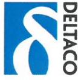
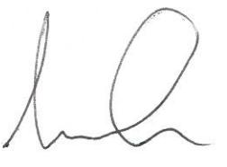

## EC Declaration of Conformity CE mark

This DoC is issued under the sole responsibility of the manufacturer: SweDeltaco AB Alfred Nobels Alle 109 146 48 Tullinge Sweden

Product(s) of declaration:

Type: Item number: DELTACO HDMI Cable HDMI-1080

The product(s) of the declaration (mentioned above) is (are) in conformity with the relevant community harmonisation legislations;

## RoHS Directive 2011/65/EU

and are in conformity with the following harmonized standards or directives;

IEC 62321-4:2013 IEC 62321-5:2013 IEC 62321-7-1:2015 IEC 62321:2008 Annex C ISO 17075:2007 IEC 62321-6:2015

Date: 2017-03-01

Name/Title: Umar Qazi / Product Compliance Officer

Legal signature for and on behalf of SweDeltaco AB:

