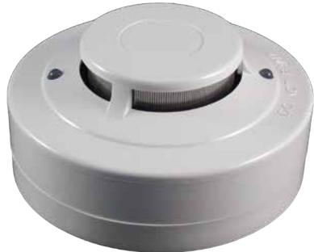
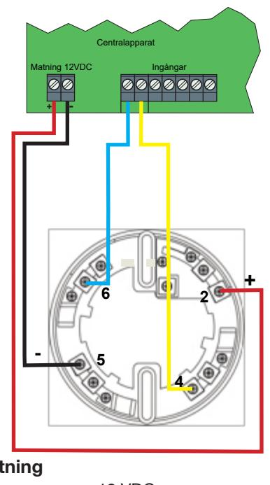
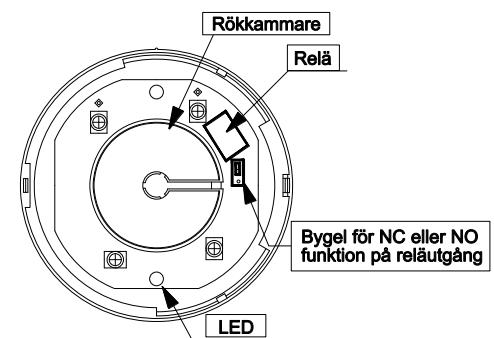

# **Optisk rökdetektor FI/CQR338-4-12V**

Installationsanvisning art.nr. 21285

## **Allmänt**

FI/CQR338 är en rökdetektor som erbetar med den optiska principen och har en reläutgång med brytande (NC) eller slutande (NO) funktion valbart med en bygel i detektorn. Två lysdioder indikerar beredskapsläge (grön blink) eller larm (rött fast sken) och är synbara 360° runt om detektorn. Detektorn är försedd med ett rostfritt nät för skydd mot insekter.

### **Funktioner**

Detektorn är försedd med en reläutgång för inkoppling till brand och säkerhetssystem och matas med 12 VDC. Reläutgången är inställd som brytande funktion (NC) vid leverans. För att ändra reläutgången till en slutande funktion (NO) måste de två skruvarna först skruvas ut och sedan locket på detektorn lyftas av. I detektorn finns en bygel som ställer in reläutgångens funktion till brytande (NC) eller slutande (NO). Flytta bygeln ett snäpp i riktning mot det svarta reläet för att ändra reläfunktionen till en slutande funktion.

### **Installation**

Detektorn bör helst installeras i tak men kan även installeras på vägg. Undvik att installera detektorn i närheten av till- och frånluftsventilation för att säkerställa att att röken kan komma fram till detektorn utan någon fördröjning. Ändra vid behov detektorns reläfunktion med bygeln inuti detektorn innan du jackar i detektorn i detektorsockeln.

Vid driftsättning tar det upp till 60 sekunder för detektorn att starta upp. Kontrollera att LED-indikeringen blinkar grönt med jämna mellanrum. Använd en testgas anpassad för rökdetektorer för att testa att detektorn larmar för brand och att detektorns LED-indikeringar då tänds upp med ett fast rött sken.

För att återställa detektorn krävs att röken i rökkammaren har försvunnit och att spänningen bryts kortvarigt.

| Anslutning |            |
|------------|------------|
| 2          | + 12 VDC   |
| 4          | Reläutgång |
| 5          | - (minus)  |

**6** Reläutgång

**Ändring av reläfunktion NC / NO**

| Spänning:                  | 12 - 24 VDC    |
|----------------------------|----------------|
| Strömförbrukning i vila:   | 25 - 75 uA     |
| Strömförbrukning vid larm: | 45 mA @ 24 VDC |
| Utgångsrelä:               | 0,8 A / 30 VDC |
| Driftstemperatur           | +5 till +40°C  |
| Mått (Dia. x H)            | 102 x 48 mm    |