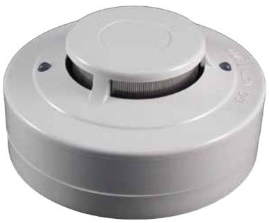

# **Optisk rökdetektor FI/CQR338-4-12V**

Produktblad art.nr. 21285

## **Allmänt**

FI/CQR338 är en optisk rökdetektor inklusive detektorsockel för 12 V brand och säkerhetsystem. Detektorn är försedd med två¨LED-indikeringar för 360° synbarhet runt om detektorn för indikering av drift och larm.

### **Funktioner**

Detektorn är försedd med en reläutgång (NC eller NO är valbart med bygel) för inkoppling till brand och säkerhetssystem.

FI / CQR338 är oberoende certifierad enligt EN54-7.

# **Egenskaper**

- **►** Optisk rökdetektering
- **►** Avancerad detekterings- och urskiljningsalgoritm
- **►** LED-indikering för drift och larm med 360° synbarhet runt om detektorn
- **►** Reläutgång (NC eller NO)
- **►** Certifierad enligt EN54-7

| Spänning:                  | 10.2-13.8 VDC                   |
|----------------------------|---------------------------------|
| Strömförbrukning i vila:   | 320 uA max.                     |
| Strömförbrukning vid larm: | 35 mA (max. 80 mA)              |
| Reläutgång:                | Växlande (NC, NO)               |
| Uppstartstid:              | Max. 60 sekunder                |
| Kapslingsklass:            | IP42                            |
| Relativ luftfuktighet:     | 0 till 95% (icke kondenserande) |
| Driftstemperatur           | -10 till +50°C                  |
| Mått (Dia. x H)            | 100 x 46 mm                     |
| Vikt:                      | 130 gr                          |