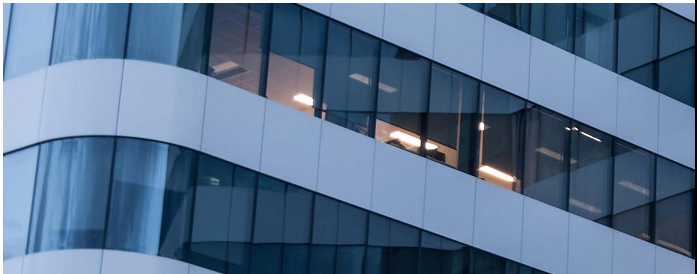
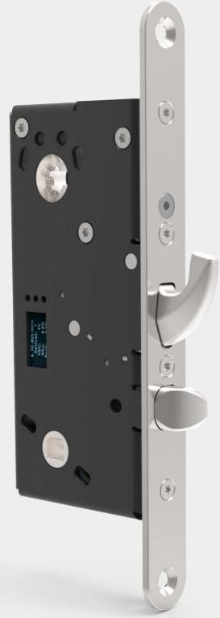
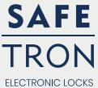
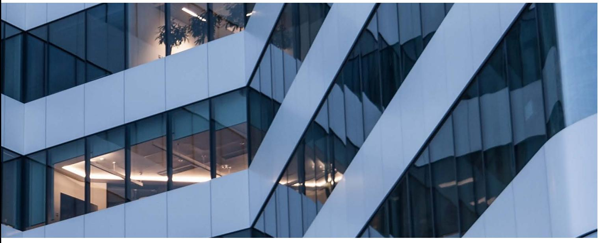
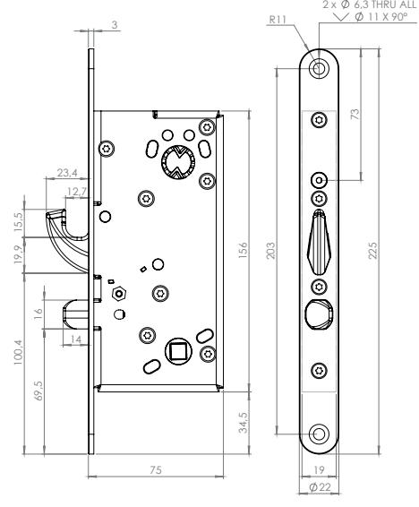
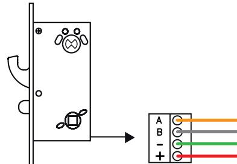

# Marknadens mest kompletta motorlås med modern kolvplacering

# SAFETRON

SAFETRON 6600 är marknadens mest kompletta motorlås som nu fått en

modern kolvplacering - identisk med med lås i ASSA connect-serierna.

Detta innebär att motorlåset är anpassade för moderna dörrurtag, oavsett om det är fast eller utbytbart slutbleck.

Motorlås 6500/6600 är dubbelt så snabba som sina syskon i 6000-serien och frånreglar under 0.1 sekunder. Därför behövs normalt sett inget separat daglås på högfrekventa dörrar.

#### Brandceller

SAFETRON 6600 är försedd med en förstärkt hakregelkolv samt fallkolv för tryckesfunktion och igenhållande egenskaper i t.ex. brandcellsgräns. Motorlås 6600 används med fördel som enda lås i dörrar med skyddsklasskrav 1, 2 eller 3.

### Certifierad låsprodukt

SAFETRON 6600 är certifierad enligt Stöldskyddsföreningens norm SSF 3522 klass 2A, 2B, 3, 4 och 5 samt den europeiska standarden SS-EN 14846 Grade 7. SAFETRON 6600 är också godkänd som låsning i dörrar enligt RC3 och RC4.

#### Integrerade mot passersystem

SAFETRON 6000-serien erbjuder integrerad styrning mot flera av marknadens stora passersystemleverantörer. Detta innebär att motorlåsen kan anslutas direkt mot passersystemets dörrcentral utan styrenhet och därefter kan konfigureras genom passersystemets mjukvara vilket ger en förenklad installation och en mer kostnadseffektiv dörrmiljö.

#### Nödutrymning enligt SS-EN 179

SAFETRON 6600 kan användas i nödutrymningsvägar ihop med SAFETRON nödutrymningsbehör 796 enligt Europastandarden SS-EN 179:2008, samt SSF 3522 klass 2B. Kombinationen ger en dörrmiljö där krav för såväl hög säkerhet som nödutrymning tillgodoses i en låsenhet.

## **Utvecklad och tillverkad i Sverige**

SAFETRON 6600 är precis som alla våra motorlås utvecklade och tillverkade i Sverige för den Skandinaviska marknaden. Våra lås tillverkas av material som klarar tuffa miljöer och säkerhetskrav. Vi sparar inte in där andra gör utan garanterar högkvalitativa produkter även om det innebär en dyrare tillverkningsprocess.

#### **Hardox®**

Väsentliga detaljer är producerade i Hardox®-stål från SSAB, ett stål med världsunika egenskaper gällande slitstyrka, hårdhet och seghet. Varför tillverka produkter med material från andra länder när vi är bäst i världen på hemmaplan?

#### **Egenskaper**

- Certifierad enligt SS-EN 14846 grade 7 samt SSF-3522 låsklass 2B, 3, 4 och 5
- Dorndjup 50 mm
- Hakregel & fallkolv
- Frånregling: 0.1 sekunder
- Öppningsbart med nyckel/vred (90 graders vridning)
- Nödutrymning ihop med Nödutrymningsbehör 796
- Återinrymning valbar i styrenhet
- Plug and playinstallation
- Upp till 100m kabel mellan motorlås och styrenhet
- RS-485/OSDP krypterad kommunikation
- Händelselogg
- Servicemodul i styrenhet
- Seriekoppling, upp till två motorlås mot en styrenhet

#### **Tekniska data**

- Multispänning 12-24 VDC +/- 15%
- Strömförbrukning: 150mA @ 24VDC
- Arbetstemperatur -20°C till +40°C

| BENÄMNING              | INNEHÅLL                                                                                             | ART NR    | E-NUMMER |
|------------------------|------------------------------------------------------------------------------------------------------|-----------|----------|
| SAFETRON 6600          | Motorlås 6600                                                                                        | 202144715 | 5867700  |
| SAFETRON 6600 sats     | Motorlås 6600, Styrenhet TC CU2, Anslutningskabel C06 (10m), Slutbleck 107-2, Karmöverföring CT81 | 202144716 | 5867702  |
| SAFETRON 6600 halvsats | Motorlås 6600, Anslutningskabel C06 (10m), Slutbleck 107-2, Karmöverföring CT81                   | 202144839 | 5867707  |

