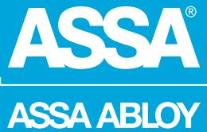
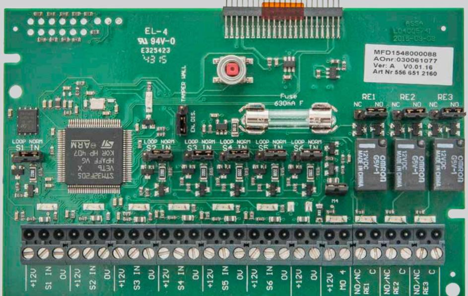
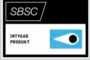
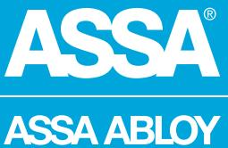

# 530III SIO6-4

ASSA ABLOY, the global leader in door opening solutions

530III SIO6-4 är ett in- och utgångskort som används i ASSA ARX larmmodul för att ansluta larmgivare. 530III SIO6-4 ansluts tillsammans med DAC 530III i samma kapsling. 530III SIO6-4 har sex ingångar och fyra utgångar varav tre reläutgångar med NO/NC-valmöjlighet via bygel och en övervakad transistorutgång.

De sex ingångarna är programmerbara och kan arbeta normalt öppen eller normalt sluten, dubbelbalanserat med valfria motståndsvärden (standard 2K2 ohm).

Även trippelbalansering är möjlig när övertäckningslarm från detektor används.

530III SIO6-4-kortet kan hantera strömslinga på samtliga ingångar som slingkopplade glasdetektorer och branddetektorer.

Samtliga in- och utgångar har lysdiodindikeringar för att förenkla installation och felsökning.

# 530III SIO6-4

ASSA ABLOY, the global leader in door opening solutions

# **Data**

- 6 ingångar
- 3 Reläutgångar
- 1 Övervakad transistorutgång
- AUX 12V DC
- Matningsspänning 12 30V DC 12-24V AC (530III SIO6-4-kortet matas via DAC interna spänning).
- Strömförbrukning 50 mA (DAC530III/SIO6-4)
- Vikt 0,562 kg
- Temperaturområde +10°C till +40°C
- Luftfuktighet 75% (ej kondenserande)
- Miljöklass 2
- Dimension H x B x D (mm) 183 x 183 x 46
- Kompatibel med DAC530III
- Larmgodkänd: SSF 1014, utgåva 4 Larmklass 3/4*

*För larmklass 3/4 krävs borrskydd SIO/DACIII-BS02

## **Artikelnummer**

- 530III SIO6-4 S556 651 2160 E58 703 81
## **Tillbehör**

- SIO/DACIII-BS02 S5590102131 E58 703 89
CE-kontrollerad och godkänd

ASSA ABLOY is the global leader in door opening solutions, dedicated to satisfying end-user needs for security, safety and convenience

ASSA AB P.O. Box 371 SE-631 05 Eskilstuna Sweden Phone +46 (0)16 17 70 00

Fax +46 (0)16 17 70 49 Customer support: phone intl. +46 (0)16 17 71 00 Phone nat. 0771-640 640 Fax +46 (0)16 17 73 72 e-mail: helpdesk.marknad@assaabloy.com

www.assa.se