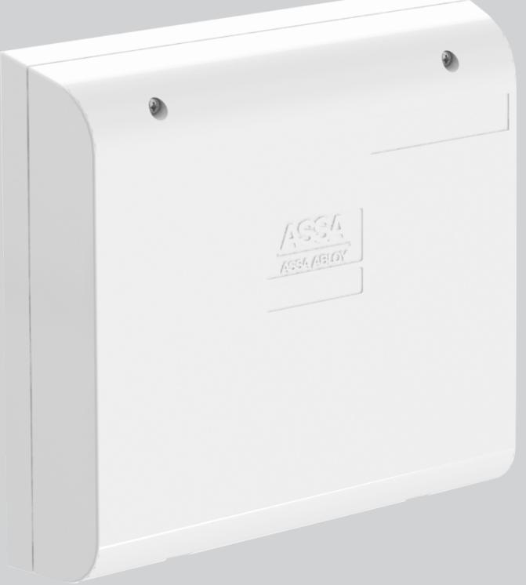
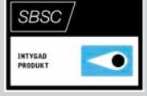
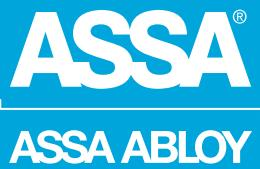
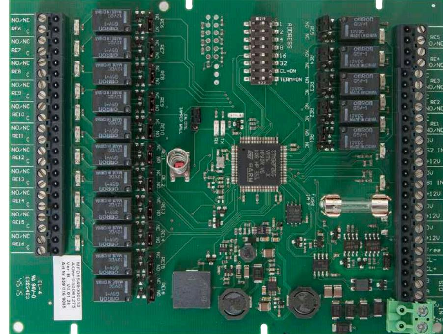
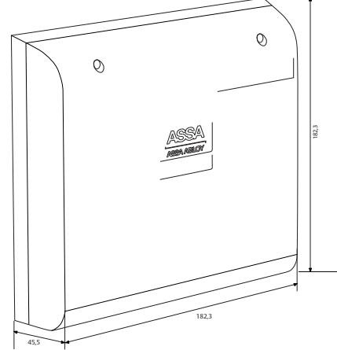

## SIO2-16

ASSA ABLOY, the global leader in door opening solutions

SIO2-16 är ett in- och utgångsenhet som används i larm i ARX för att ansluta larmgivare.

SIO2-16 kan anslutas till undercentral LCU9016III direkt på DAC-bussarna eller via SIO-bussen på mastercentralen. SIO2-16 har två ingångar samt 16 reläutgångar.

De två ingångarna är programmerbara och kan arbeta normalt öppen eller normalt sluten, dubbelbalanserat med valfria motståndsvärden (standard 2K2 ohm). Även trippelbalansering är möjlig när övertäckningslarm från detektor används.

Samtliga 16 reläutgångar är programmerbara och har NO/NC, som väljs via en bygel.

SIO2-16-kortet kan hantera strömslinga på samtliga ingångar som slingkopplade glasdetektorer och branddetektorer. Samtliga in- och utgångar har lysdiodindikeringar för att förenkla installation och felsökning.

SIO2-16 kan antingen anslutas direkt till en dörrbuss eller till larmsystemets SIO-buss.

Till ASSA ARX-systemet används SIO2-6 tillsammans med systemfunktionen ASSA ARX Hiss, för styrning av hissar eller postboxar. SIO2-16 kopplas till centralenhet LCU9016// LCU 9017 eller högre version. För larmgodkännande krävs LCU9016III version M eller högre.

# SIO2-16

ASSA ABLOY, the global leader in door opening solutions

### **Data**

- 2 ingångar
- 16 Reläutgångar
- AUX 12V DC
- 1 SIO-kommunikationsport
- 1 CL20 kommunikationsport
- 1 Glassäkring 1A
- Matningsspänning 24-28V DC
- Strömförbrukning 20mA
- Vikt 0,386 Kg
- Temperaturområde -10°C till + 40° C
- Luftfuktighet 75% (ej kondenserande)
- Miljöklass 2
- Dimension H x Bx D (mm) 183 x 183 x 46
- Larmgodkänd: SSF 1014, utgåva 4 Larmklass 3/4*

*För larmklass 3/4 krävs borrskydd SIO/DACIII-BS02 (S5590102131)

- SBSC-intyg 16-130
### **Övrigt**

- Kapsling PC/ABS
#### **Artikelnummer**

• SIO2-16 S559 016 9085 E58 703 65SIO

- **Tillbehör**
- SIO/DACIII-BS02 S5590102131 E58 703 89

www.assa.se

ASSA AB P.O. Box 371 SE-631 05 Eskilstuna

Sweden

Phone +46 (0)16 17 70 00 Fax +46 (0)16 17 70 49 Customer support: phone intl. +46 (0)16 17 71 00 Phone nat. 0771-640 640 Fax +46 (0)16 17 73 72

ASSA ABLOY is the global leader in door opening solutions, dedicated to satisfying end-user needs for security, safety and convenience

e-mail: helpdesk.marknad@assaabloy.com