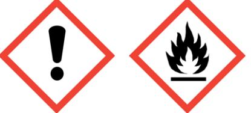

Dokumentnr: 15.243.20-1 Sida 1 av 11

# **Säkerhetsdatablad Kaba Cleaner Aerosol**

Enligt 1907/2006/EG samt ändringsförordningen (EG) 830/2015 Version 1 Upprättad: 2017-05-18

# **AVSNITT 1: Namnet på ämnet/blandningen och bolaget/företaget**

| 1.1 Produktbeteckning Artikelnummer                                                                            | Kaba Cleaner Aerosol 200ml                                      |
|-------------------------------------------------------------------------------------------------------------------|-----------------------------------------------------------------|
| 1.2 Relevanta identifierade användningar av ämnet eller blandningen och användningar som det avråds från | Rengörare av cylindrar                                          |
| 1.3 Närmare upplysningar om den som tillhandahåller säkerhetsdatablad                                          | dormakaba Sverige AB                                            |
| Adress                                                                                                            | F O Petersons Gata 28 421 31 Västra Frölunda                 |
| Telefon                                                                                                           | +46 31-355 20 00                                                |
| E-post                                                                                                            | info.se@dormakaba.com                                           |
| Kontaktperson                                                                                                     | Sustainability Cooridinator                                     |
| 1.4 Telefonnummer för nödsituationer                                                                              | 112 Giftinformationscentralen, under kontorstid 010- 4566700 |

### **AVSNITT 2: Farliga egenskaper**

### **2.1 Klassificering av ämnet eller blandningen:**

Klassificering (CLP(EG) nr 1272/2008) Aerosoler - Kategori 1: H222-H229 Specifik organtoxicitet vid enstaka exponering -Kategori 3: H336 **2.2 Märkningsuppgifter: Faropiktogram**

**Signalord:** Fara **Innehåller** Kolväten, C9-C11, n-alkaner, isoalkaner, cykloalkaner, <2% aromater. **Faroangivelser** H222 Extremt brandfarlig aerosol. H229 Tryckbehållare: Kan sprängas vid uppvärmning. H336 Kan göra att man blir dåsig eller omtöcknad. **Kompletterande faroangivelser**

EUH208 Innehåller Bensensylfonsyra, di-C10-14-alkyderivat, kalcium salter. Kan orsaka en allergisk reaktion.

dormakaba Sverige AB F O Petersons Gata 28 421 31 Västra Frölunda Sverige

Phone +46 31-355 20 00 Fax +46 31-28 17 39 www.dorma.se

**Organisationsnr** 556204-8545

Enligt 1907/2006/EG samt ändringsförordningen (EG) 830/2015 Version 1 Upprättad: 2017-05-18

### **AVSNITT 2: Farliga egenskaper (…)**

### **Skyddsangivelser**

P101 Ha förpackningen eller etiketten till hands om du måste söka läkarvård.

P103 Läs etiketten före användning.

P210 Får inte utsättas för värme, heta ytor, gnistor, öppen låga eller andra antändningskällor. Rökning förbjuden.

P251 Får inte punkteras eller brännas, gäller även tömd behållare.

P211 Spreja inte över öppen låga eller andra antändningskällor.

P304+P340 VID INANDNING: Flytta personen till frisk luft och se till att andningen underlättas. P405 Förvaras inlåst.

P410+P412 Skyddas från solljus. Får inte utsättas för temperaturer över 50 °C/122 °F.

P501 Innehållet/ behållaren lämnas till en godkänd avfallsanläggning.

## **2.3 Andra faror**

Produkten bedöms ej innehålla ämnen som uppfyller kriterierna för att klassificeras som PBT- eller vPvB-ämnen.

Enligt 1907/2006/EG samt ändringsförordningen (EG) 830/2015 Version 1 Upprättad: 2017-05-18

# **AVSNITT 3: Sammansättning/information om beståndsdelar**

### **3.2 Kemisk sammansättning:** Blandning

| Ämne                          | CAS-nr           | Konc     | Faroklasser &     | Faro        |
|-------------------------------|------------------|----------|-------------------|-------------|
|                               | EG-nr            | %        | kategorikoder     | angivelser* |
|                               | Reg-nr           |          |                   |             |
| Kolväten, C9-C11, n-alkaner,  | 64742-48-9       | 25-50    | Flam Liq. 3       | H226        |
| isoalkaner, cykloalkaner, <2% | 919-857-5        |          | Asp. Tox 1        | H304        |
| aromater.                     | 01-2119463258-33 |          | STOT SE 3         | H336        |
| Butan                         | 106-97-8         | 25-50    | Flam. Gas 1       | H220        |
|                               | 203-448-7        |          | Press. Gas C      | H280        |
|                               | 01-2119474691-32 |          |                   |             |
| Mineralolja                   | 8042-47-5        | 10-25    | Asp Tox. 1        | H304        |
|                               | 232-455-8        |          |                   |             |
|                               | 01-2119487078-27 |          |                   |             |
| Propan                        | 74-98-6          | 5-10     | Flam. Gas 1       | H220        |
|                               | 200-827-9        |          | Press. Gas C      | H280        |
|                               | 01-2119486944-21 |          |                   |             |
| Cyklopentan                   | 287-92-3         | 5-10     | Flam. Liq. 2      | H225        |
|                               | 206-016-6        |          | Aquatic Chronic 3 | H412        |
|                               | 01-2119463053-47 |          |                   |             |
| Isobutan                      | 72-28-5          | 1-2,5    | Flam. Gas 1       | H220        |
|                               | 200-857-2        |          | Flam. Liq. 1   | H224        |
|                               | 01-2119485395-27 |          | Press. Gas C      | H280        |
| Bensensulfonsyra, Di-C10-14-  | -                | 0,25-1   | Skin Sens. 1      | H317        |
| alkylderivat, kalciumsalter   | 939-603-7        |          |                   |             |
| Isopentan                     | 78-78-4          | 0,25-1   | Flam. Liq 1       | H224        |
|                               | 201-142-8        |          | Asp. Tox 1        | H304        |
|                               | 01-2119475602-38 |          | Aquatic Chronic 2 | H411        |
|                               |                  |          | STOT SE 3         | H336        |
| 3-(Diisobutoxy                | 268567-32-4      | 0,1-0,25 | Eye Dam 1         | H318        |
| thiophosphorylsulfanyl)-2-    | 434-070-2        |          | Skin Sens. 1      | H317        |
| methyl-propionic acid         |                  |          | Aquatic Chronic 3 | H412        |
| Hexan blanding av isomer   | -                | 0,1-0,25 | Flam Liq. 2       | H225        |
| (innehåller <5% n-hexan (203- |                  |          | Asp. Tox 1        | H304        |
| 777-6))                       |                  |          | Aquatic Chronic 2 | H411        |
|                               |                  |          | Skin Irrit. 2     | H315        |
|                               |                  |          | STOT SE 3         | H336        |

* För faroangivelsernas lydelse se under punkt 16

Klassificeringen grundas på data från kemikalieleverantören samt http://echa.europa.eu/ (Databaser)

dormakaba Sverige AB F O Petersons Gata 28 421 31 Västra Frölunda Sverige

Phone +46 31-355 20 00 Fax +46 31-28 17 39

**Organisationsnr** 556204-8545

**Säte** Göteborg

www.dorma.se

Enligt 1907/2006/EG samt ändringsförordningen (EG) 830/2015 Version 1 Upprättad: 2017-05-18

# **AVSNITT 4: Åtgärder vid första hjälpen**

### **4.1 Beskrivning av åtgärder vid första hjälpen:**

# **Allmän information**

Vid minsta osäkerhet eller om besvär kvarstår, kontakta läkare.

Ge aldrig vätska eller framkalla kräkning om personen är medvetslös. Håll personen varm och lugn. **Inandning**

Sök frisk luft.

# **Hudkontakt**

Avlägsna genast förorenade kläder.

Tvätta utsatta hudpartier med tvål och vatten. Kontakta läkare om besvär uppstår/kvarstår.

### **Ögonkontakt**

Håll ögonlock öppna och skölj genast med mycket(ljummet) vatten i flera minuter. Avlägsna ev. kontaktlinser. Kontakta läkare vid ihållande besvär.

### **Förtäring**

Skölj munnen samt ge vatten att dricka om den skadade är vid fullt medvetande. Framkalla ej kräkning. Kontakta läkare /sjukhus och visa om möjligt detta säkerhetsdatablad eller förpackning.

# **4.2 De viktigaste symptomen och effekterna, både akuta och fördröjda:**

| Inandning:   | Kan vara lätt irriterande vid inandning. Höga koncentrationer av ångor från denna   |
|--------------|-------------------------------------------------------------------------------------|
|              | produkt en narkotisk effekt och kan ge huvudvärk, trötthet, yrsel och illamående.   |
| Hudkontakt:  | Kan orsaka irritation vid långvarig och ofta upprepad hudkontakt. (sveda, rodnad)   |
| Ögonkontakt: | Kan irritera ögonen. (Sveda tårbildning)                                            |
| Förtäring:   | Kan orsaka illamående samt kräkningar. Farligt: kan ge lungskador vid förtäring. |
|              | Vid nedsväljning finns risk för att en mindre mängd kommer ned i luftstrupen (s k   |
|              | aspiration) och förorsakar en allvarlig kemisk lunginflammation.                    |

**4.3 Angivande av omedelbar medicinsk behandling och särskild behandling som eventuellt krävs** Risk för aspiration.

Enligt 1907/2006/EG samt ändringsförordningen (EG) 830/2015 Version 1 Upprättad: 2017-05-18

## **AVSNITT 5: Brandbekämpningsåtgärder**

# **5.1 Släckmedel**

Pulver, koldioxid, skum eller vattendimma.

**Ej lämpligt släckmedel:** Riktad vattenstråle

**5.2 Särskilda faror som ämnet eller blandningen kan medföra**

Brandgaser från organiska material är generellt giftiga vid inandning.

Kan vid brand bilda koloxid samt svaveldioxid.

Kan orsaka explosiva blandningar med luft.

Aerosolburkar kan explodera vid brand.

Farliga ångor tyngre än luft kan bildas.

### **5.3 Råd till brandbekämpningspersonal**

Använd självförsörjande andningsapparat för brandbekämpning samt skyddsdräkt.

### **Övrigt**

Behållare i närheten av brand kyls med vatten och flyttas från brand om detta är riskfritt.

# **AVSNITT 6: Åtgärder vid oavsiktliga utsläpp**

# **6.1 Personliga skyddsåtgärder, skyddsutrustning och åtgärder vid nödsituationer**

Använd personlig skyddsutrustning.

Utspridd produkt medför halkrisk.

Sörj för god ventilation. Undvik inandning.

Avlägsna ev. antändningskällor. Rök ej.

# **6.2 Miljöskyddsåtgärder**

Hindra produkten att spolas ut i ytvatten eller avloppssystem.

### **6.3 Metoder och material för inneslutning och sanering**

Absorbera spill med icke brännbart material (t.ex. sand eller jord).

Förvara i lämpliga och tillslutna behållare för bortskaffning.

### **6.4 Hänvisning till andra avsnitt**

Se avsnitt 7 gällande hantering.

Se personlig skyddsutrustning avsnitt 8.

Ev. uppsamlat spill placeras i tillsluten behållare och hanteras som avfall enligt avsnitt 13.

Enligt 1907/2006/EG samt ändringsförordningen (EG) 830/2015 Version 1 Upprättad: 2017-05-18

# **AVSNITT 7: Hantering och lagring**

# **7.1 Försiktighetsmått för säker hantering**

Sörj för god ventilation. Följ tillämpliga skyddsföreskrifter.

Förvaras åtskilt från antändningskällor. Rökning förbjuden.

Undvik inandning av ångor samt kontakt med ögon och hud.

Använd ej produkten på heta ytor.

Ät, drick och rök ej under arbetet.

### **7.2 Förhållanden för säker lagring, inklusive eventuell oförenlighet**

Förvara produkten i svalt, torrt och väl ventilerat utrymme åtskilt från antändningskällor.

Behållare hålls ordentligt stängda för att hindra läckage.

Förvara alltid produkten i original förpackning.

Förvara ej produkten i trapphus eller utrymmen avsedda för genomgång.

Förvaras åtskilt från livsmedel samt djurfoder

### **7.3 Specifik slutanvändning**

-

### **AVSNITT 8: Begränsning av exponeringen/personligt skydd**

# **8.1 Kontrollparametrar:**

**Förebyggande åtgärder**

Sörj för god ventilation.

### **Ingående ämnen med arbetsplatsrelaterade gränsvärden (AFS 2015:7)**

| Ämne           | CAS-nr  | NGV        | KGV        | Anm. |
|----------------|---------|------------|------------|------|
| Lacknafta      | -       | 50 ppm     | 100 ppm    | H    |
| < 2 % aromater |         | 300 mg/m³  | 600 mg/m³  |      |
| Isopentan      | 78-78-4 | 600 ppm    | 750 ppm    | V    |
|                |         | 1800 mg/m³ | 2000 mg/m³ |      |

### **Förklaring anmärkning:**

H = Ämnet kan lätt upptas genom huden.

V = Vägledande korttidsgränsvärde

# **8.2 Begränsning av exponeringen:**

# **Allmänna hygieniska skyddsåtgärder**

Hantera i enlighet med god yrkeshygien och säkerhetspraxis.

Tvätta händer innan raster och vid arbetets slut.

Ät, drick eller rök ej under arbetet. Undvik inandning av ånga/gaser/aerosoler.

### **Personlig skyddsutrustning:**

Rådgör alltid med en kompetent leverantör vid val av personlig skyddsutrustning.

dormakaba Sverige AB F O Petersons Gata 28 421 31 Västra Frölunda Sverige

Phone +46 31-355 20 00 Fax +46 31-28 17 39 www.dorma.se

**Organisationsnr** 556204-8545

### Sida 7 av 11

# **Säkerhetsdatablad Kaba Cleaner Aerosol**

Enligt 1907/2006/EG samt ändringsförordningen (EG) 830/2015 Version 1 Upprättad: 2017-05-18

### **AVSNITT 8: Begränsning av exponeringen/personligt skydd (...)**

### **Andningsskydd**

Om koncentrationen överstiger de arbetsplatsrelaterade gränsvärdena måste andningsskydd anpassade för ändamålet användas.

**Handskydd** Använd lämpliga skyddshandskar (Nitrilgummi, Viton, 4H ). **Ögonskydd** Använd skyddsglasögon vid risk för stänk. (Korgglasögon) **Kroppsskydd** Använd lämpliga skyddskläder.

**AVSNITT 9: Fysikaliska och kemiska egenskaper**

### **9.1 Information om grundläggande fysikaliska och kemiska egenskaper:**

| Form:                                               | Vätska                    |
|-----------------------------------------------------|---------------------------|
| Färg:                                               | Grå,                      |
| Lukt:                                               | Karaktäristisk            |
| Densitet:                                           | 0,679 g/cm3 (ASTM D 4052) |
| Lukttröskel:                                        | Ej tillgängligt           |
| pH-värde (Koncentrat):                              | Ej tillgängligt           |
| Smält/fryspunkt (°C):                               | - /-42                 |
| Kokpunkt/kokpunktsintervall (°C):                   | Ej tillgängligt           |
| Flampunkt (°C):                                     | <10                       |
| Avdunstningshastighet:                              | Ej tillgängligt           |
| Brännbarhet (fast form, gas):                       | Ej tillgängligt           |
| Övre/undre brännbarhetsgräns eller explosionsgräns: | Ej tillgängligt           |
| Ångtryck:                                           | 2100 hPa                  |
| Ångdensitet (Luft=1):                               | Ej tillgängligt           |
| Löslighet vatten:                                   | Ej löslig.                |
| Fördelningskoefficient n-oktanol/vatten:            | Ej tillgängligt           |
| Självantändningstemperatur (°C):                    | Ej självantändelig        |
| Sönderfallstemperatur (°C):                         | Ej tillgängligt           |
| Viskositet:                                         | Ej tillgängligt           |
| Explosiva egenskaper:                               | Ej tillgängligt           |
| Oxiderande egenskaper:                              | Ej tillgängligt           |

### **9.2 Annan information:**

Ångorna är tyngre än luft. Brandfarlig vätska

dormakaba Sverige AB F O Petersons Gata 28 421 31 Västra Frölunda Sverige

Phone +46 31-355 20 00 Fax +46 31-28 17 39 www.dorma.se

**Organisationsnr** 556204-8545

Enligt 1907/2006/EG samt ändringsförordningen (EG) 830/2015 Version 1 Upprättad: 2017-05-18

# **AVSNITT 10: Stabilitet och reaktivitet**

# **10.1 Reaktivitet**

Produkten är stabil vid rekommenderad hantering och användning.

### **10.2 Kemisk stabilitet**

Produkten är stabil vid rekommenderad hantering och användning.

### **10.3 Risken för farliga reaktioner**

Inga kända vid rekommenderad hantering och användning.

## **10.4 Förhållanden som ska undvikas**

Höga temperaturer, flammor och gnistor.

### **10.5 Oförenliga material**

Starka oxidationsmedel, starka syror, starka alkaliska ämnen.

# **10.6 Farliga sönderdelningsprodukter**

Inga kända vid rekommenderad hantering och användning.

# **AVSNITT 11: Toxikologisk information**

# **11.1 Information om de toxikologiska effekterna**

Se även avsnitt 4. (De viktigaste symptomen och effekterna, både akuta och fördröjda) **Inandning** Kan vara lätt irriterande vid inandning. Höga koncentrationer av ångor från denna produkt en narkotisk effekt. **Hudkontakt** Kan vara irriterande. **Ögonkontakt** Kan vara irriterande. **Förtäring** Risk för aspiration. **Toxikologiska data** Toxikologisk data på denna beredning finns ej tillgänglig. **Specifik organtoxicitet (STOT): enstaka och upprepad exponering** Kan göra att man blir dåsig eller omtöcknad. **Sannolika exponeringsvägar** Kontakt med ögon/hud, inandning och förtäring. **Allergiframkallande egenskaper** Denna produkt är inte klassificerad som allergiframkallande vid inandning eller hudkontakt. **CMR (Cancerogena, Mutagena och Reproduktionsstörande ämnen)** Denna produkt är inte klassificerad som cancerogen, mutagen eller reproduktionsstörande.

# **Fara för aspiration**

Ja

Enligt 1907/2006/EG samt ändringsförordningen (EG) 830/2015 Version 1 Upprättad: 2017-05-18

# **AVSNITT 12: Ekologisk information**

Denna produkt är ej klassificerad som miljöfarlig. Förhindra okontrollerat utsläpp till dagvatten och avloppsnät. **12.1 Toxicitet** Toxikologiska data/tester på denna beredning finns ej tillgängliga. **12.2 Persistens och nedbrytbarhet** Ej tillgängligt **12.3 Bioackumuleringsförmåga** Ej tillgängligt **12.4 Rörligheten i jord** Olöslig i vatten. **12.5 Resultat av PBT- och vPvB-bedömningen** Produkten bedöms ej innehålla ämnen som uppfyller kriterierna för att klassificeras som PBT- eller vPvB-ämnen. **12.6 Andra skadliga effekter** -

### **AVSNITT 13: Avfallshantering**

### **13.1 Avfallsbehandlingsmetoder**

Oanvänd eller rester av produkt är klassificerade som farligt avfall enligt Avfallsförordning (SFS 2011:927).

Rådfråga lokala myndigheter vid omhändertagande av avfall.

Undvik att släppa ut rester av produkten i avlopp eller vattendrag.

### **Föreslagna EWC-koder:**

Föreslagen EWC-kod: t.ex. 14 06 03*eller 20 01 29*

### **Förpackning**

Tömd och väl rengjord förpackning lämnas till materialåtervinning.

### **AVSNITT 14: Transportinformation**

**14.1 UN-nummer** 1950 **14.2 Officiell transportbenämning/Proper shipping name (IMDG, IATA/ICAO):** AEROSOLER, brandfarliga / AEROSOLS, flammable **14.3 Faroklass för transport** 2 **14.4 Förpackningsgrupp** - (Klassifceringskod 5F) **14.5 Miljöfaror** Marine pollutant: No

dormakaba Sverige AB F O Petersons Gata 28 421 31 Västra Frölunda Sverige

Phone +46 31-355 20 00 Fax +46 31-28 17 39 www.dorma.se

**Organisationsnr** 556204-8545

Enligt 1907/2006/EG samt ändringsförordningen (EG) 830/2015 Version 1 Upprättad: 2017-05-18

# **AVSNITT 14: Transportinformation (…)**

# **14.6 Särskilda försiktighetsåtgärder**

### - **14.7 Bulktransport enligt bilaga II till MARPOL 73/78 och IBC-koden**

- **LQ** 1L **Tunnelrestriktionskod** (D)

**AVSNITT 15: Gällande föreskrifter**

# **15.1 Föreskrifter/lagstiftning om ämnet eller blandningen när det gäller säkerhet, hälsa och miljö**

Klassificering i enlighet med CLP(EG) nr 1272/2008. AFS 2014:43, AFS 2015:7 Avfallsförordningen (SFS 2011:927).

**15.2 Kemikaliesäkerhetsbedömning** Ingen utförd.

# **AVSNITT 16: Annan information**

# **Faroangivelsernas lydelse under p. 3**

H220 Extremt brandfarlig gas

H224 Extremt brandfarlig vätska och ånga

H225 Mycket brandfarlig vätska och ånga.

H226 Brandfarlig vätska och ånga.

H280 Innehåller gas under tryck. Kan explodera vid uppvärmning.

H304 Kan vara dödligt vid förtäring om det kommer ner i luftvägarna.

H315 Irriterar huden.

H317 Kan orsaka allergisk hudreaktion.

H318 Orsakar allvarliga ögonskador.

H336 Kan göra att man blir dåsig eller omtöcknad.

H411 Giftigt för vattenlevande organismer med långtidseffekter.

H412 Skadliga långtidseffekter för vattenlevande organismer.

**Version 1:** 2017-05-18. Detta säkerhetsdatablad har gjorts i enlighet med bilaga II i REACHförordningen (EG) 1907/2006 samt ändringsförordningen (EG) 830/2015.

Enligt 1907/2006/EG samt ändringsförordningen (EG) 830/2015 Version 1 Upprättad: 2017-05-18

### **AVSNITT 16: Annan information (…)**

### **Källor:**

Datablad från tillverkare. CLP-förordningen, www.kemi.se (Databaser), AFS 2015:7,<http://echa.europa.eu/> (Databaser)

Användaren av denna produkt måste avgöra om informationen i detta säkerhetsdatablad är tillräcklig för det användningsområde som produkten ska brukas inom.

### **Förklaring till förkortningar**

ADR: Bestämmelser för transport av gods på väg. BCF: Bio Concentration Factor (mått på bioackumulerbarheten hos ett ämne). CAS-nr Chemical Abstracts Service number DNEL: Derived No Effect Level PNEC: Predicted No Effect Concentration EC50: Effect Concentration EG-nr: Ett ämnes nummer i Einecs, Elincs eller i No-Longer Polymers List. HGV: Hygieniskt gränsvärde (högsta godtagbara genomsnittshalt av en luftförorening i inandningsluften). ID-nr: Identifieringsnummer i Klassificerings - och märkningsregistret i CLP (art 42) IMDG: International Maritime Dangerous Goods Code. Bestämmelser för farligt gods till sjöss. KIFS 2005:7: Kemikalieinspektions föreskrifter om klassificering och märkning av kemiska produkter. Koc Fördelningskonstanten mellan vatten och organiskt kol. IC50: Median Inhibition Concentration LC50: Lethal Concentration LD50: Lethal Dose Log pow: Mått för ett ämnes bioackumulerbarhet. NOEC: No Observed Effect Concentration PBT-ämne: Persistent, Bio accumulative and Toxic substances. FTI: Registret för produktansvar och återvinningssystem för förpackningar. vPvB-ämne: Very persistent and Very Bio accumulative substances.

Phone +46 31-355 20 00 Fax +46 31-28 17 39 www.dorma.se

**Organisationsnr** 556204-8545