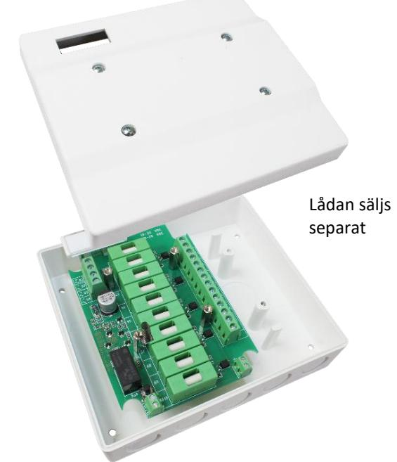
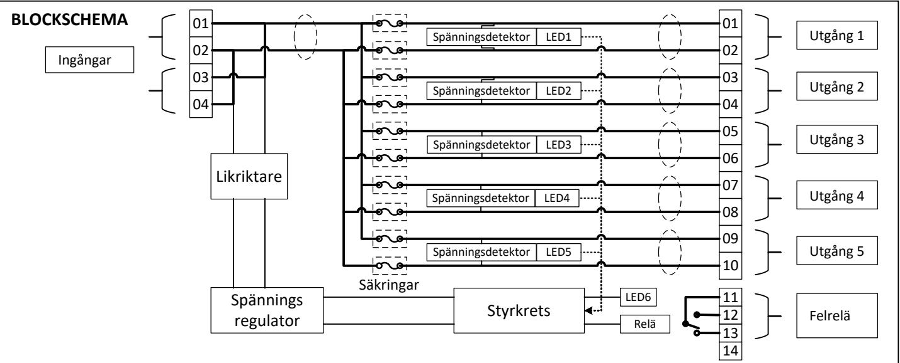
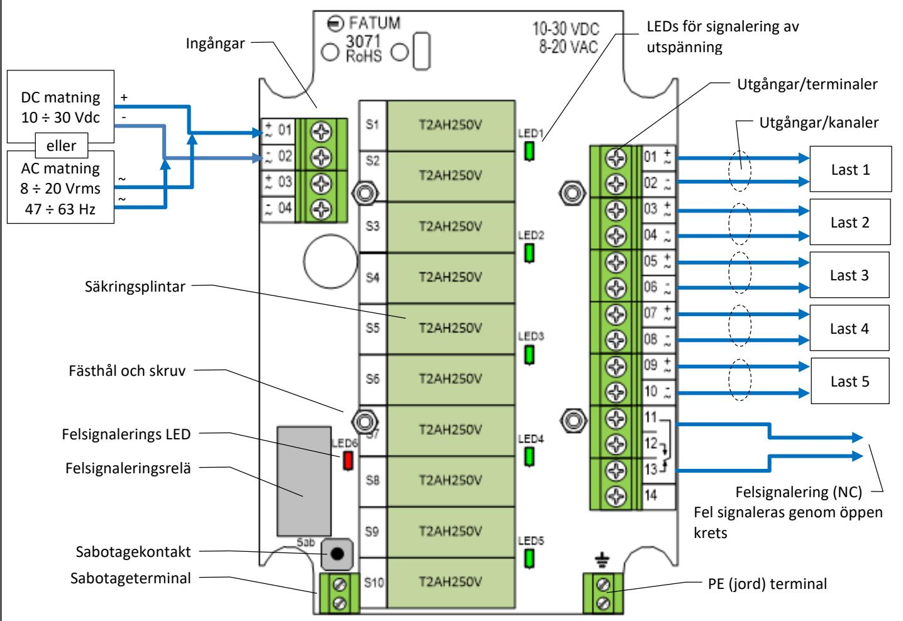

# **FATUM FATUM Säkringsmodul**

# **Datablad och installationsbeskrivning 3071.03**

### **BESKRIVNING**

Säkringsmodulen 3071 är konstruerad för kraftfördelning. Den innehåller en matning med dubbla ingångar för anslutning till strömförsörjningen och fem oberoende säkrade utgångar. Utgångarna (+) och (-) i varje kanal är säkrade med separata säkringar. Normaltillståndet för varje kanal signaleras med gröna LEDs. Fel som detekteras i varje kanal (brist på spänning eller aktiverad säkring) signaleras av gemensam röd LED och omkopplingsrelä.

#### **FUNKTIONER**

- DC eller AC matningsspänning
- Fem utgångar avsäkrade med separata säkringar
- Separata säkringar på utgångarna, både på (+) och (-)
- Optisk indikering av utspänning i varje kanal (grön LED)
- Optisk indikering av fel (röd LED)
- Signalering av fel via omkopplingsrelä
- Reläkontakter klassade för 2 A / 30 V

## **TEKNISKA SPECIFICATIONER**

| Matningsspänning DC          | 10 ÷ 30 V               |  |  |  |
|------------------------------|-------------------------|--|--|--|
| Matningsspänning AC          | 8 ÷ 20 Vrms, 47 ÷ 63 Hz |  |  |  |
| Maximal ingångsström         | 10 A                    |  |  |  |
| Antal utgångar/kanaler       | 5                       |  |  |  |
| Maximal ström i varje kanal  | < 2 A                   |  |  |  |
| Utgångssäkringar S1 till S10 | T2AH250V                |  |  |  |
| Felrelä                      | SPDT relä               |  |  |  |
| Kontaktdata för felrelä      | 30 Vdc, 2 A             |  |  |  |
| Matningsström                | 23 mA @ 12 Vdc,         |  |  |  |
| (relä aktiverat, normalläge) | 33 mA @ 24 Vdc          |  |  |  |
| Miljöklass                   | EN 50130-5, Class II    |  |  |  |
| Dimensioner                  | 116 x 80 x 16 mm        |  |  |  |
| Vikt                         | 85 g                    |  |  |  |
| Driftstemperatur             | -20 °C to +55 °C        |  |  |  |
| Överrensstämmelse            |                         |  |  |  |

## **TERMINALER FÖR IN-/UTGÅNGAR**

Ingångar

| #  | Funktion         |               |  |  |
|----|------------------|---------------|--|--|
| 01 |                  | (+) eller AC1 |  |  |
| 02 | Matningsspänning | (-) eller AC2 |  |  |
| 03 |                  | (+) eller AC1 |  |  |
| 04 | Matningsspänning | (-) eller AC2 |  |  |

#### Reläutgång

| #  | Funktion       |
|----|----------------|
| 11 | Ansluten       |
| 12 | Normalt öppen  |
| 13 | Normalt stängd |
| 14 | Används ej     |

## **KOPPLINGSSCHEMA**

| Utgångar |                      |                      |         |      |  |
|----------|----------------------|----------------------|---------|------|--|
| #        | Funktion             |                      | Säkring | LED  |  |
| 01       |                      | (+) utgång eller AC1 | S1      | LED1 |  |
| 02       | Utgång 1             | (-) utgång eller AC2 | S2      |      |  |
| 03       |                      | (+) utgång eller AC1 | S3      | LED2 |  |
| 04       | Utgång 2             | (-) utgång eller AC2 | S4      |      |  |
| 05       |                      | (+) utgång eller AC1 | S5      | LED3 |  |
| 06       | Utgång 3             | (-) utgång eller AC2 | S6      |      |  |
| 07       | (+) utgång eller AC1 |                      | S7      |      |  |
| 08       | Utgång 4             | (-) utgång eller AC2 | S8      | LED4 |  |
| 09       |                      | (+) utgång eller AC1 |         |      |  |
| 10       | Utgång 5             | (-) utgång eller AC2 | S10     | LED5 |  |

#### **FELSIGNALERING (exempel)**

|                                        | Signalering för utspänning |      |      |      |      | Felindikerings LED | Felindikeringsrelä |            |
|----------------------------------------|----------------------------|------|------|------|------|--------------------|--------------------|------------|
| Tillstånd hos säkringsmodulen          | LED1                       | LED2 | LED3 | LED4 | LED5 | LED6               | C-NC krets         | C-NO krets |
| Normal, enheten spänningssatt          | ON                         | ON   | ON   | ON   | ON   | OFF                | Sluten             | Öppen      |
| Säkring i kanal 1 aktiverad            | OFF                        | ON   | ON   | ON   | ON   | ON                 | Öppen              | Sluten     |
| Säkring i kanal 2 aktiverad            | ON                         | OFF  | ON   | ON   | ON   | ON                 | Öppen              | Sluten     |
| Säkring i kanal 3 aktiverad            | ON                         | ON   | OFF  | ON   | ON   | ON                 | Öppen              | Sluten     |
| Säkring i kanal 4 aktiverad            | ON                         | ON   | ON   | OFF  | ON   | ON                 | Öppen              | Sluten     |
| Säkring i kanal 5 aktiverad            | ON                         | ON   | ON   | ON   | OFF  | ON                 | Öppen              | Sluten     |
| Säkringar i kanal 1 och 3 aktiverade   | OFF                        | ON   | OFF  | ON   | ON   | ON                 | Öppen              | Sluten     |
| Säkringar i kanal 2,4 och 5 aktiverade | ON                         | OFF  | ON   | OFF  | OFF  | ON                 | Öppen              | Sluten     |
| Alla säkringar aktiverade              | OFF                        | OFF  | OFF  | OFF  | OFF  | ON                 | Öppen              | Sluten     |
| Låg/ingen matningsspänning             | OFF                        | OFF  | OFF  | OFF  | OFF  | OFF                | Öppen              | Sluten     |