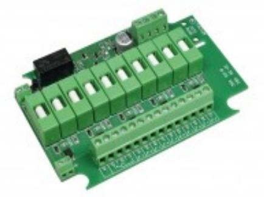
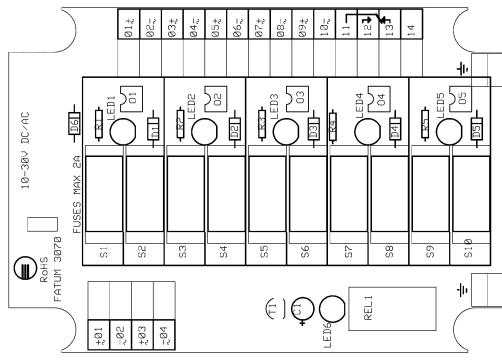

## 3071

## SÄKRINGSPLINT 10-30 V DC/AC

## **Produktdetajler:**

| Matningsspänning            | 7-30 VDC, 8-20 VAC           |
|-----------------------------|------------------------------|
| Strömförbrukning            | 23 mA @12 VDC, 33 mA @24 VDC |
| Antal kanaler               | 5                            |
| Skruv ing. matning          | 0,2 - 2,5 mm2                |
| Skruv utg. matning          | 0,14 - 1,5 mm2               |
| Max. belastning per channel | 30 V / 2 A                   |
| Max. ingångsström           | 10 A                         |
| Storlek (L x W)             | 116 x 80                     |

**Sabotageskyddad säkringsplint för spridning av strömmatning 10 A till 5 sektioner.**

Säkringsmodulen 3071 är konstruerad för kraftfördelning.

Den innehåller en matning med dubbla ingångar för anslutning till strömförsörjningen och fem oberoende säkrade utgångar. Utgångarna (+) och (-) i varje kanal är säkrade med separata säkringar.

Normaltillståndet för varje kanal signaleras med gröna LEDs.

Fel som detekteras i varje kanal (brist på spänning eller aktiverad säkring) signaleras av gemensam röd LED och omkopplingsrelä. Skruvanslutning med hissfunktion.

## **BESTÄLLINGSINFORMATION**

[Powered by TCPDF (www.tcpdf.org)](http://www.tcpdf.org)

**Typ E-nr Beskrivning** 3071.03 5010375 Säkringsplint; 10-30V DC/AC; Skruv