# Bruksanvisning

#### S24D330H

Färgen och utseendet kan variera beroende på produkt. Specifikationerna kan ändras utan föregående meddelande för att förbättra produktens prestanda.

Innehållet i den här handboken kan komma att ändras utan förvarning i avsikt att förbättra kvaliteten.

© Samsung Electronics

Samsung Electronics innehar upphovsrätten för den här handboken.

Användning eller reproduktion av den här handboken, delvis eller i sin helhet, utan tillstånd från Samsung Electronics är förbjudet.

Andra varumärken än Samsung Electronics tillhör sina respektive ägare.

- En administrationsavgift kan tillkomma om
	- ‒ (a) en tekniker tillkallas och det inte finns något fel på produkten.
	- (om du inte har läst den här användarhandboken).
	- ‒ (b) du tar med produkten till ett reparationscenter och det inte finns något fel på produkten. (om du inte har läst den här användarhandboken).
- Beloppet på en sådan administrationsavgift informeras före arbetet sker eller hembesöket görs.

### Innehållsförteckning

#### Innan du använder produkten

| Säkra installationsutrymmet | 4 |
|-----------------------------|---|
| Förvaring                   | 4 |
| Säkerhetsföreskrifter       | 4 |
| Symboler                    | 4 |
| Rengöring                   | 5 |
| Elektricitet och säkerhet   | 5 |
| Installation                | 6 |
| Användning                  | 7 |

#### Förberedelser

| Delar                                       | 9  |
|---------------------------------------------|----|
| Knappar på framsidan                        |    |
| Baksidan                                    | 10 |
| Ändra inställningarna för Ljus och Kontrast | 11 |
| Ändra produktens lutning                    | 11 |
| Antistöldlås                                | 12 |
| Installation                                | 13 |
| Montera stativet                            | 13 |
| Avlägsna stativet                           | 14 |

#### Ansluta och använda en källenhet

| Kontrollpunkter före anslutning              | 15 |
|----------------------------------------------|----|
| Ansluta och använda en dator                 | 15 |
| Anslutning med D-SUB-kabel (analog typ)      | 15 |
| Ansluta med en HDMI-kabel                    | 16 |
| Anslutning med en HDMI-DVI-kabel             | 16 |
| Ansluta strömmen                             | 16 |
| Korrekt hållning vid användning av produkten | 17 |
| Installation av drivrutiner                  | 17 |
| Ställa in den optimala upplösningen          | 17 |

#### Skärminställning

| Ljus                    | 18 |
|-------------------------|----|
| Kontrast                | 18 |
| Skärpa                  | 18 |
| Spelläge                | 19 |
| SAMSUNG MAGIC Bright    | 19 |
| SAMSUNG MAGIC Angle     | 20 |
| SAMSUNG MAGIC Upscale   | 20 |
| Bildstorlek             | 20 |
| HDMI svart           | 21 |
| Svarstid                | 21 |
| H-position & V-position | 21 |
| Grov                    | 21 |
| Fin                     | 21 |

### Innehållsförteckning

#### Ställa in ton

| Röd     | 22 |
|---------|----|
| Grön    | 22 |
| Blå     | 22 |
| Färgton | 23 |
| Gamma   | 23 |

#### Ändra storlek på eller flytta skärmen

| Språk                               | 24 |
|-------------------------------------|----|
| Meny H-position & MenyV-position | 24 |
| Visa tid                         | 24 |
| Transparens                         | 24 |

#### Inställningar och återställning

| Återställ alla | 25 |
|-------------------|----|
| Eco-spar Plus  | 25 |
| Sluttid           | 25 |
| PC/AV-läge        | 26 |
| Knappupprepn.tid  | 26 |
| Källdetektering   | 26 |
| INFORMATION       | 26 |

#### Installera programmet

| Easy Setting Box | 27 |
|------------------|----|

#### Felsökningsguide

| Vanliga frågor                         | 30 |
|----------------------------------------|----|
| Kontrollera följande.                  |    |
| Kontrollera upplösning och frekvens    | 28 |
| Testa produkten                        | 28 |
| Innan du kontaktar Samsungs kundtjänst | 28 |

#### Specifikationer

| Allmänt                         | 31 |
|---------------------------------|----|
| Tabell över standardsignallägen | 32 |

#### Appendix

| Ansvar för betalservice                      |    |
|----------------------------------------------|----|
| (kostnad för kunder)                         | 34 |
| Inget fel på produkten                       | 34 |
| En skada på produkten som orsakats av kunden | 34 |
| Annat                                        | 34 |

## Innan du använder produkten Kapitel 01

### Säkra installationsutrymmet

Se till att det finns plats runt produkten för ventilation. En invändig temperaturökning kan orsaka brand och skada på produkten. Se till att det finns så mycket utrymme som visas nedan eller mer när du installerar produkten.

― Utseendet kan variera beroende på produkt.

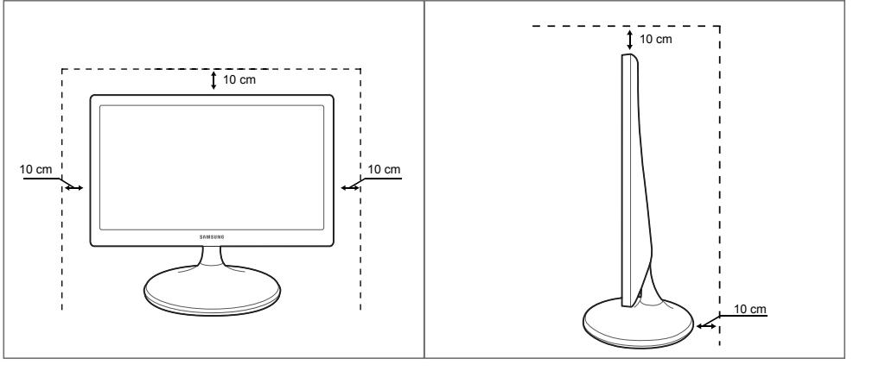

### Förvaring

Högglansmodeller kan få vita fläckar på ytan om en luftfuktare med ultraljud används i närheten.

― Kontakta Samsungs kundtjänst om du behöver rengöra insidan av produkten (en avgift tas ut).

### Säkerhetsföreskrifter

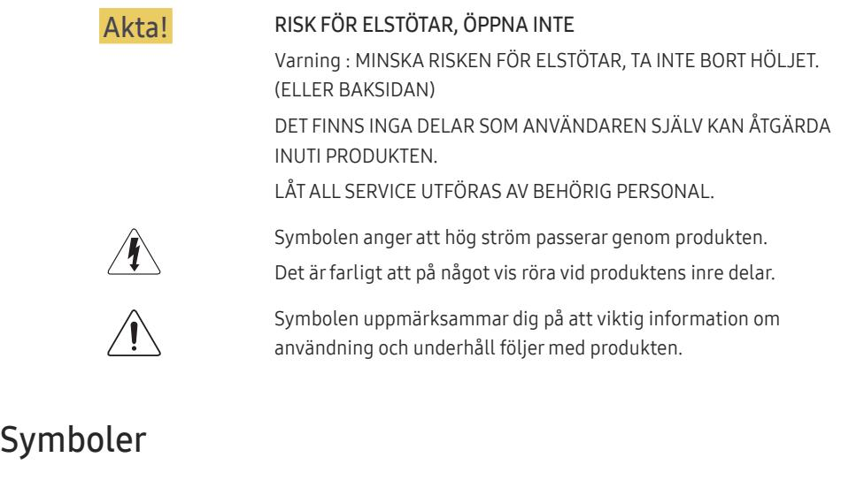

Varning! En allvarlig eller dödlig skada kan uppstå om anvisningarna inte följs.

Akta! Personskada eller skador på föremål kan uppstå om anvisningarna inte följs.

### Rengöring

― Var försiktig när du rengör skärmen och höljet eftersom avancerade LCD-skärmar lätt repas.

― Gör följande vid rengöring.

- 1 Stäng av produkten och datorn.
- 2 Koppla bort strömsladden från produkten.

― Håll i kontakten på strömsladden och rör inte sladden med blöta händer. Stötar kan annars uppstå.

- 3 Torka bildskärmen med en ren, mjuk och torr trasa.
	- ‒ Använd inte något rengöringsmedel som innehåller alkohol, lösningsmedel eller tensider på bildskärmen.
	- ‒ Spruta inte vatten eller rengöringsmedel direkt på produkten.
- 4 Fukta en ren och torr trasa med vatten och vrid ur den ordentligt när du gör rent utsidan av produkten.
- 5 Anslut strömsladden till produkten när du är färdig med rengöringen.
- 6 Sätt på produkten och datorn.

### Elektricitet och säkerhet

#### Varning!

- Använd inte en skadad strömsladd eller stickkontakt, eller ett eluttag som sitter löst.
- Anslut inte flera produkter till samma eluttag.
- Ta inte i kontakten med våta händer.
- Sätt i elkontakten ordentligt så att den inte sitter löst.
- Anslut stickkontakten till ett jordat eluttag (endast typ 1-isolerade enheter).
- Böj eller dra inte kraftigt i strömsladden. Placera inte något tungt föremål på strömsladden.
- Placera inte strömsladden eller produkten i närheten av värmekällor.
- Ta bort damm från stickkontakterna och eluttaget med en torr trasa.

Akta!

- Koppla inte från strömsladden när produkten används.
- Använd endast den strömsladd som tillhandhålls av Samsung och som följde med produkten. Använd inte strömsladden till andra produkter.
- Se till att eluttaget som strömsladden är anslutet till inte är övertäckt.
	- ‒ Strömmen till produkten måste brytas genom att strömsladden kopplas från om problem uppstår.
- Håll i stickkontakten när du kopplar från strömsladden från eluttaget.

#### Installation

#### Varning!

- Placera inte ljus, insektsspray eller cigaretter på produkten. Placera inte produkten nära värmekällor.
- Placera inte produkten i dåligt ventilerade utrymmen som bokhyllor eller garderober.
- Placera produkten minst 10 cm från väggen för ventilationens skull.
- Håll plastförpackningen utom räckhåll för barn.
	- ‒ Barnen kan kvävas.
- Placera inte produkten på ett ostadigt eller vibrerande underlag (instabil hylla, lutande ytor med mera).
	- ‒ Produkten kan falla och skadas och/eller orsaka skada.
	- ‒ Om produkten används i en miljö med kraftiga vibrationer kan produkten skadas eller börja brinna.
- Installera inte produkten i ett fordon eller på en plats utsatt för damm, fukt (droppande vatten osv.), olja eller rök.
- Utsätt inte produkten för direkt solljus, värme eller heta föremål som t.ex. en spis.
	- ‒ Produktens livstid kan förkortas eller brand uppstå.
- Placera inte produkten inom räckhåll för småbarn.
	- ‒ Produkten kan falla och skada barn.
- Matolja (exempelvis sojabönsolja) kan skada eller deformera produkten. Använd inte produkten i närheten av oljeföroreningar. Och installera eller använd inte produkten i köket eller nära spisen.

#### Akta!

- Tappa inte produkten när du flyttar den.
- Ställ inte ner produkten med framsidan nedåt.
- När du placerar produkten på ett skåp eller en hylla måste du se till att den nedre, främre kanten av produkten inte skjuter ut.
	- ‒ Produkten kan falla och skadas och/eller orsaka skada.
	- ‒ Placera endast produkten på skåp eller hyllor som har rätt storlek.
- Ställ ner produkten försiktigt.
	- ‒ Produkten kan skadas eller orsaka personskador.
- Om produkten installeras på ett ovanligt ställe (en plats utsatt för större mängder dammpartiklar, kemiska ämnen, extrema temperaturer eller höga fuktnivåer, eller en plats där produkten är igång under längre tidsperioder) kan det resultera i en kraftig försämring av produktens prestanda.
	- ‒ Kontakta Samsungs kundtjänst om du vill installera produkten på ett sådant ställe.

#### Användning

#### Varning!

- Ström med hög spänning går genom produkten. Ta aldrig själv isär, reparera eller ändra produkten.
	- ‒ Kontakta Samsungs kundtjänst för reparation.
- Om du ska flytta produkten måste du först koppla bort alla kablar från den, inklusive strömsladden.
- Om produkten låter konstigt, luktar bränt eller rök ska du omedelbart ta bort strömsladden och kontakta Samsungs kundtjänst.
- Låt inte barn klänga eller klättra på produkten.
	- ‒ Barnen kan skadas allvarligt.
- Om du tappar produkten eller om ytterhöljet skadas stänger du av strömmen och kopplar från strömsladden. Kontakta sedan Samsungs kundtjänst.
	- ‒ Fortsatt användning kan orsaka brand eller stötar.
- Lämna inte tunga föremål eller föremål som barn gillar (leksaker, godis osv.) på produkten.
	- ‒ Produkten eller tunga föremål kan falla när barn försöker nå leksakerna eller godiset och orsaka allvarliga skador.
- Stäng av produkten och dra ur strömsladden under åskväder.
- Tappa inte föremål på produkten och utsätt inte produkten för kraftiga smällar.
- Flytta inte produkten genom att dra i strömsladden eller någon kabel.
- Om en gasläcka inträffar ska du inte röra produkten eller stickkontakten. Ventilera också lokalen omedelbart.
- Lyft eller flytta inte produkten genom att dra i strömsladden eller någon kabel.
- Använd inte och placera inte eldfarliga sprayer eller lättantändliga ämnen nära produkten.
- Se till att ventilationsspringorna inte blockeras av dukar eller gardiner.
	- ‒ En ökad inre temperatur kan orsaka brand.
- Infoga inte metallföremål (mynt, hårspännen, säkerhetsnålar osv.) eller brännbara föremål (papper tändstickor osv.) i produkten (i ventilationsspringor, in-/utmatningsportar osv.).
	- ‒ Stäng alltid av produkten och koppla från strömsladden om vatten eller något annat ämne hamnar i produkten. Kontakta sedan Samsungs kundtjänst.
- Placera inte föremål som innehåller vätska (vaser, krukor, flaskor osv.) eller metallföremål på produkten.
	- ‒ Stäng alltid av produkten och koppla från strömsladden om vatten eller något annat ämne hamnar i produkten. Kontakta sedan Samsungs kundtjänst.

#### Akta!

- Om du låter skärmen stå med stillbild under en längre tid kan det orsaka inbrända bilder och defekta pixlar.
	- ‒ Aktivera strömsparläget eller en dynamisk skärmsläckare om du inte tänker använda produkten under en tid.
- Koppla från strömsladden från eluttaget om du inte tänker använda bildskärmen under en längre tid (semester med mera).
	- ‒ Ansamlat damm kan i kombination med värme orsaka brand, elstötar eller elläckage.
- Använd produkten med den rekommenderade upplösningen och frekvensen.
	- ‒ Synen kan försämras.
- Placera inte AC/DC-adaptrar tillsammans.
- Ta bort plastförpackningen från AC/DC-adaptern innan du använder den.
- Utsätt inte strömadaptern för vatten.
	- ‒ Stötar eller brand kan uppstå.
	- ‒ Undvik att använda produkten utomhus där den kan utsättas för regn eller snö.
	- ‒ Var noga med att AC/DC-adaptern inte blir blöt när du torkar golvet.
- Placera inte AC/DC-adaptern i närheten av någon värmekälla.
	- ‒ Annars kan brand uppstå.
- Se till att ventilationen är god kring AC/DC-adaptern.
- Om du placerar AC/DC-strömadaptern så att den hänger med sladden inuti riktad uppåt, kan vatten och andra främmande ämnen tränga in i adaptern och göra att den slutar fungera. Se till att AC/DC-strömadaptern ligger platt på ett bord eller på golvet.
- Håll inte produkten upp-och-ned och flytta den inte genom att hålla i foten.
	- ‒ Produkten kan falla och skadas eller orsaka skada.
- Om du sitter för nära skärmen under en längre tid kan synen försämras.
- Använd inte luftfuktare eller spisar i närheten av produkten.
- Vila ögonen i mer än fem minuter för varje timme du använder produkten.
- Rör inte vid skärmen när produkten varit påslagen under en längre tid då den kan vara mycket varm.
- Förvara små tillbehör utom räckhåll för barn.
- Var försiktig när du justerar produktens vinkel eller sänker eller höjer den.
	- ‒ Handen eller ett finger kan fastna och skadas.
	- ‒ Kraftig lutning på produkten kan resultera i att den faller och orsakar skada.
- Placera inte tunga föremål på produkten.
	- ‒ Produkten kan skadas eller orsaka personskador.

## Förberedelser Kapitel 02

### Delar

### Knappar på framsidan

- ― Färg och form på delarna kan variera från det som visas på bilden. Specifikationerna kan ändras utan föregående meddelande för att höja prestandan.
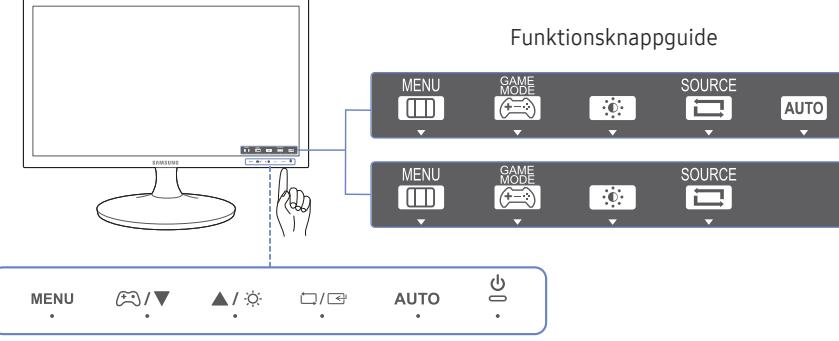

― Du aktiverar en knapp på produkten genom att peka på området längst ned på panelen.

― Knappen aktiveras inte om du pekar runt knappetiketten på framsidan av produkten.

| Ikoner | Beskrivning                                                                                                                                                                                                                                                                                                      |
|--------|------------------------------------------------------------------------------------------------------------------------------------------------------------------------------------------------------------------------------------------------------------------------------------------------------------------|
|        | Öppna eller stäng menyn på skärmen eller gå tillbaka till den föregående menyn.                                                                                                                                                                                                                               |
|        | OSD-kontrollås: Behåll de aktuella inställningarna eller lås menyreglaget så att inställningarna inte kan ändras av misstag.                                                                                                                                                                                  |
|        | • Aktivera: För att låsa menyreglaget trycker du på knappen i 10 sekunder.                                                                                                                                                                                                                              |
|        | • Inaktivera: För att låsa upp det låsta menyreglaget trycker du på knappen i över 10 sekunder.                                                                                                                                                                                                            |
|        | ― Om skärmmenykontrollen är låst kan du justera Ljus och Kontrast. Spelläge är tillgängligt. INFORMATION kan visas.                                                                                                                                                                                           |
|        | Tryck på om du vill aktivera eller inaktivera Spelläge.                                                                                                                                                                                                                                                       |
|        | Objekten nedan är inte tillgängliga om funktionen Spelläge är tillgänglig.                                                                                                                                                                                                                                       |
|        | SAMSUNG SAMSUNG SAMSUNG • BILD Kontrast, Skärpa, MAGICBright, MAGICAngel, MAGICUpscale                                                                                                                                                                                                   |
|        | • FÄRG                                                                                                                                                                                                                                                                                                        |
|        | • INST. & ÅTERST. Eco-spar Plus                                                                                                                                                                                                                                                                            |
|        | Flytta till den övre eller nedre menyn eller ändra värdet för ett alternativ på menyn på skärmen.                                                                                                                                                                                                             |
|        | Använd den här knappen för att reglera skärmens ljusstyrka och kontrast.                                                                                                                                                                                                                                         |
|        | Bekräfta ett menyval.                                                                                                                                                                                                                                                                                            |
|        | Om du trycker på knappen när menyn på skärmen inte visas ändras inmatningsskällan (Analog / HDMI). Om du slår på produkten eller ändrar inmatningskälla genom att trycka på knappen visas ett meddelande med information om den ändrade inmatningskällan i det övre vänstra hörnet av skärmen. |

| Ikoner              | Beskrivning                                                                                                                                            |  |  |  |
|---------------------|--------------------------------------------------------------------------------------------------------------------------------------------------------|--|--|--|
|                     | Tryck på knappen för att justera skärminställningarna automatiskt.                                                                                  |  |  |  |
|                     | ― Om du ändrar upplösningen i visningsegenskaper aktiveras funktionen Autojustering.                                                                |  |  |  |
|                     | ― Funktionen är bara tillgänglig i Analog-läge.                                                                                                        |  |  |  |
|                     | Slå på eller av skärmen.                                                                                                                               |  |  |  |
| Funktionsknappguide | När du trycker på en knapp på produkten visas Funktionsknappguiden innan skärmmenyn öppnas. (Guiden visar funktionen för den knapp som trycks ned.) |  |  |  |
|                     | Du kan öppna skärmmenyn när guiden visas genom att trycka en gång till på motsvarande knapp.                                                        |  |  |  |
|                     | Funktionsknappguiden kan variera mellan olika funktioner och produktmodeller.                                                                       |  |  |  |
|                     | Se aktuell produkt.                                                                                                                                    |  |  |  |
|                     | ― På funktionsknappssidan ser du om Spelläge är aktiverat. : Av                                                                                     |  |  |  |
|                     | : På                                                                                                                                                   |  |  |  |

### Baksidan

― Färg och form på delarna kan variera från det som visas på bilden. Specifikationerna kan ändras utan föregående meddelande för att höja prestandan.

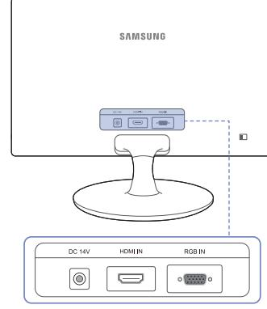

| Port | Beskrivning                                                     |
|------|-----------------------------------------------------------------|
|      | Ansluts till AC/DC-adaptern.                                    |
|      | Ansluter till en källenhet med HDMI-kabel eller HDMI-DVI-kabel. |
|      |                                                                 |
|      | Anslut till en dator med D-SUB-kabeln                           |
|      |                                                                 |

### Ändra inställningarna för Ljus och Kontrast

Justera Ljus och Kontrast med knapparna när inledningsskärmen visas (när ingen skärmmeny visas).

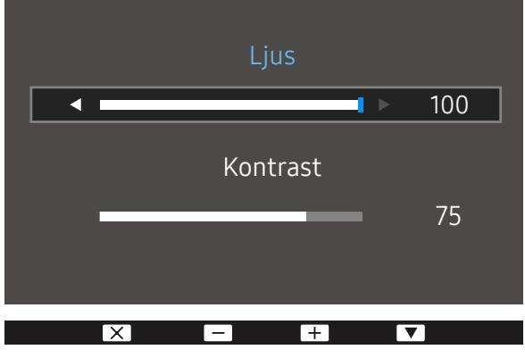

- ― Den visade bilden kan variera beroende på modell.
#### Ljus

- ― Menyn är inte tillgänglig när läget Dynamisk kontr. är angett för SAMSUNG MAGICBright.
- ― Menyn är inte tillgänglig när Eco-spar Plus är aktiverat.

#### Kontrast

- ― Menyn är inte tillgänglig när läget SAMSUNG MAGICBright är i Bio eller Dynamisk kontr..
― Menyn är inte tillgänglig när Spelläge är aktiverat.

### Ändra produktens lutning

- ― Färg och form på delarna kan variera från det som visas på bilden. Specifikationerna kan ändras utan föregående meddelande för att höja prestandan.
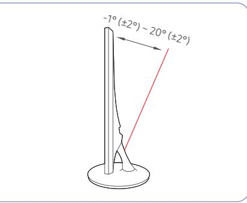

- Du kan ändra produktens lutning.
- Håll i nedre delen av produkten och justera noggrant lutningen.

### Antistöldlås

- ― Ett antistöldlås gör det möjligt för dig att använda produkten på ett säkert sätt även på offentliga platser.
- ― Låsenhetens form och låsmetod varierar med tillverkare. Se bruksanvisningen som medföljer låsenheten för detaljer.

#### Låsa en stöldskyddslåst enhet:

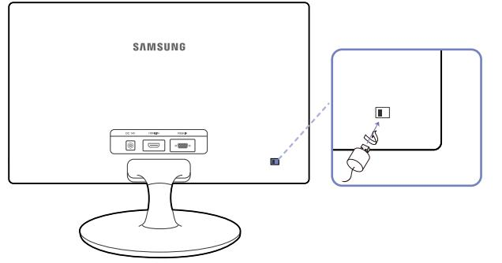

- 1 Fäst kabeln för antistöldlåsenheten i ett tungt föremål, såsom en bordsskiva.
- 2 Dra ena änden av kabeln genom öglan i andra änden.
- 3 Sätt i låsenheten i antistöldlåsenheten på produktens baksida.
- 4 Lås låsenheten.
	- ‒ En antistöldlåsenhet kan köpas separat.
	- ‒ Se bruksanvisningen som medföljer låsenheten för detaljer.
	- ‒ Antistöldlåsenheter kan köpas hos elektronikåterförsäljare eller online.

### Installation

#### Montera stativet

― Innan du monterar produkten ska du ställa ned produkten på ett plant och stabilt underlag med skärmen nedåt.

― Utseendet kan variera beroende på produkt.

För in anslutningen för stativ i stativet i den riktning som bilden visar.

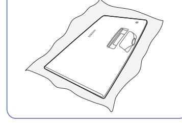

Lägg en duk över bordet för att skydda produkten och placera produkten på den så att fronten är vänd nedåt.

Kontrollera att anslutningen för stativ är ordentligt ansluten.

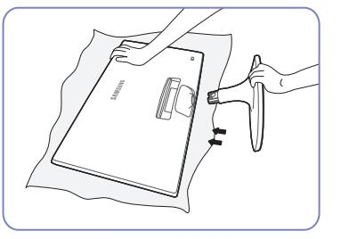

Håll i produktens huvudenhet med händerna som bilden visar.

Tryck in det monterade stativet i huvudenheten i pilens riktning som bilden visar.

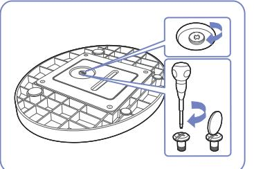

Vrid anslutningsskruven på stativets nederdel helt så att den är ordentligt fäst.

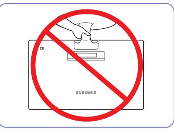

#### - Akta!

Håll inte bara i stativet om du håller produkten uppoch-ned.

#### Avlägsna stativet

― Innan du monterar produkten ska du ställa ned produkten på ett plant och stabilt underlag med skärmen nedåt.

― Utseendet kan variera beroende på produkt.

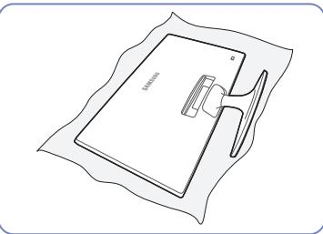

Lägg en duk över bordet för att skydda produkten och placera produkten på den så att fronten är vänd nedåt.

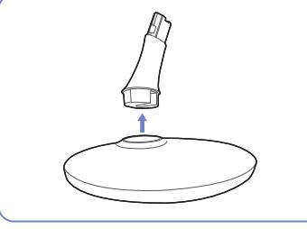

Ta ut anslutningen för stativ ur stativet genom att dra den i pilens riktning som bilden visar.

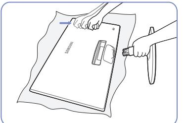

Greppa tag om stativpelaren med ena handen och banka nedåt med knuten näve på stativets fotplatta i pilens riktning för att lossa plattan.

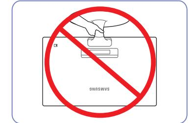

- Akta!

Håll inte bara i stativet om du håller produkten uppoch-ned.

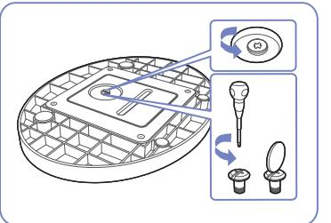

Vrid anslutningsskruven längst ned på stativet för att dela på dem.

## Ansluta och använda en källenhet Kapitel 03

### Kontrollpunkter före anslutning

― Innan du ansluter en källenhet ska du läsa bruksanvisningen som medföljer. Antalet och platserna för portarna på källenheterna kan variera från en enhet till en annan.

- ― Anslut inte strömsladden innan du ansluter de andra kablarna. Se till att först ansluta en källenhet innan du ansluter strömsladden.
- Om du ansluter strömkabeln under inkoppling kan det skada produkten.
- ― Kontrollera typerna av portar på baksidan av produkten du vill ansluta.

### Ansluta och använda en dator

#### Välj en anslutningsmetod som passar för din dator.

― Anslutningsdelarna kan variera med olika produkter.

- ― Vilka portar som ingår kan variera beroende på produkt.
### Anslutning med D-SUB-kabel (analog typ)

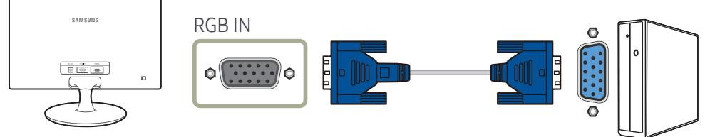

### Ansluta med en HDMI-kabel

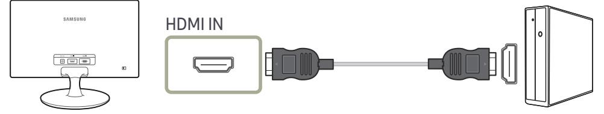

#### Anslutning med en HDMI-DVI-kabel

### Ansluta strömmen

Strömanslutning med integrerad AC/DC-strömadapter

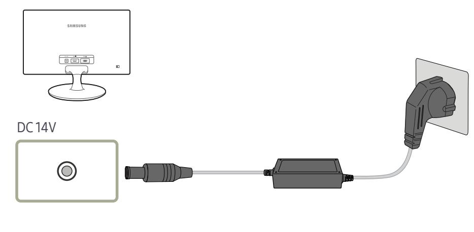

― Ingångsvolten ändras automatiskt.

#### Strömanslutning med löstagbar AC/DC-strömadapter

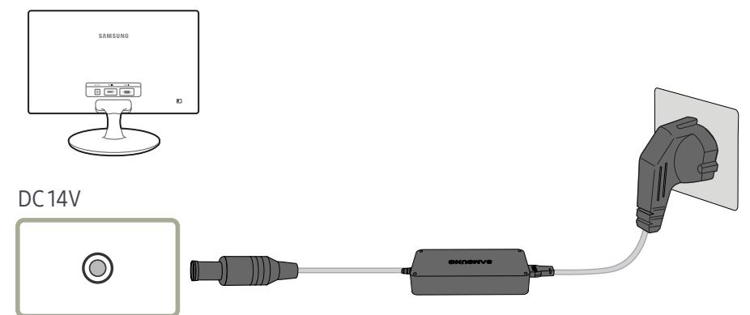

― Ingångsvolten ändras automatiskt.

### Korrekt hållning vid användning av produkten

Använd produkten med korrekt hållning enligt följande:

- Sitt med rak rygg.
- Justera vinkeln så att ljus inte reflekteras i skärmen.
- Håll underarmarna raka i förhållande till överarmarna och i nivå med handryggen.
- Armbågarna ska hålla ungefär 90 graders vinkel.
- Justera höjden på produkten så att knäna är böjda 90 grader eller mer, hälarna är placerade mot golvet och armarna hålls lägre än hjärtat.

### Installation av drivrutiner

- ― Du kan ställa in optimal upplösning och frekvens för den här produkten genom att installera överensstämmande drivrutiner för den här produkten.
- ― Om du vill installera den senaste versionen av produktens drivrutin, hämtar du den från Samsung Electronics webbplats på http://www.samsung.com.

### Ställa in den optimala upplösningen

Ett informationsmeddelande om optimal upplösning visas första gången du slår på produkten när du köpt den.

#### Välj ett språk på produkten och ställ in optimal upplösning på datorn.

- ― Om du inte väljer den optimala upplösningen visas meddelandet tre gånger under en viss tid även om du stänger av och slår på produkten igen.
- ― Du kan också välja den optimala upplösningen via Kontrollpanelen på datorn.

## Skärminställning Kapitel 04

Ange skärminställningar, till exempel ljusstyrka. En detaljerad beskrivning av varje funktion finns med. Se apparaten för detaljer.

― De funktionerna som är tillgängliga varierar beroende på produktmodellen. Se aktuell produkt.

### Ljus

Ändrar bildens ljusstyrka. (Intervall: 0~100) Ett högre värde får bilden att visas klarare.

― Menyn är inte tillgänglig när läget Dynamisk kontr. är angett för SAMSUNG MAGICBright.

― Menyn är inte tillgänglig när Eco-spar Plus är aktiverat.

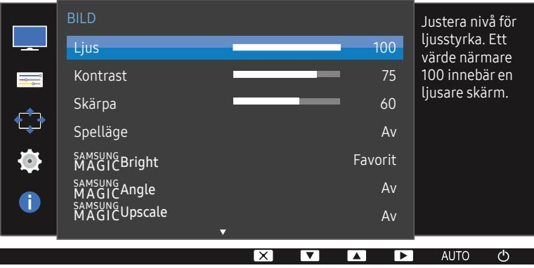

― Den visade bilden kan variera beroende på modell.

### Kontrast

Justera kontrasten mellan motiv och bakgrund. (Intervall: 0~100)

Ett högre värde ökar kontrasten för att få motivet att bli klarare.

― Det här alternativet är inte tillgängligt när SAMSUNG MAGICBright är i läget Bio eller Dynamisk kontr..

- ― Menyn är inte tillgänglig när Spelläge är aktiverat.
### Skärpa

Framhäv motivets konturer eller gör dem suddigare. (Intervall: 0~100) Ett högre värde gör motivets konturer skarpare.

― Det här alternativet är inte tillgängligt när SAMSUNG MAGICBright är i läget Bio eller Dynamisk kontr..

― Menyn är inte tillgänglig när läget SAMSUNG MAGICUpscale är i Läge 1 eller Läge 2.

― Menyn är inte tillgänglig när Spelläge är aktiverat.

### Spelläge

Konfigurera produktens skärminställningar för spelläget.

Använd den här funktionen när du spelar spel på en dator eller har anslutit en spelkonsol som PlayStation™ eller Xbox™.

- ― När skärmen stängs av, övergår i energisparläge eller ändrar ingångskällor, växlas Spelläge till Av även om det är inställt på På.
- ― Om du vill att Spelläge alltid ska vara aktiverat, markerar du Alltid på.

### SAMSUNG MAGIC Bright

Med den här menyn får du optimal bildkvalitet anpassad efter den miljö där produkten kommer att användas.

- ― Menyn är inte tillgänglig när Eco-spar Plus är aktiverat.
- ― Menyn är inte tillgänglig när Spelläge är aktiverat.
- ― Menyn är inte tillgänglig när SAMSUNG MAGICAngle är aktiverat.

Du kan anpassa ljusstyrkan efter dina egna behov.

#### I PC-läge

- Favorit: Anpassa kontrasten och ljusstyrkan efter behov.
- Standard: Få en bildkvalitet som är anpassad för redigering av dokument eller för att surfa på Internet.
- Bio: Få en ljusstyrka och skärpa som på en TV för visning av video- och DVD-innehåll.
- Dynamisk kontr.: Få en balanserad ljusstyrka genom automatiskt kontrastjustering.

#### I AV-läge

När den externa ingången ansluts via HDMI och PC/AV-läge är inställd på AV, har SAMSUNG MAGICBright fyra automatiska bildinställningarna (Dynamisk, Standard, Film och Favorit) som är förinställda på fabriken. Du kan aktivera antingen Dynamisk, Standard, Film eller Favorit. Du kan välja Favorit som automatiskt återkallar dina personliga bildinställningar.

- Dynamisk: Välj det här läget för att visa en skarpare bild än i läget Standard.
- Standard: Välj detta läge när omgivningen är ljus. Detta ger också en skarp bild.
- Film: Välj detta läge när omgivningen är mörk. Detta spar ström och minskar ögontrötthet.
- Favorit: Välj detta läge när du vill justera bilden enligt dina önskemål.

### SAMSUNG MAGIC Angle

Med SAMSUNG MAGICAngle kan du ställa in inställningar för optimal bildkvalitet beroende på visningsvinkeln.

― Menyn är inte tillgänglig när läget Bio eller Dynamisk kontr. är angett för SAMSUNG MAGICBright.

- ― Menyn är inte tillgänglig när Spelläge är aktiverat.
Du kan anpassa vinkeln efter dina egna behov.

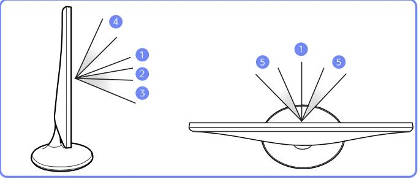

- Av 1 : Välj det här alternativet om du sitter rakt framför produkten.
- Tillb.lutat läge1 2 : Välj det här alternativet om du tittar upp något på produkten.
- Tillb.lutat läge2 3 : Välj det här alternativet om du tittar upp mer på produkten än vid Tillb.lutat läge1.
- Stående läge 4 : Välj det här alternativet om du tittar ner något på produkten.
- Sidoläge 5 : Välj det här alternativet om du sitter lite vid sidan av produkten.
- Gruppvy: Välj det här alternativet om fler än en person tittar på produkten från platserna 1 , 4 och 5 .
- Favorit: Tillb.lutat läge1 används som standard om Favorit är valt.

### SAMSUNG MAGIC Upscale

SAMSUNG MAGICUpscale-funktionen kan förbättra bilddetaljernas lager och göra bilden mer levande.

#### Funktionen har mest effekt på lågupplösta bilder.

- ― Menyn är inte tillgänglig när läget Bio eller Dynamisk kontr. är angett för SAMSUNG MAGICBright.
- ― Menyn är inte tillgänglig när Spelläge är aktiverat.
- Av / Läge 1 / Läge 2
- ― Jämfört med Läge 1 har Läge 2 större effekt.

### Bildstorlek

Ändra bildstorleken.

#### I PC-läge

- Auto: Visa bilden med det bildformat som inmatningskällan har.
- Wide: Visa bilden i helskärmsläge oavsett vilket bildformat inmatningskällan har.

#### I AV-läge

- 4:3: Visa bilden med bildformatet 4:3. Lämpligt för videor och standardsändningar.
- 16:9: Visa bilden med bildformatet 16:9.
- Anpassa t. skärm: Visa bilden med originalbildformatet utan beskärning.
- ― Funktionen kanske inte ingår beroende på vilka portar produkten har.
- ― Du kan ändra skärmstorlek när följande villkor är uppfyllda.
- ― En digital utenhet är ansluten med HDMI-kabeln.
- ― Ingångssignalen är 480p, 576p, 720p eller 1080p och skärmen kan visas normalt (signalerna kan inte användas på alla modeller).
- ― Detta kan endast ställas in när det externa ingången är ansluten via HDMI och PC/AV-läge är inställt som AV.

### HDMI svart

Om en DVD-spelare eller digital-tv-box är ansluten till produkten via HDMI, kan det uppstå en viss bildförsämring (kontrast/färgförsämring, svärta etc.) på den anslutna källenheten. I sådana fall kan HDMI svart användas för att justera bildkvaliteten.

Om så är fallet korrigerar du den försämrade bildkvaliteten med HDMI svart.

― Funktionen är bara tillgänglig i HDMI-läge.

- Normal: Välj det här läget när det inte finns någon försämring av kontrastförhållandet.
- Låg: Välj det här läget för att minska svärtan och öka den vita nivån när det finns en försämring i kontrastförhållandet.

― HDMI svart kanske inte fungerar med vissa källenheter.

― Funktionen HDMI svart aktiveras bara vid en viss AV-upplösning, till exempel 720P och 1080P.

### Svarstid

#### Accelerera skärmens svarshastighet så att videon blir mer levande och naturlig.

― Det bästa alternativet för Svarstid när du inte visar film är Standard eller Snabbare.

### H-position & V-position

H-position: Flytta skärmen åt vänster eller höger.

V-position: Flytta skärmen uppåt eller nedåt.

― Endast tillgängligt i läget Analog.

― Menyn är endast tillgänglig när Bildstorlek är inställt på Anpassa t. skärm i AV-läge. När en 480p-, 576p-, 720p- eller 1080p-signal används i AV-läge och bildskärmen visas normalt väljer du Anpassa t. skärm för att justera den vågräta positionen i nivåerna 0-6.

### Grov

#### Justera skärmfrekvensen

- ― Endast tillgängligt i läget Analog.
Fin

Finjustera skärmen för en levande bild.

- ― Endast tillgängligt i läget Analog.
## Ställa in ton Kapitel 05

En detaljerad beskrivning av varje funktion finns med. Se apparaten för detaljer. Justera skärmens ton. Menyn är inte tillgänglig när läget SAMSUNG MAGICBright är i Bio eller Dynamisk kontr.. Menyn är inte tillgänglig när Spelläge är aktiverat.

― De funktionerna som är tillgängliga varierar beroende på produktmodellen. Se aktuell produkt.

### Röd

Justera värdet för färgen röd i bilden. (Intervall: 0~100) Ett högre värde ökar färgens intensitet.

― Den visade bilden kan variera beroende på modell.

### Grön

Justera värdet för färgen grön i bilden. (Intervall: 0~100) Ett högre värde ökar färgens intensitet.

### Blå

Justera värdet för färgen blå i bilden. (Intervall: 0~100) Ett högre värde ökar färgens intensitet.

### Färgton

#### Ändrar bildens färgton.

― Menyn är inte tillgänglig när SAMSUNG MAGICAngle är aktiverat.

- ― Menyn är inte tillgänglig när läget SAMSUNG MAGICBright är i Bio eller Dynamisk kontr..
- ― Menyn är inte tillgänglig när Spelläge är aktiverat.
- Sval 2: Ange att färgtemperaturen ska vara svalare än Sval 1.
- Sval 1: Ange att färgtemperaturen ska vara svalare än läget Normal.
- Normal: Visa standardfärgtonen.
- Varm 1: Ange att färgtemperaturen ska vara varmare än läget Normal.
- Varm 2: Ange att färgtemperaturen ska vara varmare Varm 1.
- Favorit: Anpassa färgtonen.
- ― När den externa ingången ansluts via HDMI och PC/AV-läge är inställd på AV, har Färgton fyra automatiska inställningar för färgtemperatur (Sval, Normal, Varm och Favorit).

### Gamma

#### Ändra den normala ljusstyrkan (Gamma) för bilden.

- ― Menyn är inte tillgänglig när SAMSUNG MAGICAngle är aktiverat.
- ― Menyn är inte tillgänglig när läget SAMSUNG MAGICBright är i Bio eller Dynamisk kontr..
- ― Menyn är inte tillgänglig när Spelläge är aktiverat.
- Läge 1 / Läge 2 / Läge 3

## Ändra storlek på eller flytta skärmen Kapitel 06

En detaljerad beskrivning av varje funktion finns med. Se apparaten för detaljer.

― De funktionerna som är tillgängliga varierar beroende på produktmodellen. Se aktuell produkt.

### Språk

#### Ställ in menyspråk.

― En ändring i språkinställningen tillämpas bara för skärmmenyerna.

- ― Den används inte för andra funktioner i datorn.
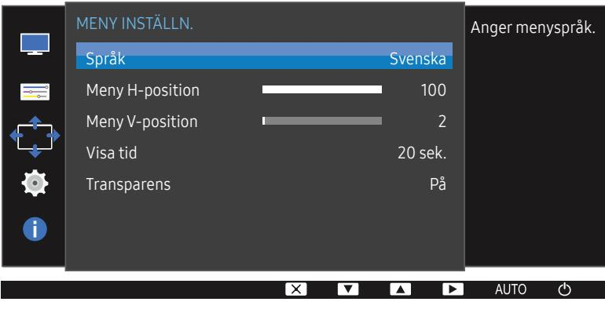

― Den visade bilden kan variera beroende på modell.

### Meny H-position & MenyV-position

Meny H-position: Flytta menyn åt vänster eller höger. Meny V-position: Flytta menyn uppåt eller nedåt.

### Visa tid

Ställ in att menyn på skärmen automatiskt ska försvinna om den inte används under en viss tid. Med Visa tid anger du efter hur lång tid menyn på skärmen ska försvinna.

### Transparens

Ställ in transparensen för menyfönstren.

## Inställningar och återställning Kapitel 07

En detaljerad beskrivning av varje funktion finns med. Se apparaten för detaljer.

― De funktionerna som är tillgängliga varierar beroende på produktmodellen. Se aktuell produkt.

## Återställ alla

Återställ alla Eco-spar Plus Sluttid PC/AV-läge Knappupprepn.tid Källdetektering INST. & ÅTERST. Av Acceleration Auto Återställ alla inställningarna för produkten till fabriksinställningarna.

Återställ alla inställningar för produkten till standardfabriksinställningarna.

― Den visade bilden kan variera beroende på modell.

### Eco-spar Plus

Funktionen Eco-spar Plus minskar strömförbrukningen genom att kontrollera den elektriska ström som används av skärmpanelen.

― Det här alternativet är inte tillgängligt när SAMSUNG MAGICBright är i läget Dynamisk kontr..

― Menyn är inte tillgänglig när Spelläge är aktiverat.

- Av: Avaktivera funktionen Eco-spar Plus.
- Auto: Strömförbrukningen minskas automatiskt med ca 10 % från den aktuella inställningen. (Hur mycket strömförbrukningen minskas beror på skärmens ljusstyrka.)
- Låg: Strömförbrukningen minskas med 25% från standardinställningen.
- Hög: Strömförbrukningen minskas med 50% från standardinställningen.

### Sluttid

Sluttid: Aktivera Sluttid-läget.

Stäng av efter: Timern kan ställas in på 1 till 23 timmar. Produkten stängs automatiskt av efter det angivna antalet timmar.

- ― Alternativet är bara tillgängligt när Sluttid är inställt på På.
25

― I produkter för vissa marknader är Sluttid inställt på att aktiveras automatiskt 4 timmar efter att produkten slås på. Det görs i enlighet med regelverk för strömförsörjning. Öppna MENU INST. & ÅTERST. och ställ in Sluttid på Av om du inte vill att timern ska aktiveras.

### PC/AV-läge

Ställ in PC/AV-läge på AV. Bildstorleken förstoras.

Det här alternativet är användbart när du tittar på en film.

- Ställ in som "PC" vid anslutning till en PC.
- Ställ in som "AV" vid anslutning till en AV-enhet.
- ― Den här funktionen stöder inte läget Analog.
- ― Medföljer endast Wide-modellerna, som 16:9 eller 16:10.
- ― Om skärmen (när den är ställd till HDMI) är i energisparläge eller om meddelandet Kontrollera signal visas ska du trycka på knappen för att visa menyn OSD (On Screen Display). Du kan välja PC eller AV.

### Knappupprepn.tid

Ställ in hur snabbt en knapp ska svara när den trycks ner.

Du kan välja Acceleration, 1 sek eller 2 sek. Om du väljer Ingen upprepning svarar ett kommando bara en gång när en knapp trycks ner.

### Källdetektering

Välj antingen Auto eller Manuellt som metod för att känna igen ingångssignalen.

### INFORMATION

Visa den aktuella inmatningskällan, frekvensen och upplösningen.

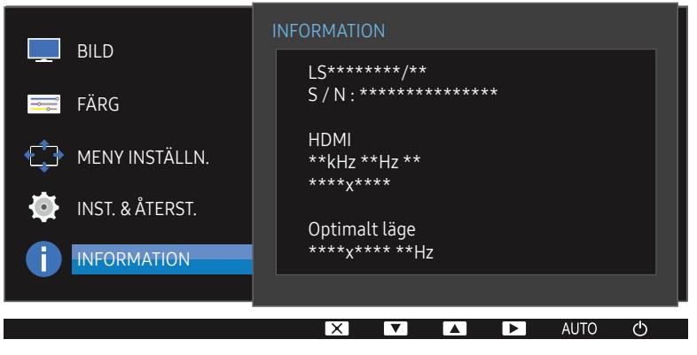

― Den visade bilden kan variera beroende på modell.

## Installera programmet Kapitel 08

### Easy Setting Box

Med Easy Setting Box kan användare använda skärmen genom delning i flera sektioner. Om du vill installera den senaste versionen av Easy Setting Box, hämtar du den från Samsung Electronics webbplats på http://www.samsung.com.

― Programmet kanske inte fungerar som det ska om du inte startar om datorn efter installationen.

― Ikonen Easy Setting Box kanske inte visas beroende på datorsystemet och produktspecifikationer.

― Om ikonen för genvägen inte visas trycker du på F5.

#### Begränsningar och problem vid installation

Installationen av Easy Setting Boxkan påverkas av grafikkortet, moderkortet och nätverksmiljön.

#### Systemkrav

| Operativsystem                 | Hårdvara                                      |  |  |  |
|--------------------------------|-----------------------------------------------|--|--|--|
| • Windows XP 32Bit/64Bit    | • Minst 32 MB minne                        |  |  |  |
| • Windows Vista 32Bit/64Bit | • Minst 60 MB ledigt utrymme på hårddisken |  |  |  |
| • Windows 7 32Bit/64Bit     |                                               |  |  |  |
| • Windows 8 32Bit/64Bit     |                                               |  |  |  |
| • Windows 8.1 32Bit/64Bit   |                                               |  |  |  |
| • Windows 10 32Bit/64Bit    |                                               |  |  |  |

## Felsökningsguide Kapitel 09

### Innan du kontaktar Samsungs kundtjänst

― Innan du kontaktar Samsungs kundtjänst ska du testa produkten enligt följande. Om problemet kvarstår ska du kontakta Samsungs kundtjänst.

### Testa produkten

Kontrollera om produkten fungerar normalt genom att använda produkttestfunktionen.

Om skärmen är avstängd och strömlampan blinkar fast produkten är korrekt ansluten till en dator utför du ett självdiagnostest.

- 1 Slå av både datorn och produkten.
- 2 Koppla från kabeln från produkten.
- 3 Slå på produkten.
- 4 Om meddelandet Kontrollera signal visas fungerar produkten normalt.

― Om skärmen förblir blank ska du kontrollera datorsystem, videostyrenhet och kabel.

### Kontrollera upplösning och frekvens

#### Om ett läge som överstiger den upplösning som stöds (se Tabell över standardsignallägen) är inställt visas meddelandet Ej optimalt läge.

― Den upplösning som visas på skärmen kan variera beroende på inställningarna på datorn och vilka kablar som används.

### Kontrollera följande.

#### Installationsfel (datorläge)

#### Skärmen håller på att slås på och av.

Kontrollera att kabeln är korrekt ansluten mellan produkten och datorn, och att kontakterna är ordentligt fästa.

Mellanslag hittas på alla fyra sidor av skärmvisningen när en HDMI- eller HDMI-DVI-kabel ansluts till produkten och datorn.

Mellanslagen som hittas på skärmen har inget att göra med produkten.

Mellanslag på skärmen orsakas av datorn eller grafikkortet. För att lösa problemet ska du justera skärmstorleken i HDMI- eller DVI-inställningar för grafikkortet.

Om grafikkortets inställningsmeny inte har något alternativ för att ändra skärmstorleken ska du uppdatera grafikkortets drivrutin till senaste version.

(Kontakta tillverkaren av grafikkortet eller datorn för mer information om hur du ändrar skärminställningarna.)

#### Skärmproblem

#### Strömlampan är släckt. Skärmen slås inte på.

Kontrollera att strömsladden är ordentligt fastsatt.

Meddelandet Kontrollera signal visas.

Kontrollera att kabeln är ordentligt ansluten till produkten.

Kontrollera att enheten som är ansluten till produkten som är påslagen.

#### Ej optimalt läge visas.

Det här meddelandet visas om signalen från grafikkortet överskrider produktens maximala upplösning eller frekvens.

Ändra den maximala upplösningen och frekvensen efter produktens prestanda i enlighet med tabellen över standarsignallägen (s. 32).

#### Bilderna på skärmen ser förvridna ut.

Kontrollera kabelanslutningen till produkten.

#### Skärmen är inte klar. Skärmen är suddig.

#### Justera Grov och Fin.

Ta bort alla tillbehör (videoförlängningskabel etc.) och försök igen.

Ställ in upplösning och frekvens till rekommenderad nivå.

#### Skärmen visas instabilet och skakigt. Det finns skuggor eller spökbilder till vänster på skärmen.

Kontrollera att upplösning och frekvens för datorn är inom upplösningsintervallet och frekvensen som är kompatibla med produkten. Om det behövs ska du sedan ändra inställningar i enlighet med tabellen över standardsignallägen (s. 32) i den här manualen och menyn INFORMATION på produkten.

Skärmen är för ljus. Skärmen är för mörk.

Justera Ljus och Kontrast.

Skärmfärgen är ojämn.

Ändra inställningarna under FÄRG.

Färgerna på skärmen har en skugga och är förvridna.

Ändra inställningarna under FÄRG.

Vitt ser inte riktigt ut som vitt.

Ändra inställningarna under FÄRG.

Det finns ingen bild på skärmen och strömlampan blinkar varannan till varje hel sekund.

Produkten är i energisparläge.

Tryck på valfri knapp på tangentbordet eller flytta på musen för att återgå till föregående skärm.

#### Texten är suddig.

Om du använder ett Windows-operativsystem (t.ex. Windows 7, Windows 8, Windows 8.1 eller Windows 10): Gå till Kontrollpanelen Teckensnitt Justera ClearType-text och ändra Aktivera ClearType.

#### Videouppspelningen är hackig.

Uppspelning av högupplösta, stora videofiler kan vara hackig. Det kan bero på att videospelaren inte är optimerad för datorresursen.

Försök spela upp filen i en annan videospelare.

#### Källenhetsfel

#### Ett signalljud hörs när min dator startar.

Om en signal hörs när datorn startar ska du låta den komma på service.

― LED-lampornas synlighet på produktens ram är beroende av användarens betraktningsvinkel. Ljuset är ofarligt för människor och har ingen effekt på produktens funktioner eller prestanda. Produkten är säker att använda.

### Vanliga frågor

― Läs användarhandboken för datorn eller grafikkortet för mer information om ändring av inställningar.

#### Hur ändrar jag frekvens?

Ställ in frekvensen på grafikkortet.

- Windows XP: Gå till Kontrollpanelen Utseenden och teman Bildskärm Inställningar Avancerat Bildskärm och ändra Uppdateringsfrekvens under Bildskärmsinställningar.
- Windows ME/2000: Gå till Kontrollpanelen Bildskärm Inställningar Avancerat Bildskärm och ställ in Uppdateringsfrekvens under Bildskärmsinställningar.
- Windows Vista: Gå till Kontrollpanelen Utseende och anpassning Anpassning Bildskärmsinställningar Avancerade inställningar Bildskärm och ställ in Uppdateringsfrekvens under Bildskärmsinställningar.
- Windows 7: Gå till Kontrollpanelen Utseende och anpassning Bildskärm Skärmupplösning Avancerade inställningar Bildskärm och justera Uppdateringsfrekvens under Bildskärmsinställningar.
- Windows 8 (Windows 8.1): Välj Inställningar Kontrollpanelen Utseende och anpassning Bildskärm Skärmupplösning Avancerade inställningar Bildskärm och ändra Uppdateringsfrekvens under Bildskärmsinställningar.
- Windows 10: Gå till Inställningar System Bildskärm Avancerade skärminställningar Egenskaper för bildskärmskort Bildskärm, och justera Uppdateringsfrekvens under Bildskärmsinställningar.

#### Hur ändrar jag upplösningen?

- Windows XP: Gå till Kontrollpanelen Utseende och teman Bildskärm Inställningar och justera upplösningen.
- Windows ME/2000: Gå till Kontrollpanelen Bildskärm Inställningar och ändra upplösningen.
- Windows Vista: Gå till Kontrollpanelen Utseende och anpassning Anpassa Inställningar för bildskärm och justera upplösningen.
- Windows 7: Gå till Kontrollpanelen Utseende och anpassning Bildskärm Justera upplösning och justera upplösningen.
- Windows 8 (Windows 8.1): Gå till Inställningar Kontrollpanelen Utseende och anpassning Bildskärm Justera upplösning och justera upplösningen.
- Windows 10: Gå till Inställningar System Bildskärm Avancerade skärminställningar, och justera upplösningen.

#### Hur ställer jag in energisparläge?

- Windows XP: Ställ in energisparläget i Kontrollpanelen Utseende och teman Bildskärm Inställningar för skärmsläckare Energialternativ eller datorns BIOS-inställningar.
- Windows ME/2000: Ställ in energisparläget i Kontrollpanelen Bildskärm Inställningar för skärmsläckare Energialternativ eller datorns BIOS-inställningar.
- Windows Vista: Ställ in energisparläget i Kontrollpanelen Utseende och anpassning Anpassa Inställningar för skärmsläckare Energialternativ eller datorns BIOS-inställningar.
- Windows 7: Ställ in energisparläget i Kontrollpanelen Utseende och anpassning Anpassa Inställningar för skärmsläckare Energialternativ eller datorns BIOS-inställningar.
- Windows 8 (Windows 8.1): Ställ in energisparläget i Inställningar Kontrollpanelen Utseende och anpassning Anpassa Inställningar för skärmsläckare Energialternativ eller datorns BIOSinställningar.
- Windows 10: Ställ in energisparläget i Inställningar Anpassning Låsskärm Timeoutinställningar för skärmen Energialternativ eller datorns BIOS-inställningar.

## Specifikationer Kapitel 10

### Allmänt

| Modellnamn             | S24D330H                                                                                       |  |  |  |
|------------------------|------------------------------------------------------------------------------------------------|--|--|--|
| Storlek                | 24-klass (24 tum / 61 cm)                                                                      |  |  |  |
| Visningområde          | 531,36 mm (H) x 298,89 mm (V)                                                                  |  |  |  |
| Bildpunktstopp         | 0,27675 mm (H) x 0,27675 mm (V)                                                                |  |  |  |
| Maximal pixelklocka | 148,5 MHz (Analog, HDMI)                                                                       |  |  |  |
| Nätanslutning          | AC 100 - 240 V – (+/- 10 %), 50/60 Hz ± 3 Hz                                                   |  |  |  |
|                        | Se etiketten på produktens baksida, eftersom standardspänningen kan variera i olika länder. |  |  |  |
| Signalanslutningar     | D-SUB, HDMI                                                                                    |  |  |  |
| Miljöförhållanden      | Drift                                                                                          |  |  |  |
|                        | Temperatur: 10 C–40 C (50 F–104 F)                                                             |  |  |  |
|                        | Luftfuktighet: 10% till 80%, icke-kondenserande                                                |  |  |  |
|                        | Förvaring                                                                                      |  |  |  |
|                        | Temperatur: -20 C–45 C (-4 F–113 F)                                                            |  |  |  |
|                        | Luftfuktighet: 5% till 95%, icke-kondenserande                                                 |  |  |  |

#### ― Plug & Play

Skärmen kan installeras på alla Plug & Play-kompatibla system. Tvåvägs datautväxling mellan monitorn och datorns system optimerar monitorinställningarna. Monitorinstallationen sker automatiskt. Du kan dock anpassa installationsinställningarna efter önskemål

#### ― Panelpunkter (pixlar)

På grund av produktens tillverkning kan ungefär 1 pixel per miljon (1 ppm) vara ljusare eller mörkare på LCD-panelen. Detta påverkar inte produktprestandan.

― Specifikationerna ovan kan ändras utan föregående meddelande för att höja prestandan.

― Den här enheten är en digital apparat i Klass B.

- ― Detaljerade enhetsspecifikationer finns på Samsung Electronics webbplats.
### Tabell över standardsignallägen

| Modellnamn     |                      | S24D330H            |
|----------------|----------------------|---------------------|
| Synkronisering | Horisontell frekvens | 30–81 kHz           |
|                | Vertikal frekvens    | 56–75 Hz            |
| Upplösning     | Optimal upplösning   | 1920 x 1080 @ 60 Hz |
|                | Maximal upplösning   | 1920 x 1080 @ 60 Hz |

Om en signal som hör till följande standardsignallägen skickas från datorn justeras skärmen automatiskt. Om signalen som sänds från datorn inte hör hemma ibland standardsignallägena kan skärmen bli blank med strömlampan på. I så fall ska du ändra inställningarna enligt följande tabell genom att läsa i bruksanvisningen för grafikkortet.

| Upplösning       | Horisontell frekvens (kHz) | Vertikal frekvens (Hz) | Pixelklocka (MHz) | Synkpolaritet (H/V) |
|------------------|----------------------------|------------------------|-------------------|---------------------|
| IBM, 720 x 400   | 31,469                     | 70,087                 | 28,322            | -/+                 |
| MAC, 640 x 480   | 35,000                     | 66,667                 | 30,240            | -/-                 |
| MAC, 832 x 624   | 49,726                     | 74,551                 | 57,284            | -/-                 |
| MAC, 1152 x 870  | 68,681                     | 75,062                 | 100,000           | -/-                 |
| VESA, 640 x 480  | 31,469                     | 59,940                 | 25,175            | -/-                 |
| VESA, 640 x 480  | 37,861                     | 72,809                 | 31,500            | -/-                 |
| VESA, 640 x 480  | 37,500                     | 75,000                 | 31,500            | -/-                 |
| VESA, 800 x 600  | 35,156                     | 56,250                 | 36,000            | +/+                 |
| VESA, 800 x 600  | 37,879                     | 60,317                 | 40,000            | +/+                 |
| VESA, 800 x 600  | 48,077                     | 72,188                 | 50,000            | +/+                 |
| VESA, 800 x 600  | 46,875                     | 75,000                 | 49,500            | +/+                 |
| VESA, 1024 x 768 | 48,363                     | 60,004                 | 65,000            | -/-                 |
| VESA, 1024 x 768 | 56,476                     | 70,069                 | 75,000            | -/-                 |
| VESA, 1024 x 768 | 60,023                     | 75,029                 | 78,750            | +/+                 |

| Upplösning          | Horisontell frekvens (kHz) | Vertikal frekvens (Hz) | Pixelklocka (MHz) | Synkpolaritet (H/V) |
|---------------------|----------------------------|------------------------|-------------------|---------------------|
| VESA, 1152 x 864    | 67,500                     | 75,000                 | 108,000           | +/+                 |
| VESA, 1280 x 720    | 45,000                     | 60,000                 | 74,250            | +/+                 |
| VESA, 1280 x 800    | 49,702                     | 59,810                 | 83,500            | -/+                 |
| VESA, 1280 x 1024   | 63,981                     | 60,020                 | 108,000           | +/+                 |
| VESA, 1280 x 1024   | 79,976                     | 75,025                 | 135,000           | +/+                 |
| VESA, 1440 x 900    | 55,935                     | 59,887                 | 106,500           | -/+                 |
| VESA, 1600 x 900 RB | 60,000                     | 60,000                 | 108,000           | +/+                 |
| VESA, 1680 x 1050   | 65,290                     | 59,954                 | 146,250           | -/+                 |
| VESA, 1920 x 1080   | 67,500                     | 60,000                 | 148,500           | +/+                 |

― Horisontell frekvens

Tiden det krävs för att skanna en rad från vänster till höger sida av skärmen kallas en horisontell cykel. Det resiproka numret på den horisontella cykeln kallas horisontell frekvens. Horisontell frekvens uppmäts i kHz.

#### ― Vertikal frekvens

Genom att varje bild upprepas många gånger per sekund ser bilderna naturligare ut. Den här upprepningsfrekvensen kallas för "vertikal frekvens" eller "uppdateringshastighet" och anges i Hz.

― Den här produkten kan ställas in till endast en upplösning för varje skärmstorlek för att uppnå optimal bildkvalitet tack vare panelens karaktär. Därför kan bildkvaliteten försämras om en annan upplösning än den angivna upplösningen ställs in. För att undvika detta rekommenderar vi att du väljer optimal upplösning som är specificerad för din produkt.

― Kontrollera frekvensen när du byter en CDT-monitor (ansluten till en dator) mot en LCD-monitor. Om LCD-monitorn inte stöder 85 Hz ändrar du den vertikala frekvensen till 60 Hz med CDT-monitorn innan du byter den mot LCD-monitorn.

## Appendix Kapitel 11

### Ansvar för betalservice (kostnad för kunder)

― När service efterfrågas, trots garantin, kan vi debitera dig för ett besök av en servicetekniker i följande fall.

### Inget fel på produkten

Rengöring av produkten, justering, förklaring, ominstallation osv.

- Om en servicetekniker ger instruktioner för hur produkten ska användas eller bara justerar inställningar utan att montera isär produkten.
- Om en defekt har orsakats av yttre miljöfaktorer (Internet, antenn, kabelsignal osv,)
- Om en produkt har installerats om eller om extra enheter har anslutits efter det att den köpta produkten installerades första gången.
- Om en produkt har installerats om för att flyttas till en annan plats eller till ett annat hus.
- Om kunden begär användningsinstruktioner på grund av en produkt från ett annat företag.
- Om kunden begär instruktioner för att använda nätverket eller ett program från ett annat företag.
- Om kunden begär installation och konfigurering av programvara för produkten.
- Om en servicetekniker tar bort/rengör damm eller främmande material inuti produkten.
- Om kunden begär en installation ytterligare efter att ha köpt produkten via hemshopping eller online.

### En skada på produkten som orsakats av kunden

Skada på produkten orsakad av kundens felhantering eller felaktiga reparation. Om en skada på produkten har orsakats av:

- yttre påverkan eller fall.
- Användning av tillbehör eller separat sålda produkter som inte specificerats av Samsung.
- Reparation av en person förutom en tekniker från ett annat serviceföretag eller partner till Samsung Electronics CO.; Ltd.
- Ommodellering eller reparation av produkten utförd av kunden.
- Användning av produkten med felaktig spänning eller icke-auktoriserade elektriska anslutningar.
- Säkerhetsföreskrifterna i användarhandboken har inte följts.

#### Annat

- Om produkten skadats på grund av en naturkatastrof. (åska, brand, jordbävning, översvämning osv.)
- Om förbrukningskomponenter har förbrukats. (batterier, toner, lysrör, munstycke, vibrator, lampa, filter, band osv.)

― Om kunden begär service och produkten inte har något fel kan en serviceavgift tas ut. Läs därför alltid användarhandboken först.