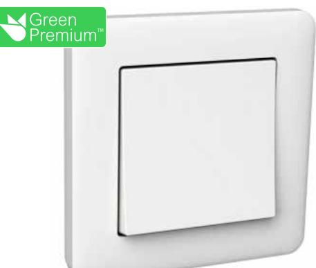

# **Produktdatablad**

Specifikationer

# Strömställare, Exxact, Primo, trapp/1-pol, infälld, 16A, IP21, snabbanslutning, komplett med ram, Vit

**E-nummer**: **1822121** WDE002021

# **EAN-kod : 3606480210389**

| Produktdata                    |                                                                                                   |
|--------------------------------|---------------------------------------------------------------------------------------------------|
| Produktfamilj                  | EXXACT                                                                                            |
| Typ av produkt eller komponent | Strömställare                                                                                     |
| Enhetsapplikation              | Manövrering                                                                                       |
| Teknologityp                   | Elektromekanisk                                                                                   |
| Kvantitet per set              | Sats med 5                                                                                        |
| Teknisk data                   |                                                                                                   |
| Produktbeskrivning             | Komplett produkt                                                                                  |
| Apparatmontering               | Infälld                                                                                           |
| Antal vippor                   | 1                                                                                                 |
| Funktion                       | Trapp 1-pol                                                                                       |
| Koppling                       | [6/1]                                                                                             |
| Rated current                  | 16 A                                                                                              |
| [Ue] rated operational voltage | 250 V                                                                                             |
| Network type                   | AC                                                                                                |
| Colour                         | Vit (RAL 9003)                                                                                    |
| Anslutningar - plintar         | Snabbanslutning                                                                                   |
| Loop terminaler                | 2                                                                                                 |
| Anslutningskapacitet           | 1 x 1.52 x 2.5 mm² för fast kabel (kablar) 1 x 1.52 x 2.5 mm² för fåtrådig (FK) kabel (kablar) |
| Material                       | ABS (akrylnitrilbutadienstyren)                                                                   |
| Valfri montering               | Med klokit: insats Med skruv: vippa                                                            |
| Inbyggnadsdjup                 | 15 mm                                                                                             |
| Höjd                           | 71 mm                                                                                             |
| Bredd                          | 71 mm                                                                                             |
| Utskjutande mått               | 18 mm                                                                                             |

## **Miljö**

**Standarder** EN 60669-1

Friskrivningsklausul: Denna dokumentation ska inte användas för att avgöra dessa produkters lämplighet eller pålitlighet för specifika kundapplikationer.

| Produktcertifieringar | NEMKO CE FIMKO SEMKO |
|-----------------------|-------------------------------|
| IP-kapslingsklass     | IP20 IP44 med tätningssats |

# **Förpackningsinformation**

| Förpackningstyp 1            | PCE     |
|------------------------------|---------|
| Antal i Förpackning 1        | 1       |
| Förpackning 1 höjd           | 4,3 cm  |
| Förpackning 1 bredd          | 10,3 cm |
| Förpackning 1 djup           | 11,7 cm |
| Förpackning 1 vikt           | 88 g    |
| Förpackningstyp 2            | BB1     |
| Antal i Förpackning 2        | 5       |
| Förpackning 2 höjd           | 10,4 cm |
| Förpackning 2 bredd          | 11,7 cm |
| Förpackning 2 djup           | 20,1 cm |
| Förpackning 2 vikt           | 498 g   |
| Förpackningstyp 3            | CAR     |
| Number of Units in Package 3 | 60      |
| Förpackning 3 höjd           | 22,5 cm |
| Förpackning 3 bredd          | 37,1 cm |
| Förpackning 3 djup           | 43,7 cm |
| Förpackning 3 vikt           | 6,39 kg |

### **Hållbarhetsinformation**

| Hållbarhetsstatus                     | Green Premium-produkt                                                                                                           |
|---------------------------------------|---------------------------------------------------------------------------------------------------------------------------------|
| REACh-förordning                      | REACh-Deklaration                                                                                                               |
| Innehåller ej REACh SVHC ämnen     | Ja                                                                                                                              |
| EU RoHS-direktiv                      | Kompatibel EU RoHS-deklaration                                                                                               |
| Innehåller ej giftiga tungmetaller | Ja                                                                                                                              |
| Kvicksilverfri                        | Ja                                                                                                                              |
| RoHS-förordning Kina                  | RoHS-deklaration Kina Proaktiv RoHS-deklaration för Kina (ej inom juridisk omfattning för RoHS Kina)                         |
| RoHS-undantagsinformation             | Ja                                                                                                                              |
| Miljöupplysning                       | Produktmiljöprofil                                                                                                              |
| WEEE                                  | Produkten måste kasseras på europeiska unionens marknader enligt specifik källsortering och aldrig kasseras i hushållssopor. |

### **Kontraktsgaranti**

**Garanti** Enligt våra försäljningsvillkor

#### **Rekommenderade ersättningsprodukter**