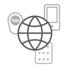
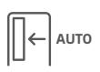
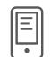
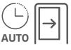
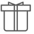
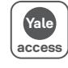
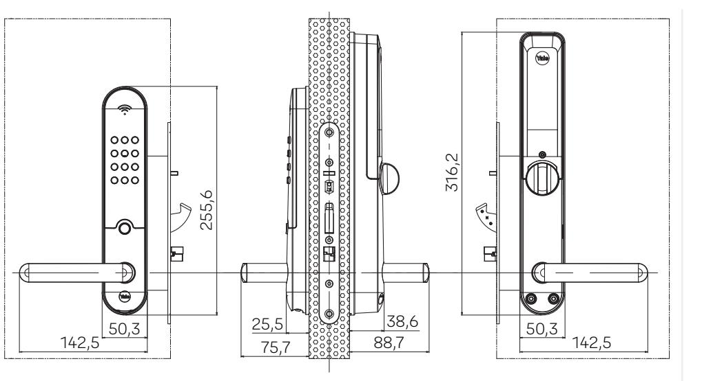
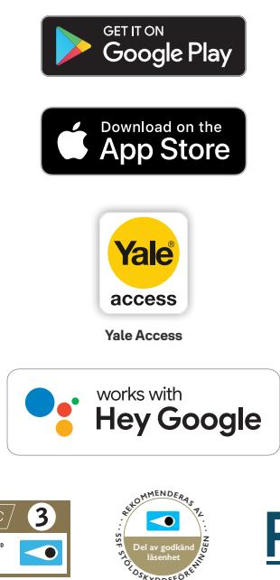

# Yale Doorman L3 digitalt lås för hemmet

**Lås upp med mobilen, kod eller använd bricka. Valet är helt ditt och du behöver aldrig bära nycklar igen. Lås och lås upp ditt hem på håll eller aktivera autolåsning för total trygghet. Du behöver aldrig fundera på om hemmet är låst igen.**

Kombinationen av digital kryptering och robust mekanik gör låset till vårt säkraste någonsin. Yale Doorman L3 rekommenderas av SSF och är naturligtvis godkänt i nya låsklass 3.

Yale Doorman är perfekt för dig som vill kontrollera åtkomst på ett smart sätt till ditt hem. Skapa tillfälliga koder för andra eller släpp in dem via din smartphone. Gå en promenad med hunden, ta en joggingtur eller gå ut i trädgården – helt utan nycklar.

Lås och lås upp med kod, nyckelbricka eller app och se status i din smarttelefon från var som helst i världen

Tilldela permanent eller tidsbegränsat tillträde, via din smarttelefon från var som helst i världen

Förberedd för röststyring och andra smartahemkomponenter (se yale.se för uppdaterad lista över kompatibla enheter)

Automatisk upplåsing när du kommer hem

Få koll på vem som öppnar dörren och se status i appens aktivitetslogg samt få pushmeddelanden till din smarttelefon

Automatisk låsing med justerbar tidsfördröjning

Förberedd för In-Home-Services (leveranser och tjänster innanför dörren)

Innebyggd ringklocka En app för styrning av alla dina lås kompatibla med Yale Access

**Trusted every day**

## Specifikationer

### **Funktion**

Öppnas med användarkod, nyckelbricka eller boende eller gästens App. Inbyggt realtidsklocka och kalender Förberedd för in home service tjänster Inbyggd dörrklocka Mekanisk nödöppning från insidan Nödström från utsidan mha standard 9 v batteri

Låsklass 3522 Klass 3 i bortasäkert läge.

#### **Egenskaper**

Beslag endast 50 mm anpassad för moderna dörrkonstruktioner.

Metalliska och beständiga ytbehandlingar i borstad och blankt utförande.

Förenklad installation anpassad för dörrindustrins krav

Förbättrat användainterface guidar användaren med ljud, ljus och talad guide.

Modern och säker RFID lösning baserad på Mifare Desfire Variant anpassad för centraliseras administration

Centraliserad administration fungerar parallellt med användarens personifiering av låsets funktion

#### **Specifikationer**

SSF 3522 Låsklass 3 IP 55 (utsida) Passar befintliga låsuttag för skandinaviska ytterdörrar. Ingen kabeldragning Klarar dörrtjocklekar från 40-88 mm utan anpassning

4 X AA Alkaliska batterier.

Brandtestad upp till 120 minuter (Indikativt. Brand cert hålls av dörren)

#### **Centraliserad administration**

Låsägaren, fastighetsägare/förvaltare, kan utfärda nyckelbrickor till låset utan att fysiskt vara vid dörren. En grupp nyckelbrickor till distribueras före inflyttning och ett "tidsfönster" styr från vilken tidpunkt nyckelbrickan ska fungera.

En ny hyresgästs/boendes nyckelbrickor kommer automatiskt radera förgående hyresgästs behörigheter och personliga inställningar. Den boende kan inte påverka centralt utfärdade nyckelbrickor

Nyckelbrickor för entreprenörer kan styras i detalj och ges relevanta behörigheter via uppdateringsläsare.

 **S KY D D S F**

Apple, the Apple logo and iPhone are trademarks of Apple Inc., registered in the U.S.and other countries and regions. App Store is a service mark of Apple Inc. Google and Google Play are trademarks of Google LLC.