# Installations manual iOS/ Secuyou Smart Lock

Version DK 01-2020

# Trin 1

- 1. Download Secuyou Smart Lock App'en
- 2. Sikre dig at din bluetooth forbindelse er slået til i indstillinger
- 3. Sikre dig, at andre brugere, ikke er forbundet til den lås, du ønsker at få adgang til. Andre brugere skal slukke for deres bluetooth.
- 4. Placer dig max. 1 meter fra låsen ved installation
- 5. Installer kun en lås ad gangen (du kan evt. fjerne batterier i andre låse)

#### Trin 2

- 1. Tryk på UNLOCK knappen
LED's (rød/grøn) vil blinke og låsen klar til installation med din Smartphone (hvis ikke gå til pkt. 2+3)

- 2. Afmonter batteridæksel (du skal bruge en spids genstand)
- 3. Fjern plast slippen og sæt batteridæksel på igen. Gå til pkt. 1.

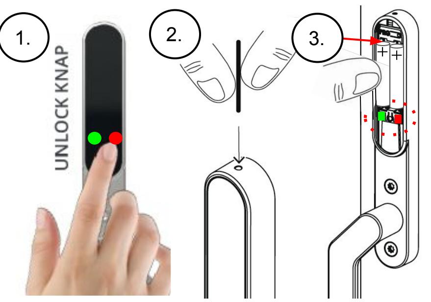

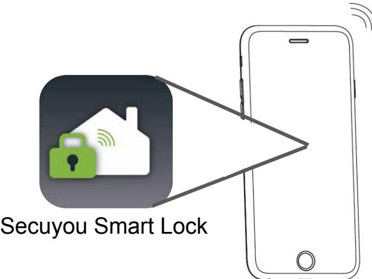

# Trin 3

- 1. Åbn din Secuyou Smart Lock App
- 2. Tryk på UNLOCK knappen på låsen (det sikre at den er søgbar)
- 3. Tryk på ADD LOCK
- 4. Eller tryk på menu-ikon og ADD LOCK

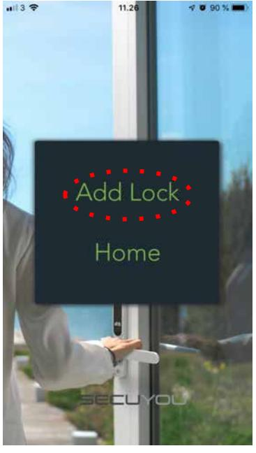

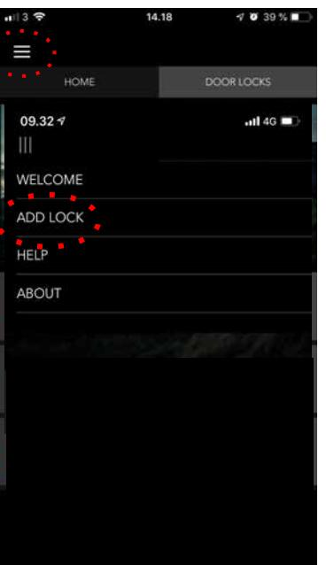

- 1. Når lås er fundet, vil låsen vises i listen som Smart Lock
- 2. Tryk for at vælge låsen
- 3. Lås og smartphone forbindes vent nogle sekunder

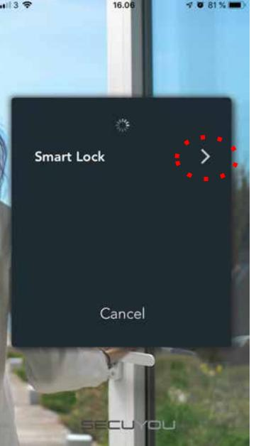

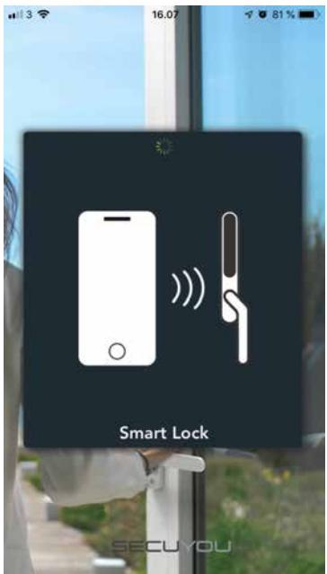

# Trin 5

- 1. I feltet Name door vælger du et navn til låsen (æ, ø, å må IKKE benyttes)
- 2. Tryk for at godkende navnet

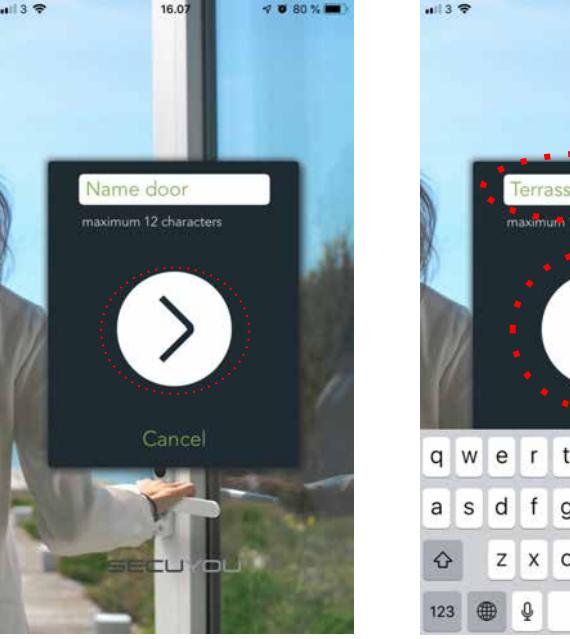

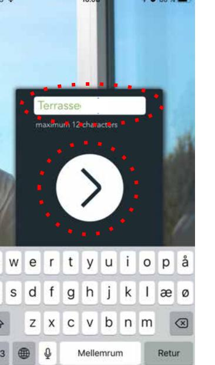

- 1. I rullemenuen, vælger du en kode til låsen
- 2. Tryk for at godkende koden
- 3. Du kan altid se den valgte kode i din app og give adgang til andre (se trin 9-12)

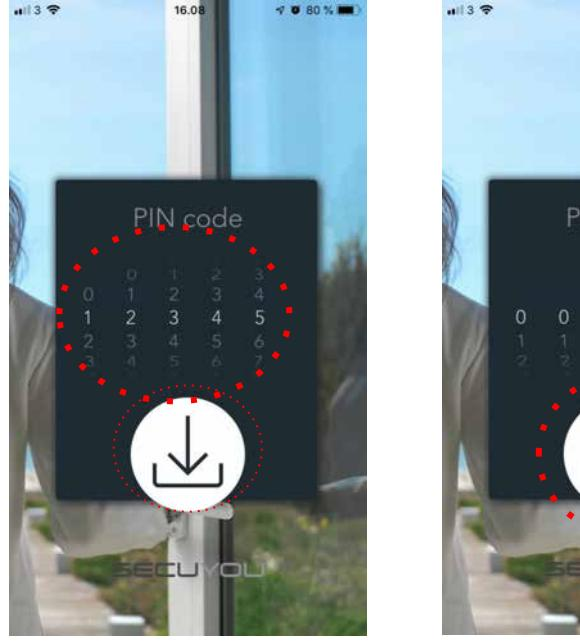

## Trin 7

- 1. Din lås er nu installeret og klar til brug
- 2. Kontroller at lås/app er Connected / grøn lampe
- 3. Kontroller at du kan låse og låse op ved tryk på
- 4. Kontroller at du kan låse og låse op ved tryk på UNLOCK knappen på låsen

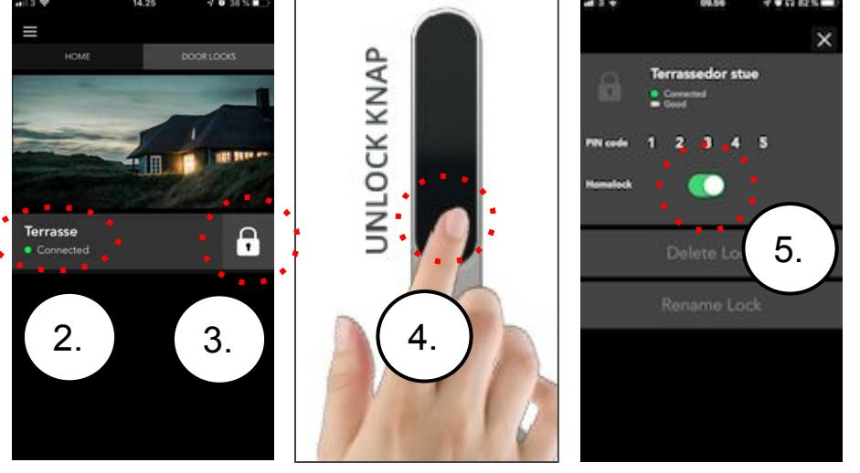

## Trin 8

#### Sådan virker din Smart Lock.

- 1. En lås kan kun have forbindelse til en bruger
- 2. Når en bruger mister bluetooth forbindelsen, vil låse automatisk låse hvis håndtaget er lukket ned.
- 3. Låse vil herefter finde en ny bruger
- 4. Uanset hvilken bruger der har forbindelse til låsene, kan alle brugere betjene låsen via UNLOCK knappen på låsen
- 5. Hvis Homelock vælges vil låsen ikke låse automatisk, men forblive i det valgte låse stadie, selvom bluetooth forbindelsen mistes.
- 6. Hvis vises er det fordi håndtaget ikke er lukket ned og så kan man ikke låse.
- 7. Anvendes en forkert kode vil en timeout startes, første forsøg 40 sek. Andet forsøg 5 min. Tredje forsøg 14 min. LED blinker rød når timeout er aktiv.

Man kan man tage batterierne ud, sætte dem i igen. Så slettes timeout og du kan forsøge med rigtig kode igen. Se mere trin 19-20

- 8. Pin koden på låse kan kun ændres ved at nulstille låse
#### Trin 9 - 12: Adgang til nye brugere

## Trin 9

- 1. Se trin 1
- 2. Åbn din Secuyou Smart Lock App
- 3. Tryk på ADD LOCK
- 4. Eller tryk i menu-ikon og ADD LOCK

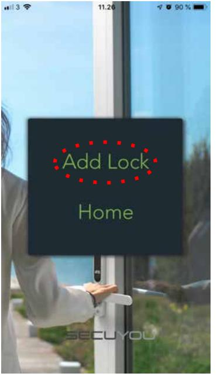

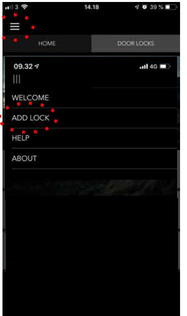

- 1. Når låse er fundet, vil låsene vises i listen
- 2. Tryk for at få adgang til den ønskede lås på listen
- 3. Lås og smartphone forbindes vent nogle sekunder

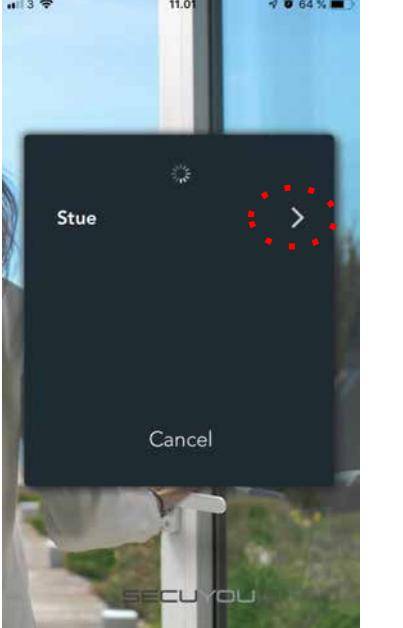

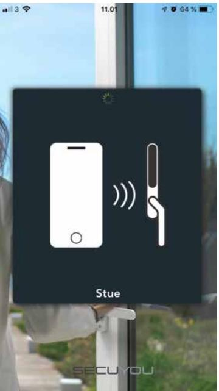

#### Trin 9 - 12: Adgang til nye brugere

## Trin 11

- 1. Vælg kode til låsen i rulle-menu (kode brugt ved første installation af låsen)
- 2. Tryk for at godkende koden (Se trin 19-20 ved indtastning af forkert kode)

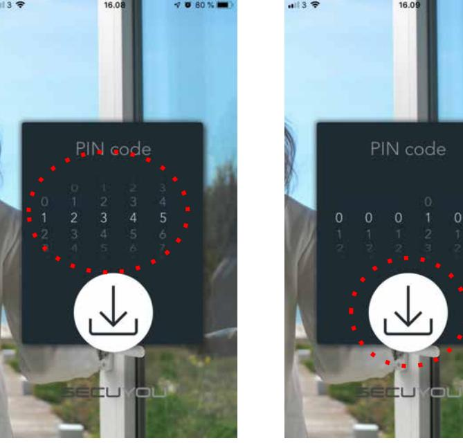

- 1. Du har nu adgang til låsen
- 2. Kontroller at lås/app er Connected / grøn lampe
- 3. Kontroller at du kan låse og låse op ved tryk på låse-ikonet

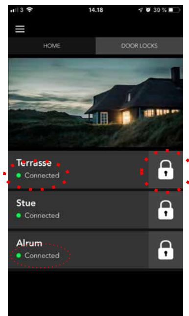

#### Trin 13 - 14: Ændre navne på låse

# Trin 13

- 1. Tryk på menuen DOOR LOCKS
- 2. Tryk ud fra den lås navn skal ændres
- 3. Tryk på RENAME LOCK

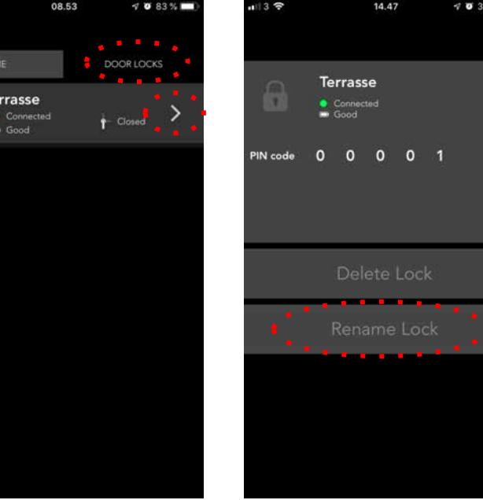

- 1. I feltet RENAME LOCK vælges et navn til låsen (æ, ø, å må IKKE benyttes)
- 2. Tryk OK for at godkende navnet

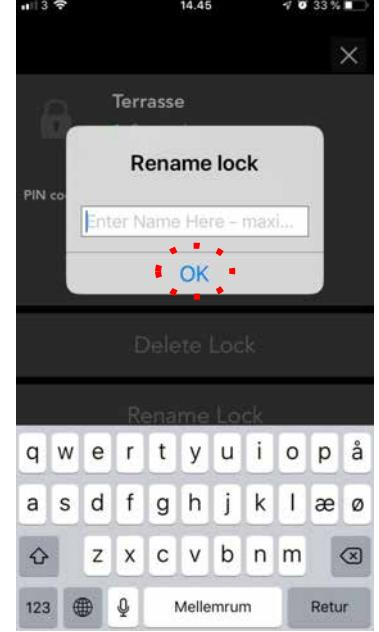

#### Trin 15 - 16: Ændre koder på låse (kan kun ske ved at nulstille låsen)

# Trin 15

- 1. VIGTIGT: Lås låsen op! Afmonter batteridæksel
- 2. Tryk PRG knappen ned i 5 sekunder, indtil grøn lampe blinker (brug kun din finger / ikke værktøj)
- 3. Slip herefter PRG knappen
- 4. Gå til trin 16

*VIGTIGT: Hvis du glemme at låse op, før du trykker på PRG (punkt 2) vil låsen være i timeout i 30 min. Rød lampe blinker og stopper efter de 30 min.*

*Du kan nu låse op ved tryk på UN-LOCK knappen uden at være forbundet til din SmartPhone.*

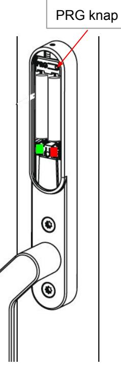

- 1. Tryk på
- 2. Tryk ud fra den lås koden skal ændres
- 3. Tryk på DELETE LOCK og accepter ved at trykke på YES knap
- 4. Gå til trin 3-7 og geninstaller låsen (i trin 6 vælges den nye kode)

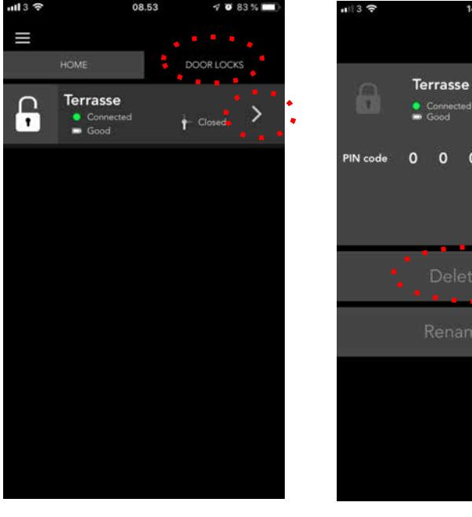

#### Trin 17 - 18: Nulstille / fabriksindstille låse

# Trin 17

- 1. VIGTIGT: Lås låsen op! Afmonter batteridæksel
- 2. Tryk PRG knappen ned i 5 sekunder, indtil grøn lampe blinker (brug kun din finger / ikke værktøj)
- 3. Slip herefter PRG knappen
- 4. Gå til trin 18

*VIGTIGT: Hvis du glemme at låse op, før du trykker på PRG (punkt 2) vil låsen være i timeout i 30 min. Rød lampe blinker og stopper efter de 30 min.*

*Du kan nu låse op ved tryk på UN-LOCK knappen uden at være forbundet til din SmartPhone.*

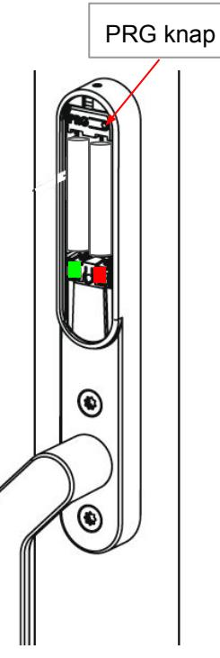

- Trin 18 1. Tryk på 2. Tryk ud fra den lås du ønsker at slette 3. Tryk på DELETE LOCK og accepter / YES
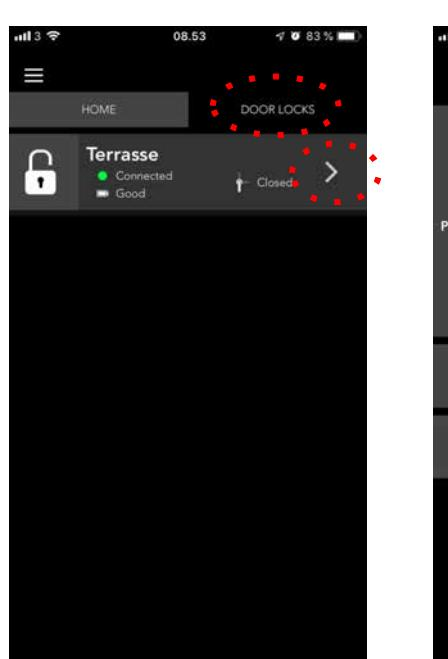

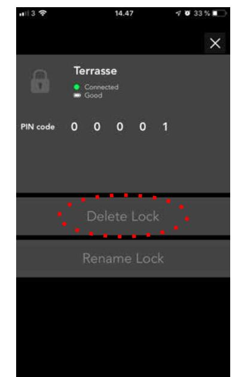

## Trin 19

- 1. Selvom du har valgt forkert kode, til en lås, vil den optræde i din liste. Du vil få en notifikation at koden ud har valgt er forkert.
- 2. Slet herefter låsen i din liste via menu
- 3. Hvis LED på låsen blinker rød så skal du afvente til LED slukker (se afsnit om timeout trin 8 pkt. 6)
- 4. Hvis LED ikke slukker, kan du tage batterier ud og sætte dem i igen (timeout stopper)

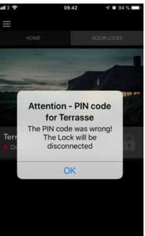

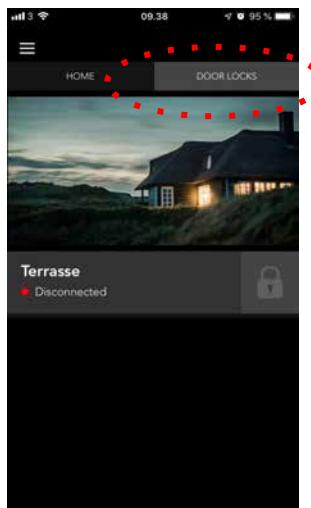

- 1. Når låsen er sletter skal du gå til trin 3 og fortsæt installationen (husk at vælge rigtig kode).
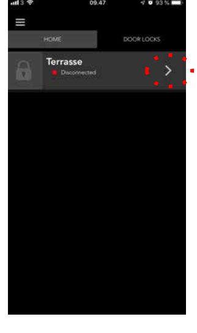

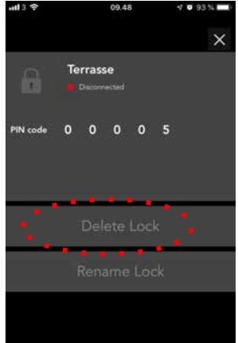