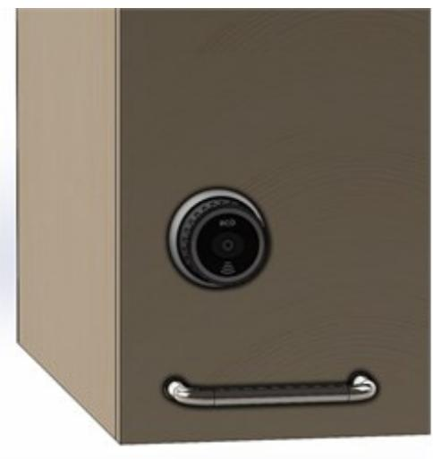

## LOCKR-CABINET MIF

LockR Cylinder Artikelnummer: 20181050, E-nummer: 5871593

LockR-Cabinet är ett komplett skåplås med tillhörande fallkolvslås. Som tillhör RCO:s offline produktsortiment.

## **Teknisk beskrivning**

R-CARD M5 kan maximalt hantera 2047 offline-enheter (LockR Cyliner + NoKey + LockR Cabinet) per domän. Kravet för att cabinet ska fungera är R-CARD M5 version M5 5.47 samt att objektet har relevant antal online-läsare med stöd för initiering av kort/taggar. LockR Cabinet levereras med stöd för Desfire EV2 och Mifare Classic.

Vid batteribyte håller LockR Cabinet konfigurationen i 3 timmar. Om längre tid passerar måste cylindern omprogrammeras. LockR Cabinet har inbyggd klocka och kalender som sätts vid driftsättning av ODM-programvaran. Klockan i enheten kan driva +- 30 sekunder per år i rumstemperatur. Klockan justeras automatiskt varje gång ODMprogramvaran kommunicerar med enheten. ODM-programmet används alltid vid driftsättning, programmering, uppdatering av Flash samt vid behov av detaljerad händelselogg.

| Utförande:            | Svart med grå skyddsring                      |
|-----------------------|-----------------------------------------------|
| Matningsspänning:     | 6V 2*CR2 batterier skall uppfylla IEC-60086-4 |
| Display:              | Lysdiodsindikering                            |
| Livslängd batterier:  | 3 år med 8 användningar per dag               |
| Systemkrav R-CARD M5: | 5.48.x                                        |
| Mått (BxHxD):         | 69x63x74                                      |
| Kommunikation:        | RFID Offline                                  |
| Vikt:                 | 585 gram                                      |
| Temperaturområde:     | -25 till +65 °C                               |
| Lästekniker:          | Desfire EV2, Mifare® Classic                  |
| Sändarfrekvens:       | 13,56 MHz                                     |
| Inläsning som stöds:  | Desfire EV2 RCO App, Classic sektor           |