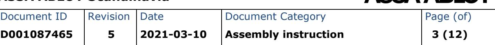
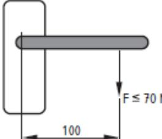
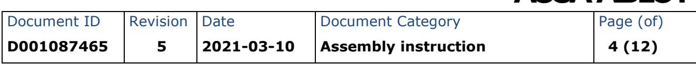
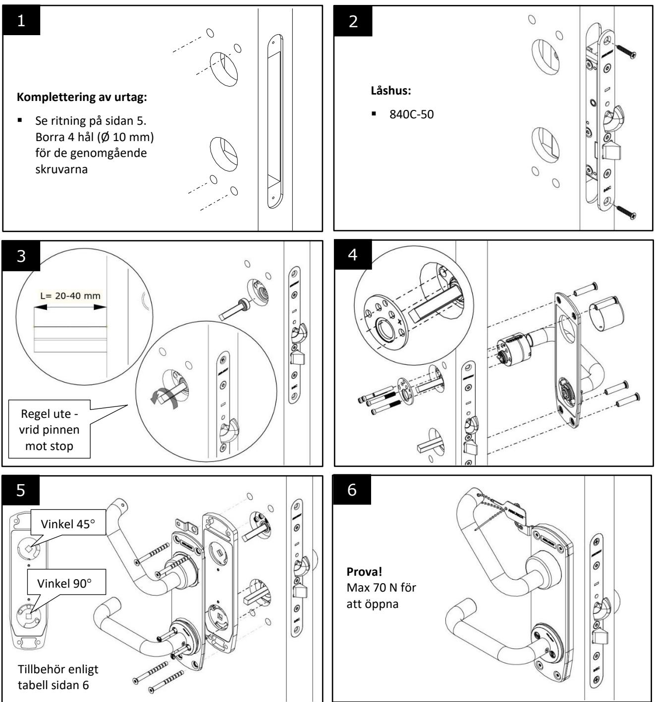
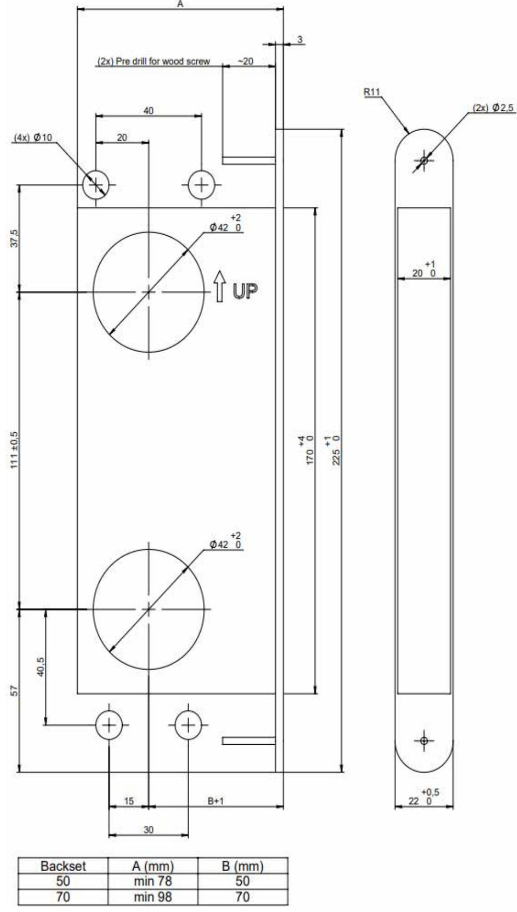
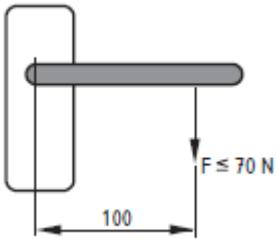
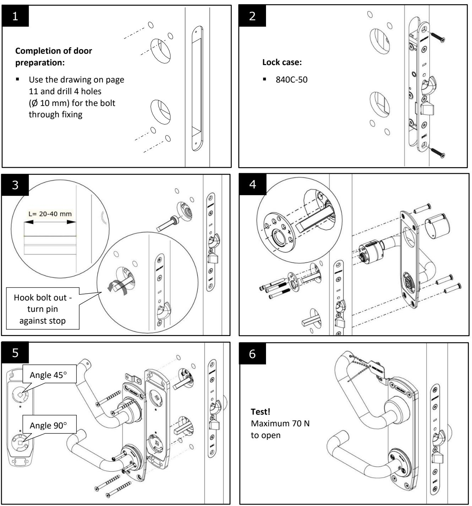
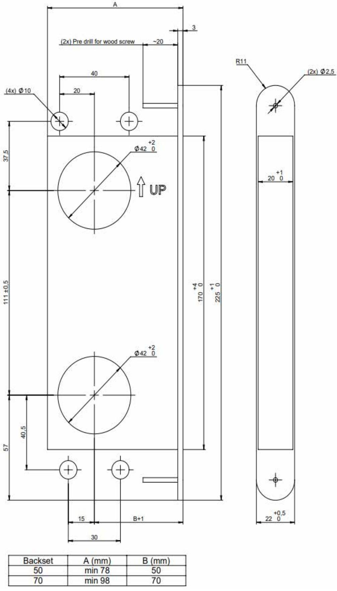

| D001087465  | 5        | 2021-03-10 | Assembly instruction | 1 (12)    |
|-------------|----------|------------|----------------------|-----------|
| Document ID | Revision | Date       | Document Category    | Page (of) |

Document ID Revision Date Document Category Page (of)

## **Monteringsanvisning nödutrymningsbeslag 179H**

| ASSA ABLOY Opening Solutions Sweden AB Kungsgatan 71 SE-632 21 Eskilstuna Sweden 2391 |   |                 |             |                                                                                             |  |    |   |   |    |
|---------------------------------------------------------------------------------------------------|---|-----------------|-------------|---------------------------------------------------------------------------------------------|--|----|---|---|----|
| SS-EN 179:2008                                                                                    |   | 2391-CPR-18-368 |             | DoP 368                                                                                     |  | 19 |   |   |    |
| 3                                                                                                 | 6 | 6               | B 1 3 |                                                                                             |  | 5  | 2 | A | A* |
| Nödutrymningsbeslag/ Emergency exit device                                                     |   | 179H            |             | Ability to release: Pass Durability of ability to release: Pass Fire resistance: Pass |  |    |   |   |    |

#### **Klassificering enligt SS-EN 179:2008**

| Box |                                                         | Grad |                                                                                                                                                                  |
|-----|---------------------------------------------------------|------|------------------------------------------------------------------------------------------------------------------------------------------------------------------|
| 1   | Användningsområde                                       | 3    | Högfrekvent användning där risk för oaktsamhet kan förekomma                                                                                               |
| 2   | Hållbarhet                                              | 6    | 100 000 testcykler                                                                                                                                               |
| 3   | Dörrvikt                                                | 6    | Upp till 200 kg                                                                                                                                                  |
| 4   | Lämplighet för användning på brand/röktäta dörrar | B    | Lämplig att användas på brand/röktäta dörrar brandtestade enligt EN 1634-1                                                                              |
| 5   | Säkerhet                                                | 1    | Alla nödutrymningsbeslag har en kritisk säkerhets funktion, därför är endast den högsta klassen identifierad enligt denna europeiska standard     |
| 6   | Korrosions beständighet                              | 3    | 96 tim (högt motstånd)                                                                                                                                           |
| 7   | Inbrottssäkerhet                                        | 5    | Nödutrymningsbeslag är främst för drift av en dörr från insidan och inbrotts säkerhetskraven är sekundära i förhållande till utrymningssäkerheten |
| 8   | Projektion av nödhandtag                             | 2    | Projektion upp till 100 mm (standard projektion)                                                                                                              |
| 9   | Typ av funktion på nödutrymningsbeslag               | A    | Nödutrymningsbeslag med tryckesfunktion                                                                                                                       |
| 10  | Monteras på slagdörrar                               | A*   | Enkeldörr, dubbeldörr: aktiv dörrblad. *Får ej monteras i dubbeldörr då passivt dörrblad är försett med utrymningsbeslag                          |

## **VARNING!**

**Säkerhetsfunktionerna för denna produkt är avgörande för dess överensstämmelse med SS-EN 179:2008. Inga ändringar av något slag, andra än de som beskrivs i dessa instruktioner, är tillåtna.**

**Före montage:**

- **Det är viktigt att följa monteringsanvisningen noga vid montage.**
- Nödutrymningsbeslaget är avsett att monteras på utåtgående slagdörrar, enkel- eller pardörr; endast aktivt dörrblad. Maximal dörrbladsstorlek 1320x2520 mm (BxH). Får ej monteras i dubbeldörr då passivt dörrblad är försett med utrymningsbeslag.
- För ytterligare information besök vår hemsida www.assaabloyopeningsolutions.se.
- Innan du installerar ett nödutrymningsbeslag på en branddörr skall certifieringen av dörren avseende brand kontrolleras för att säkerställa att det är lämpligt att montera nödutrymningsbeslaget på denna typ av dörr. Det är av yttersta vikt att nödutrymningsbeslaget inte monteras på en branddörr med högre brandmotstånd än vad det är godkänd för.
- Låshus och slutbleck skall monteras så att de får ett säkert ingrepp. Rekommenderad dörrspringa mellan låshus och slutbleck är 3 ±1 mm.

| Document ID | Revision | Date       | Document Category    | Page (of) |
|-------------|----------|------------|----------------------|-----------|
| D001087465  | 5        | 2021-03-10 | Assembly instruction | 2 (12)    |

- Nödutrymningsbeslaget bör installeras på en höjd av mellan 900 mm och 1 100 mm från färdigt golv. Om majoriteten av de personer som vistas i lokalen kommer att vara barn eller rullstolsburna, kan man överväga att minska höjden.
- Om nödutrymningsbeslaget monteras på dörr med glas kontrollera att glaset är av typ härdat eller laminerat personsäkerhetsglas.
- När nödutrymningsbeslaget monteras på pardörrar med dörrstängare eller dörrautomatik är det rekommenderat att koordinator enligt SS-EN 1158 monteras för att säkerställa att dörrarna stängs i rätt ordningsföljd. Detta är speciellt viktigt vid montage på branddörrar. För att säkerställa koordinatorns funktion kan medbringare t ex ASSA 2010 monteras.
- Tänk på att öppningskraften ökar om en dörr förses med dörrstängare eller dörrautomatik, vilket bör beaktas om barn, äldre eller funktionshindrade skall använda dörren.
- Nödutrymningsbeslag enligt kategori 2 (standard projektion <100 mm) skall användas i situationer med begränsat fritt utrymningsmått, eller då dörrar som skall förses med utrymningsbeslag inte kan öppnas mer än till 90° öppningsvinkel. Tänk på att montage av t ex draghandtag kan påverka dörrens fria öppningsmått, vilket bör beaktas om dörren har begränsad öppningsvinkel.
- Dörren får inte förses med annan ytterligare låsning än de angivna i denna anvisning. Detta utesluter inte installation av självstängande enheter som t ex dörrstängare. Undantag får göras om nationella byggregler tillåter detta.

Boverkets byggregler, BBR, anger följande: Om dörrar avsedda för utrymning hålls låsta under vissa tider, skall elektrisk kontroll användas för att säkerställa att utrymning skall kunna ske. Kontrollen skall vara samordnad med någon för driften väsentlig funktion som gör att

verksamhet inte kan bedrivas innan dörrar i utrymningsvägar låsts upp. Strömavbrott eller annat fel får inte sätta denna kontroll ur funktion.

- En dekal med texten "Tryck för att öppna" eller ett piktogram ska monteras på insidan av dörren omedelbart ovanför nödutrymningsbeslaget eller om möjligt på beslaget. Arean på dekalen bör vara minst 8 000 mm² och dess färger ska vara vit på en grön bakgrund. Den ska utformas så att pilen pekar på manöverelementet när den installeras. Denna dekal ingår ej i förpackningen.
- Medföljande skruvar, som inte är genomgående, rekommenderas att fästas i följande material och tjocklek:
	- o Stål min 2 mm eller förstärkning med nitmutter M5
	- o Aluminium min 4 mm eller förstärkning med nitmutter M5
	- o Trä min 20 mm

#### **Under montage:**

Följ instruktioner på sidan 4.

#### **Efter montage:**

- Smörj nödutrymningsbeslagets och låshusets alla kontaktytor med ASSA låsfett.
- Kontrollera noggrant att inte tätningar, väderskydd eller annat hindrar eller försämrar nödutrymningsbeslagets funktion. Kontrollera att inte något på dörren sticker ut och försämrar eller hindrar att dörren kan öppnas fritt.
- Mät öppningskrafter. Resultat skall journalföras och överlämnas till slutanvändaren.
- Kontrollera eventuell återinrymningsfunktion.
- Montören skall efter slutförd installation förse slutanvändaren med dokumentation såsom monterings- och underhållinstruktioner.

#### **Underhållsinstruktioner**

För att säkerställa prestanda i enlighet med detta dokument, bör följande rutinkontroller och underhåll göras i intervall om högst en månad:

- Kontrollera att dörren kan manövreras och öppnas fritt.
- Inspektera och testa nödutrymningsbeslaget för att se till att alla komponenter är i ett tillfredsställande skick.
- Kontrollera att alla skruvar är väl åtdragna.
- Kontrollera eventuell återinrymningsfunktion.
- Kontrollera att inga ytterligare låsanordningar har monterats på dörren sedan den ursprungliga installationen.
- Kontrollera att nödutrymningsbeslagets dekal är oskadad och väl synlig.
- Smörj nödutrymningsbeslagets och låshusets alla kontaktytor med ASSA låsfett minst var 20 000:e cykel, eller minst två gånger per år.
- Mät öppningskrafter. Resultat skall journalföras och jämföras med tidigare mätningar. Betydande avvikelser skall utredas.

## **Mätning av öppningskraft (max 70 N)**

| Datum | Resultat (N) | Anmärkning | Signatur |
|-------|--------------|------------|----------|
|       |              |            |          |
|       |              |            |          |
|       |              |            |          |
|       |              |            |          |
|       |              |            |          |
|       |              |            |          |
|       |              |            |          |
|       |              |            |          |
|       |              |            |          |
|       |              |            |          |
|       |              |            |          |
|       |              |            |          |

## **Monteringsanvisning nödutrymningsbeslag 179H**

| Document ID | Revision | Date       | Document Category    | Page (of) |
|-------------|----------|------------|----------------------|-----------|
| D001087465  | 5        | 2021-03-10 | Assembly instruction | 5 (12)    |

© ASSA ABLOY, All rights reserved

| Document ID | Revision | Date       | Document Category    | Page (of) |
|-------------|----------|------------|----------------------|-----------|
| D001087465  | 5        | 2021-03-10 | Assembly instruction | 6 (12)    |

## **Beslagstabell nödutrymningsbeslag 179H**

| ÖVRIGA TILLBEHÖR                           | LÅSHUS (INGÅR EJ I 179H) |  |  |  |  |  |  |
|--------------------------------------------|--------------------------|--|--|--|--|--|--|
| (INGÅR EJ I 179H)                          | 840C-50*                 |  |  |  |  |  |  |
| Slutbleck ASSA ABLOY 1487-X inkl magnet | X                        |  |  |  |  |  |  |
| Cylindersats ASSA ABLOY XX11               | X                        |  |  |  |  |  |  |
| Cylinderbehör ASSA ABLOY 3212              | X                        |  |  |  |  |  |  |
| Cylinderbehör ASSA ABLOY 3212 S            | X                        |  |  |  |  |  |  |
|                                            |                          |  |  |  |  |  |  |
|                                            |                          |  |  |  |  |  |  |
|                                            |                          |  |  |  |  |  |  |
|                                            |                          |  |  |  |  |  |  |

Nödutrymningsbeslag ASSA ABLOY 179H rekommenderas att användas tillsammans med de tillbehör angivna i tabellen ovan eftersom ASSA ABLOY annars inte ansvarar för att i nödutrymningsbeslaget överensstämmer med kraven i SS-EN 179:2008.

ASSA ABLOY ansvarar inte för modifiering eller ändring av något annat slag än de som beskrivs i monteringsinstruktionen.

* Får ej monteras i pardörr då passivt dörrblad är försett med utrymningsbeslag.

| D001087465  | 5        | 2021-03-10 | Assembly instruction | 7 (12)    |
|-------------|----------|------------|----------------------|-----------|
| Document ID | Revision | Date       | Document Category    | Page (of) |

## **Assembly instruction emergency exit device 179H**

| 2391                                          |   |      | ASSAABLOY Opening Solutions Sweden AB Kungsgatan 71 SE-632 21 Eskilstuna Sweden |                                                                                             |         |   |    |   |    |  |
|-----------------------------------------------|---|------|------------------------------------------------------------------------------------------|---------------------------------------------------------------------------------------------|---------|---|----|---|----|--|
| SS-EN 179:2008                                |   |      | 2391-CPR-18-368                                                                          |                                                                                             | DoP 368 |   | 19 |   |    |  |
| 3                                             | 6 | 6    | B                                                                                        | 1                                                                                           | 3       | 5 | 2  | A | A* |  |
| Nödutrymningsbeslag/ Emergency exit device |   | 179H |                                                                                          | Ability to release: Pass Durability of ability to release: Pass Fire resistance: Pass |         |   |    |   |    |  |

#### **Classification according to EN 179:2008**

| Box |                                            | Grade |                                                                                                                                                                    |
|-----|--------------------------------------------|-------|--------------------------------------------------------------------------------------------------------------------------------------------------------------------|
| 1   | Category of use                            | 3     | High frequency of use where there is little incentive to exercise care, i.e. where there is a chance of an accident occurring and of misuse         |
| 2   | Durability                                 | 6     | 100 000 test cycles                                                                                                                                                |
| 3   | Door mass                                  | 6     | Up to 200 kg                                                                                                                                                       |
| 4   | Suitability for use on fire/smoke doors | B     | Suitable for use on fire and smoke door assemblies based on a test in accordance with EN 1634-1                                                        |
| 5   | Safety                                     | 1     | All emergency exit devices have a critical safety function, therefore only the top grade is identified for the purpose of this European Standard |
| 6   | Corrosion resistance                       | 3     | 96 h (high resistance)                                                                                                                                             |
| 7   | Security                                   | 5     | Emergency exit devices are primarily for the operation of a door from the inside and the security requirements are secondary to those of safety  |
| 8   | Projection of lever handle              | 2     | Projection up to 100 mm (standard projection)                                                                                                                |
| 9   | Type of emergency exit device           | A     | Emergency exit device with "lever handle" operation                                                                                                          |
| 10  | Field of door application               | A*    | Single door, double door: active leaf. *Must not be mounted on double door when passive leaf is provided with a panic exit device                   |

# **WARNING!**

**The safety features of this product are essential to its compliance with EN 179:2008. No modification of any kind, other than those described in these instructions, are permitted.** 

#### **Before installation:**

- **The fixing instructions should be carefully followed during installation.**
- The emergency exit device is intended for mounting on outgoing doors, single or double door; active door leaf only. Maximum door leaf size 1320x2520 mm (WxH). Must not be mounted on double door when passive door leaf is provided with a panic exit device
- For further information visit our website www.assaabloyopeningsolutions.se.
- Before fitting an emergency exit device to a fire/smoke resisting door, the fire certification of the fire door assembly on which the exit device has been tested to prove suitability for use on a fire door should be examined. It is of utmost importance that an exit device is not used on a fire door assembly of a greater fire resistance time than approved for.
- The lock case and the strike should be fitted to provide secure engagement. Recommended distance between the lock case and the strike is 3 ±1 mm.
- The emergency exit device should normally be installed at a height of between 900 mm and 1 100 mm from the finished floor level. Where it is known that the majority of the occupants of the premises will be young children, consideration should be given to reducing the height of the bar.
- Where an emergency exit device is designed to be fitted to a glazed door, it is essential that the glazing is tempered or laminated glass.

| Document ID | Revision | Date       | Document Category    | Page (of) |
|-------------|----------|------------|----------------------|-----------|
| D001087465  | 5        | 2021-03-10 | Assembly instruction | 8 (12)    |

- Where emergency exit devices are to be fitted to double door sets with rebated meeting stiles and self-closing devices, a door coordinator device in accordance with EN 1158 should be fitted to ensure the correct closing sequence of the doors. This recommendation is particularly important with regard to fire/smoke resisting door assemblies. The use of a carry bar to move the active leaf may be required for this application e.g. ASSA 2010.
- If a door closing device is to be used to return the door to the closed position, care should be taken not to impair the use of the doorway by the young, elderly and infirm.
- Category 2 (standard projection <100 mm) emergency exit devices should be used in situations where there is restricted width for escape, or where the doors to be fitted with exit devices are not able to open beyond 90°. Keep in mind that mounting of e.g. pulling handles also may affect the effective door opening width, which should be considered if the door has a limited opening angle.
- No devices for securing the door in the closed position should be fitted other than that specified in these instructions. This does not preclude the installation of self closing devices. Exceptions may be made if national building regulations permit this.
- A sign which reads "Rotate to open" or a pictogram should be provided on the inside face of the door immediately above the operating element, or on the operating element if it has a sufficient flat face to take the size of lettering

required. The surface area of the pictogram should be not less than 8 000 mm² and its colors should be white on a green background. It should be designed such that the arrow points to the operating element, when installed. This pictogram is not included in the package.

- The supplied screws, which are not throughdoor bolts, are recommended to be attached to the following materials and thicknesses:
	- o Steel minimum 2 mm or alternate with M5 pop nuts
	- o Aluminum minimum 4 mm or alternate with M5 pop nuts
	- o Wood minimum 20 mm

#### **During installation:**

Follow instructions on page 10.

#### **After installation:**

- Lubricate all of the surfaces on the emergency exit device and lock case with ASSA lock grease.
- Make sure that any seals or weather-stripping fitted to the complete door assembly, does not inhibit the correct operations of the emergency exit device.
- Measure opening forces. Results shall be recorded and handed over to the end user.
- Check any re-entrance function.
- After completion of installation, the installer shall provide the end user with documentation such as installation and maintenance instructions.

| D001087465 | 5 | 2021-03-10 | Assembly instruction | 9 (12) |
|------------|---|------------|----------------------|--------|
|            |   |            |                      |        |

#### **Maintenance**

To ensure performance in accordance with this document, the following routine checks and maintenance should be performed at intervals of no more than one month:

- Make sure that the door can swing freely.
- Inspect and test the emergency exit device to ensure that all components are in a satisfactory condition.
- Make sure all screws are tightened.
- Check any re-entrance function.
- Check that no additional locking devices have been fitted to the door since the original installation.
- Make sure the decal of the emergency exit device is undamaged and clearly visible.
- Lubricate contact surfaces on the emergency exit device and lock case with ASSA lock grease at least every 20 000th cycle, or at least twice a year.
- Measure opening forces. Results should be recorded and compared with previous measurements. Significant deviations shall be investigated.

## **Measure the opening force (maximum 70 N)**

| Date | Result (N) | Remark | Signature |
|------|------------|--------|-----------|
|      |            |        |           |
|      |            |        |           |
|      |            |        |           |
|      |            |        |           |
|      |            |        |           |
|      |            |        |           |
|      |            |        |           |
|      |            |        |           |
|      |            |        |           |
|      |            |        |           |
|      |            |        |           |
|      |            |        |           |

| D001087465 | 5 | 2021-03-10 | Assembly instruction | 10 (12) |
|------------|---|------------|----------------------|---------|
|            |   |            |                      |         |

## **Assembly instruction emergency exit device 179H**

| Document ID | Revision | Date       | Document Category    | Page (of) |
|-------------|----------|------------|----------------------|-----------|
| D001087465  | 5        | 2021-03-10 | Assembly instruction | 11 (12)   |

| Document ID | Revision | Date       | Document Category    | Page (of) |
|-------------|----------|------------|----------------------|-----------|
| D001087465  | 5        | 2021-03-10 | Assembly instruction | 12 (12)   |

## **Chart of fittings for emergency exit device 179H**

| OTHER ACCESSORIES                    | LOCK CASES (NOT INCLUDED WITH 179H) |  |  |  |  |  |
|--------------------------------------|-------------------------------------|--|--|--|--|--|
| (NOT INCLUDED WITH 179H)             | 840C-50*                            |  |  |  |  |  |
| Strike ASSA ABLOY 1487-X incl magnet | X                                   |  |  |  |  |  |
| Cylinder set ASSA ABLOY XX11         | X                                   |  |  |  |  |  |
| Cylinder accessory ASSA ABLOY 3212   | X                                   |  |  |  |  |  |
| Cylinder accessory ASSA ABLOY 3212 S | X                                   |  |  |  |  |  |
|                                      |                                     |  |  |  |  |  |
|                                      |                                     |  |  |  |  |  |
|                                      |                                     |  |  |  |  |  |
|                                      |                                     |  |  |  |  |  |

Emergency exit device ASSA ABLOY 179H is recommended for use in combination with accessories listed in above table as ASSA ABLOY otherwise will take no responsibility for that the Emergency exit device correspond with the requirements in SS-EN 179:2008.

ASSA ABLOY take no responsibility for any modification or change of any kind other than described in the Assembly instruction.

* Must not be mounted on double door when passive door leaf is provided with a panic exit device.