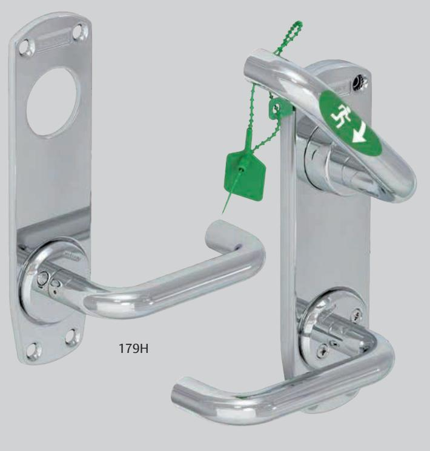
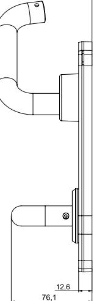
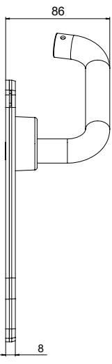

# ASSA ABLOY 179H och 179I

## Nödutrymningsbeslag

179I

**ASSA ABLOY 179H, dörrtjocklek 42-90 mm, för motorlås ASSA ABLOY 840C-50 och 850C-50.** 

#### **ASSA ABLOY 179I , dörrtjocklek 42-90 mm, för motorlås ASSA ABLOY 841C-50 och 851C-50.**

#### **Användningsområde**

ASSA ABLOY 179H och 179I är avsedda för slagdörrar i utrymningsvägar. Låset öppnas med ett handgrepp, vilket ger en säker utrymning.

#### **Egenskaper**

- Lämplig för montage i passersystem.
- Nödutrymningsbeslag ASSA ABLOY 179H och 179I är certifierade enligt europastandarden SS-EN 179:2008.
- Finns i ASSA ABLOYs ytbehandlingar 001/Prion, 002/Nickel, 011/Krom, 013/Mattkrom.
- På utsida monteras en rund cylinder för att erhålla högsta inbrottssäkerhet.

### **Funktion ASSA ABLOY 179H**

- Monteras tillsammans med motorlås ASSA ABLOY 840C-50 eller 850C-50.
- Dörren kan alltid öppnas från insidan via utrymningshandtaget.
- Återinrymningsfunktion är valbar elektroniskt.
- Utrymningshandtaget kan plomberas med sigilltråd. • Tryckesfall ger brandigenhållning upp till brandklass E120/ EI120.

#### **Funktion ASSA ABLOY 179 I**

- Monteras tillsammans med motorlås ASSA ABLOY 841C-50 eller 851C-50.
- Dörren kan alltid öppnas från insidan via utrymningshandtaget.
- Återinrymningsfunktion är valbar elektroniskt.
- Utrymningshandtaget kan plomberas med sigilltråd.
- Kan monteras på dörrar med dörrautomatik.

# ASSA ABLOY 179H och 179I

### Nödutrymningsbeslag

|     | 6 | 60 20 |   |
|-----|---|----------|---|
| 216 |   | 15       | 8 |

179 H 179 I

| Artikelnummer ASSA ABLOY 179H |                              |  |
|-------------------------------|------------------------------|--|
| 001059202101001               | UTR.BESLAG 179H HÖ, Prion    |  |
| 001059202101002               | UTR.BESLAG 179H HÖ, Nickel   |  |
| 001059202101011               | UTR.BESLAG 179H HÖ, Krom     |  |
| 001059202101013               | UTR.BESLAG 179H HÖ, Mattkrom |  |
| 001059202102001               | UTR.BESLAG 179H VÄ, Prion    |  |
| 001059202102002               | UTR.BESLAG 179H VÄ, Nickel   |  |
| 001059202102011               | UTR.BESLAG 179H VÄ, Krom     |  |
| 001059202102013               | UTR.BESLAG 179H VÄ, Mattkrom |  |

| Artikelnummer ASSA ABLOY 179I |                              |  |  |
|-------------------------------|------------------------------|--|--|
| 000911561101001               | UTR.BESLAG 179I HÖ, Prion    |  |  |
| 000911561101002               | UTR.BESLAG 179I HÖ, Nickel   |  |  |
| 000911561101011               | UTR.BESLAG 179I HÖ, Krom     |  |  |
| 000911561101013               | UTR.BESLAG 179I HÖ, Mattkrom |  |  |
| 000911561102001               | UTR.BESLAG 179I VÄ , Prion   |  |  |
| 000911561102002               | UTR.BESLAG 179I VÄ, Nickel   |  |  |
| 000911561102011               | UTR.BESLAG 179I VÄ, Krom     |  |  |
| 000911561102013               | UTR.BESLAG 179I VÄ, Mattkrom |  |  |

ASSA ABLOY Opening Solutions Sweden P.O. Box 371 SE-631 05 Eskilstuna Sweden Phone +46 (0)16 17 70 00 Fax +46 (0)16 17 70 49 Customer support: Phone intl. +46 (0)16 17 71 00

Phone nat. 0771-640 640 Fax +46 (0)16 17 73 72 e-mail: helpdesk.se.openingsolutions@assaabloy.com www.assaabloyopeningsolutions.se