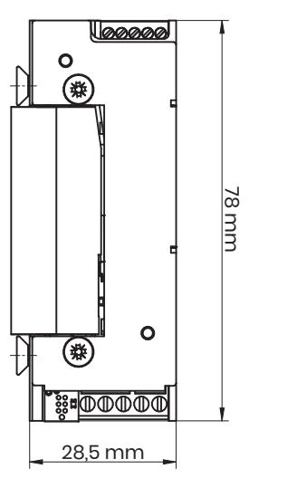
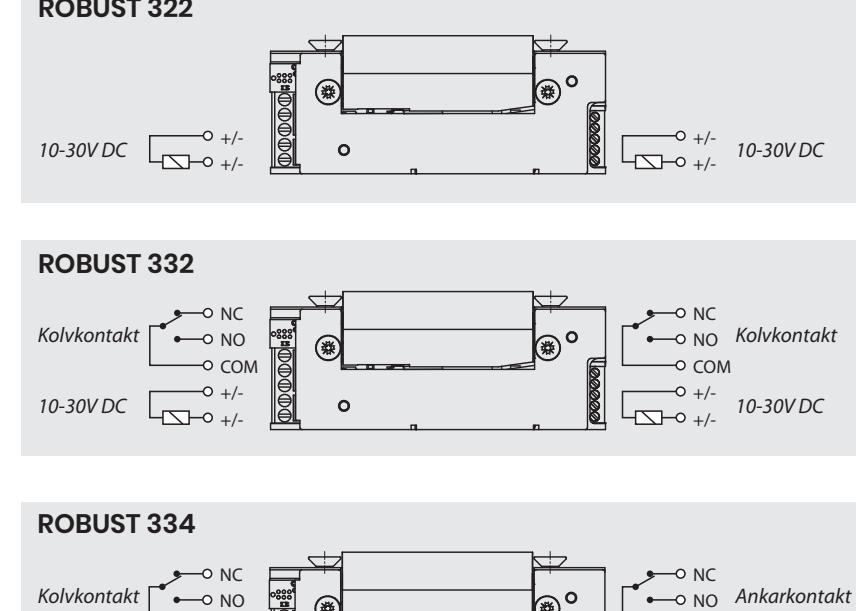
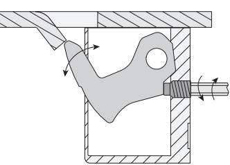
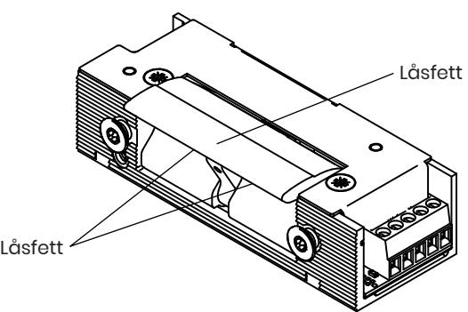
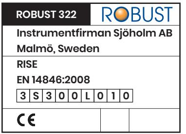

# **Elslutbleck ROBUST serie 300**

| Allmant -      |  |
|----------------|--|
| Teknik -       |  |
|                |  |
| Installation - |  |

*Innehåll: Allmänt 1 Montage 4 Kontakta oss 7 Teknik 2 Underhåll 5 Installation 3 CE-märkning 6*

#### *1. Allmänt:*

Detta dokument är gällande för ROBUST elslutbleck typ 322, 332 och 334.

Elslutbleck ROBUST serie 300 med listtrycksteknik passar till dörrar med normalt ställda krav på säkerhet och höga krav på driftsäkerhet. ROBUST serie 300 CE-märkt och certifierat för dörrar av högsta brandtekniska klass E120/EI120.

Serie 300 är avsedd för daglåsning i dörrar och internlåsning inom handel, kontor och

industri eller i entréer och allmänna utrymmen i flerbostadshus.

ROBUST serie 300 finns i rättvänd funktion, med det menas att det öppnar när elslutblecket är spänningssatt.

Endast rättvänd funktion får användas i brandklassade dörrar.

Multispänning 10-30 V DC samt med eller utan kolvkontakt kan även fås med ankarkontakt för indikering om elslutblecket är öppet. Passar tillsammans med ROBUST montagestolpar serie S.

## *2. Teknik:*

- 
- 
- Brandgodkänd EI120/E120 Inbyggt transientskydd
- Tillval: kolvkontakt eller kolvkontakt och ankarkontakt Mikrobrytare, 500 mA vid 30V DC
- 
- Listtryck 60-80 kg Multispänning 10-30V DC
- Brythållfasthet 1 200 kg Strömförbrukning 10-30 mA
	-
	-
- Rättvänd funktion Låshus, vridfall och montagestolpe i rostfritt stål

| Art.nr. | Beskrivning                                       | Spänning  |
|---------|---------------------------------------------------|-----------|
| 322     | Rättvänd funktion                                 | 10-30V DC |
| 332     | Rättvänd funktion med kolvkontakt                 | 10-30V DC |
| 334     | Rättvändfunktion med kolvkontakt och ankarkontakt | 10-30V DC |

# 45 mm

20,1 mm

COM +/- +/-

*10-30V DC*

# *3. Installation:*

Läs noga igenom detta dokument innan installation för en korrekt installation och användning av elslutblecket.

*10-30V DC*

Installation bör göras av person med goda kunskaper om gällande regelverk för brandklassade dörrar samt utbildning i att installera dörrlås och elslutbleck. När elslutblecket installeras i branddörr, kontrollera certifikat för att säkerställa att rätt beslag används. Säkerställ att dörr och karm är i bra skick, att dörren fungerar bra och inte kärvar eller på annat sätt inte stänger helt. Kontrollera så att springan mellan dörr och karm inte är större än vad dörrtillverkaren anger. Viktigt att dörrlåsets fallkolv sticker in djupt i elslutbleckets vridfall.

COM +/- +/-

Efter installation, kontrollera så att alla skruvar är åtdragna och att dörren inte kärvar utan löper fritt. Kontrollera att installationen uppfyller gällande krav för branddörrar. Säkerställ att dörren stänger smidigt så att dörrlåsets fallkolv lätt griper in i elslutbleckets vridfall och låser dörren. Dokumentation skall överlämnas av installatör till brukare/ansvarig för anläggning.

*PRODUKT- & INSTALLATIONSDOKUMENT*

# **Elslutbleck ROBUST serie 300**

## *4. Montage:*

- Välj rätt ROBUST montagestolpe med avseende på karmprofil och karmmaterial t.ex. trä eller metall.
- Använd skruv avsedda för karmens material.
- Dörrspringan mellan låshusets stolpe och elslutbleckets montagestolpe skall vara 2-5 mm för att säkerställa en god funktion.
- Det skall vara ett glapp på 0,5-1,5 mm mellan elslutbleckets vridfall och låshusets fallkolv.
- Säkerställ att inget borr- eller slipspån hamnar i elslutblecket. Rengör urtaget i karmen ordentligt innan montaget.
- Justera vridfallets stoppskruv i sidan på elslutblecket till rätt läge, enl. bild, för att få en smidig och mjuk gång i dörren.
- Anslut elslutblecket (se kopplingsschema) och kontrollera så att kabeln inte kläms när elslutblecket monteras.
- Montagestolpe eller elslutbleck får ej övermålas.

## *5. Underhåll:*

- Smörj elslutbleckets vridfall och låshusets fallkolv tunt lager med avsett låsfett, bör göras 2 ggr/år eller vid behov.
- Använd aldrig olja i eller på elslutbleck eller låshus.
- Funktionen av elslutbleck och dörr skall kontrolleras med jämna mellanrum. Kontrollera så dörren löper fritt och går smidigt. Vid behov justera dörrstängare, dörrautomatik och gångjärn. Säkerställ att skruvar är åtdragna.

#### *6. CE-märkning:*

För att bevara egenskaperna för denna produkt och därmed produktens överensstämmelse med EN14846:2008 är inga ändringar/justeringar, annat än de som beskrivs i detta dokument, tillåtna.

| ROBUST 332                  |  |  |  |
|-----------------------------|--|--|--|
| Instrumentfirman Sjöholm AB |  |  |  |
| Malmö, Sweden               |  |  |  |
| RISE                        |  |  |  |
| EN 14846:2008               |  |  |  |
| 3 S 3 0 0 L 0 1 0     |  |  |  |
|                             |  |  |  |

| ROBUST 334                  |        |  |
|-----------------------------|--------|--|
| Instrumentfirman Sjöholm AB |        |  |
| Malmö, Sweden               |        |  |
| RISE                        |        |  |
| EN 14846:2008               |        |  |
| 3 S 3 0 0 L 0               | 1 0 |  |
|                             |        |  |

*7. Kontakta oss:*

Instrumentfirman Sjöholm AB info@robust-se.com www.robust-se.com Silverviksgatan 12 213 74 Malmö, Sweden Tel. +46 (0)40-21 14 00