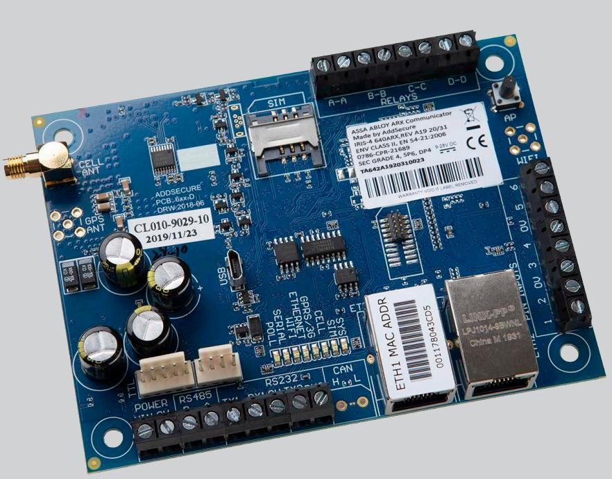
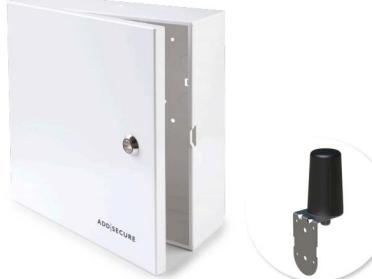

# ASSA ABLOY ARX Communicator

Larmsändare och kommunikationsenhet för ARX säkerhetssystem

ARX Communicator är en kommunikationsenhet som öppnar upp en rad nya funktioner i ARX.

ARX Communicator kan agera larmsändare med krypterad tvåvägskommunikation via IP och mobila nätet med valfri pollningsfrekvens för att uppnå det säkerhetskrav som anläggningen kräver (upp till larmklass 4).

Med ARX Link Connection används ARX Communicator för att koppla upp en central till ett befintligt ARX system via mobila nätet, även på platser där du inte har ett fast nätverk eller där nätverket inte är färdiginstallerat. Som en tillfällig eller permanent lösning. ARX Link Connection kan användas samtidigt med larmöverföring.

Enheten kommer förprogrammerad vilket ger en enkel driftsättning i ARX Säkerhetssystem och koppling mot larmcentral.

I ARX klienten ser du tydligt status på ARX Communicator och kan exempelvis enkelt prova av IP och mobila kommunikationen separat, skicka testlarm och se signalstyrkan på mobilnätet.

ARX Communicator är utrustad med sex ingångar som konfigureras från ARX klienten. Ingångar används för larmöverföring från externa system som t ex. brandlarm.

Enheten fungerar tillsammans med LCU9016III, ARX Power 9008 och ARX Power.

ARX Power 9008 och ARX Power är förberedda för montage av ARX Communicator. För användning till LCU9016III monteras ARX Communicator i kapsling ARX Communicator Enclosure för montage på vägg.

Kommunikationsenheten behöver inte MIO-LIF01 för att kunna kommunicera klartextmeddelanden (SIA nivå 3) med larmcentraler.

# ASSA ABLOY ARX Communicator

Larmsändare och kommunikationsenhet för ARX säkerhetssystem

## **Data**

- Matningsspänning: 24V DC
- Strömförbrukning: 24V DC: 51mA Max 55mA
- Temperaturområde: -10°C till +55°C
- 6 ingångar för larmöverföring av externt larm
- 2G/3G/4G antenn medföljer
- Miljökass 2

### **Mått och vikt**

| Bredd | 120 mm |
|-------|--------|
| Höjd  | 90 mm  |
| Vikt  | 90 g   |

### **Certifierad enligt:**

Inbrott: SSF 114 utgåva 2 Cert Nr: 21-208

Brand: SBF 110:8 Cert Nr: 21-207

#### **Artikelnummer**

|                              | S5590000160WOB E58 014 37 |            |
|------------------------------|---------------------------|------------|
| Tillbehör                    |                           |            |
| • ARX Communicator Enclosure | S5590000165               | E58 014 38 |

ARX Communicator Enclosure

ASSA ABLOY Opening Solutions Sweden P.O. Box 371 SE-631 05 Eskilstuna Sweden Phone +46 (0)16 17 70 00 Fax +46 (0)16 17 70 49

Customer support: Phone intl. +46 (0)16 17 71 00 Phone nat. 0771-640 640 Fax +46 (0)16 17 73 72 e-mail: helpdesk.se.openingsolutions@assaabloy.com www.assaabloyopeningsolutions.se

