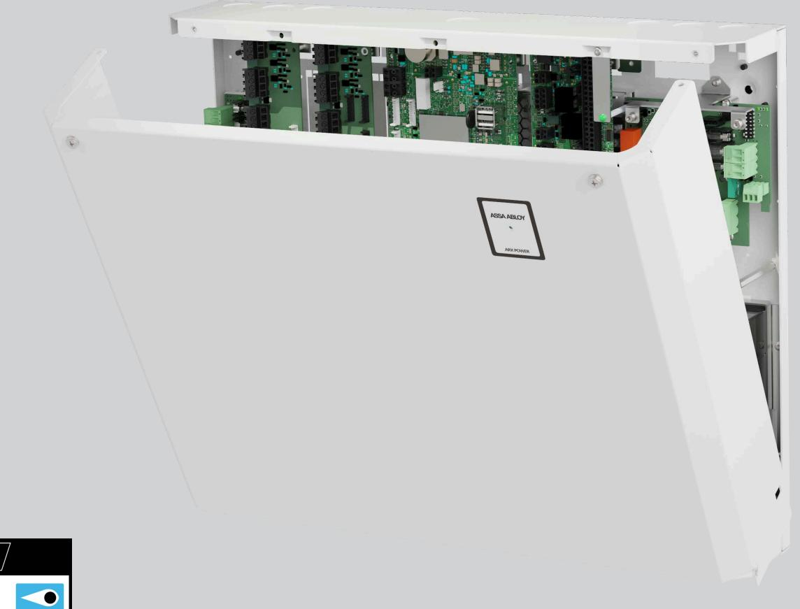
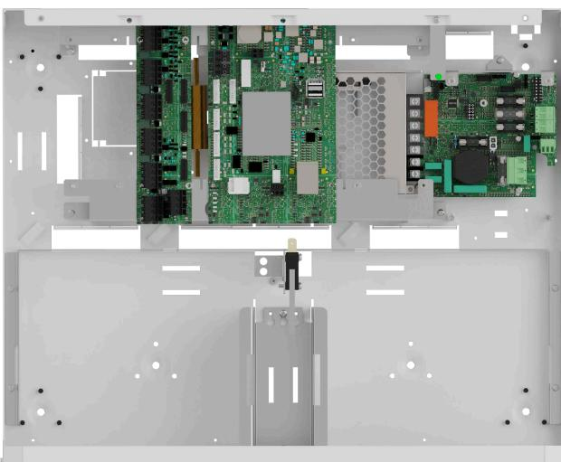

# ASSA ABLOY ARX Power 9008

ARX centralenhet med inbyggd batteribackup

ASSA ABLOY ARX Power 9008 är en kompakt allt-i-ett lösning för ARX Säkerhetssystem. Enheten rymmer förutom batteribackup också en centralenhet och basloopkort för fyra dörrar. Kan kompletteras med ett loopkort 4014 för stöd upp till maximalt åtta trådbundna dörrar. ARX Power 9008 har färdiga monteringsplatser för MIO 6-6 eller MIO-Slave, ARX Power Fuse 05 och ARX Communicator.

Enheten har en diskret, stilren design med en passiv konstruktion som leder ut värme utan fläktar vilket gör den helt tyst. Stor designfokus har lagts på installationsvänlighet med exempelvis rymlig kapsling för enkel kabelhantering, VMC-snäppfästen för tillbehör och välplanerade kabelgenomföringar. Genom att kombinera ARX hårdvara och batteribackup i samma kapsling sparas utrymme, förenklar installation och ger en kostnadseffektiv lösning både till material och arbetsinsats.

ARX Power 9008 är larmgodkänd upp till larmklass 4 och uppfyller elsäkerhetsstandard EN 62368-1.

ARX Power 9008 har inbyggd larmöverföring direkt från centralenhet upp till larmklass 2.

För larmöverföring i högsta larmklasser, kommunikation till ARX Server där nätverk saknas och kommande plustjänster* monteras ARX Communicator på avsedd plats i kapsling.

Extra tanke har också lagts på att designa enheten för att så enkelt som möjligt kunna ersätta befintliga föråldrade system.

ARX Power 9008 har skydd mot överlast, överspänning, övertemperatur, kortslutning och djupurladdning. Den rymmer upp till 2 st 20Ah batterier och kan vid behov kompletteras med en batteribox i samma formfaktor – ARX Power Box som rymmer ytterligare upp till 2 st 20Ah batterier. Enheten monteras enkelt på vägg.

*Kommande funktioner.

# ASSA ABLOY ARX Power 9008

ARX centralenhet med inbyggd batteribackup

### **Data**

- Matningsspänning: 230 V AC
- Inström: 1,7A vid 230V AC
- Egenförbrukning:
	- o Elnätsdrift: 235mA
	- o Batteridrift: 225mA
- Utgångsspänning: 27,3 V DC
- Kontinuerlig last 4A, 5A peak
- Godkänd medellast enligt SSF1014:
	- o Larmklass 1/2: 1,35A
	- o Larmklass 3/4: 0,55A
- Batteri
	- o UPLUS: 2st 7,2Ah 12Veller
	- o UPLUS: 2st 20Ah 12V
- 4 CL-20 kommunikationsportar
- 1 RS-485 kommuniktinsport
- 1 ethernetanslutning
- 1 utgång watchdog
- Temperaturområde +5°C till +40°C
- Relativ fuktighet 75%
- IP-klass 30 endast inomhus

#### **Certifikat**

- LK 2, *LK 3/4 Security Grade 4, MK 1 Environment Class 1. EN50131-1-A1
- EN50136 Security Grade 3, SP4
- EN 62368-1 SE
- EN 50131-6
- SBSC intyg 16-130
- Kräver ARX verison 4.7 eller högre

## **Mått och vikt**

- Bredd: 444mm
- Höjd: 366mm
- Djup: 108mm
- Vikt: 5,9kg utan batterier

*För larmklass 3/4 Krävs MIO6-6 eller MIO-Slave. Borrskyddsdetektor CD470, E-nummer E63 100 90, beställs i separat kanal.

ASSA ABLOY Opening Solutions Swede P.O. Box 371 SE-631 05 Eskilstuna Sweden

Phone +46 (0)16 17 70 00 Fax +46 (0)16 17 70 49

Customer support: Phone intl. +46 (0)16 17 71 00 Phone nat. 0771-640 640 Fax +46 (0)16 17 73 72 e-mail: helpdesk.se.openingsolutions@assaabloy.com www.assaabloyopeningsolutions.se

#### **Följande händelser kan visas i ARX:**

- Anslutning av kommunikation till ARX Larmbuss. Nätavbrott, Säkringsfel, Sabotagelarm, Överspänning, Underspänning, Batterifel, Låg systemspänning, Låg batterispänning, Övertemperatur, Undertemperatur, Åldrat batteri
#### **Följande status kan visas i ARX:**

- Anslutning av kommunikation till ARX Larmbuss. Aktuell strömförbrukning, Strömförbrukning senaste minuten (medelvärde), Strömförbrukning senaste dygnet (medelvärde), Max uppmätt strömförbrukning, Överbelastning i antal minuter, Antal dagar där belastningen är över 80%, Systemspänning, Max systemspänning, Min systemspänning, Max uppmätt temperatur, Min uppmätt temperatur, Ackumulerad tid för hög temperatur, Max kontinuerlig ström i batteribackup (ampere), Inställd tid fördröjt nätbortfall larm, Inställt spänningsvärde för låg batterispänning, Inställt spänningsvärde för batteritest, Installerad batterikapacitet, Inställt larmvärde när batteri börjar ta slut, Sabotage, Kommunikation
#### **Artikelnummer**

| • ARX Power 9008 S55299008165 E58 014 94 |
|------------------------------------------------|
|------------------------------------------------|

#### **Tillbehör**

| • ARX Communicator       | S5590000160WOB E58 014 37 |            |
|--------------------------|---------------------------|------------|
| • ARX Power Firmware Kit | S55299300100              | E58 014 97 |
| • ARX Power Box          | S5529X00B165              | E58 014 35 |
| • ARX Power Fuse 05      | S5529X00F160              | E58 014 36 |
| • MIO6-6                 | S5590164N160              | E58 703 46 |
| • MIO-Slave              | S5590165N160              | E58 703 47 |
| • LIF-01                 | S5590166160               | E58 703 87 |
| • 4014LC                 | S554014184                | E58 760 23 |
| Batterier                |                           |            |
|                          |                           |            |

- UPLUS 12V, 7,2Ah, 10-12 år S511107084 E53 320 95 • UPLUS 12V, 20Ah, 10-12 år S511104084 E53 320 97
#### ARX Power 9008

