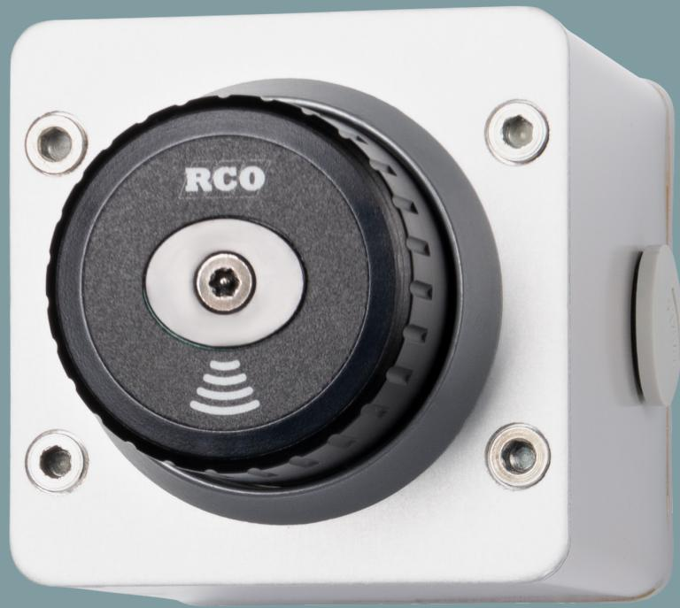
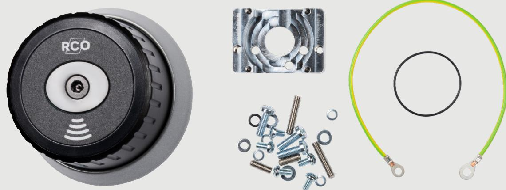

# **LockR Rotary Switch**

### **Slipp nycklar till dina elektriska brytare med hjälp av LockR Rotary Switch. Smidigt och säkert.**

LockR Rotary Switch är vårt allra senaste tillskott i LockR-familjen. LockR Rotary Switch är ett kit för inomhus bruk med en LockR Cylinder 80 samt tillbehör anpassat för anslutning till Kraus & Naimers elektriska brytare, som finns i olika utföranden. Med hjälp av vår säkra och smarta lösning går det att behörighetsstyra vilka som kan manövrera brytaren.

LockR Rotary Switch hanteras i samma administrationsverktyg som dörrar och övriga lås i passersystemet. Du behöver bara en tagg och det går självklart att styra vem som ska ha tillgång till brytaren och vid vilka tidpunkter. Det går även att dela ut tillfälliga behörigheter och om en tagg tappas bort spärras den enkelt i systemet.

Enkelt och smidigt.

#### **Var kan den användas?**

LockR Rotary Switch används då man vill koppla in en elektrisk brytare mekaniskt och slippa nycklar. På så sätt kan man styra behörigheten till många olika typer av elektriska installationer. LockR Rotary Switch passar utmärkt till exempelvis hissar, jalusier, basketkorgar i gymnastiksalar, belysning med mera.

## **TEKNISK BESKRIVNING**

R-CARD M5 kan maximalt hantera 2047 offline-enheter (LockR Cyliner + NoKey) per domän. Kravet för att Rotary Switch ska fungera är R-CARD M5 version M5 5.47 eller senare samt att objektet har relevant antal online-läsare med stöd för initiering av kort/taggar. LockR Rotary Switch levereras med stöd för Desfire EV2 och Mifare Classic.

Vid batteribyte håller LockR Rotary Switch konfigurationen i 3 timmar. Om längre tid passerar måste cylindern omprogrammeras. LockR Rotary Switch har inbyggd klocka och kalender som sätts vid driftsättning av ODM-programvaran. Klockan i enheten kan driva +- 30 sekunder per år i rumstemperatur. Klockan justeras automatiskt varje gång ODM-programvaran kommunicerar med enheten. ODM-programmet används alltid vid driftsättning, programmering, uppdatering av Flash samt vid behov av detaljerad händelselogg.

**Matningsspänning:**  6V

**Temperaturområde:**  +5 till +65 °C

**Kapslingsklassning:**  Endast inomhusbruk

**Lästeknik:**  Mifare® Classic, 1 eller 4 Kbyte / Mifare® Desfire EV2

**Sändarfrekvens:**  13,56 MHz

80 x 80 x 122 mm **Vikt:** 

**Läsavstånd:** 

**Batterilivslängd:** 

5.47 eller senare

**Mått (BxHxD):** 

Ca 2-4 cm beroende på transponder

3 år med 8 användningar per dag

**Systemkrav R-CARD M5:** 

940 gram

#### **För att få en komplett enhet behöver delar beställas från Kraus & Neimer.**

LockR Rotary Switch kan användas till följande Kraus&Naimer artiklar:

Reserv/komplement brytare inkl låskoppling 1 (AK1) CA10 A175 Z, SKS0004 CA10 A176 Z, SKS0004 CA10 A201 Z, SKS0004 CA10 A214 Z, SKS0004 CA10 A720 Z, SKS0004

Kompletta art nr inkl lådan CA10 A175 Z, SKS0005 CA10 A176 Z, SKS0005 CA10 A201 Z, SKS0005 CA10 A214 Z, SKS0005 CA10 A720 Z, SKS0005

Bara fronten till lådan 9T1 041 FRONT/RCO

