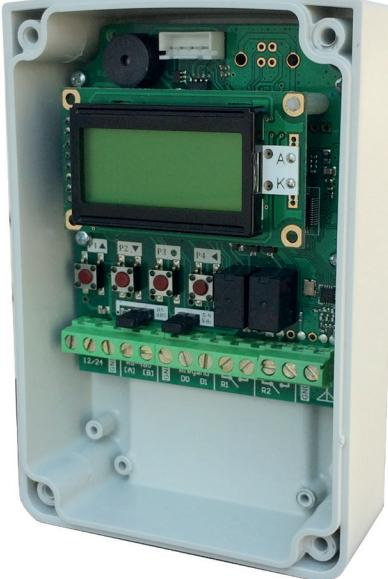
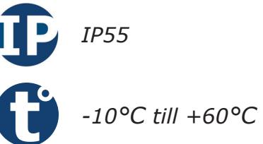
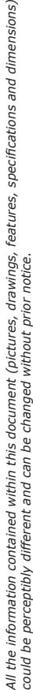
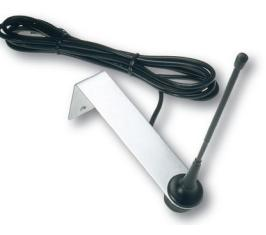

# **Produktblad**

## **Radiomottagare - SEL128R433-WPL**

### **Produktbeskrivning**

Radiomottagare med AES128 kryptering med möjlighet att dela behörigheter via sändaren.

Stand-alone: Radiomottagare med plats för 2000 sändare. Två reläutgångar programmerbara som puls, växlande eller tidsstyrda.

Passersystem: Radiomottagaren har utgångar både för wiegand-protokoll och RS485. Radiomottagaren kan kopplas mot ett passersystem för att ersätta en traditionell kortläsare, då används radiosändarna istället för kort, varje radiosändare tilldelas till en användare i systemet och precis som med en passerbricka kan man begränsa tillträdet för användarna till vissa tider på dygnet och alla passager registreras i händelseloggen för systemet.

### **Funktioner**

- För standalone, wiegand eller RS485
- Kan monteras utomhus
- Kryptering: AES128 bit
- Kan programmeras som puls, växlande och tid
- Lagrar upp till 2000 sändare

*IK10*

#### **Teknisk information**

**Utgångar:** Två reläutgångar (2 NO) Wiegand - 26, 30 och 44 bitar RS485 - ASCII, Modbus och OSDP **Max belastning:** 24VA **Funktioner:** Puls, växlande eller tid (1s-23t:59m) **Antal sändare:** 2000 sändare **LCD-display för programmering:** Ja **Inbyggt EEPROM-minne:** Ja **Ingång för extern antenn:** Ja **Känslighet:** -115dBm **Ingångsimpedans:** 50 Ohm **Frekvens:** 433.92 MHz **Radiotyp:** High security superheterodyn **Kryptering:** AES128 bit **Moduleringar:** GFSK **Kodkombinationer:** 2128 **Dimensioner (L x B x H):** 123 x 81,5 x 41,5mm **Spänningsmatning:** 12 eller 24Vac/dc **Strömförbrukning:** 50mA **Kapslingsklass:** IP55 **Temperaturområde:** -10°C till +60°C

#### **Tillbehör**

**SEA433** Extern antenn

**SEL2641-MXPL** Backupminne till radiomottagare

**S3TR128Ex** Radiosändare med två eller fyra knappar, AES128

#### **Passar till följande passersystem**

CDVI Atrium Vanderbilt Omnis, Entro Bravida Integra

