# **ERONE 500 Kg RADIOCONTROLLED MAGLOCK**

#### **1. Introduction**

The maglock is a 500 Kg door maglock . F05-ML1100R2641 radiocontrolled

The maglock release command can be sent or by radio, with a 2 key transmitter type S2TR2641E2 or a 4 key transmitter type S2TR2641E4 (fig. 1), or using an external C-NO push-button (not provided). The magnet unlock starts at the release of the button and lasts the programmed time (par. 8) : default unlock time = 4 sec. NOTE : a short applied at the C-NO inputs can keep the magnet always unlocked. The maglock is equipped with a monitor output R-R (C-NO or C-NC selectable with a jumper), see image below.

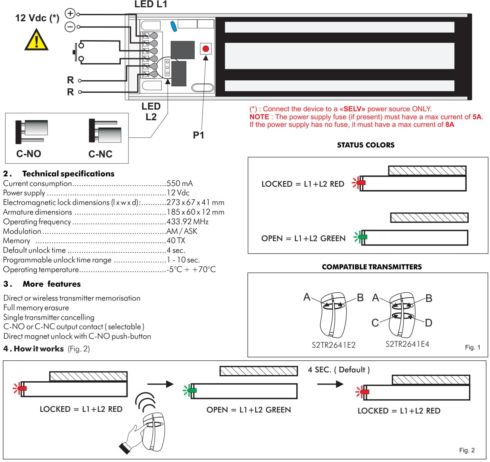

#### **5 . Transmitter memorisation**

*5.1 Memorising with P1 push-button (Fig. 3)*

1) Push P1 for 4 sec. until L1+L2 turns OFF

2) Push the transmitter button to memorise, L1+L2 will flash and come back OFF, the magnet will have a pulse of UNLOCK. While L1+L2 are OFF it's possible to memorize more TX buttons.

After 5 sec. from the last memorisation L1+L2 turn back ON , the procedure ends and the magnet LOCKS AGAIN.

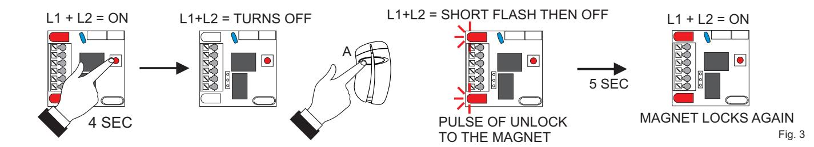

#### *5.2 Wireless memorising ( without accessing P1) (Fig. 4)*

1) Push simultaneously the buttons A + B of the transmitter and the led L1+L2 will make a SHORT FLASH.

- 2) Release A+B and push the button A for 4 SEC. until the led L1+L2 TURN OFF
3) Release A and push the button of the transmitter to memorise ( A or B or C or D ) always before the led L1+L2 turn ON AGAIN. L1+L2 make a short flash, the magnet unlock for a while and remains OFF, waiting for more buttons to receive. Then, after 4 sec., L1+L2 turn back ON, the magnet locks again and the procedure ends. To memorise more transmitters it is necessary to use a transmitter already memorised for opening the memory. Repeat the steps 1 and 2 above, using the transmitter already memorised. When the led L1+L2 turns OFF push the button of the new transmitter to memorise.

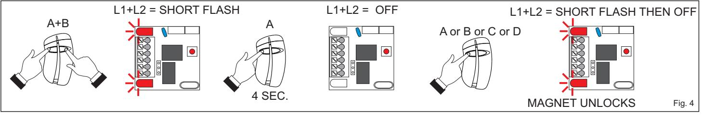

#### **6 . Full memory**

When the memory is full and you try to memorise another transmitter, the led L1+L2 make 4 flashes and the operation fails.

#### **7 . Memory erasure**

*7.1 Single transmitter cancelling (Fig. 4)*

The procedure to cancel the single transmitter is the identical to the memorisation and carried out only by using P1.

Follow the steps 1 and 2 of the procedure at paragraph 5.1

If the transmitter was memorised, at the end it will be cancelled.

#### *7.2 Full memory erasure ( Fig. 5)*

1) Push P1 and keep it pushed until L1+L2 turn OFF;

2) Release P1 and then, before L1+L2 turn on again, keep pushed P1 until L1+L2 make 3 long flashes At that point the memory has been completely erased.

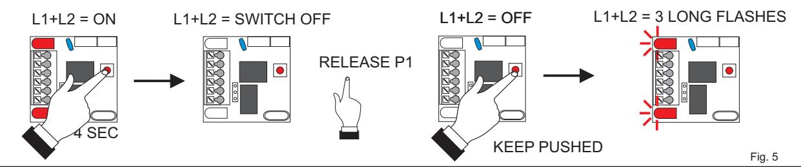

### **8. Unlock time setting** ( fig. 6)

The unlock time of the magnet is set by default to 4 sec. To modify this time proceed as follows:

1) Push simultaneously the buttons A + B of the transmitter and the led L1 will make a SHORT FLASH.

2) Release A+B and push the button B for 4 SEC. until the led L1 starts a SEQUENCE OF FLASHES

3) For setting the time desired, count the number of flashes and push P1 just after the flash corresponding to the release seconds desired. At the P1 release, the system will store the time corresponding to the number of flashes: L1 makes 3 short flashes and turns back ON. NOTE : the 10th flash lasts more then the others.

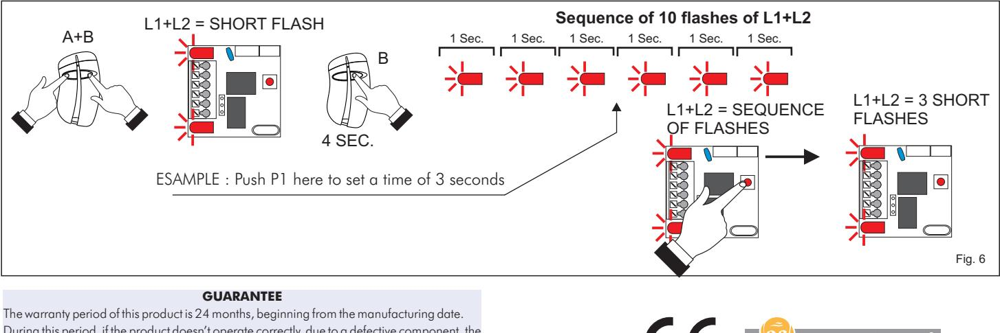

During this period, if the product doesn't operate correctly, due to a defective component, the product will be repaired or replaced at the sole discretion of CDVI Wireless.The warranty does not extend to the receiver case which can be damaged by conditions outside the control of CDVI Wireless.

Hereby, CDVI Wireless Spa, declares that the radio equipment type is in compliance with directive 2014/53/EU. The full text of the EU declaration of conformity is available at the following internet address: www.erone.com. F05-ML1100R2641

Manufactured by CDVI Wireless Spa Via Piave, 23 - 31020 San Pietro di Feletto (TV) - Italy Tel: +39-0438-450860 - Fax: +39-0438-455628 web: www.erone.com - e-mail: info@erone.com

#### APPROVAL RELATIVE TO EMERGENCY EXITS:

In the case of an installation of electromagnetic lock on emergency exits, it is imperative to make sure that these exit points will be automatically free in case of fire alarm, to open in the event of a fire alarm to allow evacuation of the premises. The electromagnetic lock installed on emergency exits must be in accordance with the fire approval department For more information, contact the local fire officer or the safety officer responsible for the building.

#### POWER SUPPLY

An electromagnetic lock always operates in DC current, a very low safety voltage. The Diax® electromagnetic lock is recommended for use with power supplies manufactured by CDVI, however, other power supplies may be used on condition that they are of equivalent quality and characteristics rectified, filtered, regulated and protected by fuse in primary and secondary sectors.

#### MOUNTING RECOMMENDATIONS

- Define the level of security of the access.

- Determine the maximum strength of holding force to this level of security.

- Select the Diax® electromagnetic lock according to the environment, the inside, the outside, the climatic

constraints, (For example: stainless steel dedicated to an outside use).

- Always install the electromagnetic lock on the secure side of the place to be secured.

- Indeed make sure that the frame and opening, receiving or supporting the electromagnetic lock, armature plate and their accessories, are solid and resistant to damage or wear over a period of time.

- Consider any bracketry required for the assembly according to the type of support receiving the electromagnetic lock and armature plate.

- Define the passage of cables to ensure the protection against the vandalism and the environmental requirements (in particular through flexible hoses of door, glands, gutters, cross cables, plastic tubes).

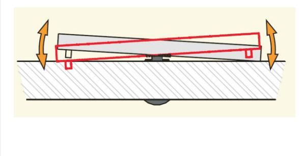

#### Armature plate

- It is vital to fix the electromagnetic lock and armature plate solidly on their supports.

- Make sure that the magnet and the armature meet evenly over their entire mating surfaces.

- The Armature plate must be able to pivot slightly about its center mounting screw to compensate for any door misalignment.

#### Security ropes

The electromagnetic lock undergoes repeated shocks and the vibration at the points of fixation on the frame (frequencies of openings / closures, attempt of opening wears closed and attempts of vandalism) which can loosen the fixing bolts/ screws. To prevent the risk of the electromagnetic block from falling, install both security ropes supplied, to guarantee the safety of the users (see attached plan).

#### MAINTENANCE

The Electromagnet and armature plate have a specific treatment which strengthens the protection against wear and corrosion. These products do not require high maintenance. Nevertheless to ensure optimum performance,it is recommended to clean regularly the surfaces in contact of the electro magnet and armature plate with a cloth and non abrasive products. If traces of corrosion appear, it is recommended to clean and oil the contact surfaces.

Check and tighten regularly all the fixings of the Electromagnet and ensure that while the armature is able to pivot on its mounting, the fixing bolt is not liable to loosen (we recommend thread-lock for all fixing bolts).

## INSTALLATION

Installation on an outward opening door (Push door) Installation on an inward opening door (Pull door)

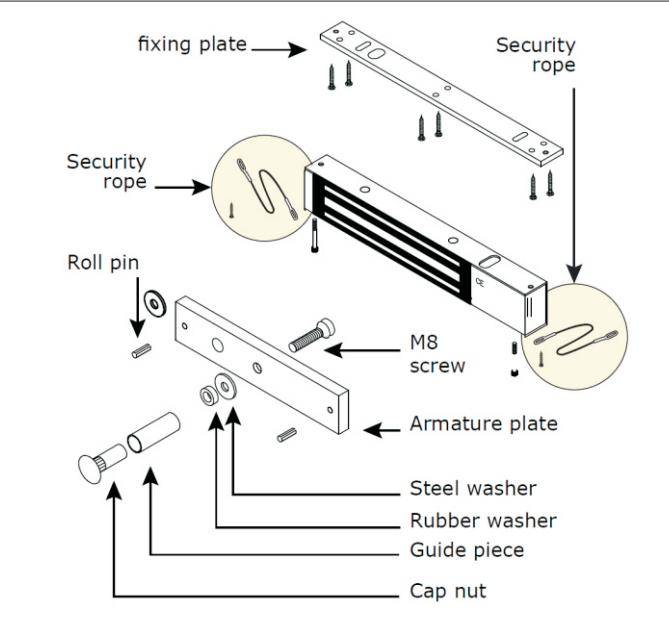

# INSTALLATION WITH ACCESSORIES

Installation with an Armature housing Installation with base for glass door

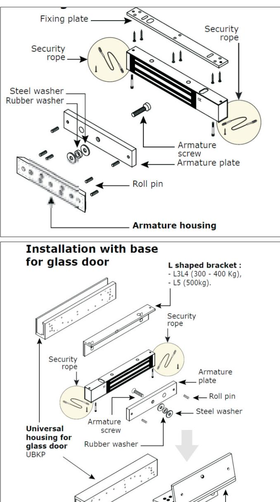

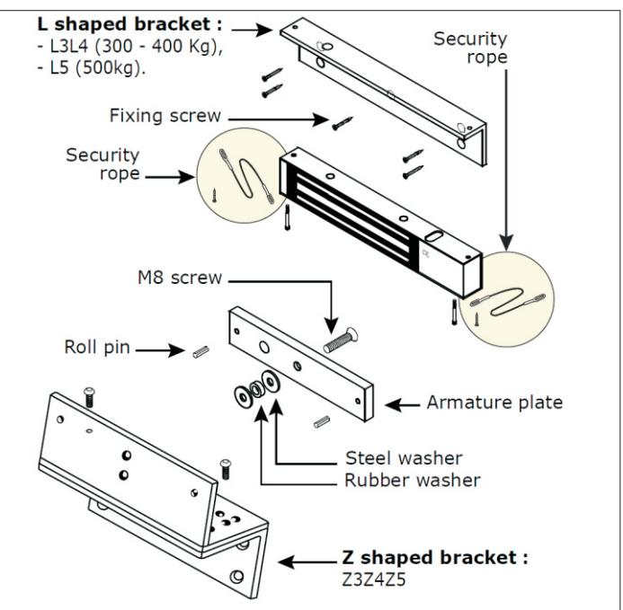

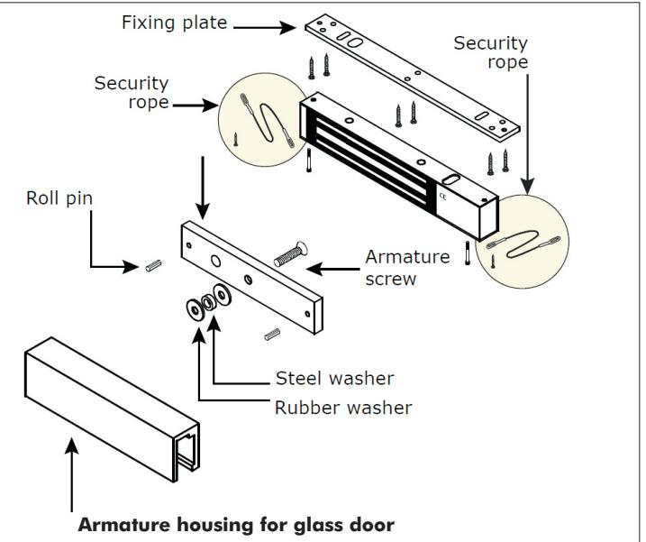

**Installation with DPM300 - DPM400 - DPM500 (Door position monitoring)***

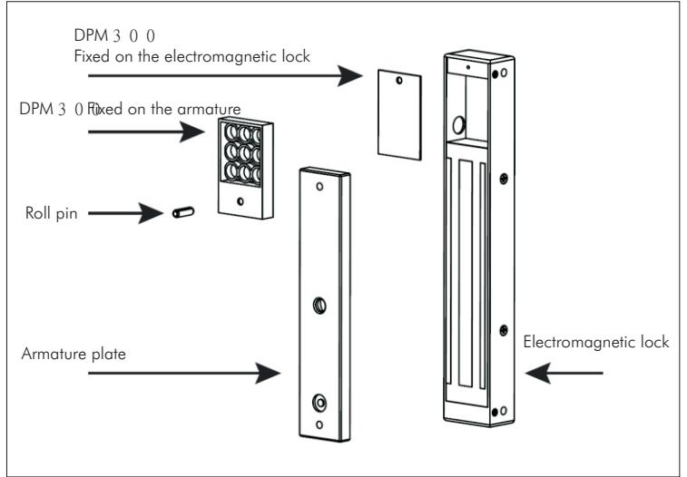