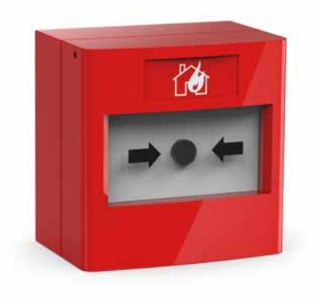

## **Larmknapp**

## **Produktbeskrivning**

Larmknappar utförda i smakfull mjuk design. Larmknappen har två fria växlingar för valfritt användande. Larmknappen har ett tryckglas som inte går sönder och inte behöver bytas. Utlöst larmknapp indikeras med en signalflagga i övre vänstra hörnet. Den medföljande nyckeln används för återställning och test av funktion samt för öppning av fronten vid installation. Larmknapparna levereras med en nyckel. Transperent skyddslock finns som tillbehör. Andra typer av skyddshuvar finns som separata produkter.

## **Tekniska Specifkationer**

Powered by TCPDF (www.tcpdf.org)

| Höjd (mm)        | 87           |
|------------------|--------------|
| Bredd (mm)       | 87           |
| Djup (mm)        | 58           |
| Vikt (kg)        | 0.19         |
| Spänning (VDC)   | 12           |
| IP klass         | IP24         |
| Material         | Polykarbonat |
| Temperaturområde |              |
| Färg             | Röd          |
| Maxström (VAC)   | 3            |
| Kontakter        | 2 växlande   |