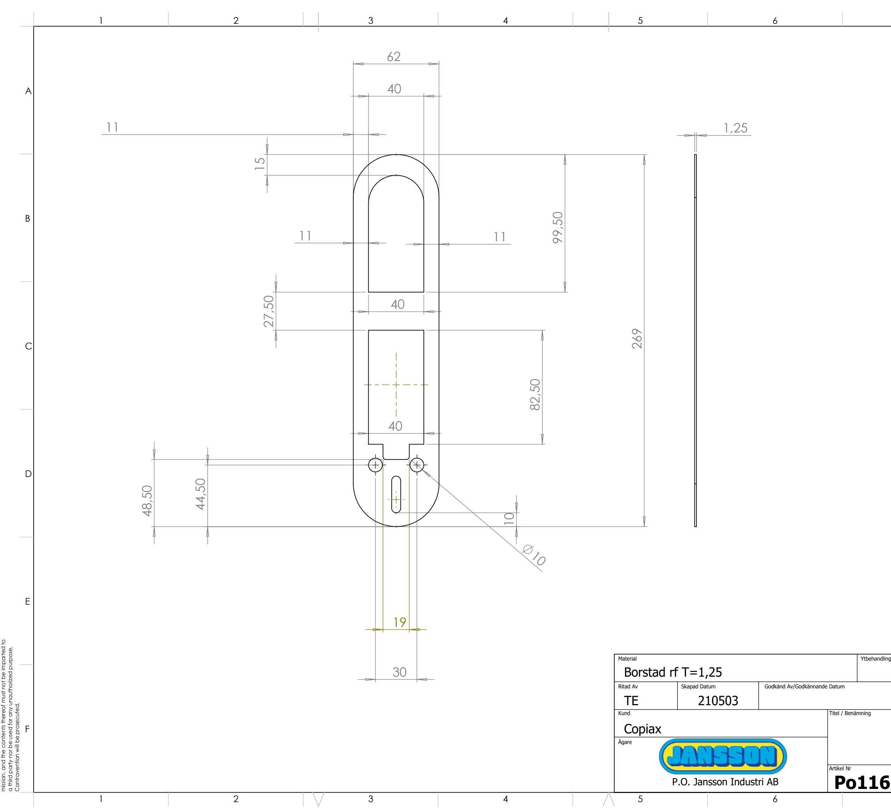

This document must not be copied without our written per-

7

| 1,25                                                            | A |
|-----------------------------------------------------------------|---|
|                                                                 | B |
|                                                                 | C |
|                                                                 | D |
|                                                                 | E |
| Skala Generell Tolerans Godkänd Av/Godkännande Datum      |   |
| (Där ej annat anges) E 210503 1:2 Titel / Benämning |   |
| Rev Artikel Nr Blad                                       | F |
| 1 (1) Po116 6 7 8                                   |   |
|                                                                 |   |