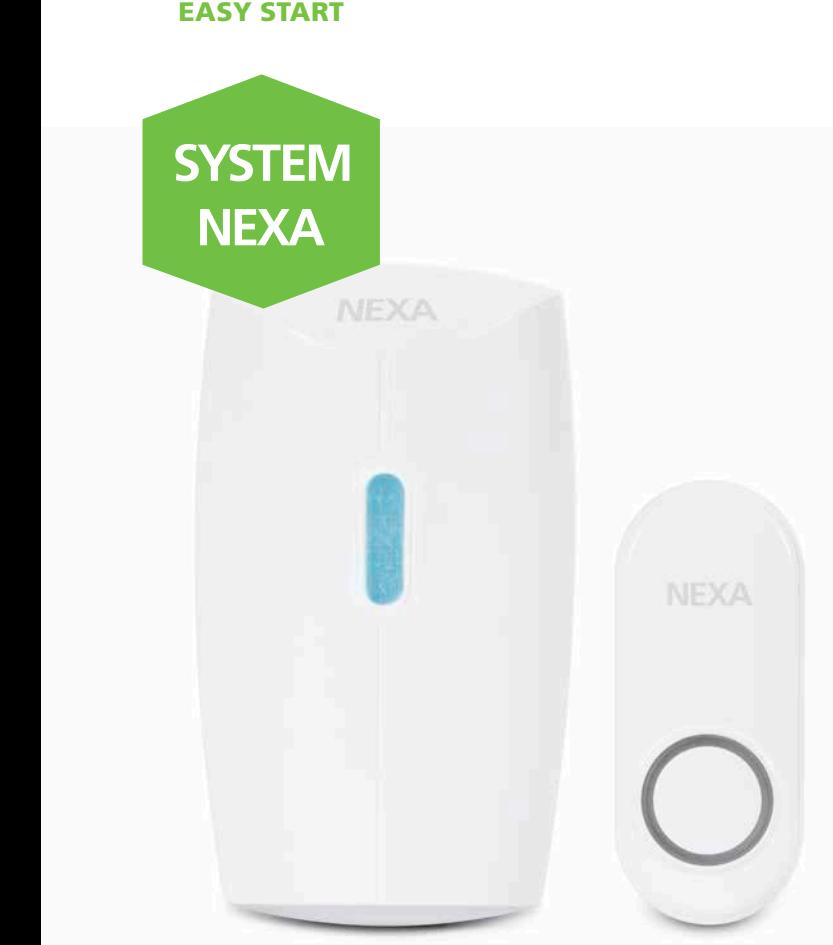
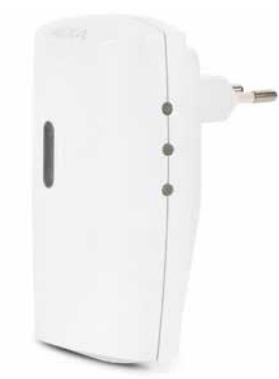

## **SMARTA HEM**

## DÖRRKLOCKA, PLUG-IN, SET **MLR-1923/SET**

Kategori EASY START, så enkelt att alla kan använda det.

Set med dörrklocka och tryckknapp. Förutom att fungera som en vanlig dörrklocka med tryckknapp kan dörrklockan också ta emot signaler från rörelsevakt och magnetkontakt eller fjärrkontroll om så önskas. Det finns 6 valbara signaler så olika sändare kan ge olika ringsignaler. Ljudnivån kan ställas i 4 olika nivåer; Hög – Mellan – Låg – Mute.

- Plug-in
- 32 minnesplatser
- Enkel installation
- 6 valbara ringsignaler
- 4 ljudnivåer
- Upp till 150 meter räckvidd

## **TEKNISK DATA**

**1**

**23**

| Strömkälla dörrklocka       | 220–240 V~50Hz              |
|-----------------------------|-----------------------------|
| Strömkälla tryckknapp       | Batteri, 1 x CR2032 (ingår) |
| Protokoll                   | System Nexa (433,92 MHz)    |
| Räckvidd                    | Upp till 150 m              |
| Strömförbrukning            | < 1 W                       |
| IP klassificering           | Tryckknapp IP44             |
| Mått dörrklocka (B x H x D) | 59 x 100 x 37 mm            |
| Mått tryckknapp (B x H x D) | 30 x 70 x 15,5 mm           |
| EAN                         | 7330545183511               |
| Art nr   E-nummer           | 18351   E 53 320 84         |

