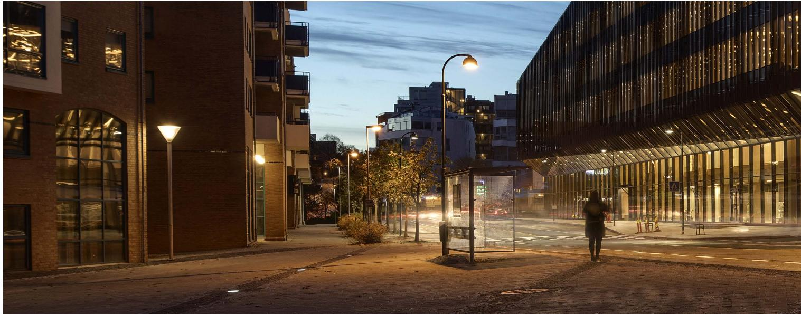
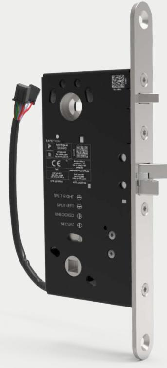
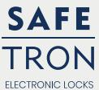
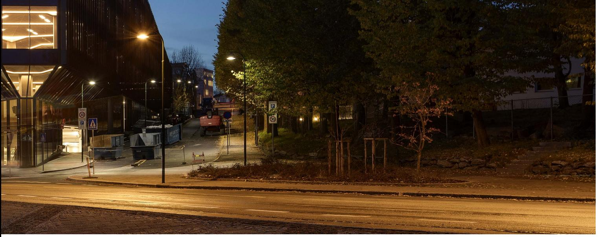
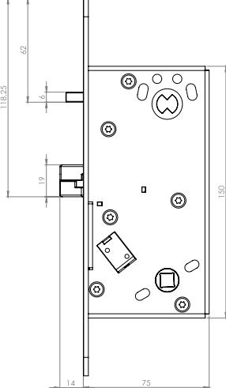

# **Eltryckeslås med listtrycksteknik för dörrautomatik**

Aldrig tidigare har det varit enklare att lösa det komplicerade.

SAFETRON SL630 är ett elektromekaniskt lås med patentsökt listtrycksteknik. Låset har ett brett och unikt användningsområde som täcker in funktionskrav såsom elektrisk aktivering, dörrautomatik, nödutrymning, brandigenhållning, splitfunktion samt återinrymning.

Aldrig tidigare har så många komplexa funktionskrav uppfyllts av ett och samma låshus.

### **Dörrautomatik och tryckesfunktion**

SAFETRON SL630 kan med fördel användas i kombination med dörrautomatik men samtidigt förses med trycken som aktiveras elektroniskt. Låset är försett med dubbla solenoider, den ena styr upplåsning av dubbelfunktionsfall och den andra aktivering av tryckesfunktionen. Detta innebär att anslutning kan separeras till dörrautomatik respektive passagesystem.

#### **Split funktion**

SAFETRON SL630 har valbar split funktion vilket innebär att utsidans trycke är elektriskt styrt medan insidans trycke alltid är mekaniskt inkopplat och därigenom alltid medger en mekanisk utpassage. Önskas istället enkel funktion d.v.s. elektrisk aktivering från båda sidor är detta valbart via låsets funktionsväljare.

#### **Brandceller**

SAFETRON SL630 är certifierad och CE-märkt för användning i brandcellsgränser högst brandteknisk klass: 120min.

#### **Nödutrymningsbeslag i två alternativ**

SAFETRON 793 är ett nödutrymningstrycke som möjliggör en normal passage genom trycke samtidigt som samma trycke utgör en godkänd nödutrymning. Indikering från trycket ges via inbyggd givare för att säkerställa att godkänd passage skett. Kombinationen är certifierad enligt SS-EN 179:2008.

SAFETRON SL630 kan även användas med nödutrymningsbeslag 794 för cylinderpositionen. SAFETRON 794 används när låset har ställts i enkel funktion, d.v.s. när elektrisk manövrering krävs från bägge sidor.

# SAFETRON SL630

# **Återinrymning**

SAFETRON SL630 tillgodoser kraven för såväl nödutrymning som återinrymning. Låsets tryckesfunktion har omvänd funktion och därigenom aktiveras återinrymning genom nedbrytning av spänningen till dörrmiljön. Nedbrytningen kan ske genom aktiverat brandlarm eller genom aktiverat nödbeslag 794/795 i kombination med reläkortet SAFETRON REC (Re-entry card).

## **En dörrtyp i hela fastighetsprojekt**

Tack vare det unika och breda användningsområdet i SL630 finns inte längre behovet av elslutbleck. Eftersom kolvplaceringen är samma som hos eltryckeslås SL620 och motorlås 6500/6600 kan samma dörrtyp med samma urtag och slutbleck beställas till hela fastighetsprojekt. Välj lås utifrån funktions- och säkerhetskrav. En följdeffekten blir också en mer stilren dörrmiljö när stora urtag för elslutbleck kan elimineras.

## **Listtrycksteknik**

SAFETRON SL630 har som första låshus någonsin listtrycksteknik vilket innebär att låset öppnar trots att tryck mot dörren föreligger. Listtryck är ett normalt förekommande fenomen ofta orsakat av exempelvis övertryck i fastigheten, skeva dörrar eller att snö/grus hamnat i dörrspringan. SAFETRON SL630 eliminerar dessa problem och förhindrar onödiga driftstopp.

## **Egenskaper**

- Listtrycksteknik
- Split funktion, mekanisk insida
- Enkel funktion, elektrisk aktivering båda sidor
- Brandgodkänd: 120 min
- Anpassad för dörrautomatik
- Dorndjup 50 mm
- Fallutsprång 14 mm

## **Tekniska data**

- Multispänning 12-24 VDC +/- 15%
- Strömförbrukning: N/A
- Arbetstemperatur -20°C till +40°C

| BENÄMNING           | ART NR    | E-NUMMER |
|---------------------|-----------|----------|
| SAFETRON SL630      | 202144862 |          |
| SAFETRON SL630 sats | 202144864 |          |

- Godkänd med Ställverksregel typ T
- Enkelt omställbar höger eller vänster
- Tryckesrörelseindikering
- Förreglingsindikering
- Dörrstatusindikering
- Vred/cylinder indikering

