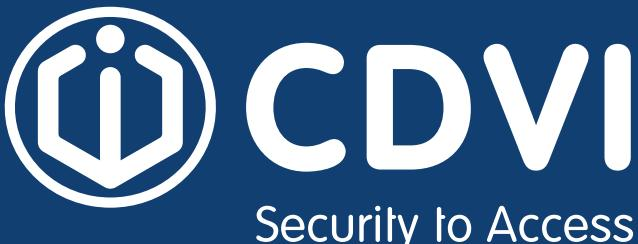

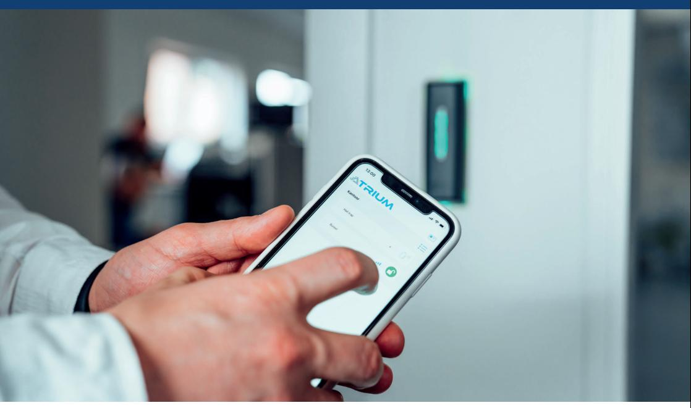

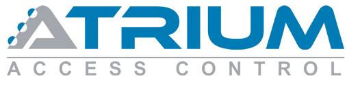

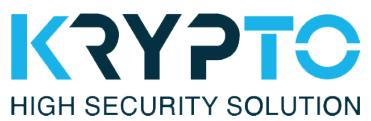

www.cdvi.se

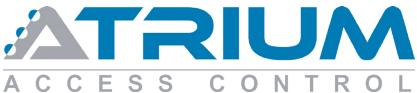

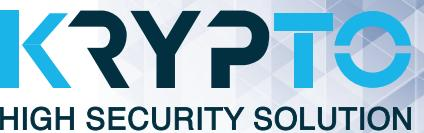

**Atrium Krypto** är mer än bara ett passersystem, vi har kombinerat ett **användarvänligt** gränssnitt med avancerad **kryptering** för att skapa ett **passage-** och **styrsystem** för både **privata**, **publika** och **industriella** miljöer.

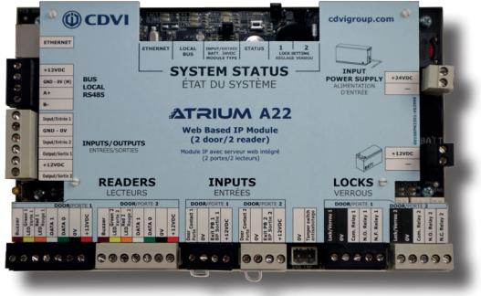

## **Några av fördelarna med Atrium Krypto**

- x Hög säkerhet med **krypterad** kommunikation
- x Användarvänligt **Plug 'N Play** system
- x **Mer än** ett passersystem
- x Inga månadskostnader
- x Inbyggd **webbserver**
- x **Fria** uppdateringar
- x **Gratis** program
- x Programmeras via:
	- Surfplatta
	- Telefon
	- Dator

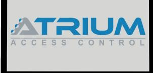

2 www.cdvi.se

**Kameraintegrering** Med Atrium kan du koppla samman passersystem och kameror.

### **Mailnotiser**

Få notiser vid speciella händelser eller vid t.ex. fel på backup-batteri.

## **APERIO**

Koppla samman Atrium med Aperio trådlösa handtag och cylindrar.

**Hisstyrning** Integrering för att styra behörigheter till t.ex. hiss.

> **Lockdown** Lockdown funktion för skolor, företag och sjukhus.

**Räknare** Vill du kunna sälja 10-kort på ett gym eller hålla koll så inte fler än tillåtet vistas i ett och samma rum?

#### **Software Development Kit** Atrium har ett öppet API för att kunna integrera mot andra webbaserade system.

# **Hög säkerhet med mobila nycklar**

Lås upp dörrar smidigt och säkert med din smartphone.

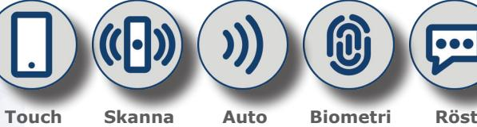

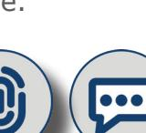

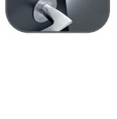

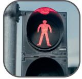

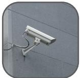

www.cdvi.se 3

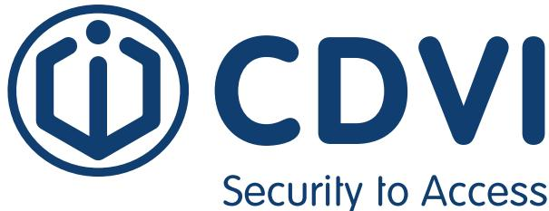

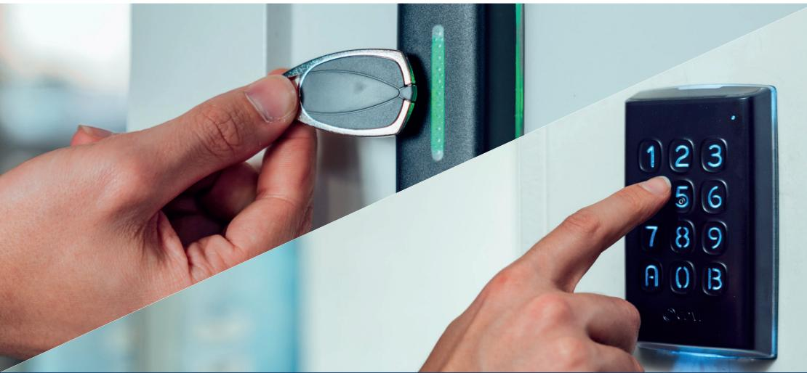

#### **CDVI Sweden AB**

Datavägen 12B 436 32, Askim Sverige

## **+46 (0)31-760 19 30 info@cdvi.se**

Every effort is made to ensure all information in this document is correct at the time of publication, but it is offered without any guarantee and/or liability for completeness or correctness. Any information or images could be perceptibly different and we reserve the right to adjust, remove, or replace information or images without prior notice.