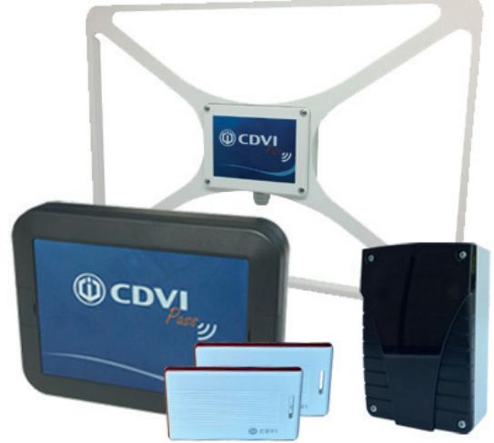
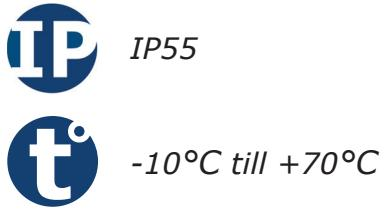
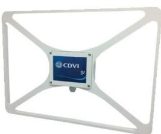
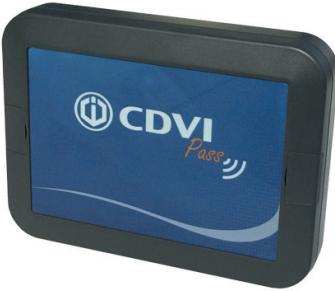
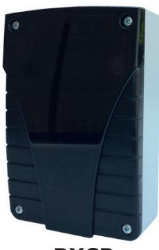
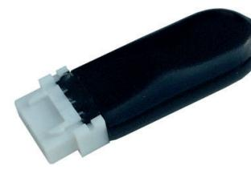
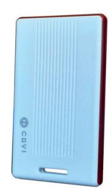

# **Produktblad**

## **Aktiva tag system - CDVI PASS**

### **Produktbeskrivning**

CDVI Pass är ett aktivt tag system baserat på tvåvägskommunikation, där antennen väcker kortet som i sin tur skickar en radiosignal vidare till en mottagare.

Mottagaren kan antingen köra standalone eller kopplas mot ett passersystem via wiegand eller RS-485, då registreras alla passager och behörigheter styrs av passersystemet.

Antennerna finns både som low range (0-6 meter) eller long range (6-15 meter).

#### **Funktioner**

- Aktiva passerkort
- Standalone eller passersystem
- Lång batteritid
- Räckvidd 0-15 meter
- Hög säkerhet med kryptera kommunikation

*IK10*

#### **Delar till CDVI Pass:**

**AN01RCP** Long range antenn 6-15 meter Inbyggd mottagarenhet

**AN02CP / AN02RCP** Low range antenn 0-6 meter Finns med eller utan inbyggd mottagarenhet

**RXCP** Mottagarenhet till AN02CP

**SEA433** Antenn till mottagarenhet

| Artikel | E-nummer  |
|---------|-----------|
| AN01RCP | 58 717 67 |
| AN02CP  | 58 717 68 |
| AN02RCP | 58 717 69 |
| RXCP    | 58 717 79 |
| SEA433  | 58 713 66 |
| MBCP    | 58 717 76 |
| ATCP    | 58 717 70 |
|         |           |

#### **Passar till följande passersystem**

| CDVI       | Atrium Krypto |
|------------|---------------|
| Vanderbilt | Omnis, Entro  |
| Bravida    | Integra       |

**MBCP** Backupminne till RXCP

**ATCP** Aktivt kort till CDVI Pass

