# **Adapter2 QUICK GUIDE** FOR INSTALLERS

Dear customer,

Thank you for choosing our product. The full *Installation and Application Manual* is downloadable from the manufacturer's website:

https://tell.hu/en/products/gprs-communicators/ adapter2

# PUTTING INTO OPERATION:

- I. Choose the SIM card services according to the module functions you would like to use (mobile internet, voice call, SMS service).
- II. Remove the module's plastic cover and insert the SIM card.

III. Check the installation environment for avoiding weak signal strength and other problems (strong electromagnetic disturbances, high humidity).

- IV. Connect the GSM antenna.
- V. Make the correct wiring according to the module version.
- VI. Connect the module to the power supply *(12-24V DC, 500mA)!*

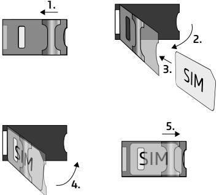

*Attention! Do NOT connect the GSM antenna's connector directly or indirectly to the protective ground, because this may damage the module!*

*Attention! Do NOT use the COM terminal for powering up the module, because this can lead to damaging the components!*

*-> Chapter 2 of the Installation and Application Manual*

# WIRING OF THE MODULE:

#### **Module versions:**

The *Adapter2* can be mounted with European 2G, 3G, 4G or international 3GA and 4GA phones, can be equipped with PSTN as a backup, and can be ordered in default and PRO version.

If you want to use the *PSTN* or line phone function, you need to get the *PSTN* version of the *Adapter2!*

#### **Inputs:**

The *NO* and *NC* contacts are defined between the *COM* terminal and the given input, while with the *PSTN* version, the contact is defined between the negative *V-* terminal of the supply voltage and the selected input.

The default *Adapter2* has one input, the PSTN version has four. The type of an input can be selected in the programming software.

#### **Outputs:**

The outputs can provide *NO* relay contacts, so the wiring should be done accordingly. The module will switch the negative *V-* point of the power supply to the output and can support a load of *1A.*

The *LINE* is a simulated phone line output, which should be connected to the *RING-TIP* input of an alarm system capable of phone line communication.

The *PSTN* input is for connecting the phone line, while the *PHONE* output is for connecting a landline telephone.

### *Attention! Do NOT connect the module's terminals directly or indirectly to the protective ground because this may damage the module!*

#### **Transparent serial port:**

The *Adapter2* has a transparent serial port, which is suitable for bidirectional transparent data transfer over the Internet. The wiring needed for this function differs on a case to case basis, and is highly dependant on the connected device and the need for a logic level converter. For more information on this process, see the *Installation and Application Manual* of *Adapter2.*

#### **Adapter2 – Alarm system wiring with GSM backup:**

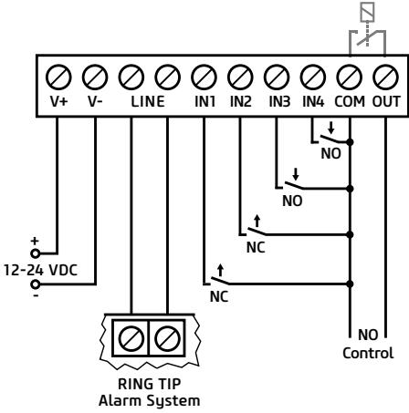

**Adapter2 PSTN – Alarm system wiring with PSTN backup:**

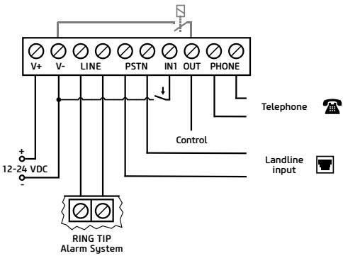

*-> Chapter 2 of the Installation and Application Manual*

# PROGRAMMING SOFTWARE:

The latest version of the programming software is available on the manufacturer's website.

#### **Permission levels:**

The *Adapter2* uses different user levels. The superadmin authorization level used during the installation has full access to all settings of the module.

#### *Default superadmin password:* 1234

For more information on the permission levels, see the *Installation and Application Manual* of *Adapter2.*

*Attention! It is highly recommended that you modify the default passwords after the first login. This can be done with the password icons in the Connection type submenu of Connection menu.*

## **USB connection :**

- Launch the Adapter2 programming software!
- Connect the module via USB A-B cable to the computer!
- Select the *USB* option in the *Connection type* submenu!
- Enter the *Connection password* then push the button!

#### **PIN-code, APN and Cloud:**

After a successful USB connection, select the *General* submenu of the *Device Settings* menu. Here, in the *SIM* section, you can set the SIM card's PIN code and the APN specified by your provider.

In the *Cloud server* section enter the server details and set the *Cloud usage.*

Default server url: 54.75.242.103 Default server port: 2020

If the *Cloud usage* option is enabled, the device can be accessed at any time via the cloud server. Otherwise it will only connect upon request sent by SMS to the phone number of the SIM card:

#### *CONNECT,PWD=devicepassword# (e.g. *CONNECT,PWD=1234#)

After a successful connection is established, the device sends a response SMS, which contains the server data and the *Device ID.*

#### **Device ID:**

The *Device ID,* which is necessary for remote connection can be located in the *Status monitoring* submenu of the *Device status* menu.

# **Cloud connection :**

- Launch the *Adapter2* programming software!
- Select the *Cloud* option in the *Connection type* submenu!
- Enter the server details and the *Device ID!*
- Enter the Connection password then push the button.

#### For further connection options, see the *Installation and Application Manual* of *Adapter2.*

*-> Chapter 3 of the Installation and Application Manual*

# LED SIGNALS:

*Slowly flashing green:* Connected to GSM network, normal operation *Flashing green and red:* Event reporting in progress *Flashing red:* GSM service unavailable or system restart in progress *Permanent red:* SIM card error

# PROGRAMMING THE MODULE:

### **Built-in help:**

Detailed help is available for each menu of the programming software by clicking the *Help* button at the top right corner.

### **Configure notifications and remote monitoring:**

The data of CMS (Central monitoring station) servers can be added at the top of the *Reporting channels* menu. In addition to typing the name, you also need to set the receiver's IP address/domain and port, the protocols you want to use, and the supervision settings.

The device can also send notification by voice call or SMS, and in case of a PRO device, the email and Push notifications are also available. Also the necessary phone numbers and e-mail addresses can be added in the *Reporting channels* menu.

In order to signal a CID code to a CMS, first you need to create a notification template from the previously added servers in the Notification template menu. You can create a notification template by clicking on New button, then you need to select the servers you want to use and set their priority.

### **IP cameras:**

The *Adapter2 PRO* versions can handle up to 4 IP camera images at once. A new camera can be added in *IP cameras* menu by entering a name and the camera URL. The camera type can be Stream or Picture depending on the URL.

For obtaining the URL of your IP camera we recommend our *IP Camera detector* software that is made with this purpose in mind. It is available on *tell.hu.*

### **Event settings:**

The events of *Adapter2* can be divided into three groups that can be set differently.

#### *Inputs and Input events:*

The type and sensitivity of the inputs can be set in the *Inputs* menu. In order for a contact input to generate an event, you need to add a New input event in the *Input events* menu.

#### *New input events:*

- Enter the Name and Type of the event!
- Select the Input!
- Add the Event Code, Partition and Zone!
- Select the *Notification template!*

#### *Service events:*

The *Adapter2* can perform various actions as a result of service events. To do this, you need to add a new service event in the *Service events* menu by clicking the *New* button.

#### *After adding a new service event:*

- Enter the Name and Type of the event!
- Select the Event from the list!
- Add the Event Code, Partition and Zone!
- Select the *Notification template!*

#### *Alarm system events:*

The device is capable of performing actions as a result of an event coming from an alarm system. To do this, you need to add a new event in the Service events menu by clicking the *New* button.

#### *After adding a new alarm system event:*

- Enter the Name and Type of the event!
- Add the Event Code, Partition and Zone!
- Select the *Notification template!*

#### *Assigning notifications and controls to events:*

When adding an event, you can assign multiple notification and output control actions to it.

#### *Available actions:*

- Output control in monostable, bistable or pulse series mode.
- Voice call notification with customizable Voice messages.

- IP-based reporting to CMS.
- Text-based notifications via SMS or e-mail (e-mail for PRO version only).
- Push notification sending with camera image (PRO version only).

#### *Attention! To send Push messages, you must assign at least one mobile app to the device!*

*-> Chapter 4 and 5 of the Installation and Application Manual*

# ASSIGNING MOBILE APP:

You can assign 4 mobile apps to an *Adapter2 Pro.* The application used is called *TELL Control Center* and is available on both Android and iOS platforms.

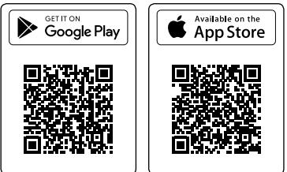

### *System requirements:*

- Minimum Android version: 4.2
- Minimum iOS version: 8

### *Before adding:*

- Set up a *Registration password* in the programming software's *Mobile devices* submenu!
- Generate QR-code by clicking the QR-code button.

#### *Adding a device:*

- After starting the app scan the generated *QR-code!*
- Enter a chosen *Username* (this identifies the app in the module)!
- Enter the *Registration password!*
- Enter a chosen *Device name* (this identifies the module in the app)!

### *Main functions of TELL Control Center:*

- Display Online/Offline status.
- Display GSM signal strength and power supply.
- Display firmware version.
- Display status of inputs and outputs.
- Remote output control.

For more information about *TELL Control Center* features, see the *TELL Control Center User Guide,* which can be found on tell.hu.

*-> TELL Control Center User Guide*

# SAFETY INSTRUCTIONS

*For your safety, please read carefully and follow the instructions below! Failure to observe safety instructions may be a threat to you and your environment!* 

TELL's product *(hereinafter referred to as "device")* has a built-in mobile communication modem. Depending on the product version, the built-in modem is capable of 2G, 3G or 4G mobile communication.

The *2G* modem can use the following frequency bands: 850/900/1800/1900 MHz @GSM/GPRS

The *3G* modem can use the following frequency bands: 900/2100 MHz @UMTS, 900/1800 @GSM/GPRS

The *3GA* modem can use the following frequency bands: 800/850/900/1900/2100 MHz @UMTS, 850/900/1800/1900 MHz @GSM

The *4G* modem can use the following frequency bands: 900/1800 MHz@GSM/EDGE, B1/B8@WCDMA, B1/B3/B7/B8/B20/B28A@LTE

The *4GA* modem can use the following frequency bands: B2/B4/B5@ WCDMA, B2/B4/B5/B12/B13@LTE

- DO NOT USE the device in an environment where radiofrequency radiation can cause a risk and may interfere with other devices, that may cause undesired operation - such as medical devices!
- DO NOT USE the device if there's a risk of high humidity, hazardous chemicals or other physical impact!
- DO NOT USE the device beyond the specified operating temperature range!
- DO NOT MOUNT the device in hazardous environment!
- DO NOT INSTALL/WIRE the device under voltage. For easy disconnection, the device's adapter or power supply should be easily accessible!
- ALWAYS DISCONNECT the power supply before starting to mount the device!
- ALWAYS DISCONNECT the device's power supply before inserting, removing or replacing the SIM card!
- TO SWITCH OFF the device disconnect all power sources, including power supply and USB.
- The computer connected to the device must always be connected to the protective ground!
- DO NOT USE a computer to program the device that is not connected to the protective ground. To avoid ground looping, the power supply of the computer and the device must use the same grounding!

# **Adapter2 GYORSTELEPÍTÉSI ÚTMUTATÓ** TELEPÍTŐKNEK

#### Tisztelt Vásárlónk!

adapter2

Köszönjük, hogy megvásárolta termékünket! A teljes *Telepítési és Alkalmazási Útmutató* letöthető a gyártó weboldaláról: https://tell.hu/hu/termekek/gprs-kommunikatorok/

# ÜZEMBE HELYEZÉS:

- I. A használni kívánt funkciók alapján válasszunk szolgáltatásokat a SIM kártya szolgáltatónál (mobilinternet, hívásszolgáltatás, SMS szolgáltatás)!
- II. Távolítsuk el a modul műanyag fedelét majd helyezzük be a SIM kártyát!

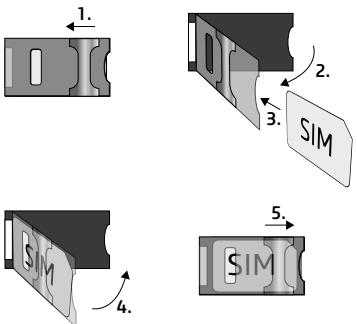

- III. Ellenőrizzük a telepítési környezetet gyenge térerő és egyéb problémák elkerülése érdekében (erős elektromágneses zavarok, magas páratartalom)!
- IV. Csatlakoztassuk a GSM antennát!
- V. Végezzük el a modul bekötését a modul verziónak megfelelően!
- VI. Csatlakoztassuk a modult tápfeszültséghez *(12-24V DC, 500mA)!*

*Figyelem! A GSM antenna csatlakozóját se közvetlenül, se közvetve NE csatlakoztassa védőföldhöz, mert ez a modul meghibásodását okozhatja!*

*Figyelem! A COM terminált NE használja a modul megtáplálására, mert ez a modul meghibásodását okozhatja!*

*-> Telepítési és Alkalmazási Útmutató 2. fejezet*

# MODUL BEKÖTÉSE:

### **Modul verziók:**

Az Adapter2 kommunikáció tekintetében *2G, 3G, 4G* és nemzetközi *3GA* valamint *4GA* telefonnal szerelve, funkciók terén *PSTN* tartalékkal vagy a nélkül, sima és *PRO* verzióban rendelhető.

A *PSTN* és a vezetékes telefon funkció használatához Adapter2 PSTN verziója szükséges!

#### **Bemenetek:**

Az *NO* vagy *NC* kontaktust az alap modul esetén a kiválasztott bemenet és a *COM* terminál között, a *PSTN* verziónál a kiválasztott bemenet és a tápfeszültség negatív *V-* pontja között értelmezzük.

Alap modul négy bemenettel, a *PSTN* verzió egy bemenettel rendelkezik. A bemenetek típusát a programozó szoftverben választhatjuk ki.

#### **Kimenet:**

A kimenet *NO* állapotú relékontaktust szolgáltat, ennek megfelelő bekötés szükséges az adott munkafolyamat elvégzéséhez. Az eszköz a tápfeszültség negatív *V-* pontját kapcsolja a kimenetre és maximum *1A*-rel terhelhető.

A *LINE* egy szimulált telefonvonal-kimenet, amit vezetékes telefonkommunikátorral rendelkező riasztók *RING-TIP* bemenetére lehet kötni.

A *PSTN* bemenet a vezetékes telefonvonal bekötésére szolgál, a *PHONE* kimenetre pedig egy vezetékes telefonkészüléket lehet csatlakoztatni.

#### *Figyelem! Ne csatlakoztassa a modul termináljait se közvetlenül, se közvetve védőföldhöz, mert ez a modul meghibásodását okozhatja!*

#### **Transzparens soros port:**

Az Adapter2 rendelkezik egy transzparens soros porttal is, mely interneten keresztüli kétirányú transzparens adatátvitelre alkalmas. Ennek a bekötése nagyban függ csatlakoztatott berendezéstől, és a szintillesztés szükségességétől. Részletesebb információt erről a folyamatról az Adapter2 *Telepítési és Alkalmazási Útmutatójában* talál.

#### **Adapter2 – Riasztó példa bekötés GSM tartalékkal:**

**Adapter2 PSTN – Riasztó példa bekötés PSTN tartalékkal:**

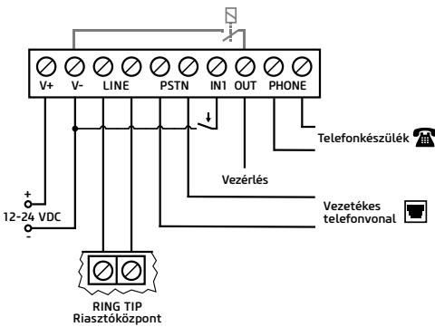

- *-> Telepítési és Alkalmazási Útmutató 2. fejezet*
# PROGRAMOZÓ SZOFTVER:

A programozó szoftver legfrissebb változata elérhető a gyártó weboldaláról.

#### **Jogosultsági szintek:**

Az Adapter2 többféle jogosultságszinttel dolgozik. A telepítés során használt szuperadmin jogosultsági szint teljes hozzáféréssel rendelkezik a modul minden beállításához.

#### *Gyári szuperadmin jelszó:* 1234

További információt a felhasználói szintek működéséről a *Telepítési és Alkalmazási Útmutatóban talál.*

*Figyelem! Az első belépéskor erősen ajánlott módosítani a modul gyári jelszavait a programozó szoftver Kapcsolat menü Kapcsolódási mód almenüjében található a jelszó ikonok segítségével!*

# **USB elérés :**

- Indítsa el az Adapter2 programozó szoftvert!
- Csatlakoztassa a modult USB A-B kábelenkeresztül a számítógéphez!
- A *Kapcsolódási mód* almenüben válassza az USB opciót!
- Adja meg a Csatlakozási jelszót, majd nyomjon a gombra!

#### **PIN-kód, APN és Felhő:**

Sikeres USB kapcsolat után válasszuk a *Modulbeállítások* menü *Általános beállítások* almenüjét. Itt a SIM mezőben beállíthatjuk a SIM kártya PIN-kódját és a szolgáltatója által megadott APN-t.

A Felhő mezőben állítsuk be a szerver adatokat és a Felhőhasználatot.

Gyári szerver url: 54.75.242.103 Gyári szerver port: 2020

*A Felhőhasználat* engedélyezésével az eszköz távolról mindig elérhető lesz, amennyiben viszont tiltjuk, az eszköz távoli eléréséhez egy SMS parancsot kell küldenünk a SIM kártyához tartozó telefonszámra:

*CONNECT,PWD=moduljelszó# (pl. *CONNECT,PWD=1234#)

Az eszköz sikeres csatlakozás után válasz SMS-t küld amely a szerver adatokat és az *Eszközazonosítót* tartalmazza.

#### **Eszköz azonosító:**

A távoli eléréshez elengedhetetlen Eszközazonosítót a *Modulállapot* menü *Állapotfigyelés* almenüjében találja.

# **Távoli elérés :**

- Indítsa el az Adapter2 programozó szoftvert!
- A *Kapcsolódási mód* almenüben válassza a *Felhő* opciót!
- Adja meg a szerver adatokat és a modul Eszköz azonosítóját!
- Adja meg a Csatlakozási jelszót, majd nyomjon a gombra.

Egyéb távoli kapcsolódási lehetőségeket találhat a *Telepítési és Alkalmazási Útmutatónkban.*

# LED JELZÉSEK:

*Lassú zöld villogás:* GSM kapcsolat, üzemszerű működés *Zöld és piros villogás:* Esemény bejelzése folyamatban *Pirosan villog:* GSM hálózat nem elérhető, vagy újraindítás folyamatban *Folyamatos piros*: SIM-kártya hiba

# MODUL PROGRAMOZÁSA:

# **Beépített súgó:**

A programozó szoftver helyérzékeny súgója minden menüből elérhető a jobb felső sarokban található *Segítség* gombra kattintva.

# **Értesítések és távfelügyelet konfigurálása:**

Az *Értesítési csatornák* menü tetején tudjuk felvenni az egyes távfelügyeleti vevőegységek adatait. A név begépelése mellett szükség van még a vevő IP címére és portjára, a használni kívánt protokollokra és életjel beállítására.

Az eszköz e mellett képes még SMS és hívás útján kiértesíteni, PRO eszköz esetén pedig az e-mail és Push értesítés is elérhető. Az ehhez szükséges telefonszámok és e-mail címek is az *Értesítési csatornák* menüben adhatók meg.

Ahhoz, hogy egy CID kódot egy távfelügyelet felé be tudjunk jelezni, először létre kell hozni egy értesítési sablont a felvett vevőegységekből az *Értesítési sablonok* menüpontban. Értesítési sablont az *Új* gombra nyomva tudunk létrehozni, ehhez pedig ki kell választanunk a használni kívánt vevőegységeket és be kell állítanunk a prioritásukat.

## **IP kamerák:**

Az Adapter2 PRO verziók egyszerre 4 db IP kamerakép kezelésére képesek. Új kamerát felvenni az *IP kamerák* menüben a kameranév és egy URL megadásával tudunk. A kamera típusát az URL-től függően kell beállítani Élőképnek vagy Pillanatképnek.

Az IP kamerája linkjének kinyeréséhez ajánlani tudjuk a külön erre a célra készített *IP Kamera kereső* szoftverünket, melyet a *tell.hu* oldalon találhat meg.

### **Események programozása:**

Az Adapter2 eseményeit három csoportba soroljuk, ezeket külön-külön kell beállítani.

#### *Bemenetek és Bemeneti események:*

A használt bemenetek típusát és érzékenységét a *Bemenetek* menüben állíthatjuk be. Ahhoz, hogy egy bemenetre érkező kontaktus eseményt hozzon létre, a *Bemeneti események* menüben hozzá kell adnunk egy *Új* bemeneti eseményt.

#### *Új bemeneti eseménynél:*

- Adjuk meg az esemény Nevét és Típusát!
- Válasszuk ki a Bemenetet!
- Határozzuk meg az Eseménykódot, a Partíciót és a Zónát!
- Válasszuk ki a távfelügyeleti *Értesítési sablont!*

#### *Szervizesemények:*

Az Adapter2 rendelkezik egy szervizesemény készlettel, és ezek hatására az eszköz különböző műveleteket képes végrehajtani. Ehhez a *Szervizesemények* menüben hozzá kell adnunk egy szervizeseményt az gombra kattintva.

#### *Új szervízesemény felvétele után:*

- Adjuk meg az esemény Nevét és Típusát!
- Válasszuk ki a kívánt Eseményt a szervízesemény készletből!
- Határozzuk meg az Eseménykódot, a Partíciót és a Zónát!
- Válasszuk ki a távfelügyeleti *Értesítési sablont!*

#### *Riasztóközpont-események:*

Az eszköz egy riasztóközponttól érkező események hatására is képes műveletek végrehajtására. Ehhez a *Riasztóközpont-események* menüben hozzá kell adnunk egy új eseményt az *Új* gombra kattintva.

### *Új riasztóközpont-esemény felvétele után:*

- Adjuk meg az esemény Nevét és Típusát!
- Határozzuk meg az Eseménykódot, a Partíciót és a Zónát!
- Válasszuk ki a távfelügyeleti *Értesítési sablont!*

#### *Értesítések és vezérlések eseményekhez rendelése:*

Minden eseményhez rendelhetünk értesítéseket és kimenetvezérlést az esemény felvételekor.

## *Beállítható műveletek:*

- Kimenetvezérlés monostabil, bistabil vagy impulzussorozat formában.
- Hanghívásos értesítés a személyre szabható Hangüzenetek használatával.
- Távfelügyelet értesítése IP alapon.
- Szöveg alapú SMS és e-mail értesítés (e-mail csak PRO verziónál).
- Push értesítés kamerakép küldéssel (csak PRO verzió).

#### *Figyelem! A Push üzenetek kiküldésének feltétele legalább egy mobilalkalmazás hozzárendelése a modulhoz!*

*-> Felhasználói Útmutató 4. és 5. fejezet*

# MOBILALKALMAZÁS HOZZÁRENDELÉSE:

Az *Adapter2* PRO változataihoz lehetőségünk van mobilalkalmazást rendelni. Ez az alkalmazás a *TELL Control Center*, elérhető Android és iOS platformon egyaránt.

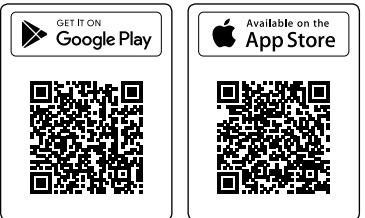

## *Rendszerkövetelmények:*

- Minimális Android verzió: 4.2
- Minimális iOS verzió: 8

### *Hozzárendelés előtti lépések:*

- *Regisztrációs jelszó* beállítása programozó szoftver *Mobileszközök* almenüjében.
- QR-kód generálása ugyanitt a *QR-kód*<QR-kód ikon> gombra kattintva.

### *Eszköz hozzárendelése:*

- Az alkalmazás elindítása után olvassuk be a generált *QR-kódot!*
- Adjunk meg egy tetszőleges *Felhasználónevet* (ez az alkalmazás azonosítására szolgál a modulban)!
- Adjuk meg a *Regisztrációs jelszót!*
- Adjunk meg egy tetszőleges *Eszköznevet* (ez a modul azonosítására szolgál az alkalmazásban)!

## *A TELL Control Center főbb funkciói:*

- Online/Offline állapot kijelzése.
- GSM térerő és tápfeszültség kijelzése.
- Firmware verzió kijelzése.
- Bemenet és kimenet állapotok kijelzése.
- Kimenetek távoli vezérlése.

*A TELL Control Center* további funkcióiról a *TELL Control Center Használati Útmutatóban* olvashat, melyet a *tell.hu* oldalon találhat meg.

*-> TELL Control Center Használati Útmutató*

# BIZTONSÁGI UTASÍTÁSOK

*Biztonsága érdekében kérjük figyelmesen olvassa végig és kövesse az alábbi utasításokat! A biztonsági utasítások esetleges be nem tartása veszélyt jelenthet Önre és a környezetére is!*

A TELL terméke *(továbbiakban "eszköz")* beépített mobilkommunikációs modemmel rendelkezik. Termékváltozattól függően, a beépített modem *2G, 3G* vagy *4G* mobilkommunikációra képes.

A *2G* modem az alábbi frekvenciasávokat használhatja: 850/900/1800/1900 MHz @GSM/GPRS

A *3G* modem az alábbi frekvenciasávokat használhatja: 900/2100 MHz @UMTS, 900/1800 @GSM/GPRS

A *3GA* modem az alábbi frekvenciasávokat használhatja: 800/850/900/1900/2100 MHz @UMTS, 850/900/1800/1900 MHz @GSM

A *4G* modem az alábbi frekvenciasávokat használhatja: 900/1800 MHz@GSM/EDGE, B1/B8@WCDMA, B1/B3/B7/B8/B20/B28A@LTE

A *4GA* modem az alábbi frekvenciasávokat használhatja: B2/B4/B5@ WCDMA, B2/B4/B5/B12/B13@LTE

- NE HASZNÁLJA az eszközt olyan környezetben, ahol a rádiófrekvenciás sugárzás veszélyt okozhat és egyéb eszközökkel interferencia alakulhat ki, amely megzavarhatja azok működését - például egészségügyi eszközök!
- NE HASZNÁLJA az eszközt magas páratartalom vagy veszélyes kemikáliák, vagy egyéb fizikai behatások fennállása esetén!
- NE HASZNÁLJA az eszközt a megadott működési hőmérséklettartományon kívül!
- NE TELEPÍTSE az eszközt veszélyes környezetben!
- TILOS az eszközt feszültség alatt felszerelni / bekötni. A könnyű áramtalaníthatóság érdekében az eszköz hálózati adaptere, vagy tápegysége legyen könnyen elérhető helyen!
- MINDIG VÁLASSZA LE az eszközt a tápfeszültségről a felszerelés megkezdése előtt!
- MINDIG VÁLASSZA LE az eszközt a tápfeszültségről a SIM kártya behelyezése, eltávolítása vagy cseréje előtt!
- AZ ESZKÖZ KIKAPCSOLÁSÁHOZ válassza le az eszközről az összes áramforrást, beleértve a tápfeszültséget és az USB csatlakozást is!
- AZ ESZKÖZHÖZ CSATLAKOZTATOTT számítógép minden esetben legyen csatlakoztatva a védőföldhöz!
- NE HASZNÁLJON olyan számítógépet az eszköz programozására, amely nincs csatlakoztatva a védőföldhöz. A földhurok elkerülése érdekében a számítógép és az eszköz tápegysége ugyanazon földelést kell, hogy használja!
- NE PRÓBÁLJA MEGJAVÍTANI az eszközt. Az eszköz javítását csak szakképzett személy végezheti!
- BIZTOSÍTSON MEGFELELŐ ÁRAMFORRÁST az eszköznek! Az eszköz csak olyan tápegység használata esetén működik biztonságosan és megfelelően, amely az eszköz kézikönyvében megadott követelmények maximális értékeit is képes teljesíteni. A pontos adatokat az eszköz kézikönyvében és a http://tell.hu weboldalon is megtalálja.
- NE HASZNÁLJA az eszközt olyan tápegységgel, amely nem felel meg az MSZ EN 60950-1 szabványnak!
- NE CSERÉLJE FEL a tápfeszültség polaritását! A tápfeszültséget minden esetben az eszközön jelölt polaritásnak megfelelően kösse be!
- NE CSATLAKOZTASSA a GSM antenna csatlakozóját a védőföldhöz. A GSM antenna csatlakozójának fémes részeit és a modul termináljait se közvetlenül, se közvetve NE csatlakoztassa a védőföldhöz, mert ez a modul meghibásodását okozhatja!
- FIGYELEM! A termék automatikus tápfeszültség-leválasztás *(Under Voltage Lock Out)* funkcióval rendelkezik. Terméktípustól függően, amennyiben a tápfeszültség 8,4…8,2V alá csökken, a modul automatikusan kikapcsol. A modul ismét csak 11,2…11,4V-os tápfeszültségszintnél kapcsol be.

# **Adapter2 SCHNELLINSTALLATIONSANLEITUNG**

### Sehr geehrte/r Kunde/Kundin,

Wir bedanken uns, dass Sie sich für unser Produkt entschieden haben. Die komplette *Installations- und Anwendungsanleitung* kann von der Webseite des Herstellers heruntergeladen werden: https://tell.hu/de/produkte/gprs-communicators/ adapter2

# INBETRIEBNAHME:

- I. Wählen Sie aufgrund der zu benutzen beabsichtigten Funktionen Dienstleistungen beim Dienstleister der SIM-Karte aus (mobiles Internet, Anrufdienst, SMS-Dienst).
- II. Entfernen Sie den Kunststoffdeckel des Moduls, und legen Sie die SIM-Karte ein.

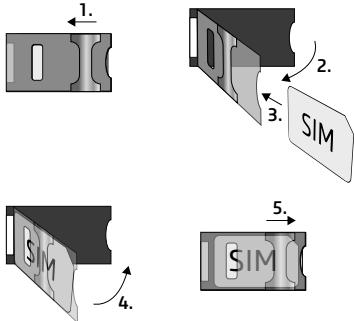

- III. Prüfen Sie die Installationsumgebung, um schwache Signalstärke und sonstige Probleme zu vermeiden (starke elektromagnetische Störungen, hohe Luftfeuchtigkeit).
- IV. Schließen Sie die GSM-Antenne an.
- V. Schließen Sie das Modul entsprechend der Modulversion an.
- VI. Schließen Sie das Modul an die Spannungsversorgung an *(12-24V DC, 500mA)!*

#### *Achtung! Schließen Sie die GSM-Antenne weder direkt, noch indirekt an die Schutzerdung an, weil das zu einem Defekt des Moduls führen kann!*

#### *Achtung! Verwenden Sie das COM-Terminal NICHT zur Einspeisung des Moduls, weil das zu einem Defekt des Moduls führen kann!*

*-> Installations- und Anwendungsanleitung, Kapitel 2*

# ANSCHLUSS DES MODULS:

#### **Modulversionen:**

Adapter2 ist hinsichtlich Kommunikation mit 2G-, 3G-, 4G- und internationalem 3GA-, sowie 4GA-Modem, hinsichtlich Funktionen mit oder ohne Ersatz-PSTN, in den Versionen Basic oder PRO-Version erhältlich. Zur Benutzung des PSTN und des Festnetztelefons ist die Version PSTN des Adapter2 nötig!

#### **Eingänge:**

Die Kontakte NO oder NC verstehen sich beim Grundmodul zwischen dem ausgewählten Eingang und dem COM-Terminal, bei der PSTN-Version zwischen dem ausgewählten Eingang und dem negativen V-Punkt der Speisespannung.

Das Grundmodul verfügt über vier, die PSTN-Version über einen Eingang. Der Eingangstyp kann in der Programmiersoftware ausgewählt werden.

#### **Ausgang:**

Der Ausgang hat einen NO-Relaiskontakt, zur Durchführung des jeweiligen Arbeitsablaufs ist ein dementsprechender Anschluss nötig. Das Gerät schließt den negativen V-Punkt der Speisespannung an den Ausgang an, und kann mit maximal 1A belastet werden.

*LINE* ist ein simulierter Telefonlinienausgang, der an den *RING-TIP*-Eingang von Alarmanlagen mit Telefonkommunikatoren im Festnetz angeschlossen werden kann.

Der *PSTN*-Eingang dient zum Anschluss der Festnetztelefonlinie, während an den *PHONE*-Ausgang ein Festnetztelefongerät angeschlossen werden kann.

*Achtung! Schließen Sie die Modulterminale weder direkt, noch indirekt an die Schutzerdung an, weil das zu einem Defekt des Moduls führen kann!*

#### **Transparente serielle Schnittstelle:**

Adapter2 verfügt auch über eine transparente serielle Schnittstelle, die zur bidirektionalen, transparenten Datenübertragung über Internet geeignet ist. Der Anschluss dieser hängt wesentlich vom angeschlossenen Gerät und der Notwendigkeit der Pegelumsetzung ab. Detaillierte Informationen zu diesem Vorgang sind in der *Installations- und Anwendungsanleitung* von Adapter2 zu finden.

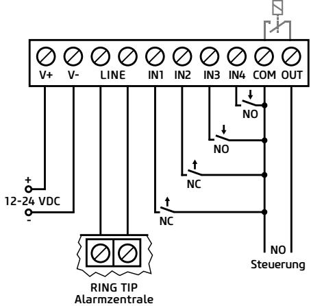

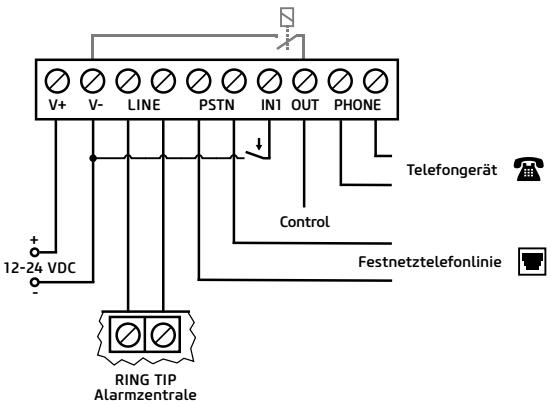

- *-> Installations- und Anwendungsanleitung, Kapitel 2*
# PROGRAMMIERSOFTWARE:

Die neueste Version der Programmiersoftware kann von der Webseite des Herstellers heruntergeladen werden.

#### **Berechtigungsebenen:**

Adapter2 arbeitet mit mehreren Berechtigungsebenen. Die bei der Installation verwendete Berechtigungsebene "Superadmin" gewährt unbeschränkten Zugriff auf alle Einstellungen des Moduls.

#### **Werkseitig eingestelltes Passwort für den Superadmin: 1234**

Weitere Informationen über die Funktion der Anwenderebenen sind der Installations- und Anwendungsanleitung zu entnehmen.

*Achtung! Bei der ersten Anmeldung ist es äußerst empfohlen, die werkseitig eingestellten Passwörter des Moduls im Menü Anschluss, Untermenü Anschlussart mittels Passwort-Symbole zu ändern.*

# **USB-Verbindung :**

- Starten Sie die Programmiersoftware Adapter2.
- Schließen Sie das Modul über einen USB Kabel A/B an den Rechner an.
- Wählen Sie im Untermenü Anschlussart die Option USB.
- Geben Sie den Verbindungspasswort ein, dann drücken Sie die Taste !

### **PIN, APN und Cloud:**

Nach erfolgreicher Herstellung der USB-Verbindung wählen Sie im Menü *Moduleinstellungen* das Untermenü *Allgemeine Einstellungen.* Hier kann im Feld "SIM" der PIN-Code der SIM-Karte und der durch den Dienstleister angegebene APN eingestellt werden. Stellen Sie im Feld Cloud die Serverdaten und die Cloudnutzung ein.

Standard Server-URL: 54.75.242.103 Standard Server-Schnittstelle: 2020

Durch Zulassung der Cloudnutzung wird immer ein Fernzugriff auf das Gerät möglich sein, bei Deaktivierung hingegen ist zum Fernzugriff auf das Geräte ein SMS-Befehl an die zur SIM-Karte gehörende Telefonnummer zu senden.

#### *CONNECT,PWD=Modulpasswort# (z. B. *CONNECT,PWD=1234#)

Das Gerät sendet nach erfolgreicher Verbindungsherstellung eine Antwort-SMS mit den Serverdaten und der UDI-Nr.

### **UDI-Nr.:**

Die für den Fernzugriff unabdingbare UDI-Nr. ist im Menü *Modulzustand,* Untermenü *Zustandsüberwachung* zu finden.

# **Fernzugriff :**

- Starten Sie die Programmiersoftware Adapter2.
- Wählen Sie im Untermenü Anschlussart die Option Cloud.
- Geben Sie die Serverdaten und die UDI-Nr. des Moduls ein.
- Geben Sie das Verbindungspasswort ein, dann drücken Sie die Taste !

Sonstige Möglichkeiten für den Fernzugriff können Sie unserer Installations- und Anwendungsanleitung entnehmen.

# LED-SIGNALE:

*Langsames grünes Blinken:* GSM-Verbindung, betriebsgemäßer Betrieb *Grünes und rotes Blinken:* Ereignismeldung im Gange *Rotes Blinken:* GSM-Netz nicht erreichbar oder Neustart im Gange *Rotes Licht leuchtet:* Fehler SIM-Karte

# PROGRAMMIERUNG DES MODULS:

### Integrierte Hilfefunktion:

Die kontextsensitive Hilfe der Programmiersoftware kann aus jedem Menü erreicht werden, indem Sie auf die Taste Hilfe in der Ecke oben rechts klicken.

#### Konfigurierung von Benachrichtigungen und Fernüberwachung:

Oben, im Menü *Benachrichtigungskanäle* können die Daten der einzelnen Einheiten der Fernüberwachungsempfänger erfasst werden. Außer der Eingabe des Namen ist noch die IP-Adresse und die Schnittstelle des Kunden, sowie die zu benutzen beabsichtigten Protokolle und die Einstellung von Lebenszeichen erforderlich. Das Gerät kann zudem auch per SMS oder durch Anruf Benachrichtigungen senden, bei den Geräten PRO stehen auch die Benachrichtigungen per E-Mail und Pushnachricht zur Verfügung. Die dazu notwendigen Telefonnummern und E-Mail-Adressen können ebenfalls im Menü *Benachrichtigungskanäle*  eingegeben werden.

Um einen CID-Code an eine Fernüberwachung melden zu können, ist zunächst von den hinzugefügten Empfängereinheiten im Menü *Benachrichtigungsvorlagen* eine Benachrichtigungsvorlage zu erstellen. Eine Benachrichtigungsvorlage kann durch betätigen der Taste *Neu* erstellt werden. Dazu sind die zu benutzen beabsichtigten Empfängereinheiten auszuwählen und ihre Prioritäten einzustellen.

#### **IP-Kameras:**

Die PRO Versionen von Adapter2 können gleichzeitig 4 IP-Kamerabilder verwalten. Eine neue Kamera kann im Menü IP-Kameras, durch Angabe eines Kameranamens und einer URL hinzugefügt werden. Der Typ der Kamera ist abhängig von der URL als Livebild oder Momentaufnahme einzustellen.

Zur Ermittlung des Links Ihrer IP-Kamera empfehlen wir unsere, für diesen Zweck entwickelte I*P-Kamera-Detektor*-Software, die von der Webseite tell.hu heruntergeladen werden kann.

### **Programmierung von Ereignissen:**

Die Ereignisse von Adapter2 werden in drei Gruppen eingeteilt, diese sind gesondert einzustellen.

# *Eingänge und Eingangsereignisse:*

Der Typ und die Empfindlichkeit der verwendeten Eingänge können im Menü *Eingänge* eingestellt werden. Damit ein, auf einen Eingang eingehender Kontakt ein Ereignis erzeugt, ist im Menü Eingangsereignisse ein neues Eingangsereignis (Neu ) zu erfassen.

### *Bei neuem Eingangsereignis:*

- Geben Sie den Namen und den Typ des Ereignisses an.
- Wählen Sie den Eingang.
- Bestimmen Sie den Ereigniscode, die Partition und die Zone.
- Wählen Sie die Benachrichtigungsvorlage der Fernüberwachung.

# *Serviceereignisse:*

Adapter2 verfügt über einen Serviceereignissatz, dadurch kann das Gerät verschiedene Aktionen durchführen. Dazu ist im Menü *Serviceereignisse* ein Serviceereignis durch Anklicken der Taste zu erfassen.

# *Nach Erfassen eines neuen Serviceereignisses:*

- Geben Sie den Namen und den Typ des Ereignisses an.
- Wählen Sie das gewünschte Ereignis vom Serviceereignissatz.
- Bestimmen Sie den Ereigniscode, die Partition und die Zone.
- Wählen Sie die *Benachrichtigungsvorlage* der Fernüberwachung.

# *Ereignisse Alarmzentrale:*

Das Gerät kann auch infolge von solchen Ereignissen Aktionen durchführen, die von einer Alarmzentrale kommen. Dazu ist im Menü Ereignisse Alarmzentrale ein neues Ereignis durch Anklicken der Taste Neu zu erfassen.

## *Nach Erfassen eines neuen Ereignisses der Alarmzentrale:*

- Geben Sie den Namen und den Typ des Ereignisses an.
- Bestimmen Sie den Ereigniscode, die Partition und die Zone.
- Wählen Sie die *Benachrichtigungsvorlage* der Fernüberwachung.

# *Zuweisung von Benachrichtigungen und Steuerungen zu Ereignissen:*

Zu allen Ereignissen können Benachrichtigungen und Ausgangssteuerungen bei Aufnahme eines Ereignisses zugewiesen werden.

### *Einstellbare Aktionen:*

- Ausgangssteuerung mit mono- oder bistabiler Kippstufe, oder Impulsfolge.
- Benachrichtigung per Sprachanruf durch Verwendung der individuell einstellbaren Sprachnachrichten.
- Benachrichtigung der Fernüberwachung auf IP-Basis.
- Textnachricht per SMS oder E-Mail (E-Mail nur bei der Version PRO).
- Pushnachricht mit Kamerabild (nur Version PRO).

#### *Achtung! Die Voraussetzung des Sendens von Pushnachrichten ist die Zuweisung von mindestens einer Mobilanwendung zum Modul.*

*-> Benutzerhandbuch, Kapiteln 4 und 5*

# ZUWEISUNG EINER MOBILE-APP:

Den Versionen PRO von Adapter2 kann eine Mobile-App zugewiesen werden. Diese Anwendung, der *TELL Control Center,* ist auf Android- und iOS-Plattform erreichbar.

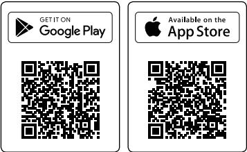

## *Systemanforderungen:*

- Minimum Android version: 4.2
- Minimum iOS version: 8

### *Schritte vor der Zuweisung:*

- Einstellung eines *Registrationspasswort*es im Untermenü *Mobile Geräte* der Programmiersoftware.
- Generierung eines QR-Codes ebenfalls hier, durch Anklicken der Tase *QR-Code* .

# *Zuweisung eines Gerätes:*

- Nach Starten der Anwendung lesen Sie den generierten *QR-Code ein.*
- Geben Sie einen beliebigen *Anwender* an (dieser dient zur Identifikation der App im Modul).
- Geben Sie das *Registrationspasswort* an.
- Geben Sie einen beliebigen *Gerätenamen* an (dieser dient zur Identifikation des Moduls in der App).

#### *Wichtigere Funktionen des TELL Control Centers:*

- Anzeige des Online-/Offline-Zustandes.
- Anzeige von GSM Signalstärke und Spannungsversorgung.
- Anzeige der Firmware-Version.
- Anzeige der Eingangs- und Ausgangszustände.
- Fernsteuerung von Ausgängen.

Weitere Funktionen des *TELL Control Centers* sind der Betriebsanleitung *TELL Control Center* zu entnehmen, die von der Webseite *tell.hu*  heruntergeladen werden kann.

*-> Betriebsanleitung TELL Control Center*

# SICHERHEITSANSWEISUNGEN

*Für Ihre Sicherheit bitten wir Sie, folgende Anweisungen aufmerksam zu lesen und befolgen! Die Nichteinhaltung der Sicherheitsanweisungen können eine Gefahr für Sie und Ihre Umwelt bedeuten!* 

Das Produkt von TELL (im Folgenden "Gerät") hat ein eingebautes Kommunikationsmodem. Abhängig von der Version des Produktes kann das eingebaute Modul im System 2G, 3G oder 4G kommunizieren.

Das *2G*-Modem kann folgende Frequenzbänder benutzen:850/900/1800/1900 MHz @GSM/GPRS

Das *3G*-Modem kann folgende Frequenzbänder benutzen: 900/2100 MHz @UMTS, 900/1800 @GSM/GPRS

Das *3GA*-Modem kann folgende Frequenzbänder benutzen: 800/850/900/1900/2100 MHz @UMTS, 850/900/1800/1900 MHz @GSM

Das *4G-*Modem kann folgende Frequenzbänder benutzen: 900/1800 MHz@GSM/EDGE, B1/B8@WCDMA, B1/B3/B7/B8/B20/B28A@LTE

Das *4GA*-Modem kann folgende Frequenzbänder benutzen: B2/B4/B5@ WCDMA, B2/B4/B5/B12/B13@LTE

- VERWENDEN SIE das Gerät in KEINER Umgebung, wo die Radiofrequenz Strahlungsgefahr hervorrufen kann und mit anderen Geräten Interferenz entstehen kann, die zur Störung der Funktion von diesen Geräten führen kann - z. B. Sanitätsgeräte!
- VERWENDEN SIE das Gerät NICHT bei hoher Luftfeuchtigkeit oder Vorhandensein von gefährlichen Chemikalien oder bei sonstigen mechanischen Einwirkungen!
- VERWENDEN Sie das Gerät KEINER außerhalb des spezifizierten Betriebstemperaturbereichs!
- INSTALLIEREN Sie das Gerät NICHT in einer gefährlichen Umgebung.
- Es ist VERBOTEN, das Gerät unter Spannung zu montieren / anzuschließen. Damit das Gerät einfach von der Spannung abgetrennt werden kann, soll das Netzteil oder die Stromversorgungseinheit des Gerätes auf einem leicht zugänglichen Ort platziert werden!

- TRENNEN SIE das Gerät IMMER von der Speisespannung, bevor Sie mit der Montage beginnen!
- TRENNEN SIE das Gerät IMMER von der Speisespannung, bevor Sie die SIM-Karte einlegen, entfernen oder austauschen!
- Zum AUSSCHALTEN DES GERÄTES trennen Sie alle Stromquellen vom Gerät, einschließlich der Speisespannung und des USB-Anschlusses!
- Der ZUM GERÄT ANGESCHLOSSENE Computer soll immer an die Schutzerdung angeschlossen sein!
- VERWENDEN SIE für die Programmierung des Gerätes KEINEN Computer, der an die Schutzerdung nicht angeschlossen ist. Zur Vermeidung der Entstehung einer Erdschleife müssen die Speiseeinheiten des Computers und des Gerätes die selbe Erdung benutzen!
- VERSUCHEN SIE NICHT das Gerät zu REPARIEREN. Die Reparatur des Gerätes darf nur von dafür ausgebildeten Fachkräften vorgenommen werden!
- STELLEN SIE GEEIGNETE STROMQUELLE für das Gerät zur Verfügung! Das Gerät arbeitet sicher und zuverlässig nur bei Verwendung von Speiseeinheiten, die fähig sind auch die maximalen Werte der Anforderungen im Handbuch des Gerätes zu erfüllen. Die genauen Daten können Sie im Handbuch des Gerätes und auch auf der Webseite unter http://tell.hu finden.
- VERWENDEN SIE das Gerät mit KEINER Speiseeinheit, die den Vorschriften der ungarischen Norm MSZ EN 60950-1 nicht entspricht!
- VERTAUSCHEN SIE die Polarität der Speisespannung NICHT! Die Speisespannung ist in jedem Fall entsprechend der am Gerät angegebenen Polarität anzuschließen!
- SCHLIESSEN SIE den Anschluss der GSM-Antenne NICHT an die Schutzerdung. Schließen Sie die metallischen Teile der GSM-Antenne WEDER direkt NOCH indirekt an eine Schutzerdung, da es zum Defekt des Moduls führen kann!
- ACHTUNG! Das Gerät verfügt über die Funktion automatische Speisespannung-Abtrennung (Under Voltage Lock Out). Abhängig von der Produktart, schaltet sich das Modul automatisch aus, wenn die Speisespannung unter 8,4…8,2V fällt. Das Modul schaltet sich wieder ein, wenn die Speisespannung 11,2…11,4V erreicht.