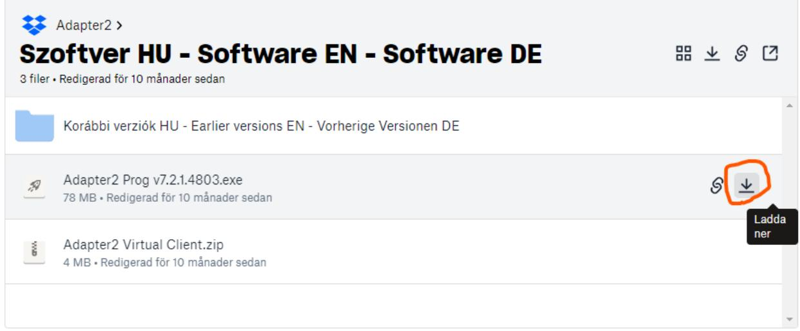

# **Konfiguration av Adapter2 - Inbrottslarm kopplad till mottagande larmcentral**

För att ersätta en fast telelina kopplad till ett inbrottslarm som rapporterar till en larmcentral så rekommenderar vi att Adapter2 4G konfigureras för rapportering via SIA IP till larmcentralen.

Larmet måste i sin tur vara inställt att skicka Contact ID via telelinan för att Adapter2 ska kunna förstå och omvandla till SIA IP.

Kontakta larmcentralen för att få uppgifter för anslutning via SIA IP.

- User account ID = identifierar kunden och skickas med i "Contact ID"-meddelanden. Borde även kunna hittas i larmets inställningar.
- SIA User Account ID = identifiering för IP-anslutningen mot larmcentralen
- IP-adress(er) och port för anslutningen. Upp till fyra kanaler kan anges, en primär och resten backup.
- Ev. AES-nyckel för kryptering

Ladda ner programvaran för konfiguration av Adapter2 från: <https://www.tell.hu/en/Adapter2-4G-IN4-R1> Skrolla ner på sidan klicka på Download och sedan Software.

|   |                                                 | Details | Info | Downloads                |  |
|---|-------------------------------------------------|---------|------|--------------------------|--|
|   |                                                 |         |      |                          |  |
|   | RUBRIK                                          |         |      | SENAST ÄNDRAT            |  |
| A | Firmware                                        |         |      | 2022-08-25 TELL Letöltés |  |
| F | Kézikönyv HU - Manual EN - Handbuch DE          |         |      | 2022-08-02 TELL Letöltés |  |
| A | Szoftver HU - Software EN - Software DE         |         |      | 2022-07-19 TELL Letöltés |  |
| P | Tanúsítvány HU - Certificate EN - Zertifikat DE |         |      | 2022-05-05 TELL Letöltés |  |

Ladda ner "Adapter2 Prog…" till datorn.

Installera programvaran, anslut till enheten med en USB-kabel och starta programvaran.

| Adapter2 programming software v7        |                         |                       |   |                  |
|-----------------------------------------|-------------------------|-----------------------|---|------------------|
|                                         | Offline device selector |                       |   |                  |
| Connection                              | 人                       | Connection type ®     |   |                  |
| Connection type 0 Device register |                         | USB                   |   |                  |
| Server register                         |                         | Connection parameters |   |                  |
| Device settings                         | A                       | Device password       |   |                  |
| General                                 | wetells                 |                       |   |                  |
| Reporting channels                      | Date/Time               |                       | > | Event            |
| Notification templates                  | ▲                       | 2022-11-29 15:20:58   |   | Connection type: |
| Inputs                                  |                         |                       |   |                  |

Ange device password 1234 och välj Connect.

### Därefter ska du vara ansluten som superadmin.

| Connection type @                                              |  |  |  |  |
|----------------------------------------------------------------|--|--|--|--|
|                                                                |  |  |  |  |
|                                                                |  |  |  |  |
|                                                                |  |  |  |  |
|                                                                |  |  |  |  |
|                                                                |  |  |  |  |
|                                                                |  |  |  |  |
|                                                                |  |  |  |  |
|                                                                |  |  |  |  |
| Successful device identification, device ID: FC:0F:E7:63:A5:F7 |  |  |  |  |
|                                                                |  |  |  |  |
|                                                                |  |  |  |  |
|                                                                |  |  |  |  |

Därefter kan du läsa in aktuell konfiguration genom att klicka på "General" till vänster och sedan "Read" högst upp i fönstret.

| Adapter2 programming software v/                      |                                                                                            |               |        |
|-------------------------------------------------------|--------------------------------------------------------------------------------------------|---------------|--------|
| Disconnect                                            | Load from file Save to file                                                             |               |        |
| Connection                                            | General settings A                                                                      |               |        |
| Connection type Device register Server register | SIM PIN code APN                                                                     | APN user name | APN Di |
| Device settings Reporting channels                 | Cloud server A Cloud usage Server Cloud (Adapter2, Pager4 Disable ▼ > |               |        |
| Notification templates T --------                  | Identification                                                                             |               |        |

Kontrollera först att APN är rätt inställd för den operatör som levererat SIM-kortet. Ex.: För Tre ska APN vara: data.tre.se och för Telia: online.telia.se

För att kunna fjärrkonfigurera Adapter2 via internet så måste Cloud usage vara Enabled, om man inte vill använda den funktionen ställs den till Disabled.

Ange User account ID och SIA user account ID.

Ställ in"Operating mode", det ska vara: "Receive and process alarm system messages upon any dialed number".

**OBS! När du lägger till eller ändrar något, tryck alltid på Write för att skriva den ändrade konfigurationen till enheten.**

| Adapter2 programming software v7                                                                               |                                                                                                                                                                                                                   |  |  |  |
|----------------------------------------------------------------------------------------------------------------|-------------------------------------------------------------------------------------------------------------------------------------------------------------------------------------------------------------------|--|--|--|
| Disconnect Read Connect Write                                                                         | Load from file Save to file                                                                                                                                                                                    |  |  |  |
| Connection <                                                                                                | General settings                                                                                                                                                                                                  |  |  |  |
| Connection type Device register Server register                                                          | SIM PIN code APN APN password Device phone number APN user name data.tre.se SIM card lock Cloud server                                                                                    |  |  |  |
| Device settings A                                                                                           |                                                                                                                                                                                                                   |  |  |  |
| General Reporting channels Notification templates Inputs                                              | Cloud usage Server Cloud (Adapter2, Pager4 ▼ Enable Identification TEX device ID Alarm system user account ID replacement TEX group ID SIA user account ID Device name User account ID |  |  |  |
| Input events                                                                                                   | 0000 123456 Adapter                                                                                                                                                                                         |  |  |  |
| Service events                                                                                                 |                                                                                                                                                                                                                   |  |  |  |
| Custom events                                                                                                  | Serial port                                                                                                                                                                                                       |  |  |  |
| Voice messages                                                                                                 | Baud rate Parity Stop bits                                                                                                                                                                                  |  |  |  |
| Admin access                                                                                                   | 1 ▼ ae00 ▼ None >                                                                                                                                                                                        |  |  |  |
| Advanced settings                                                                                              |                                                                                                                                                                                                                   |  |  |  |
|                                                                                                                | System time                                                                                                                                                                                                       |  |  |  |
| Alarm system events <                                                                                       | NTP server 1 NTP server 2 Time zone                                                                                                                                                                         |  |  |  |
| hu.pool.ntp.org time.google.com (UTC+01:00) Sarajevo, Skopje, Warsaw, Zagreb レ Alarm system events |                                                                                                                                                                                                                   |  |  |  |
| Custom event code names                                                                                        | Operating mode used upon dialing a number via the simulated phone line                                                                                                                                            |  |  |  |
| Custom user names                                                                                              | Phone number 1 Phone number 2 Phone number 3 Phone number 4 Operating mode                                                                                                                            |  |  |  |
| Custom partition names                                                                                         | Receive and process alarm system messages upon any nu ▼                                                                                                                                                           |  |  |  |
| Custom zone names                                                                                              |                                                                                                                                                                                                                   |  |  |  |

Välj sedan Reporting Channels och lägg in inställningarna för anslutning mot larmcentralen. Ange minst en kanal med IP-adress, port, protokoll och ev. krypteringsnyckel (AES).

Upp till fyra kanaler kan anges och som standard väljer den IP1 som primär, IP2 som sekundär, osv. Detta kan

| Data usage calculator Read Write Reporting channels 人 |  |  |  |  |  |  |
|-------------------------------------------------------------------|--|--|--|--|--|--|
|                                                                   |  |  |  |  |  |  |
|                                                                   |  |  |  |  |  |  |
|                                                                   |  |  |  |  |  |  |
|                                                                   |  |  |  |  |  |  |
|                                                                   |  |  |  |  |  |  |
|                                                                   |  |  |  |  |  |  |
|                                                                   |  |  |  |  |  |  |
|                                                                   |  |  |  |  |  |  |
|                                                                   |  |  |  |  |  |  |
|                                                                   |  |  |  |  |  |  |
|                                                                   |  |  |  |  |  |  |
|                                                                   |  |  |  |  |  |  |
|                                                                   |  |  |  |  |  |  |
|                                                                   |  |  |  |  |  |  |
|                                                                   |  |  |  |  |  |  |
|                                                                   |  |  |  |  |  |  |
| > ▼ V ▼                                                  |  |  |  |  |  |  |

Man kan även lägga till ett telefonnummer som den skickar SMS till om anslutningen mot larmcentralen skulle fallera. Den funktionen måste i så fall aktiveras under "Notification channels". Dubbelklicka på DEFAULT och bocka i "Backup reporting via SMS".

|                                    | * Name                   | ← 1.        | 2.            |        | 3.            | 4.         |
|------------------------------------|--------------------------|----------------|---------------|--------|---------------|------------|
| Connection type                    | I DEFAULT                | IPC1 (Primary) | IPC2 (Backup) |        | IPC3 (Backup) | IPC4 (Back |
| Device register                    | EMPTY                    | (None)         | (None)        |        | (None)        | (None)     |
| Server register                    | Notification template    |                |               | X      |               |            |
| Device settings >               | General                  |                |               |        |               |            |
| General                            | Name                     |                |               |        |               |            |
| Reporting channels                 | DEFAULT                  |                |               |        |               |            |
| ● Notification templates Inputs | Reporting to CMS         |                |               |        |               |            |
| Input events                       | Channel                  |                | Reporting     |        |               |            |
| Service events                     | 1. IPC1               |                | Primary       | ♪      |               |            |
| Custom events                      | Channel                  |                | Reporting     |        |               |            |
| Voice messages                     | 2. IPC2               |                | Backup ♪   | ♪      |               |            |
| Admin access                       | Channel                  |                | Reporting     |        |               |            |
| Advanced settings                  | 3. IPC3               |                | Backup >   | >      |               |            |
|                                    | Channel                  |                | Reporting     |        |               |            |
| Alarm system events <           | ব : IPC4              |                | Backup レ   | ▶      |               |            |
| Alarm system events                | Bactup reporting via SMS |                |               |        |               |            |
| Custom event code names            |                          |                |               |        |               |            |
| Custom user names                  |                          |                | OK            | Cancel |               |            |
| Custom partition names             |                          |                |               |        |               |            |

**OBS! Kom ihåg att klicka på Write för att skriva ändringar till enheten.**

Om det inte redan är gjort så stoppa i SIM-kortet och anslut spänningsmatning.

Kontrollera sedan att enheten kopplar upp sig mot mobilnätet via 4G och får en IP-adress. Det görs under "Status Monitoring". Där kan man även se aktuell firmware-version och en rullande logg med händelser som är användbar vid felsökning.

| Disconnect General   | Time synchronization Activate output Periodic test report |                        |   |                                      |       |                                                                                                                                                                                 |
|-------------------------|-----------------------------------------------------------|------------------------|---|--------------------------------------|-------|---------------------------------------------------------------------------------------------------------------------------------------------------------------------------------|
| Reporting channels      | Status monitoring                                         |                        |   |                                      |       |                                                                                                                                                                                 |
| Notification templates  | Property                                                  | Status / Value         |   | * Date/Time                          | Event |                                                                                                                                                                                 |
| Inputs                  | Device                                                    |                        |   | 2023-08-03 14:04:10 D: [mainsm proc  |       | <mdm a=""> (14:03:46)EG9x set volume: mic=8, spk=80</mdm>                                                                                                                       |
| Input events            | Firmware version                                          | V7.03.6.8164           |   | 2023-08-03 14:04:12 D: [mainsm proc  |       | <date> (14:04:12)ZoneOffset = 7200 sec</date>                                                                                                                                   |
|                         | SIM identifier                                            | 8946012100002217123F   | 피 | 2023-08-03 14:04:12 D: [mainsm proc  |       | <xtime> (14:04:12)System time updated(0 -&gt; 1).</xtime>                                                                                                                       |
| Service events          | Model                                                     | Adapter 2 - 4G.IN4.R 1 |   | 2023-08-03 14:04:12 D:  mainsm proc  |       | <mdm a=""> (14:04:12)System time updated from GSM</mdm>                                                                                                                         |
| Custom events           | Device ID                                                 | 60:8A: 10:70:17:2F     | 国 | 2023-08-03 14:04:12 D: [mainsm proc  |       | <mdm a=""> (14:04:12)pppsm start </mdm>                                                                                                                                         |
| Voice messages          | Supply voltage                                            | 23,49 V                |   | 2023-08-03 14:04:13 D:  mainsm proc  |       | <mdm a=""> (14:04:12)Try APN: data.rewicom.net</mdm>                                                                                                                            |
| Admin access            | Simulated line status                                     | Ide                    |   | 2023-08-03 14:04:13 D:  mainsm_proc  |       | <mdm a=""> (14:04:12)SMS storage size: 255</mdm>                                                                                                                                |
| Advanced settings       | Counters                                                  |                        |   | 2023-08-03 14:04:13 D: [mainsm_proc  |       | <mdm a=""> (14:04:13)APN set OK</mdm>                                                                                                                                           |
|                         |                                                           |                        |   | 2023-08-03 14:04:13 D: [mainsm_proc  |       | ] <mdm a=""> (14:04:13)ppp0 start </mdm>                                                                                                                                        |
|                         | System time                                               | 2023-08-03 14:04:37    |   | 2023-08-03 14:04:13 D: [mainsm_proc  |       | ] <mdm a=""> (14:04:13)ppp connected </mdm>                                                                                                                                     |
| Alarm system events     | IP uptime                                                 | 28 seconds             |   | 2023-08-03 14:04:13 I: [mainsm_proc  |       | <tcpip> (14:04:13)PPP[0] starting </tcpip>                                                                                                                                      |
|                         | Device uptime                                             | 76 seconds             |   | 2023-08-03 14:04:14 D: [tcpip_thread |       | <ppp link=""> (14:04:14)STATE: code: 0</ppp>                                                                                                                                    |
| Alarm system events     | GSM uptime                                                | 30 seconds             |   | 2023-08-03 14:04:14 D: [tcpip_thread |       | <link/> (14:04:14) ------------------------------------------------------------------------------------------------------------------------------------------------------------ |
| Custom event code names | Data traffic                                              | 2343 B                 |   | 2023-08-03 14:04:14 D: [tcpip thread |       | <link/> (14:04:14)ip addr = 10.182.80.41                                                                                                                                        |
| Custom user names       | Network                                                   |                        |   | 2023-08-03 14:04:14 D: [tcpip_thread |       | <link/> (14:04:14)netmask = 255.255.255.0                                                                                                                                       |
|                         | GSM operator                                              | Tellia nor .net        |   | 2023-08-03 14:04:14 D: [tcpip_thread |       | <link/> (14:04:14)dns1 = 8.8.8.8                                                                                                                                             |
| Custom partition names  | Data connection type                                      | 4G (E-UTRAN)           |   | 2023-08-03 14:04:14 D: [tcpip thread |       | <link/> (14:04:14)dns2 = 8.8.4.4                                                                                                                                             |
| Custom zone names       | GSM signal                                                | Excellent              |   | 2023-08-03 14:04:14 D:  tcpip thread |       | <sysnetif> (14:04:14)System netif 0  ready</sysnetif>                                                                                                                           |
|                         | IP address                                                | 10.182.80.41           |   | 2023-08-03 14:04:14 D: mainsm proc   |       | <mdm a=""> (14:04:14)New day: counters reseted</mdm>                                                                                                                            |
|                         | Number of connections                                     | 2 pcs                  |   | 2023-08-03 14:04:14 D: [tcpip thread |       | <mdm a=""> (14:04:14)IP Ready</mdm>                                                                                                                                             |
| Device status           | Modem status                                              | OK                     |   | 2023-08-03 14:04:14 D: [task Adapter |       | <ms> (14:04:14)Restart m1</ms>                                                                                                                                                  |
|                         | Cloud connection                                          | Connected              |   | 2023-08-03 14:04:14 D: [task_Adapter |       | ] < MSC> (14:04:14)MSClient_Stop_unimplemented                                                                                                                                  |
| Status monitoring       | Inputs   Outputs                                          |                        |   | 2023-08-03 14:04:14 D: [task_Adapter |       | <ms> (14:04:14)Restart m2</ms>                                                                                                                                                  |
| Event monitoring        | IN1                                                       | Inactive               |   | 2023-08-03 14:04:14 D: [task_Adapter |       | ] < MSC > (14:04:14)MSClient_Stop_unimplemented                                                                                                                                 |
| System event logs       | IN2                                                       | Inactive               |   | 2023-08-03 14:04:14 D: [task_Adapter |       | <ms> (14:04:14)Restart m3</ms>                                                                                                                                                  |
|                         | IN3                                                       | Inactive               |   | 2023-08-03 14:04:14 D: [task_Adapter |       | <msc> (14:04:14)MSClient_Stop_unimplemented</msc>                                                                                                                               |
|                         | IN4                                                       | Inactive               |   | 2023-08-03 14:04:14 D: [task_Adapter |       | <ms> (14:04:14)Restart m4</ms>                                                                                                                                                  |
| Software settings       | Output                                                    | Inactive               |   | 2023-08-03 14:04:14 D: [task Adapter |       | < MSC> (14:04:14)MSClient Stop unimplemented                                                                                                                                    |
|                         | Reporting channels                                        |                        |   | 2023-08-03 14:04:14 D:  TELLApiTask  |       | <tellapi> (14:04:14)Connecting </tellapi>                                                                                                                                       |
| Settings                | IPC1                                                      | Not configured         |   | 2023-08-03 14:04:14 D: [task Adapter |       | <ms> (14:04:14)Restart bs</ms>                                                                                                                                                  |
| About                   | IPC2                                                      | Not configured         |   | 2023-08-03 14:04:14 D: [task_Adapter |       | <msc> (14:04:14)MSClient_Stop_unimplemented</msc>                                                                                                                               |

Om alla inställningar är inlagda och enheten uppkopplad så borde det nu fungera.

För ytterligare support kontakta oss på info@acandia.se eller 08-52224030.

# **Konfiguration av Adapter2 – Porttelefon eller annan telefoni**

För att ersätta en fast telelina kopplad till en porttelefon rekommenderar vi följande grundinställningar för Adapter2 4G.

Ladda ner programvaran för konfiguration av Adapter2 från: <https://www.tell.hu/en/Adapter2-4G-IN4-R1> Skrolla ner på sidan klicka på Download och sedan Software.

|                                                      | Details | Info | Downloads                |
|------------------------------------------------------|---------|------|--------------------------|
| RUBRIK                                               |         |      | SENAST ÄNDRAT            |
| Firmware ਸ                                        |         |      | 2022-08-25 TELL Letöltés |
| Kézikönyv HU - Manual EN - Handbuch DE A          |         |      | 2022-08-02 TELL Letöltés |
| Szoftver HU - Software EN - Software DE A      |         |      | 2022-07-19 TELL Letöltés |
| Tanúsítvány HU - Certificate EN - Zertifikat DE A |         |      | 2022-05-05 TELL Letöltés |

### Ladda ner "Adapter2 Prog…" till datorn.

| Adapter2 > Szoftver HU - Software EN - Software DE 3 filer · Redigerad för 10 månader sedan |              |
|---------------------------------------------------------------------------------------------------|--------------|
| Korábbi verziók HU - Earlier versions EN - Vorherige Versionen DE                                 |              |
| Adapter2 Prog v7.2.1.4803.exe িন্দ্ 78 MB · Redigerad för 10 månader sedan                  |              |
| Adapter2 Virtual Client.zip ેં 4 MB · Redigerad för 10 månader sedan                        | Ladda ner |
|                                                                                                   |              |

Installera programvaran, anslut till enheten med en USB-kabel och starta programvaran.

### Ange device password 1234 och välj Connect.

| Adapter2 programming software v7 |                       |                  |
|----------------------------------|-----------------------|------------------|
| Offline device selector          |                       |                  |
| く Connection                  | Connection type ®     |                  |
| Connection type                  |                       |                  |
| Device register                  | USB                   |                  |
| Server register                  | Connection parameters |                  |
| Device settings A             | Device password       |                  |
| General                          | 日前的                   |                  |
| Reporting channels               | Date/Time >        | Event            |
| Notification templates           | 2022-11-29 15:20:58   | Connection type: |
| Inputs r " C               |                       |                  |

Därefter ska du vara ansluten som superadmin.

Därefter kan du läsa in aktuell konfiguration genom att klicka på "General" till vänster och sedan "Read" högst upp i fönstret.

| Adapter2 programming software v7                      |                                                                                    |                         |  |
|-------------------------------------------------------|------------------------------------------------------------------------------------|-------------------------|--|
| Connect Disconnect Re                           | Load from file Save to file                                                     |                         |  |
| Connection 人                                       | General settings                                                                   |                         |  |
| Connection type Device register Server register | SIM PIN code APN                                                             | APN user name APN pi |  |
| Device settings A Reporting channels            | Cloud server Cloud usage Server Cloud (Adapter2, Pager4 ▼ Disable レ |                         |  |

Kontrollera först att APN är rätt inställd för den operatör som levererat SIM-kortet. Ex.: För Tre ska APN vara: data.tre.se och för Telia: online.telia.se

För att kunna fjärrkonfigurera Adapter2 via internet så måste Cloud usage vara Enabled, om man inte vill använda den funktionen ställs den till Disabled.

Ställ in"Operating mode", det ska vara: "Start a GSM voice call upon any dialed number".

| Adapter2 programming software v7                      |                                                                                                                                                | X |
|-------------------------------------------------------|------------------------------------------------------------------------------------------------------------------------------------------------|---|
| Disconnect Read Write                           | Save to file Load from file                                                                                                                 |   |
| Connection                                            | General settings                                                                                                                               |   |
| Connection type Device register Server register | SIM PIN code APN APN user name APN password Device phone number data.tre.se SIM card lock                                 | A |
| Device settings A                                  | Cloud server                                                                                                                                   | A |
| O General Reporting channels                       | Cloud usage Server Enable Cloud (Adapter2, Pager4, ▼                                                                                  |   |
| Notification templates                                | Identification                                                                                                                                 |   |
| Inputs                                                | User account ID Alarm system user account ID replacement TEX group ID TEX device ID SIA user account ID Device name                   |   |
| Input events                                          | 0000 123456 Adapter                                                                                                                      |   |
| Service events Custom events                       | Serial port                                                                                                                                    | > |
| Voice messages                                        | Stop bits Baud rate Parity                                                                                                               |   |
| Admin access                                          | 9600 None 1 ▼                                                                                                                            |   |
| Advanced settings                                     |                                                                                                                                                | A |
| Alarm system events Alarm system events            | System time NTP server 2 NTP server 1 Time zone hu.pool.ntp.org time.google.com (UTC+01:00) Sarajevo, Skopje, Warsaw, Zagreb |   |
| Custom event code names                               | Operating mode used upon dialing a number via the simulated phone line                                                                         |   |
| Custom user names                                     | Operating mode Phone number 1 Phone number 2 Phone number 3 Phone number 4                                                         |   |
| Custom partition names                                | Start a GSM voice call upon any dialed phone number                                                                                            |   |
| Custom zone names                                     |                                                                                                                                                |   |

**OBS! När du lägger till eller ändrar något, tryck alltid på Write för att skriva den ändrade konfigurationen till enheten.**

Välj sedan Advanced settings för att ställa in- och utgående volym samt inställningar för mobilnät.

Vid tester med porttelefon från RCO har vi kommit fram till att följande inställningar ofta fungerar: Microphone: 8 (valbart område: 1-15) Speaker: 40 (valbart område: 1-100) Network selection: 4G only VoLTE support måste vara ibockad för att den ska kunna ringa via 4G

För olika system och specifika installationer kan det vara nödvändigt att använda andra inställningar för volymerna för att DTMF-tonen för att öppna låset ska fungera bra. Här får man prova sig fram för att hitta rätt nivåer.

Det kan också vara nödvändigt att ändra inställningarna för DTMF i porttelefonen till den som är minst känslig. Man kan även prova att använda olika knappar på telefonen för låsöppning.

| Adapter2 programming software v7                                                                                                       |                                                                                                                                                                                                                                                                                                                               |
|----------------------------------------------------------------------------------------------------------------------------------------|-------------------------------------------------------------------------------------------------------------------------------------------------------------------------------------------------------------------------------------------------------------------------------------------------------------------------------|
| Disconnect Write                                                                                                                    | Search operators                                                                                                                                                                                                                                                                                                              |
| Connection <                                                                                                                        | Advanced settings                                                                                                                                                                                                                                                                                                             |
| Connection type Device register Server register                                                                                  | Volume Microphone (outgoing CID) Speaker (incoming HSK) 8 40                                                                                                                                                                                                                                                         |
| Device settings >                                                                                                                   | Don't change these settings unless necessary. For restoring the default settings enter value "0".                                                                                                                                                                                                                             |
| General Reporting channels Notification templates Inputs Input events Service events Custom events Voice messages | Network management Operator selection Network selection Use automatic selection upon network errors 4G only Automatic > > Only the 4G device model can operate on the LTE network. V VoLTE support Manual dialing Dialing timeout for the first 4 digits  Dialing timeout from the 5th digit |
| Admin access Advanced settings                                                                                                      | 2 s 1 s 2 Locking the device Statio                                                                                                                                                                                                                                                                               |

**OBS! Kom ihåg att klicka på Write för att skriva ändringar till enheten.**

Om det inte redan är gjort så stoppa i SIM-kortet och anslut spänningsmatning.

Kontrollera sedan att enheten kopplar upp sig mot mobilnätet via 4G och får en IP-adress. Det görs under "Status Monitoring". Där kan man även se aktuell firmware-version och en rullande logg med händelser som är användbar vid felsökning.

| Disconnect General   | Time synchronization Activate output Periodic test report |                           |   |                                      |       |                                                                                                                                                                                 |
|-------------------------|-----------------------------------------------------------|---------------------------|---|--------------------------------------|-------|---------------------------------------------------------------------------------------------------------------------------------------------------------------------------------|
| Reporting channels      | Status monitoring                                         |                           |   |                                      |       |                                                                                                                                                                                 |
| Notification templates  | Property                                                  | Status / Value            |   | * Date/Time                          | Event |                                                                                                                                                                                 |
| Inputs                  | Device                                                    |                           |   | 2023-08-03 14:04:10 D: [mainsm proc  |       | <mdm a=""> (14:03:46)EG9x set volume: mic=8, spk=80</mdm>                                                                                                                       |
| Input events            | Firmware version                                          | V7.03.6.8164              |   | 2023-08-03 14:04:12 D: [mainsm proc  |       | <date> (14:04:12)ZoneOffset = 7200 sec</date>                                                                                                                                   |
|                         | SIM identifier                                            | 8946012100002217123F      | 피 | 2023-08-03 14:04:12 D: [mainsm proc  |       | <xtime> (14:04:12)System time updated(0 -&gt; 1).</xtime>                                                                                                                       |
| Service events          | Model                                                     | Adapter 2 - 4G.IN4.R 1    |   | 2023-08-03 14:04:12 D:  mainsm proc  |       | <mdm a=""> (14:04:12)System time updated from GSM</mdm>                                                                                                                         |
| Custom events           | Device ID                                                 | 60:8A:10:70:17:2F         | 피 | 2023-08-03 14:04:12 D: mainsm proc   |       | <mdm a=""> (14:04:12)pppsm start </mdm>                                                                                                                                         |
| Voice messages          | Supply voltage                                            | 23,49 V                   |   | 2023-08-03 14:04:13 D:  mainsm proc  |       | <mdm a=""> (14:04:12)Try APN: data.rewicom.net</mdm>                                                                                                                            |
| Admin access            | Simulated line status                                     | Ide                       |   | 2023-08-03 14:04:13 D: [mainsm_proc  |       | <mdm a=""> (14:04:12)SMS storage size: 255</mdm>                                                                                                                                |
| Advanced settings       | Counters                                                  |                           |   | 2023-08-03 14:04:13 D: [mainsm_proc  |       | ] <mdm a=""> (14:04:13)APN set OK</mdm>                                                                                                                                         |
|                         | System time                                               | 2023-08-03 14:04:37       |   | 2023-08-03 14:04:13 D: [mainsm_proc  |       | ] <mdm a=""> (14:04:13)ppp0 start </mdm>                                                                                                                                        |
|                         | IP uptime                                                 | 28 seconds                |   | 2023-08-03 14:04:13 D: [mainsm_proc  |       | ] <mdm a=""> (14:04:13)ppp connected </mdm>                                                                                                                                     |
| Alarm system events     | Device uptime                                             | 76 seconds                |   | 2023-08-03 14:04:13 I: [mainsm_proc  |       | <tcpip> (14:04:13)PPP[0] starting </tcpip>                                                                                                                                      |
|                         | GSM uptime                                                | 30 seconds                |   | 2023-08-03 14:04:14 D: [tcpip_thread |       | <ppp link=""> (14:04:14)STATE: code: 0</ppp>                                                                                                                                    |
| Alarm system events     | Data traffic                                              | 2343 B                    |   | 2023-08-03 14:04:14 D: [tcpip_thread |       | <link/> (14:04:14) ------------------------------------------------------------------------------------------------------------------------------------------------------------ |
| Custom event code names | Network                                                   |                           |   | 2023-08-03 14:04:14 D: [tcpip thread |       | <link/> (14:04:14)ip_addr = 10.182.80.41                                                                                                                                        |
| Custom user names       |                                                           |                           |   | 2023-08-03 14:04:14 D: [tcpip thread |       | = 255.255.255.0 <link/> (14:04:14)netmask                                                                                                                                    |
|                         | GSM operator                                              | Tellia nor .net           |   | 2023-08-03 14:04:14 D: [tcpip thread |       | <link/> (14:04:14)dns1 = 8.8.8.8                                                                                                                                             |
| Custom partition names  | Data connection type                                      | 4G (E-UTRAN)              |   | 2023-08-03 14:04:14 D: [tcpip thread |       | <link/> (14:04:14)dns2 = 8.8.4.4                                                                                                                                             |
| Custom zone names       | GSM signal                                                | Excellent 10.182.80.41 |   | 2023-08-03 14:04:14 D:  tcpip thread |       | <sysnetif> (14:04:14)System netif 0  ready</sysnetif>                                                                                                                           |
|                         | IP address Number of connections                       |                           |   | 2023-08-03 14:04:14 D: mainsm proc   |       | <mdm a=""> (14:04:14)New day: counters reseted</mdm>                                                                                                                            |
| Device status           | Modem status                                              | 2 pcs OK               |   | 2023-08-03 14:04:14 D:  tcpip thread |       | <mdm a=""> (14:04:14)IP Ready</mdm>                                                                                                                                             |
|                         | Cloud connection                                          |                           |   | 2023-08-03 14:04:14 D: [task Adapter |       | <ms> (14:04:14)Restart m1</ms>                                                                                                                                                  |
| Status monitoring       | Inputs   Outputs                                          | Connected                 |   | 2023-08-03 14:04:14 D: [task_Adapter |       | ] < MSC> (14:04:14)MSClient_Stop_unimplemented                                                                                                                                  |
|                         |                                                           |                           |   | 2023-08-03 14:04:14 D: [task_Adapter |       | ] <ms> (14:04:14)Restart m2</ms>                                                                                                                                                |
| Event monitoring        | IN1                                                       | Inactive                  |   | 2023-08-03 14:04:14 D: [task_Adapter |       | <msc> (14:04:14)MSClient_Stop_unimplemented</msc>                                                                                                                               |
| System event logs       | IN2                                                       | Inactive                  |   | 2023-08-03 14:04:14 D: [task_Adapter |       | <ms> (14:04:14)Restart m3</ms>                                                                                                                                                  |
|                         | IN3                                                       | Inactive                  |   | 2023-08-03 14:04:14 D: [task_Adapter |       | <msc> (14:04:14)MSClient_Stop_unimplemented</msc>                                                                                                                               |
| Software settings       | IN4                                                       | Inactive                  |   | 2023-08-03 14:04:14 D:  task Adapter |       | <ms> (14:04:14)Restart m4</ms>                                                                                                                                                  |
|                         | Output                                                    | Inactive                  |   | 2023-08-03 14:04:14 D: [task Adapter |       | < MSC> (14:04:14)MSClient Stop unimplemented                                                                                                                                    |
| Settings                | Reporting channels                                        |                           |   | 2023-08-03 14:04:14 D:  TELLApiTask  |       | <tellapi> (14:04:14)Connecting </tellapi>                                                                                                                                       |
|                         | IPC1                                                      | Not configured            |   | 2023-08-03 14:04:14 D: [task Adapter |       | <ms> (14:04:14)Restart bs</ms>                                                                                                                                                  |

Om alla inställningar är inlagda och enheten uppkopplad så borde det nu fungera.

För ytterligare support kontakta oss på info@acandia.se eller 08-52224030.