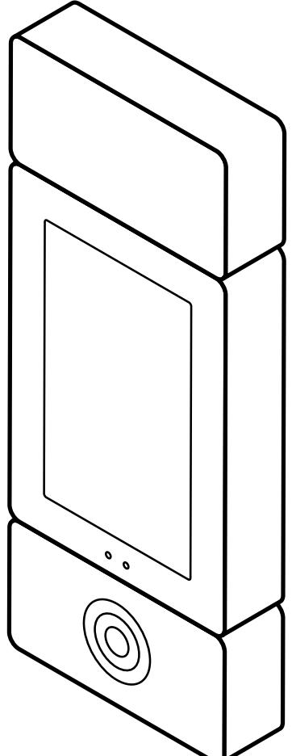
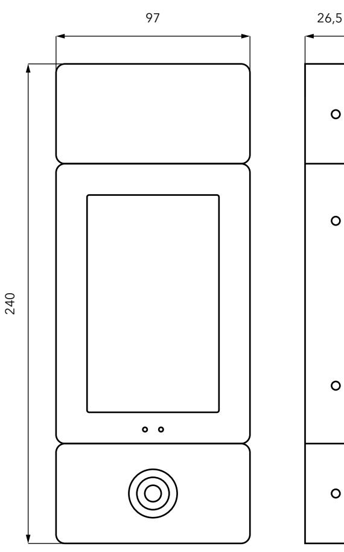
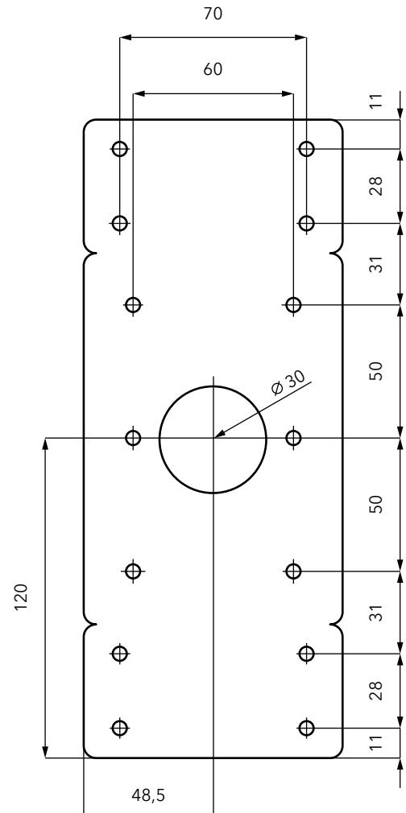
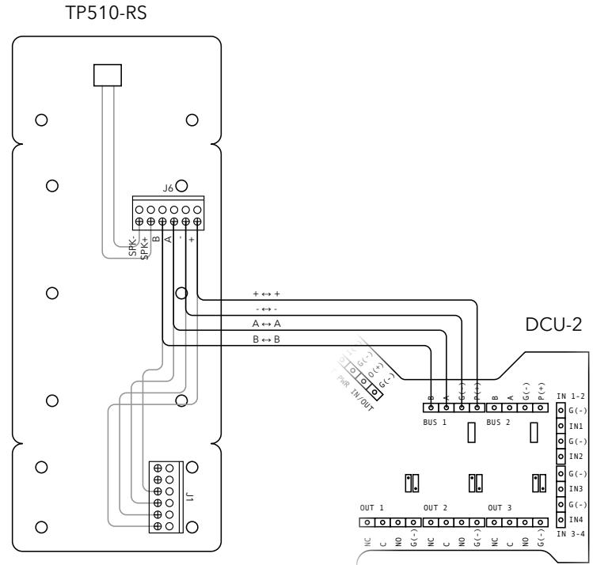

## **PORTTELEFON TP511**

**INSTALLATIONSMANUAL** SVENSKA 20181126

## **INNEHÅLL**

| 1. ALLMÄN INFORMATION 2 |  |
|-------------------------|--|
| 2. MONTERING 3          |  |
| 3. INSTALLATION 4       |  |
| 4. ÖVRIGT 5             |  |
| 5. AVFALLSHANTERING 5   |  |

### Välkommen till Dinbox!

Vi är glada att du valt en produkt från Dinbox. Du har fått en produkt med mycket innovation, erfarenhet och tankekraft bakom sig.

Besök gärna vår webbplats för mer information, bruksanvisningar och för att köpa reservdelar.

**www.dinbox.se**

## Kundtjänst och service

För serviceåtgärder hänvisar vi till vår supportavdelning som kan hjälpa till med felsökning.

Med reservation för ändringar eller feltryck.

## **1. ALLMÄN INFORMATION**

#### **1.1** Användningsområde

Porttelefon för samtal med telefon över IP-telefoni samt passage genom dörr med elektronisk nyckel och kod.

#### **1.2** Packlista

- TP511
#### **1.3** Installationskrav

- Centralenhet DCU-2 med firmware 4.1 eller senare, samt installationsmanual för DCU-2
- 4-polig partvinnad kabel för RS-485
- Nätverksanslutning 10/100 Mbit/s
- Internetuppkoppling 3/3 Mbit/s

#### **1.4** Allmän säkerhetsinformation

#### **VARNING!**

Var noga med att läsa igenom instruktionerna innan du påbörjar installationen. Dinbox kan inte hållas ansvarig för skador på person eller egendom som orsakats av felaktig installation eller användning.

#### **1.5** Säkerhetsföreskrifter

#### **VARNING!**

Endast behörig person får installera den här produkten.

- Se till att allt förpackningsmaterial är avlägsnat
- Kontrollera innan installation att produkt eller kablage inte är skadad
- Dra inte kablage i alltför skarp böj, då detta kan skada ledarna i kabeln
- Kläm inte åt kablage för hårt med buntband eller spikklamrar
- Ha inte mer än 50 m kabel mellan denna produkt och centralenhet
- Kablarna bör inte ligga alltför nära starkströmsledningar då de kan vara känsliga för elektromagnetisk störning
- Iaktta strömbelastning och dimensionera kablaget därefter för att undvika spänningsfall
- Spänningsätt ej centralenheten medan arbete i TP511 pågår

### **2. MONTERING**

#### **2.1** Måttskiss

#### **2.2** Innan du börjar

Det kablage som enheten behöver ska vara framdraget innan installation påbörjas.

Porttelefonen kan monteras både utanpåliggande och infälld. För rekommenderad monteringshöjd beakta lokala tillgänglighetskrav och montera på passande höjd. Hål för kabeluttag sitter i mitten av fästplattan.

#### **2.3** Montering

Använd skruvar som är anpassade för materialet där TP511 ska monteras. Gör ett litet hål i gummiskyddet och för igenom kablarna i hålet.

Täta skruv och kabelhålen med silikon om läsaren monteras utomhus. Skruva av skärmdelen på TP511 med hjälp av en säkerhetesskruvmejsel storlek TT10. För det framdragna kablaget genom fästplattan. Efter att kablage är anslutet, se **3.0 Installation**, montera tillbaka skärmen i fästplattan och skruva fast den med skruvarna igen.

### **3. INSTALLATION**

#### **3.1** Översikt

#### **3.2** Anslutningar

| Kontakt-ID | Pinnamn | Beskrivning                     |
|------------|---------|---------------------------------|
| J6         | +       | Positiv spänningsmatning (24 V) |
|            | -       | Jord                            |
|            | A       | Från RS-485-bussen (A till A)   |
|            | B       | Från RS-485-bussen (B till B)   |

#### **3.3** Strömförsörjning

#### **Varning**

Strömsätt produkten i slutet av installationen. Kontrollera alla anslutningar innan produkten strömsätts.

24 VDC ska användas. Kabelarea ska dimensioneras efter belastning.

#### **3.4** Anslutning

Anslut kablarna från DCU-2 till plint J6 på TP511. Se till att inte förstöra eller koppla loss någon av de andra, redan anslutna kablarna. För datatrafik

anslut A till A och B till B, för spänning anslut plus till plus och minus till minus enligt översikten ovan. Antingen bus 1 eller bus 2 kan användas.

Porttelefonens skärmmodul har fyra dipswitchar. Standardmässigt ska switch 1 och 4 vara satta till ON.

Porttelefonens läsarmodul ska vara kopplad till plint J6 med +, -, A och B. Dipswitcharna 1,3 och 4 ska vara satta till ON.

# **4. ÖVRIGT**

#### **4.1** Teknisk data

| Specifikationer  | Värde                                                 |
|------------------|-------------------------------------------------------|
| Strömförsörjning | 24 (375 mA) VDC. Matning från centralenheten          |
| Läsarteknik      | EM (125 kHz), MIFARE (13,56 Mhz)                      |
| Miljökrav        | -20 till +60 °C, 10-95% luftfuktighet                 |
| Högtalare        | 8 Ω, 1 W                                              |
| Skärm            | 5 tum, PCAP touchteknologi                            |
| Täckglas         | 3 mm härdat glas. IK-klassning IK08, 7A på Mohs skala |
| Mått             | 97 x 240 x 26,5 mm                                    |
| Vikt             | 0,9 kg                                                |

## **5. AVFALLSHANTERING**

#### **5.1** Miljöskydd

Återvinn de material som är märkta med genom att placera dem i lämpligt kärl. Elektriska och elektroniska produkter märkta med ska inte slängas med hushållsavfall. Lämna eller skicka in produkten för återvinning hos Dinbox.

www.dinbox.se 010-33 000 10

Dinbox Sverige AB Drottninggatan 97 113 60 Stockholm

Tel: 010-33 000 10 E-post: info@dinbox.se Web: www.dinbox.se