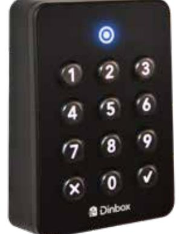

# Passerläsare G3

# Produktbeskrivning

För avläsning av nyckelbrickor och kodinmatning. Kan monteras antingen vid dörrar som en del av ett passagesystem, men också för fastighetsboxar för öppna fack med elektroniska lås. Dinbox passerläsare kan placeras både inom- och utomhus.

## Funktioner

- » Robust och tålig
- » Svag lutning för enklare användning
- » Läsarindikator
- » Markering på siffran fem
- » Bakgrundsupplysta knappar
- » Läser Mifare och EM
- » LED-indikator
- » Utanpåliggande montage
- » Inbyggd summer och sabotagekontakt
- » Inom- samt utomhusbruk

### Specifikationer

- » Kapsling i glasfiberarmerad plast
- » Ström och kommunikation med RS485
- » RFID Mifare (13.56 MHz) och EM (125 kHz)

### Artikel

| Artikelnummer | Bredd (mm) | Höjd (mm) | Djup (mm) | Vikt (kg) |
|---------------|------------|-----------|-----------|-----------|
| G3            | 66         | 97        | 28        | 0,15      |

Dinbox Drottninggatan 97 113 60 Stockholm 010-33 000 10 info@dinbox.se http://dinbox.se