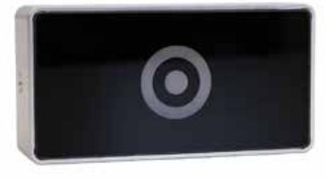

# Passerläsare R10

## Produktbeskrivning

Passerläsare för avläsning av nyckelbrickor och kan monteras antingen vid dörrar eller bredvid fastighetsbox med elektroniska lås. Kan placeras både inom- och utomhus.

## Funktioner

- » Robust och tålig
- » Läser Mifare och EM
- » LED-indikator
- » Utanpåliggande eller infällt montage
- » Vandalskydd
- » Inom- samt utomhusbruk

### Specifikationer

- » Ström och kommunikation med RS485
- » Ingång för öppnaknapp/dörrsensor
- » Utgång till elslutbleck
- » RFID Mifare (13.56 MHz) och EM (125 kHz)

### Artikel

| Artikelnummer | Bredd (mm) | Höjd (mm) | Djup (mm) | Vikt (kg) |
|---------------|------------|-----------|-----------|-----------|
| DC-R10        | 97         | 50        | 27        | 0,2       |

Dinbox Drottninggatan 97 113 60 Stockholm 010-33 000 10 info@dinbox.se http://dinbox.se