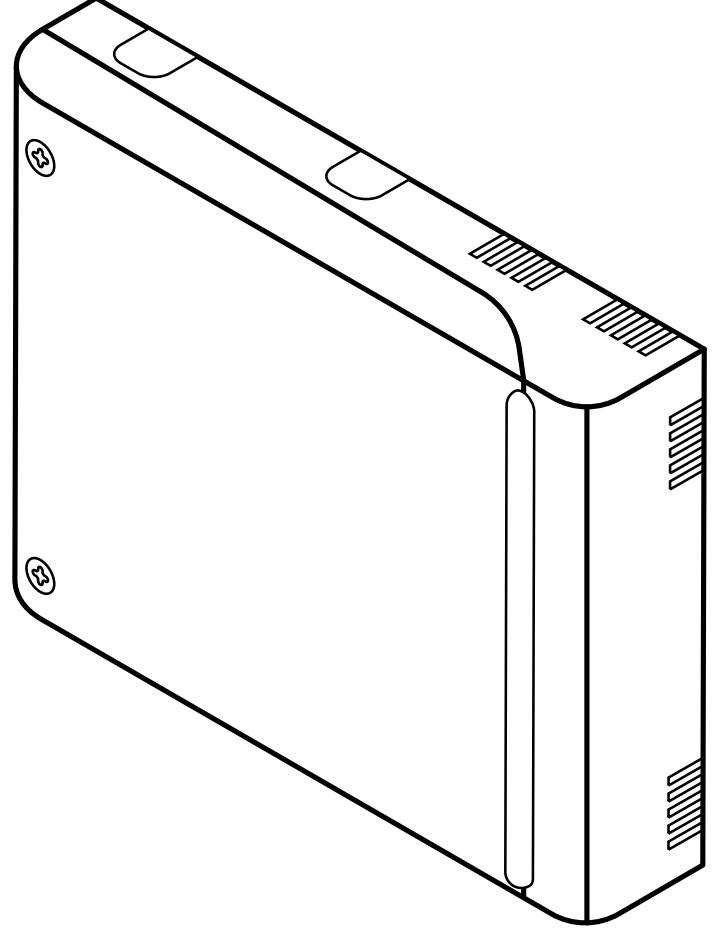
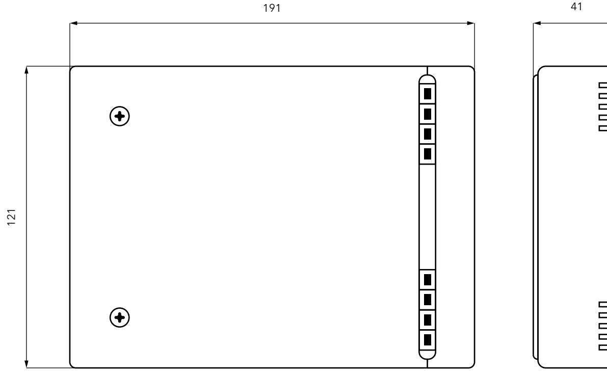
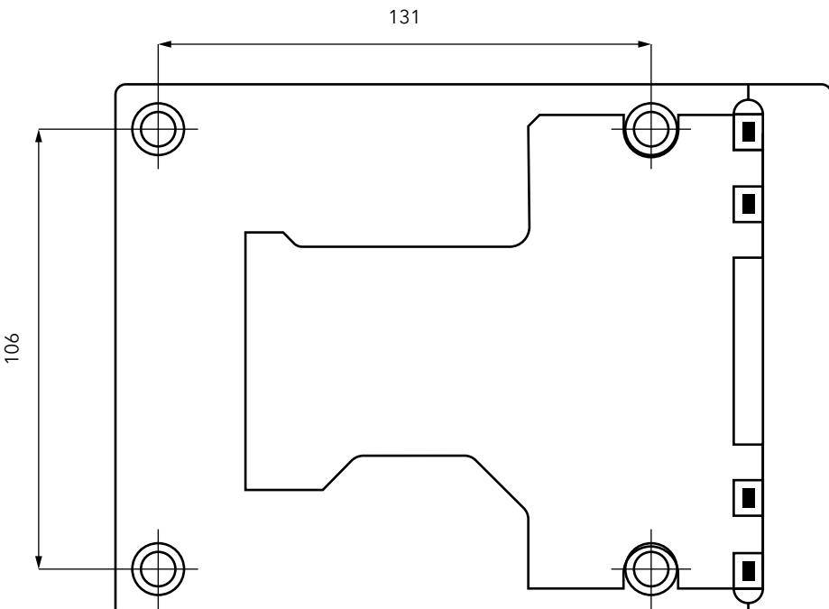
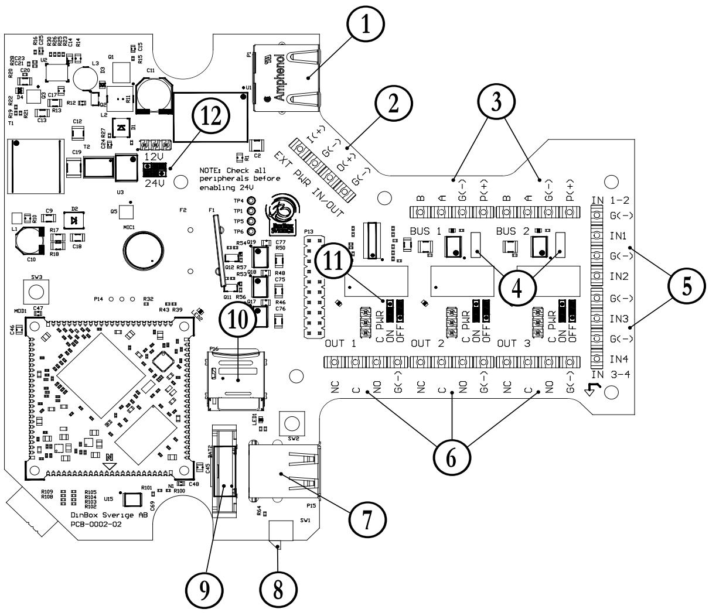
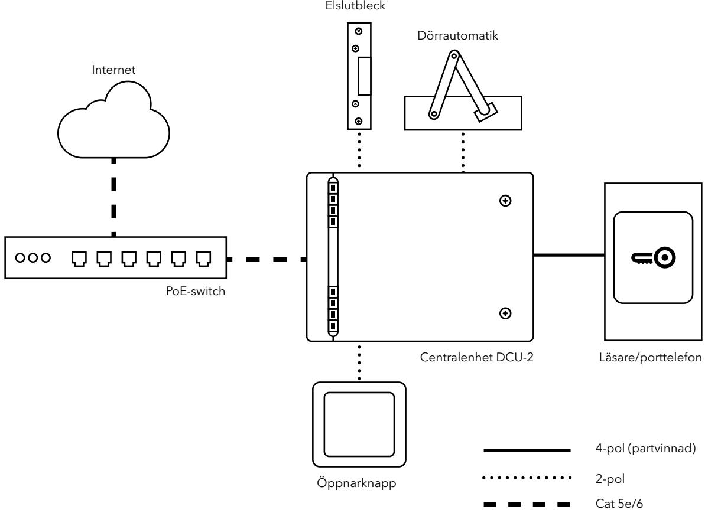
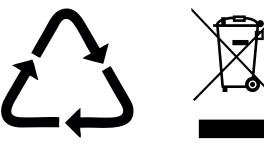

# **CENTRALENHET DCU-2**

0404, 0406

**INSTALLATIONSMANUAL** SVENSKA

20170926

# **INNEHÅLL**

| 1. ALLMÄN INFORMATION 2     |  |
|-----------------------------|--|
| 2. HÅRDVARUÖVERSIKT 3       |  |
| 3. SÄKERHETSFÖRESKRIFTER  5 |  |
| 4. SYSTEMÖVERSIKT  6        |  |
| 5. INSTALLATION 6           |  |
| 6. AVFALLSHANTERING 8       |  |

# Välkommen till Dinbox!

Vi är glada att du valt en produkt från Dinbox. Du har fått en produkt med mycket innovation, erfarenhet och tankekraft bakom sig.

Besök gärna vår webbplats för mer information, bruksanvisningar och för att köpa reservdelar.

#### **www.dinbox.se**

# Kundtjänst och service

För serviceåtgärder hänvisar Dinbox primärt till ansvarig återförsäljare eller installatör, som vid behov kontaktar Dinbox för fortsatt hjälp med felsökning.

# **1. ALLMÄN INFORMATION**

### **1.1** Användningsområde

DCU-2 är en centralenhet för styrning av läsare, porttelefon, öppnarknapp, dörrautomatik etc. i passersystem och till fastighetsboxar i fastigheten.

### **1.2** Packlista

- DCU-2
- Installationsmanual

# Symboler

Varningar/viktig säkerhetsinformation

Allmän information och tips

Med reservation för ändringar eller feltryck.

### **1.3** Installationskrav

- Nätverksanslutning 10/100 Mbit/s
- Internetuppkoppling 2/2 Mbit/s
- Strömförsörjning 12/24 V via Power over Ethernet eller extern VDC-matning
- Nätverkskabel Cat 5e/6

# **2. HÅRDVARUÖVERSIKT**

### **2.1** Måttskiss

### **2.2** Teknisk data

| Specifikationer  | Värde                                                                                                                                                    |  |
|------------------|----------------------------------------------------------------------------------------------------------------------------------------------------------|--|
| Strömförsörjning | Power over Ethernet (PoE+, 25 W) eller extern strömmatning 12 / 24 VDC Rippel max 1 % Max 3W strömförbrukning, 250 mA vid 12 V och 125 mA vid 24 V |  |
| Ingångar         | 4 st varav 2 klarar dubbelbalanserad slinga                                                                                                              |  |
| Utgångar         | 3 st reläutgångar, max belastning 1 A per utgång. Potentialfria eller spänningsmatade                                                                 |  |
| Kommunikation    | 2 st RS-485-bussar                                                                                                                                       |  |
| Miljökrav        | -30 till +70 °C, 10-95 % luftfuktighet                                                                                                                   |  |
| Mått (bxhxd)     | 191 x 141 x 41 mm                                                                                                                                        |  |
| Vikt 0,5 kg   |                                                                                                                                                          |  |

# **2.3** Anslutningar

5 (8)

| Nr | Funktion                     | Beskrivning                                                                            |
|----|------------------------------|----------------------------------------------------------------------------------------|
| B  | Nätverk och strömförsörjning | RJ45-port för nätverksanslutning och spänningsmatning över Power over Ethernet      |
| C  | Extern strömförsörjning      | Avtagbar skruvplint med alternativ extern DC-matning samt utgående spänningsmatning |
| D  | Databuss 1-2                 | Avtagbar skruvplint: RS-485-kommunikation                                              |
| E  | Termineringsbrytare          | Brytare för terminering på varja databuss                                              |
| F  | Ingång 1-4                   | Avtagbar skruvplint: 1-2 med fullfunktion och 3-4 med enbart digital funktion       |
| G  | Utgång 1-3                   | Avtagbar skruvplint för reläer                                                         |
| H  | USB                          | USB-port                                                                               |
| I  | Intrångsbrytare              | Sensor som kan larma och logga om locket öppnas                                        |
| J  | Batteri                      | 3 V Lithiumbatteri CR2032, för klocka vid strömavbrott                                 |
| K  | SD-korthållare               | MicroSD-kort med mjukvara                                                              |
| L  | Jumper - relä 1-3            | Avgör om spänning läggs på C (Common) för respektive relä                              |
| M  | Jumper - Spänningsnivå kort  | Ställer om spänningsnivån som skapas från PoE-matningen mellan 12 eller 24 VDC      |

# **3. SÄKERHETSFÖRESKRIFTER**

- **3.1** Allmän säkerhetsinformation
#### **VARNING!**

Var noga med att läsa igenom instruktionerna innan du påbörjar installationen. Dinbox kan inte hållas ansvarig för skador på person eller egendom som orsakats av felaktig installation eller användning.

### **3.2** Installation

#### **VARNING!**

Endast behörig person får installera den här produkten.

- Se till att allt förpackningsmaterial är avlägsnat
- Kontrollera innan installation att produkt eller kablage inte är skadad
- Följ de medföljande installationsanvisningarna
- Dra inte kablage i alltför skarp böj, då detta kan skada ledarna i kabeln
- Kläm inte åt kablage för hårt med buntband eller spikklamrar
- Ha inte mer än 100 m kabel mellan denna och en annan produkt
- Kablarna bör inte ligga alltför nära starkströmsledningar då de är känsliga för elektromagnetisk störning
- Iaktta strömbelastning och dimensionera kablaget därefter för att undvika spänningsfall

# **4. SYSTEMÖVERSIKT**

# **5. INSTALLATION**

#### **VARNING!**

Se säkerhetsavsnitten på sidan 5 innan du påbörjar installation.

Uppstart av produkten tar cirka 60-90 sekunder.

### **5.1** Innan du börjar

Det kablage som enheten behöver ska vara framdraget innan installation påbörjas.

# **5.2** Montering

Montera med fyra skruv i rack eller på vägg i exempelvis i el- eller telerum, elnisch, eller i direkt anslutning till dörrmiljön.

# **5.3** Databussar

För anslutning av enheter som stödjer RS-485 kommunikation.

#### **Exempel på anslutna enheter**

- Läsare
- Porttelefon
- Svarsapparat
- Fastighetsbox

#### **Anslutningar**

- B
- A
- G(-) jord
- P(+) positiv spänningsmatning

#### **Strömmatning (anslutningar P & G)**

- Kabelarea ska dimensioneras efter belastning
- 12/24 VDC beroende på hur jumper M är konfigurerad (se 5.8 för mer information).

#### **Kommunikation (anslutning B & A)**

- Krav på partvinning
- Max busslängd är 100 m per RS-485-buss
- DCU-2 har valbar 120 Ω terminering som från fabrik är aktiverad. Vid koppling i Y-nät måste den avaktiveras. Termineringen styrs med brytaren nära varje busskontakt.

# **5.4** Ingångar

Säkerställ att den externa enhetens typ matchar ingångens möjligheter, dvs fullfunktions eller enbart digital.

Potentialfri slutning in på respektive ingång. Varje ingång har en egen anslutning för G(-). Pull-upmotstånd 5,6 kΩ till 5 V.

#### **Exempel på anslutna enheter**

- Öppnarknapp
- Dörrautomatik
- Mikrobrytare
- Magnetkontakt
- Motorlås
- S0-pulsräkning för mätvärdesinsamling

#### **Ingång 1-2**

- Fullfunktionsingångar
- Dubbelbalanserad slinga
- Ingång 1 aktiveras via kortslutning mellan G(-) och IN1
- Ingång 2 aktiveras via kortslutning mellan G(-) och IN2

#### **Ingång 3-4**

- Enbart digital funktion (av/på).
- Ingång 3 aktiveras via kortslutning mellan G(-) och IN3.
- Ingång 4 aktiveras via kortslutning mellan G(-) och IN4 .

# **5.5** Utgångar

# **Varning**

Kontrollera att jumprarna för spänningsmatning är satt i rätt läge innan externa enheter strömsätts.

#### **Exempel på anslutna enheter**

- Elslutbleck/Eltryckeslås
- Motorlås
- Dörrautomatik
- Externt relä

#### **Reläpoler**

- G (jord)
- NO (normally open): Kortsluten mot C i aktiverat läge
- C (common):

Ansluts till NC eller NO. Standard från fabrik är potentialfri slutning men kan spänningssättas med jumper (se 5.7) i 12/24 VDC beroende på kortets inställning (se 5.8)

- NC (normally closed): Kortsluten mot C vilande läge
#### **Möjliga kopplingar**

- För potentialfri slutning/brytning används NC/NO som sluter mot C. Jumper L ska då vara i läget OFF
- För att spänningssätta reläet används NC/NO för positiv spänningsmatning (plus) och G för negativ spänningsmatning (minus), jumper L ska då vara i läget ON

#### **Strömbegränsning**

Maximal belastning per utgång är 1 A

### **5.6** Nätverksanslutning

Ansluts till RJ45-port. Kabel ska vara Cat 5e/6 med nätverksanslutning på minst 10/100 Mbps Ethernet.

# **5.7** Strömförsörjning

Strömsätt produkten i slutet av installationen. Kontrollera alla anslutningar innan produkten strömsätts.

Beroende på storlek av systemet ska antingen Power over Ethernet eller extern DCmatning via separat plint användas. Anslut EJ spänningsmatning i båda anslutningarna samtidigt.

#### **Power over Ethernet**

Används vid mindre installationer där utgående effekt inte överskrider 14,4 W (24 V) eller 15,6 W (12 V). Anslut Ethernet-kabel med ström och internet, exempelvis från PoE-switch. Vid PoEmatning kan utspänning 12 eller 24 VDC väljas (se 5.8). PoE-standard ska vara IEEE802.3at (25 W, PoE+).

- 12 V ger max totalt strömuttag på 1,3 A
- 24 V ger max totalt strömuttag på 0,6 A

#### **Extern DC-matning**

Extern DC-matning används med fördel när utgående effekt överskrider 15 W. Maximalt 2,5 A kan utnyttjas. Använd anslutning C. DCU-2 spänningssätts då från extern adapter med 12 eller 24 VDC. Vald matningsspänning som avgör vad som sen levereras ut från centralen.

- I(+) positiv
- G(-) jord

#### **Utgående strömförsörjning**

Används om strömförsörjning krävs till extern utrustning.

- O(+) positiv
- G(-) jord

# **6. AVFALLSHANTERING**

### **6.1** Miljöskydd

Återvinn de material som är märkta med genom att placera de i lämpligt kärl. Elektriska och elektroniska produkter märkta med ska inte slängas med hushållsavfall. Lämna eller skicka in produkten för återvinning hos Dinbox.

# **5.8** Ändra spänningsnivå på PoE

Jumper M på kretskortet ställer om spänningsnivån som skapas från PoE-matningen mellan 12 eller 24 VDC. Angiven spänning finns sedan tillgänglig för reläer och bussar. Vid leverans är 12 VDC valt. Kontrollera så att alla anslutna enheter klarar 24 VDC innan det aktiveras.

www.dinbox.se 010-33 000 10

Dinbox Sverige AB Drottninggatan 97 113 60 Stockholm

Tel: 010-33 000 10 E-post: info@dinbox.se Web: www.dinbox.se