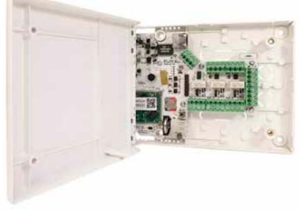

# Centralenhet DCU-2

## Produktbeskrivning

Universell centralenhet som passar till alla Dinbox elektroniska produkter. Centralenheten kan styra dörrar eller fastighetsboxar och har utgångar för tryckknappar, elslutbleck och dörrautomatik. Kan även monteras internt i fastighetsbox. Centralenheten strömförsörjs via PoE och behöver således endast nätverkskabel.

### Funktioner

- » Utgångar till elslutbleck, dörrautomatik, tvättmaskin etc
- » Ingång från dörrsensor, öppna-knapp etc
- » PoE-anslutning
- » OffIineläge med minne
- » Inom- och utomhusplacering
- » Till dörr eller fack i fastighetsbox
- » Nätverksanslutning
- » Robust konsktruktion

#### Specifikationer

- » Skyddskapsel i plast
- » Nätverks- och PoE+-anslutning
- » Ethernet 10/100 Mbps
- » Valbar 12/24 VDC
- » 2 st RS485-bussar
- » 3 st reläutgångar
- » 4 st ingångar
- » Driftstemperatur: -20 till +70 (ºC)

#### Artikel

| Artikelnummer | Bredd (mm) | Höjd (mm) | Djup (mm) | Vikt (kg) |
|---------------|------------|-----------|-----------|-----------|
| DC-DCU-2      | 191        | 141       | 41        | 0,5       |

DinBox Sverige AB Drottninggatan 97 113 60 Stockholm 010-33 000 10 info@dinbox.se http://dinbox.se