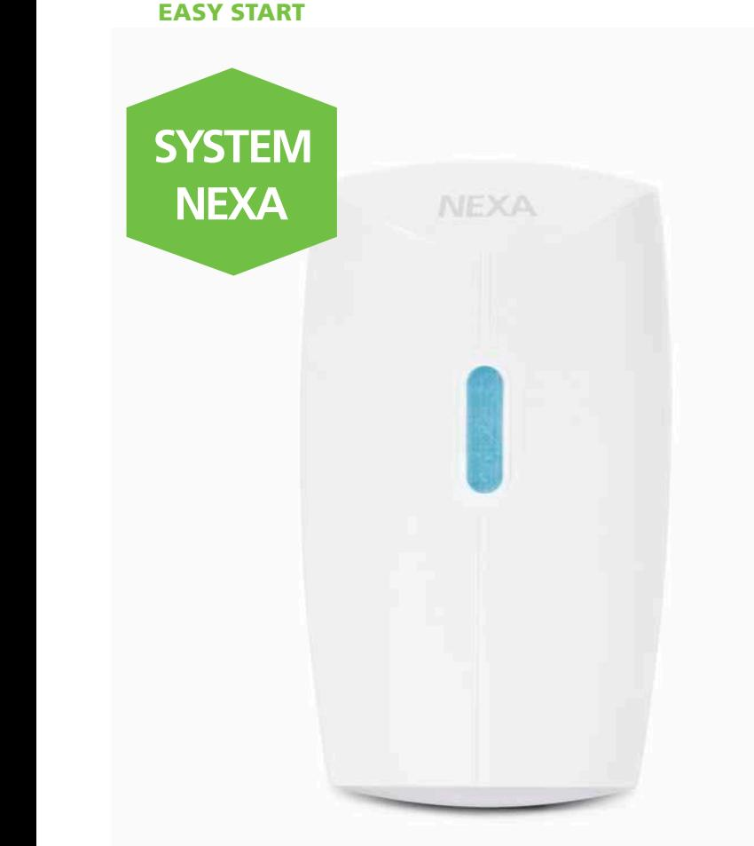
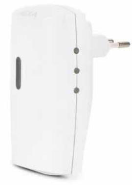

## **SMARTA HEM**

## DÖRRKLOCKA, PLUG-IN **MLR-1923**

Kategori EASY START, så enkelt att alla kan använda det.

Plug-in dörrklocka med blå LED-indikator. Förutom att fungera som en vanlig dörrklocka med tillhörande tryckknapp kan den också ta emot signaler från rörelsevakt och magnetkontakt eller fjärrkontroll om så önskas. Det finns 6 valbara signaler så olika sändare kan ge olika ringsignaler. Ljudnivån kan ställas i 4 olika nivåer; Hög – Mellan – Låg – Mute.

- Plug-in
- 32 minnesplatser
- Enkel installation
- 6 valbara ringsignaler
- 4 ljudnivåer
- Upp till 150 meter räckvidd

## **TEKNISK DATA**

**1**

**23**

| Strömkälla dörrklocka | 220–240 V~50Hz           |
|-----------------------|--------------------------|
| Protokoll             | System Nexa (433,92 MHz) |
| Räckvidd              | Upp till 150 m           |
| Strömförbrukning      | <1 W                     |
| IP klassificering     | Inomhusbruk              |
| Mått (B x H x D)      | 59 x 100 x 37 mm         |
| EAN                   | 7330545183528            |
| Art nr   E-nummer     | 18352   E 53 320 82      |
|                       |                          |

