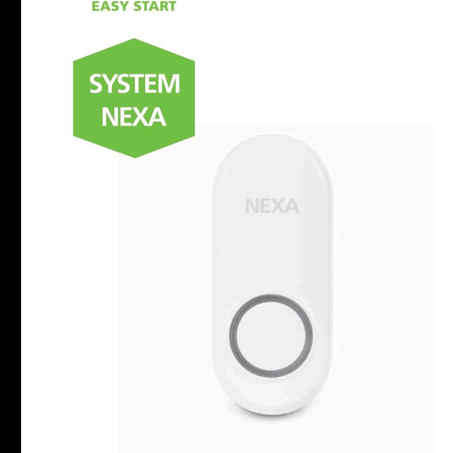

## **SMARTA HEM**

## TRYCKKNAPP TILL DÖRRKLOCKA **MLT-1924**

Kategori EASY START, så enkelt att alla kan använda det.

**1**

**23**

> Extra tryckknapp till System Nexas dörrklockor. Upp till 32 knappar kan kopplas till samma dörrklocka. Knapparna kan aktivera olika ringsignaler, välj mellan 6 olika. Godkänd för utomhusbruk (IP44).

- Enkel installation
- LED-indikering
- Upp till 150 meter räckvidd

| Strömkälla        | Batteri, 1 x CR2032 (ingår) |
|-------------------|-----------------------------|
| Protokoll         | System Nexa (433,92 MHz)    |
| Räckvidd          | Upp till 150 m              |
| Drifttemperatur   | -10 till +40 °C             |
| IP klassificering | Utomhusbruk, IP44           |
| Mått (B x H x D)  | 80 x 32 x 20 mm             |
| EAN               | 7330545183535               |
| Art nr   E-nummer | 18353   E53 320 81          |
|                   |                             |

