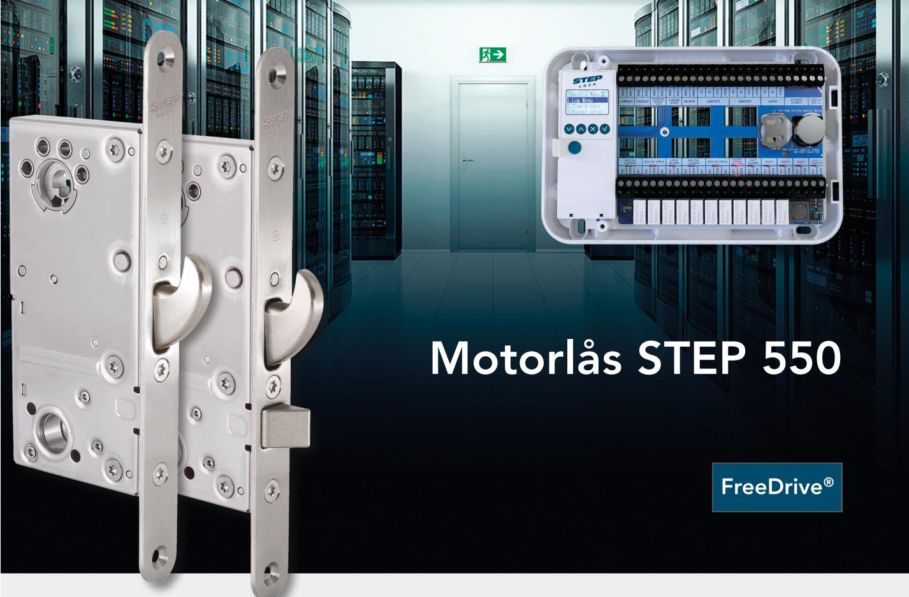
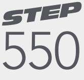
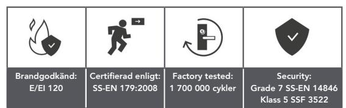
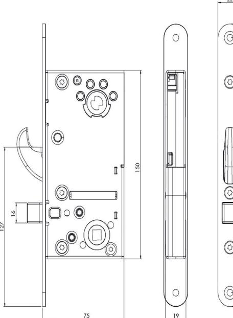
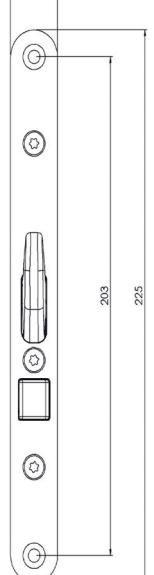
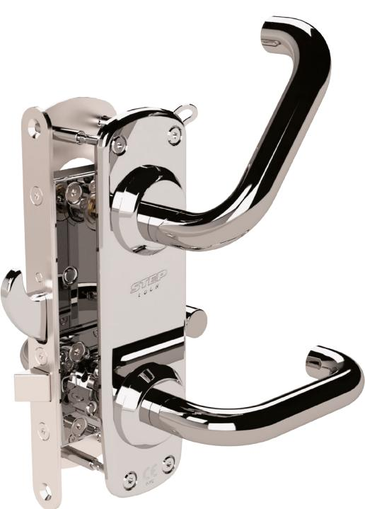

## www.steplock.se

## STEP 550 är ett kraftfullt och snabbt motorlås för dörrmiljöer med höga krav på säkerhet

Den tekniskt designade hakregeln är extremt stark, snabb och tål stora påfrestningar. Låshuset är tillverkat i rostfritt stål och har en modern kolvplacering med hakregeln placerad i centrum av låskistan. Låset kan placeras i dörrmiljöer med de absolut tuffaste inbrottsskyddskraven. Certifierat i klass 5 enligt SSF 3522, samt i Grade 7 enligt SS-EN 14846.

## Manipulationsskyddad spärrteknik

En spärrfunktion spärrar hakregeln automatiskt vid utlåsning. Samtidigt känner en indikering av spärrens läge så att du kan lita på att det verkligen är låst. Spärren är helt skyddad från åtkomst och säkerställer därmed skydd mot manipulation.

## Styrenhet med smarta funktioner

Styrenheten använder krypterad kommunikation AES-128 för låsning, upplåsning och statusindikeringar. Den kan hantera upp till två motorlås som kan styras individuellt eller synkroniserat för koppling till passersystem, larm och väsentlig funktion. Styrenheten hanterar återinrymning samt daglås.

## För dörrmiljöer med brandkrav

STEP 550 är utrustad med tryckesfall och är lämplig för dörrmiljöer med brandkrav. CE-märkt enligt SS-EN 14846:2008 i brandteknisk klass E/EI120.

## Med unik FreeDrive®-teknik

FreeDrive®-tekniken frikopplar motorn i både låst och olåst läge, vilket gör att låset kan användas elektrisk och mekaniskt oberoende av varandra. Låset kan därför med fördel användas tillsammans med utrymningsbeslag.

När det måste fungera.

# Teknisk information

| Art.nr    | Benämning                                                                                                                                                        |
|-----------|------------------------------------------------------------------------------------------------------------------------------------------------------------------|
| ST550     | STEP 550 Motorlås. Med modern kolvplacering och fallkolv. 50 mm dorndjup.                                                                                     |
| ST550 KPL | STEP 550 Motorlås komplett set. Inkl. ST550, STEP Styrenhet, STEP karmöverföring, 10 m halogenfri kabel, ett mekanisk slutbleck samt skruv- och magnetset. |
| ST550 LB  | STEP 550 Motorlås set med motorlås och styrenhet. Inkl. ST550, STEP Styrenhet, 20 cm kabel, samt skruvset.                                                    |
| ST551     | STEP 551 Motorlås. Med modern kolvplacering. 50 mm dorndjup.                                                                                                     |
| ST551 KPL | STEP 551 Motorlås komplett set. Inkl. ST551, STEP Styrenhet, STEP karmöverföring, 10 m halogenfri kabel, ett mekanisk slutbleck samt skruv- och magnetset. |
| ST551 LB  | STEP 551 Motorlås set med motorlås och styrenhet. Inkl. ST551, STEP Styrenhet, 20 cm kabel, samt skruvset.                                                    |

### Produktegenskaper

- Möter kraven enligt SSF 3522 klass 5.
- Möter kraven enligt SS-EN 14846 Grade 7 .
- Brandgodkänd för brandklassade dörrar i Grade F (120 min) enligt SS-EN 14846:2008.
- Frånreglar på mindre än 0,1 sekund.
- Modern kolvplacering.
- Styrenheten hanterar daglås.
- Låskista i rostfritt stål.
- FreeDrive®-teknik.
- Manipulationsskyddad spärrteknik.
- 50 mm dorndjup.
- Krypterad kommunikation AES-128.
- Strömförbrukning: 32 mA i vila, max 255 mA i ca 20 ms.
- Garanterar öppning trots listtryck på upp till 5 kg.
- Anslutning till motorlåset sker genom RS-485.
- Förberett för OSDP.
- Utrymning och återinrymning säkeställs tillsammans med STEP Exit nödutrymningsbehör för motorlås. Styrenheten hanterar återinrymning. Certifierade enligt SS-EN 179:2008.

### Miljö

- Styrenheten klarar temperaturer från -5 till +70 grader.
- Låset klarar temperaturer från -20 till +70 grader.

## Utrymning med oöverträffad användarvänlighet

#### STEP Exit nödutrymningsbehör

STEP 550 Motorlås i kombination med STEPs kompletta STEP Exit nödutrymmningssortiment ger dig möjlighet att skapa en tryggare utrymningsväg med oöverträffad användarvänlighet. Alla behör är certifierade enligt SS-EN 179:2008.

### FreeDrive®-tekniken ger produkterna oslagbar livslängd

STEP 550 är utrustade med FreeDrive®. Den unika tekniken frikopplar motorn och växellådan, vilket innebär att de aldrig påverkas när utrymningsbehörets trycke används. Därmed minimeras påverkan på motor och växellåda – trots att beslaget kanske används tusentals gånger varje dag.

Måttskiss för STEP 550.

STEP 550 med STEP Exit ST17920-R-2.