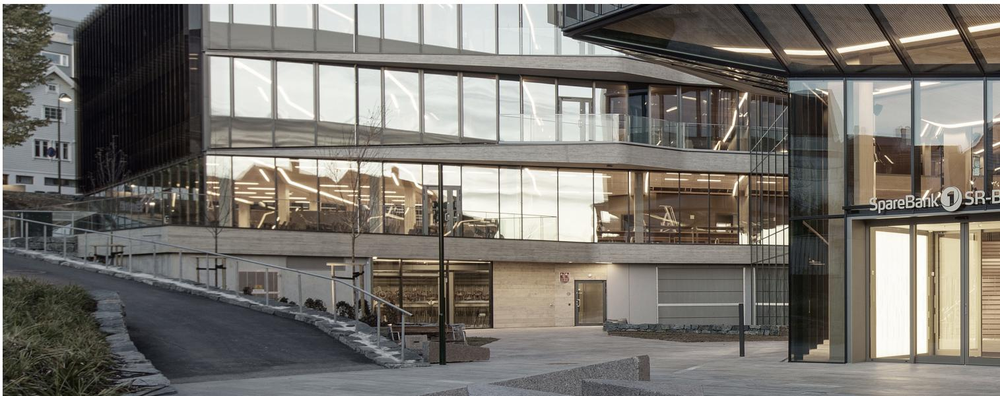
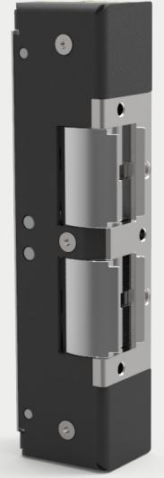
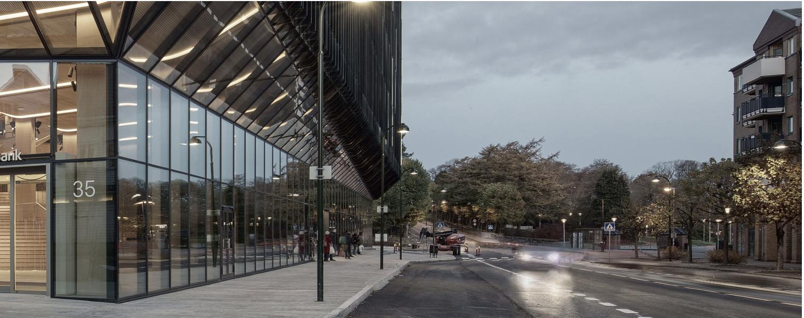
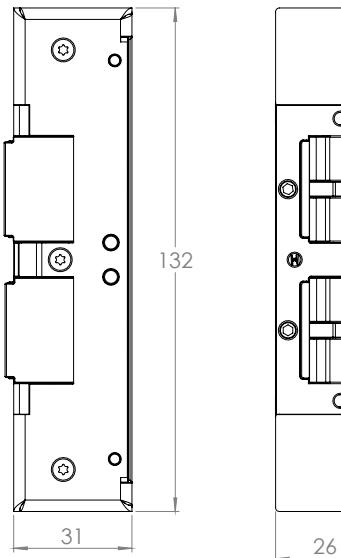
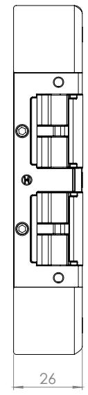

## ES22 **Dubbelt elslutbleck för att möta komplicerade dörrkrav**

SAFETRON ES 22 är ett elslutbleck av typen standard med två vridfall. De

dubbla vridfallen möjliggör separat låsning av tryckesfall och cylinderfall i

låshus med dubbelfall.

Denna konstruktion ger en lösning på komplicerade dörrmiljöer där krav på dörrautomatik, brandigenhållning, nöd- och återinrymning föreligger samtidigt. Genom att kombinera rättvänd och omvänd funktion i de dubbla vridfallen kan brandigenhållning tillgodoses via trycket samtidigt som återinrymning hanteras via brandlarm.

#### **Listtrycksteknik**

SAFETRON ES22 har en unik egenutvecklad listtrycksteknik vilket innebär att låset öppnar trots att tryck mot dörren föreligger. Listtryck är ett normalt förekommande fenomen ofta orsakat av exempelvis övertryck i fastigheten, skeva dörrar eller att snö/grus hamnat i dörrspringan. ES22 eliminerar dessa problem och förhindrar onödiga driftstopp.

#### **Dörr stängd och låst**

SAFETRON ES22 är utrustad med dubbla kolvkontakter men har också en inbyggda sensorer som indikerar att vridfallen är förreglade. Signal på plint ges först när kolvkontakt är påverkad samtidigt som vridfallet är mekaniskt förreglad.

#### **Brandgodkänt**

SAFETRON ES22 är certifierad och CE-märkt för användning i brandcellsdelande dörrar upp till 120min.

#### **Multispänning**

SAFETRON ES22 har multispänning vilket innebär att låset kan strömsättas med 10- 30VDC. Detta förenklar projektering och lagerhållning.

# SAFETRON

### **Funktionsexempel**

Dörrautomatik med nödutrymning och elektrisk återinrymning i brandcellsgräns

Dörrautomatik med nödutrymning och mekanisk återinrymning i brandcellsgräns

Dörrautomatik med daguppställning i brandcellsgräns

Nödutrymningsdörr tillsammans med utrymningslåshus enligt SS-EN 179 och 1125

Nödutrymning via brandlarm i brandcellsgräns

Dörrautomatik i brandcellsgräns med dubbelfallås där passersystem inte ännu anslutits. Montage i förberedande syfte.

#### **Egenskaper**

- Listtryck: 100kg
- Godkänt för brandcellsgränser: 120min
- Hållkraft upp till 1000kg, 10kN
- Låshus i rostfritt stål
- Multispänning 12-24VDC
- Kolvkontakt (med inbyggd ankarkontakt)
- Omvänd- eller rättvänd funktion
- Passar låshus enligt skandinavisk standard med dubbelfall

#### **Tekniska data**

- 12-24VDC (10,8-30,0VDC)
- Strömförbrukning: 35mA / vridfall
- Mikrobrytare: 30VDC: 500mA
- Inbyggd skyddsdiod

| BENÄMNING       | FUNKTION              | ART NR    |
|-----------------|-----------------------|-----------|
| SAFETRON ES22 H | För högerhängd dörr   | 202144848 |
| SAFETRON ES22 V | För vänsterhängd dörr | 202144849 |