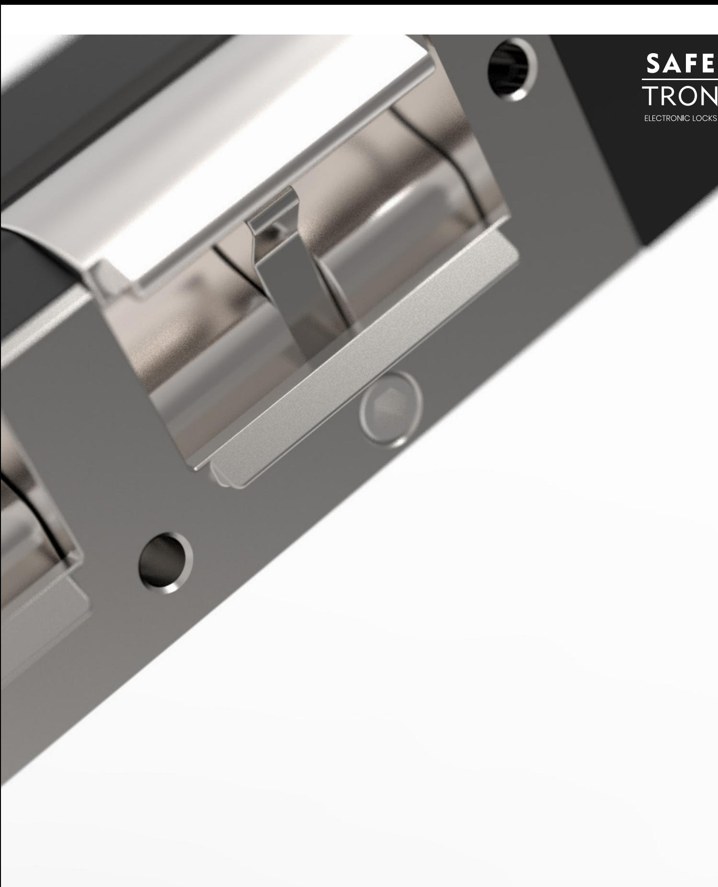
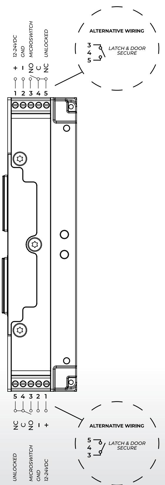
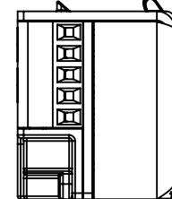
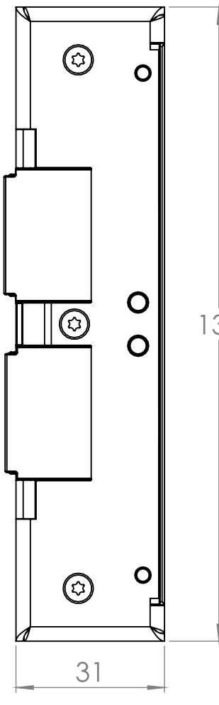
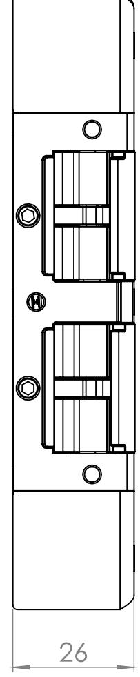
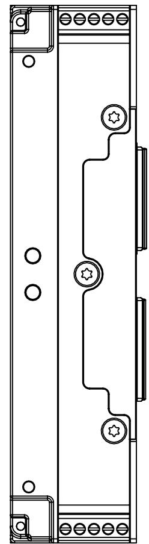
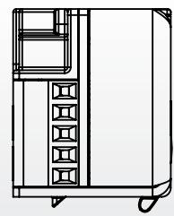
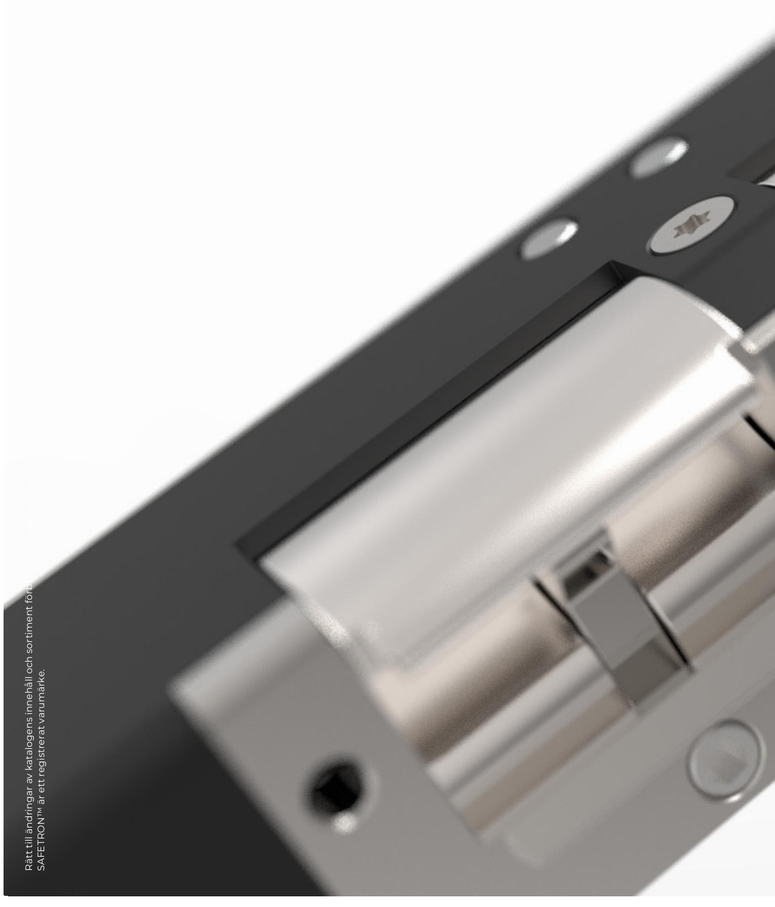

SAFETRON ES22

Installationsanvisning 20221107

# **VIKTIG INFORMATION**

Säkerhetsegenskaperna för produkt är avgörande för dess överenstämmelse med EN 14846:2008. Modifikationer eller andra ändringar på installation/produkter utöver de som beskrivs i denna dokumentation är inte tillåtna. SAFETRON tar inget ansvar för produkter som inte monterats i enlighet med gällande anvisningar eller då underhållsinstruktioner inte följs.

- SAFETRON elslutbleck ES22 är elektriska lås som används i dörrar med normalt ställda krav på säkerhet.
- Brandklassning med hänvisning till testrapport med nummer: **PGA11830A**. Testet utfördes med en enkeldörr i stål.
- Vid användning i brandcellsgränser måste elslutbleck ES22 användas i kombination med en certifierad dörr.
- Kontrollera dörrens eventuella brandcertifikat för att säkerställa att det inte finns villkor i certifikatet som utesluter eller begränsar användning av ES22.
- Innan man monterar ett elektriskt lås bör man kontrollera att dörren hänger korrekt och att dörrbladet löper fritt. Kontrollera att dörrens konstruktion medger montage av lås, exempelvis genom kontroll av dolda gångjärn, att dörrblad som greppar i varandra kan öppnas samtidigt, att dörrspringan mellan dörrblad är 3 mm +/- 1mm samt att rörliga delar inte påverkar varandra.
- SAFETRON lås får monteras i enkeldörrar eller pardörrar av trä, stål eller aluminium. Dörrvikt: över 200kg.
- Lås tillverkade enligt SS-EN 14846:2008 ger en hög grad av rimlig säkerhet förutsatt att de monteras på dörrar och karmar i gott skick.
- Beaktande skall vidtas för säkerställande av att eventuella tätningar eller tätningslister inte hämmar låsets funktion.
- Se till att rätt lås monteras för den avsedda dörrmiljön (se produktkatalog)
- Montagesättet skiljer sig inte mellan olika typer av dörrar, typ trä/metall.
- Fastställda anvisningar måste följas noga under installationen. De här instruktionerna måste överföras av installatören till användaren.
- Alla komponenter specificerade för installationen skall användas för att uppfylla europastandard SS-EN 14846:2008.
- Kontrollera låsets kolvar så att de i indraget läge inte förhindrar dörrens öppnings- och stängningsfunktion (se underhåll)
- Där lås monteras på dubbeldörrar (pardörrar) krävs att dörrstängare används som har dörr koordinator enligt EN 1158 (se standard) för att säkerställa rätt stängnings sekvens.
- Produkterna får inte användas i dörrar som kan öppnas åt båda hållen, typ svängdörr eller pendeldörr.

# **INSTALLATION**

#### **Läs igenom och följ installationsanvisningarna!**

- För en god funktion skall dörrspringan mellan låshusets stolpe och elslutbleck vara 3mm +/- 1mm.
- Undvik fil- och smärgelspån. Efter att urtaget gjorts i karmen skall det rengöras ordentligt.
- Se till att kabel inte kläms eller skadas vid montering.
- Kabel av typ data/tele/signal (enkelledare) med area mindre än 0,2 får inte användas till spänningsmatning av låset. Kabelarea ska vara dimensionerad utifrån de förutsättningar som gäller.
- Vid gemensam matning av flera lås/passagesystem/läsare/centraler och dylikt skall den sammanlagda strömförbrukningen tas i beaktande vid beräkning av kabelarea.
- Garanti bortfaller vid felaktigt montage, inkoppling eller vid användande av tillbehör som inte är rekommenderat av SAFETRON.
- SAFETRON ger ingen funktionsgaranti på installationer som inte följer rekommendationer.

# **UNDERHÅLL**

**Underhåll av lås ska utföras av utbildad fackman. Vid normal användning smörjes elslutbleckets mekaniska delar 1 gång per år. Använd ett smörjmedel som inte innehåller grafit eller lösningsmedel.**

- Vid behov eller 2 ggr/år smörj vridfallet och låskolvens glidytor med ett tunt lager låsfett.
- Kontrollera elslutbleckets funktion och fastsättning med jämna mellanrum eller 2 ggr/år.
- Låsets elektriska delar är underhållningsfria.
- Kontrollera och justera vid behov att dörren stängs korrekt. För att uppnå detta kan t.ex. dörrens gångjärn liksom dörrstängare behöva justeras. En dålig dörrfunktion påverkar låsfunktionen negativt.

SAFETRON elslutbleck ES22 är ett elslutbleck med dubbla vridfall som är avsett för dörrar med normalt ställda krav på säkerhet men med många samtidiga funktionskrav, t.ex. brandigenhållning, nödutrymning, återinrymning och passerkontroll.

För mer information om användningsområde och tillbehör se www.safetron.com.

## **Tekniska data**

### SAFETRON ES22

- Multispänning: 12-24VDC (-10% / +15%)
- Strömförbrukning: 40mA / vridfall
- Arbetstemperatur: -25°C till +70°C
- Givare Dörravk: Max 250mA 30VAC/VDC, 10W

SAFETRON ES22 är testade och certifierade i enlighet med EN 14846: 2008

## Produkterna uppfyller följande krav enligt SS-EN 14846: 2008

| Category of use | Durability and load on latch bolt | Door mass and closing force | Suitability for use on fire / smoke doors | Safety | Corrosion resistance and temperature | Security and drill resistance | Security electrical function | Security electrical manupilation |
|-----------------------|--------------------------------------------|--------------------------------------|-------------------------------------------------------|--------|-----------------------------------------------|----------------------------------------|------------------------------------|----------------------------------------|
| 3                     | C                                          | 9                                    | F                                                     | 0      | L                                             | 3                                      | 1                                  | 3                                      |

Uppfyller kraven för brandcellsgränser: 120 min

# **TILLBEHÖR**

#### **Beskrivning Art nr**

Anslutningskabel C06 (10m) 202144801 Montagestolpar i SC-serien

# **UTFÖRANDEN**

#### Höger

SAFETRON ES22 H är avsedd för högerhängda dörrar. Det övre vridfallet har omvänd funktion för att tillgodose återinrymning medan det undre vridfallet har rättvänd funktion för att bibehålla brandigenhållningen.

#### Vänster

SAFETRON ES22 V är avsedd för vänsterhängda dörrar. Det övre vridfallet har omvänd funktion för att tillgodose återinrymning medan det undre vridfallet har rättvänd funktion för att bibehålla brandigenhållningen.

# **INKOPPLING**

## OBS!

SAFETRON ES22 har ett omvänt (olåst strömlöst) och ett rättvänt (låst strömlöst) vridfall. Observera att det undre vridfallet har rättvänd funktion för att bibehålla brandintegriteten.

## **KOLVKONTAKT**

ES22 har traditionell mikrobrytare för kolvkontakt, denna signal erhålls i NO mellan plint 3 och 4.

#### **ANKARKONTAKT**

ES22 har utöver kolvkontakt och signal för olåst vridfall s.k. ankarkontakt. Denna signal erhålls som NC mellan plint 4 och 5.

## **SÄKER DÖRR**

En alternativ inkoppling är mellan plint 3 och 5 som ger kolvkontakt (dörr stängd) och stängt vridfall. Denna signal är lämplig för att säkerställa att dörren är korrekt stängd utan risk att t.ex. listtryck orsakat bruten dörr.

#### **INKOPPLING**

- 1. 12-24 VDC (-10% +15%)
- 2. GND
- 3. KOLVKONTAKT (NO)
- 4. COMMON
- 5. OLÅST VRIDFALL (NC)

# **MONTERING**

- Montera originalstolpen på elslutblecket med de två medföljande skruvarna M4x6
- Dörrspringan mellan låshusets stolpe och elslutbleckets stolpe skall vara 2-5mm för att få god funktion.
- Mellan vridfall och låshusets fallkolv skall det vara ett glapp på 0,5-1,5mm.
- Se till att urtaget för elslutblecket är ordentligt rengjort. Borr och filspån kan störa elslutbleckets funktion.
- Se till att inga kablar kläms när elslutblecket monteras in i karmen.
- Använd skruv för fastsättning av stolpen som är avsedd för karmens material.
- Elslutblecket får ej övermålas.

# **KABELDIMENSIONERING**

Kabel av typ data/tele/signal (enkelledare) med areor mellan 0,1-0,2 får inte användas som spänningsmatning av låset. Safetron ger ingen funktionsgaranti på installationer som inte följer rekommendationer. Se tabell nedan.

Rekommenderad minsta kabelarea mellan spänningskälla (trafo, ej passage system) och låshus (totallängd)

| Kabellängd | 0-10m   | 11-20m  | 21-40m  | 61-80m  | 81-100m |
|------------|---------|---------|---------|---------|---------|
| 12-24 VDC  | 0,17mm2 | 0,34mm2 | 0,68mm2 | 1,36mm2 | 1,7mm2  |

O.B.S

Det är viktigt att strömförsörjningen till elslutblecket har rätt dimensionerad kabel för att inte få spänningsfall som stör låsets funktion. Vid gemensam matning av flera lås/passagesystem/läsare/ centraler och dylikt skall den sammanlagda strömförbrukningen tas i beaktande vid beräkning av kabelarea.

## **UNDERHÅLL AV SAFETRON ELTRYCKESLÅS**

- Vid behov eller 2 ggr/år smörj vridfallet och låskolvens glidytor med ett tunt lager låsfett.
- Kontrollera elslutbleckets funktion och fastsättning med jämna mellanrum eller 2 ggr/år.
- Låsets elektriska delar är underhållningsfria.
- Kontrollera och justera vid behov att dörren stängs korrekt. För att uppnå detta kan t.ex. dörrens gångjärn liksom dörrstängare behöva justeras. En dålig dörrfunktion påverkar låsfunktionen negativt.

## **OBS!**

Smörjolja (t.ex. WD40 och liknande) får aldrig användas. Detta binder smuts och kan förhindra elslutbleckets funktion.

## **MAINTENANCE SAFETRON SOLENOID LOCK**

- Maintenance should be performed by a trained professional
- Ensure that mounted knobs, handles and cylinders are working satisfactory
- Approximately once a year, a small amount of designated grease can be applied on latches. Highly frequented doors may need maintenance whith shorter intervals
- Electric parts require NO maintenance
- Check and adjust the entire door environment

## **ATTN.**

Lubricant and penetrating oil such as WD40 must never be used on SAFETRON electric strikes. This can impede the overall function of the electric strike.

SAFETRON ES22

#### **SAFETRON AB**

Säterivägen 18 P.O. Box 2096 65002 Karlstad Sweden

Tel: +46 54 19 02 45 info@safetron.com www.safetron.com