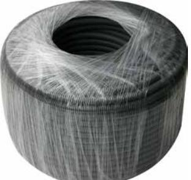
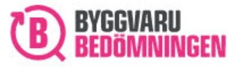

# INFLEX LF 16 100M GRÅ

E-nr 1414082 SAP 70000755

### PRODUKTBESKRIVNING

Styvhetsklass: 750N Godkända enligt EN 61 386-1 samt -22 Godkända för ingjutning

# TEKNISK SPECIFIKATION

| Böjkaraktäristik       | Flexibel      |
|------------------------|---------------|
| Tryckhållfasthetsklass | Medium (750N) |
| Slaghållfasthetsklass  | Medium (750N) |
| Minimum temperatur C°  | -25           |
| Maximum temperatur C°  | 90            |

# BYGGMÅTT

| Dimensioner |         |
|-------------|---------|
| D           | 16 mm   |
| d           | 10,9 mm |
| l           | 100 m   |
| Nettovikt   | 5,9 kg  |

### **PIPELIFE SVERIGE AB**

Box 50 · 524 02 Ljung · Sverige Telefon: +46 513 221 00 · Fax: +46 513 221 99 Email: info@pipelife.se · Fakturaadress: invoice@pipelife.se

## MILJÖBEDÖMNING

Produkten har klass B hos Sunda hus

Produkten har klass Accepteras Accepteras hos Byggvarubedömningen

#### **PIPELIFE SVERIGE AB**

Box 50 · 524 02 Ljung · Sverige Telefon: +46 513 221 00 · Fax: +46 513 221 99 Email: info@pipelife.se · Fakturaadress: invoice@pipelife.se