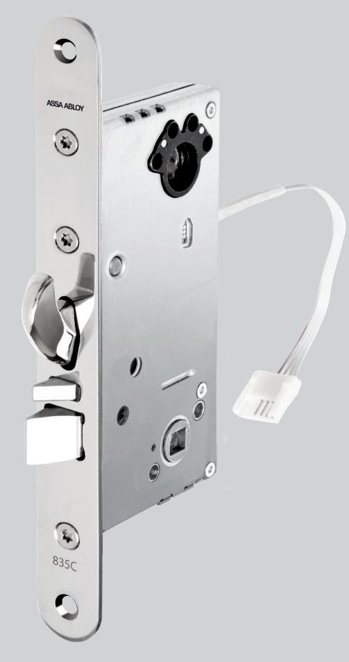
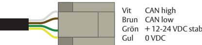
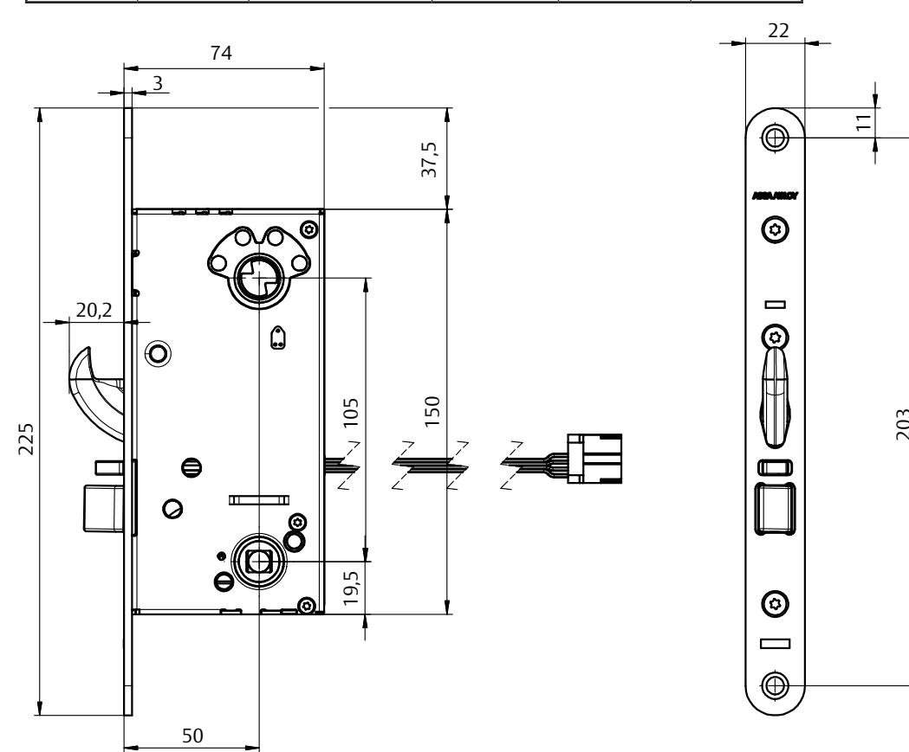

## ASSA ABLOY 835C-50

### Elektromekaniskt låshus med fallkolv och hakregel i låsklass 3 SSF 3522-1093

Hakregel ger ökad brythållfasthet. Fördelen med hakregel är att den kopplar ihop dörr och karm och ger ett extra starkt inbrottsskydd.

### **Användningsområde**

ASSA ABLOY Eltryckeslås är anpassade för högfrekventa dörrar med ASSA modul- eller Connecturtag. Passar bra som daglåsning och intern låsning inom handel, kontor och industri eller i entréer och allmänna utrymmen i flerfamiljshus där krav på godkänd låsning enligt SSF 3522 önskas. Certifierat enligt SS-EN 179 vilket möjliggör installation i utrymningsväg. ASSA ABLOY Eltryckeslås är godkänt för montage i brandcellsgräns E/EI 120.

#### **Funktion**

Trycket aktiveras med elektrisk styrning från utsidan och är mekaniskt styrt från insidan, alternativ kan trycket aktiveras elektriskt från både in- och utsida. Detta används sedan för att öppna dörren. ASSA ABLOY 835C-50 är en i familjen av multifunktionella Eltryckeslås med två huvudtyper och fem varianter:

- Trycket aktiveras elektriskt in-/utsida alternativt elektriskt styrd utsida och mekanisk inkopplad insida, ställbart.
	- Elektriskt styrd utsida, mekaniskt inkopplad insida (split spindle) - Elektriskt styrd ut- och insida (fixed spindle)
- Hakregel
	- Auto hook, hakregeln låser ut automatisk när dörren stängs
	- Auto retract, hakregeln dras in när trycket aktiveras
	- Auto hook kan stängas av och manövreras mekaniskt

ASSA 835C-50 är ett digitalt lås baserat på vår CAN-bus teknologi Hi-O. Hi-O innebär att enheterna har en inbyggd mikrodator och kommunicerar med varandra för plug-and-playinstallation, synkronisering av dörrdrift, övervakning av beteenden och för att skicka diagnostisk information.

En Hi-O-enhet ska anslutas till en Hi-O-buss via DAC 530/564, alternativt till ett analogt system via I/O BOX 350. I/O BOX 350 möjliggör en installation av ett digitalt Hi-O lås till en analog relästyrd anläggning.

#### **Egenskaper**

- Förreglad tryckesfall
- Låset kan alltid manövreras med nyckel/vred
- Brandgodkänt E/EI 120
- Certifierat enligt SSF 3522-1093, klass 3 och SS-EN 179, kombineras med ASSA ABLOY nödutrymningsbeslag 179J.
- Multifunktionellt
	- Enkelt omställbart rättvänd/omvänd funktion
	- Enkelt omställbart elektriskt/mekaniskt manövrerad sida - Autohook av/på
- Återinrymningsfunktion kan aktiveras via I/O BOX 350 med signal från utrymnings-/brandlarm
- Statusindikering tillgänglig på Hi-O-bussen och via relä på I/O BOX 350
	- Förregling Error
	- Regel ute Dörr forcerad
		-
	- Insidans trycke
- 
- 
- 
- Regel inne Dörrlägesindikering
	-

# ASSA ABLOY 835C-50

## Elektromekaniskt låshus med fallkolv och hakregel i låsklass 3 SSF 3522-1093

#### **Inkoppling**

Inkoppling till Hi-O bussen sker med fyra kablar, två för spänning, två för kommunikation. Använd färdigkontakterad kabel EA226 (10 m) vid installation. Kabeln kopplas in på valfritt ställe på Hi-O bussen.

#### **Strömförbrukning**

| Standby:           | 1W                              |
|--------------------|---------------------------------|
| Inkoppling trycke: | 2,64W under en cykel på 0,08sek |
| Autohook:          | 5,04W under en cykel på 0,25sek |

Watt / Spänning = Ström I = P / U Ström = Effekt / Spänning

| Lås     | Förregling | Hakregel | Split spindle | Fixed spindle | Auto Hook    |
|---------|------------|----------|---------------|---------------|--------------|
| 835C-50 | Ja         | Ja       | Ja, ställbar  | Ja, ställbar  | Ja, ställbar |

19,8

ASSA ABLOY Opening Solutions Sweden P.O. Box 371 SE-631 05 Eskilstuna Sweden Phone +46 (0)16 17 70 00 Fax +46 (0)16 17 70 49

Customer support: Phone intl. +46 (0)16 17 71 00 Phone nat. 0771-640 640 Fax +46 (0)16 17 73 72 e-mail: helpdesk.se.openingsolutions@assaabloy.com www.assaabloyopeningsolutions.se