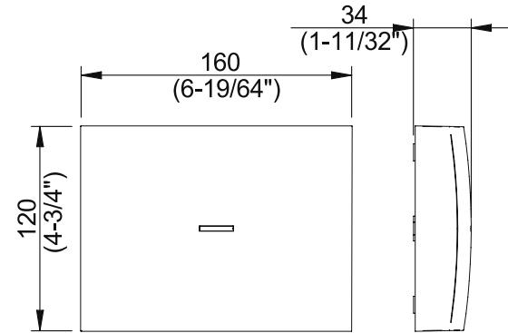

# GATEWAYx3C by SALTO

The advanced SALTO online wireless solution is the next step in battery operated access control. SALTO's Wireless solution brings real-time two-way encrypted communication between our wireless locks and the operator.

www.saltosystems.com

TECHNICAL SPECIFICATIONS: GATEWAYx3C - WIRELESS SALTO BLUEnet

#### TECHNICAL DATA:

| Housing dimensions (H x W x D): | 120 x 160 x 34 mm             |
|---------------------------------|-------------------------------|
| Weight:                         | 195 g                         |
| Cover material:                 | ABS V0 plastic                |
| IP class:                       | Not suitable for outdoor use  |
| Certifications:                 | CE, FCC/IC, RCM, SRRC, EAC |

### ELECTRONIC FEATURES:

| Power:            | PoE IEEE802.3af, 12V power adapter                  |
|-------------------|--------------------------------------------------------|
| Tamper switch:    | Built in tamper microswitch                            |
| DHCP / Static IP: | DHCP by default (recommended)                       |
| Firmware update:  | Via ProAccess SPACE though Ethernet connection      |
| LED lamps:        | Multi colour led to notify the status of the device |
|                   |                                                        |

## TECHNOLOGY PLATFORMS:

#### SALTO SPACE:

| Smile - Selfprogrammable | —                                           |
|--------------------------|---------------------------------------------|
| ROM:                     | —                                           |
| SVN data-on-card:        | •                                           |
| SALTO RFnet:             | • External SALTO RFnet Node connectivity |
| SALTO BLUEnet:           | •                                           |
| SALTO KS:                |                                             |
| SALTO KS:                | —                                           |

#### SALTO SALLIS:

SALLIS: —

#### FINISHES:

| Black: | • |
|--------|---|
| White: | • |

#### ELECTRICAL CHARACTERISTICS:

#### Operations conditions:

|              | Min | Typ | Max | Unit |
|--------------|-----|-----|-----|------|
| Temperature: | 0   | 25  | 60  | ºC   |
| Humidity:    | 35  | -   | 85  | %    |

#### Cable requirements:

| Ethernet              | UTP CAT5e                       |
|-----------------------|---------------------------------|
| Node Connection (AB)  | Generic twisted pair wire Note1 |
| Node Connection (Vdd) | 24 AWG                          |

BLUEnet Characteristics (if internal node installed):

| Frequency range:    | 2400-2483,5 Mhz      |
|---------------------|----------------------|
| RF standard:        | Bluetooth Low Energy |
| Indoor radio range: | 10/15m               |
| Max output power:   | 8dBm                 |

# PoE (IEEE 802.3af):

|                    |                       | Unit |
|--------------------|-----------------------|------|
| Class:             | 2                     |      |
| MaxPower:          | 5                     | W    |
| Ethernet Standard: | 10 BASE-T/100BASE- TX |      |

Auxiliary power supply:

|                      | Min         | Typ | Max          | Unit |
|----------------------|-------------|-----|--------------|------|
| InputVoltage Note2   | 10          | 12  | 15           | v    |
| Current consumption: | 75 Note3 | -   | 500 Note4 | mA   |

SALTO RFnet characteristics (if external node installed via BUS 485):

| Frequency range:    | 2400-2483 Mhz |
|---------------------|---------------|
| RF standard:        | IEEE 802.15.4 |
| Indoor radio range: | 10/15m        |
| Max output power:   | 5dBm          |

Note 1: 1x2x24AWG or UTP CAT5e recommended Note 2: Use provided AC-DC power supply Note 3: No external/internal node connected Note 4: 6 external node connected

