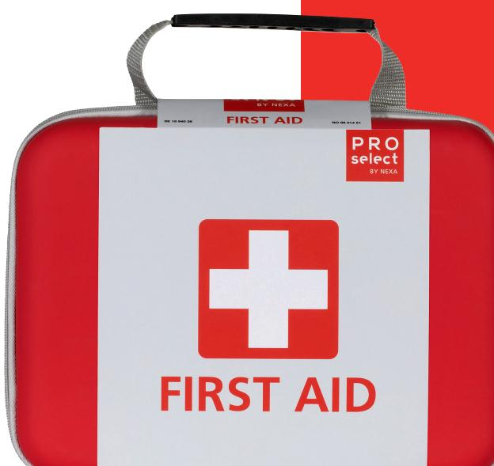
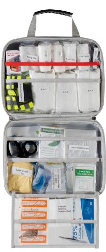

## Första hjälpen väska Large FAPS-L

En komplett och lättöverskådlig förstahjälpenväska med allt som behövs för att hantera allt från småsår till lite större skador samt brännskador.

I väskan finner du bland annat olika typer av förband, ögondusch och burn care samt en reflexväst och pannlampa om olyckan skulle inträffa på en extra utsatta plats.

Lätt att ta med och bra att ha i bilen eller ute på byggarbetsplats.

## Innehåll:

4-i-1 blodstoppare 4-i-1 blodstoppare, mini Burn Care Räddningsfilt Sterilt metallförband Latexhandskar Andningsmask Elastisk binda med clips Soft foam bandage Fixeringsnät Ögondusch Mitella Plåster Sårtvätt Hand Cleanser Säkerhetsnålar Pincett Sax Pannlampa Räddningshammare Reflexväst

Väskan är gjord i ett slitstarkt material som tål både fuktsmuts. Det gummerade handtaget gör den lätt att bära och smidig att hängas upp på en krok.

TEKNISK DATA

| Innehåller          | 65 delar       |
|---------------------|----------------|
| Mått (B x H x D) mm | 310 x 230 x 60 |
| Art nr              | 13710          |
| EL-nummer           | 88 014 50      |
| E-nummer            | 16 864 55      |
|                     |                |

