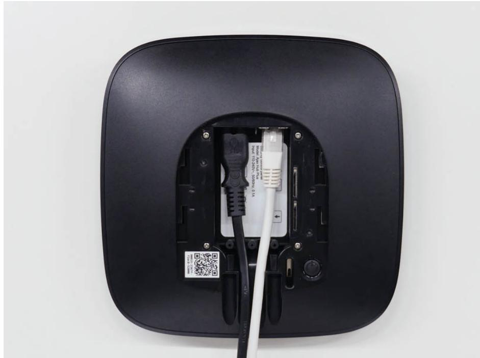
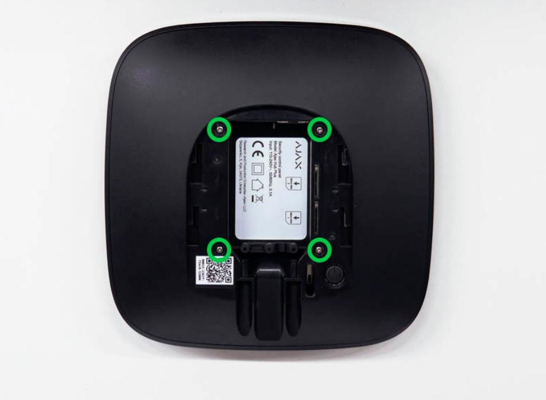
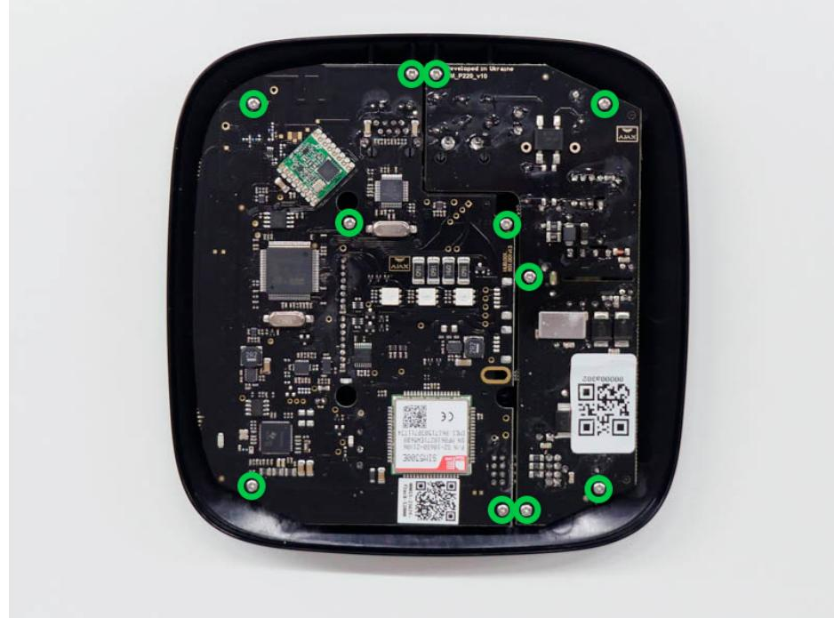
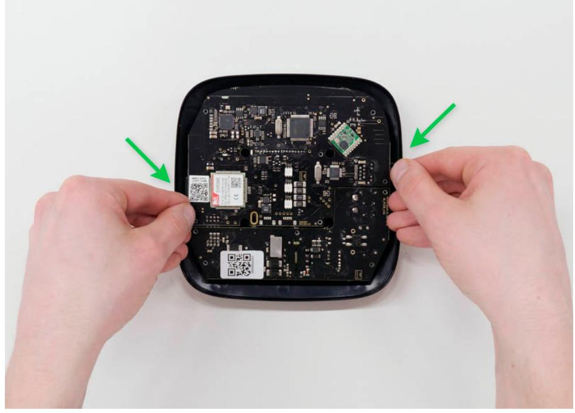
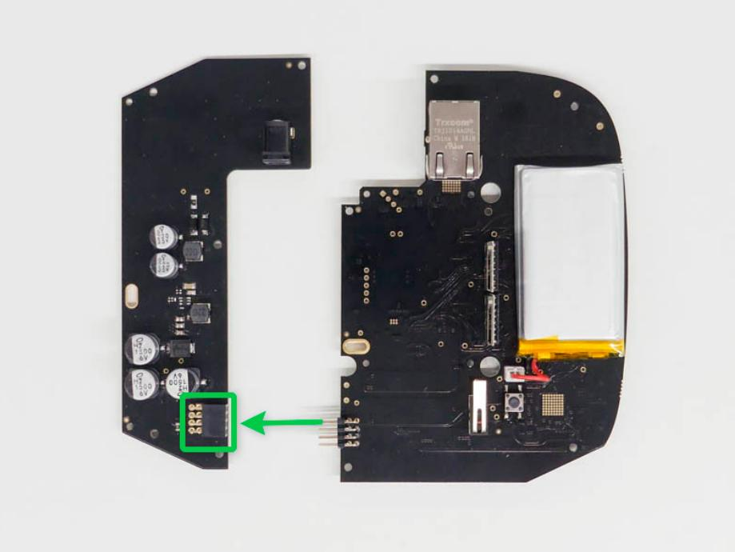

# 12V PSU for Hub/Hub Plus/ReX User Manual

Updated April 23, 2021

**12V PSU for Hub/Hub Plus/ReX** is a power supply unit, connecting the Hub/Hub Plus control panels as well as the ReX radio signal extender to 12 volt DC sources. This is an electronic board, replacing the standard 110/230 V power supply unit in the body of the device.

### Installing

12V PSU for Hub/Hub Plus/ReX should be installed by a qualified electrician only.

Before installing the power supply, make sure that the device is disconnected from the mains.

When installing the 12V PSU for Hub/Hub Plus/ReX, follow the general electrical safety rules, as well as the requirements of electrical safety regulatory acts. Never disassemble the device while it is under voltage!

#### Installation process:

- **1.** Remove the screws and take off the device from the SmartBracket mounting panel, shifting it down with force.

- **2.** Switch off the device holding the power button for 2 seconds.
- **3.** Disconnect power and Ethernet cables.

Wait 5 minutes for the capacitors to discharge.

- **4.** Remove four screws of the back lid and take it off.

- **5.** Remove the screws attaching the boards to the device body.

- **6.** Carefully remove both boards, keeping them in the same plane and not disconnecting them. There is a connector between boards: do not break it.

- **7.** Disconnect the power supply unit (smaller board) from the mainboard.
- **8.** Connect 12V PSU for Hub/Hub Plus/ReX to the mainboard using the eightpin connector between them. Do not warp or bend the antennas while replacing the board: this can cause the device to malfunction.

- **9.** Reassemble the boards and the device body than tighten the screws.
Check that the battery and its cables are not clamped. When installed properly, the boards stand firmly on all guides and do not stagger. Holding the boards together with the back lid, turn the device over. The SIM card slot, power, and Ethernet sockets should match accurately and fit the corresponding sockets, and the power button should not be stuck.Change the information about input voltage on the

device body to avoid incorrect power connections in the future. Use the special bundled sticker with the instruction.

- **10.** Connect the power (and Ethernet cable) to the appropriate sockets.
- **11.** Switch on the 12 V power source.

Do not connect the power cable with a voltage that exceeds the acceptable input voltage.

- **12.** Switch on the device by holding the power button for 2 seconds.
- **13.** Close and fix the SmartBracket mounting panel.

Switch on the device, wait until loading, and check the external power status in the Ajax app. If there is no power, and you are using a terminal adapter, check the polarity of the connected wires. If there is no power even after reconnecting, please contact the Support Service.

#### Maintenance

The device does not require technical maintenance.

# Tech specs

| Input voltage       | 8-20 V DC                                |
|---------------------|------------------------------------------|
| Output voltage      | 4.65 V DC ± 3%                           |
| Switch on voltage   | 8 V DC ± 2.5%                            |
| Switch off voltage  | 6.9-7.5 V (depending on load)            |
| Max input current   | < 1 A                                    |
| Max output current  | 1,5 A                                    |
| Connection to mains | Socket: 6.5 × 2 mm Plug: 5.5 × 2,1 mm |
| Dimensions          | 138 × 64 × 13 mm                         |

| Weight       | 30 g     |
|--------------|----------|
| Service life | 10 years |

#### Compliance with standards

# Complete Set

- **1.** Ajax 12V PSU for Hub/Hub Plus/ReX
- **2.** Terminal adapter
- **3.** Quick start guide

# Warranty

Warranty for the AJAX SYSTEMS MANUFACTURING Limited Liability Company products is valid for 2 years after the purchase.

If the device does not function correctly, please contact the Support Service first. In half of the cases, technical issues can be solved remotely!

#### Warranty Obligations

User Agreement

Technical support: support@ajax.systems