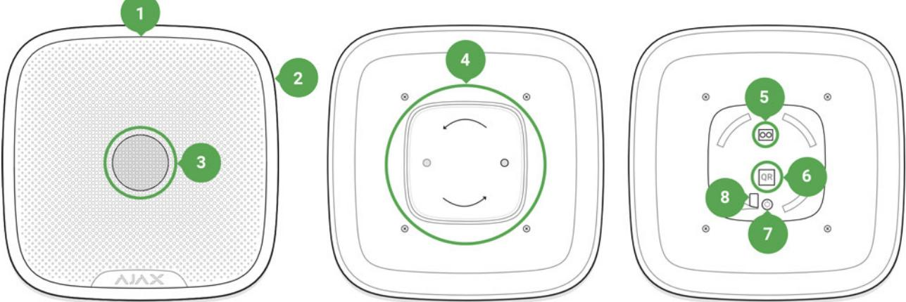
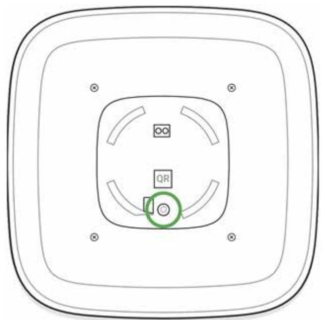
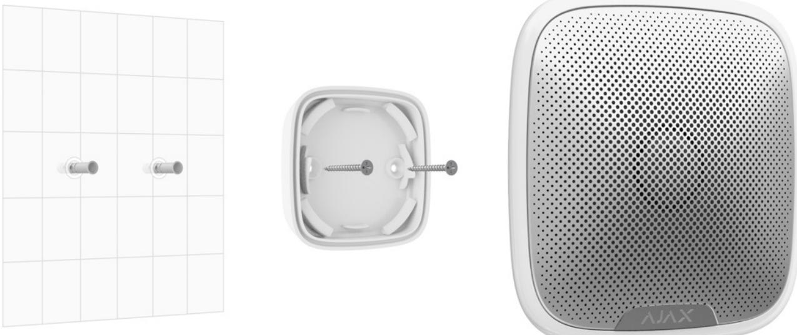
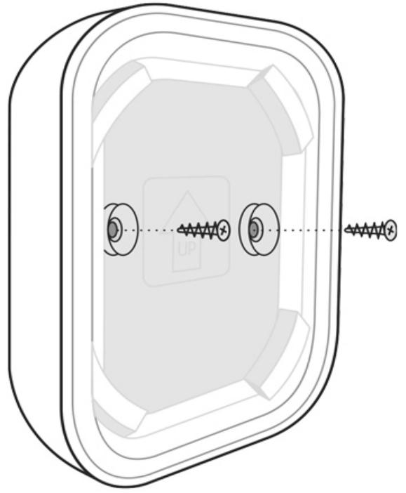

# StreetSiren User Manual

Updated December 7, 2021

**StreetSiren** is a wireless outdoor alerting device with a sound volume of up to 113 dB. Equipped with a bright LED frame and pre-installed battery, StreetSiren can be quickly installed, set up, and operate autonomously up to 5 years.

Connecting to the Ajax security system via the secured radio protocol, StreetSiren communicates with the at a distance of up to 1,500 m in line of sight. Jeweller hub

The device is set up via the for iOS, Android, macOS, and Windows. The system notifies users of all events through push notifications, SMS, and calls (if activated). Ajax apps

StreetSiren operates with only and does not support connecting via or integration modules. Ajax hubs uartBridge ocBridge Plus

The Ajax security system can be connected to a central monitoring station of a security company.

Buy street siren StreetSiren

### Functional elements

- **1.** LED frame
- **2.** Light indicator
- **3.** Siren buzzer behind the metal net
- **4.** SmartBracket attachment panel
- **5.** External power supply connection terminals
- **6.** QR code
- **7.** On/off button
- **8.** Place of fixing the SmartBracket panel with a screw

## Operating Principle

StreetSiren significantly improves the efficiency of the security system.With a high probability, its loud alarm signal and light indication is sufficient to attract the attention of neighbors and deter intruders.

The siren can be seen and heard from far away due to the powerful buzzer and bright LED. When installed properly, it is hard to dismount and switch off the

actuated siren: its body is sturdy, the metal net protects the buzzer, the power supply is autonomous, and the on/off button is locked during the alarm.

StreetSiren is equipped with a tamper button and an accelerometer. The tamper button is triggered when the device body is opened, and the accelerometer is activated when someone's try to move or dismount the device.

### Connecting

### Before starting the connection:

- **1.** Following the hub user guide, install the . Create an account, add the hub, and create at least one room. Ajax app
- **2.** Switch on the hub and check the internet connection (via Ethernet cable and/or GSM network).
- **3.** Make sure that the hub is disarmed and does not update by checking its status in the Ajax app.

Only users with administrator rights can pair the device with the hub

### **Pairing the device with the hub:**

- **1.** Select **Add Device** in the Ajax app.
- **2.** Name the device, scan or type the **QR code** (located on the detector body and packaging), and select the location room.

- **3.** Tap **Add** the countdown will start.
- **4.** Switch on the device by holding the power button for 3 seconds.

The on/off button is recessed into the body of the siren and quite tight, you can use a thin solid object to press it.

For detecting and pairing to occur, the device should be located within the coverage of the wireless network of the hub (at the same protected object). The connection request is transmitted briefly: at the moment of switching on the device.

StreetSiren switches off automatically after failing to connect to the hub. To retry the connection, you do not need to switch it off. If the device has already been assigned to another hub, switch it off and follow the standard pairing procedure.

The device connected to the hub appears in the list of devices in the app. The update of the detector statuses in the list depends on the device ping interval set in the hub settings (the default value is 36 seconds).

### Icons

Icons display some of the StreetSiren states. You can view them in the Ajax app, in the **Devices** menu.

| Icon | Value                                                                                                                 |
|------|-----------------------------------------------------------------------------------------------------------------------|
|      | Shows Jeweller signal strength between the hub/range extender and StreetSiren The recommended value is 2-3 bars |
|      | Battery charge level How battery charge is displayed in Ajax apps                                                  |
|      | radio signal range extender Displayed if the device is working via a                                               |
|      | StreetSiren is temporarily off Learn more                                                                          |
|      | StreetSiren tamper triggering events are temporarily disabled Learn more                                           |

### States

Siren states can be found in the Ajax app:

- **1.** Go to the **Devices** tab.
- **2.** Select StreetSiren from the list.

| Parameter                | Value                                                                                                                                                                                                                         |
|--------------------------|-------------------------------------------------------------------------------------------------------------------------------------------------------------------------------------------------------------------------------|
| Temperature              | The temperature of the device which is measured on the processor and changes gradually. Displayed in 1°C increment. Acceptable error between the value in the app and temperature at the installation site: 2–4°C |
| Jeweller Signal Strength | Signal strength between the hub/range extender and siren. We recommend installing the siren in places with the signal strength of 2-3 bars                                                                           |
| Connection               | Connection status between the hub/range extender and StreetSiren: Online — the siren is connected to the hub/range extender Offl ine — the siren is not connected to the hub/range extender                 |
| ReX range extender name  | radio Displayed if the siren is working via a signal range extender                                                                                                                                                     |
| Battery Charge           | Battery level of the device. Two states available: ОК Battery discharged How battery charge is displayed in Ajax apps                                                                                             |
| Lid                      | The tamper button state, which reacts to the opening of the device body                                                                                                                                                    |

| External Power                                         | External power supply status of the siren: Connected — external 12 V power supply is connected to the siren Disconnected — siren powered by pre installed batteries                                                       |
|--------------------------------------------------------|---------------------------------------------------------------------------------------------------------------------------------------------------------------------------------------------------------------------------------------|
| Alarm Volume                                           | Volume level in case of alarm Muted — the siren does not sound when the alarm is raised Quiet — 85 dB volume Loud — 100 dB volume Very loud — 113 dB volume The volume level is measured 1 m away from the siren |
| Alarm Duration, sec                                    | Duration of the alarm sound' from 3 to 180 seconds                                                                                                                                                                                 |
| Alert if Moved                                         | The state of the accelerometer alarm                                                                                                                                                                                                  |
| LED indication                                         | If enabled, the siren LED blinks once every 2 seconds only when the system is armed                                                                                                                                                |
| Beep when arming and disarming of the system           | If enabled, the siren alerts you by backlighting the LED frame and a short beep when arming and disarming                                                                                                                       |
| Notify about arming/disarming of the Night mode     | If enabled, the siren alerts you by backlighting the LED frame and a short beep when arming and disarming the system from the Night mode                                                                                        |
| Beep on Entry/Exit delay                               | If this option is enabled, the siren signals about a delay when entering/leaving (available with firmware version 3.50 or later)                                                                                                |
| Notify about the entry/exit delay in the Night mode | If this option is enabled, the siren beeps to signal about an entry/exit delay in the Night mode                                                                                                                                |
| Chime on opening                                       | When enabled, a siren notifies about opening detectors triggering in the Disarmed system mode What is chime                                                                                                                  |

| Beep Volume            | Volume of the audible notification signal about arming/disarming, entry/exit delay, opening detector triggering:                                             |
|------------------------|--------------------------------------------------------------------------------------------------------------------------------------------------------------------|
|                        | Quiet — 88 dB volume                                                                                                                                               |
|                        | Loud — 94 dB volume                                                                                                                                                |
|                        | Very loud — 112 dB volume                                                                                                                                          |
|                        | The volume level was measured 1 m away from the siren                                                                                                           |
| Temporary Deactivation | Shows the status of the device: active, completely disabled by the user, or only notifications about triggering of the device tamper button are disabled. |
|                        | The option is available for StreetSiren with firmware version 3.71 and later.                                                                                   |
| Firmware               | Siren firmware version                                                                                                                                             |
| Device ID              | Device identifier                                                                                                                                                  |
| Device No.             | Number of the device loop (zone)                                                                                                                                   |

### Settings

To change the StreetSiren settings in the Ajax app:

- **1.** Select the hub if you have several of them or if you are using the PRO app.
- **2.** Go to the **Devices** tab.
- **3.** Select **StreetSiren** in the list.
- **4.** Go to **Settings** by clicking on the .
- **5.** Set the required parameters.
- **6.** Click **Back** to save the new settings.

| Setting     | Value                                                                                          |
|-------------|------------------------------------------------------------------------------------------------|
| First field | Siren name that can be edited. The name of device you can see at notifications in the event |
|             | feed.                                                                                          |

|                      | The name can contain up to 12 Cyrillic characters or up to 24 Latin symbols                                                                                                                                                                                                                                                                                                                                                                                    |
|----------------------|-------------------------------------------------------------------------------------------------------------------------------------------------------------------------------------------------------------------------------------------------------------------------------------------------------------------------------------------------------------------------------------------------------------------------------------------------------------------|
| Room                 | Selecting the virtual room to which StreetSiren DoubleDeck is assigned. The room name you can see at notifications in the event feed                                                                                                                                                                                                                                                                                                                        |
| Alarms in Group Mode | Selecting the group to which the siren is assigned. You can select one or all groups: When assigned to a group, the siren and its indication are related to alarms and events of this group When attached to all groups, the siren and its indication are related to alarms and events of all groups in the system Regardless of the group selected, the siren will Night Mode respond to activation and alarms Learn more |
| Alarm Volume         | The siren responds to system alarms with the selected volume: Muted — the siren does not sound when the alarm is raised Quiet — 85 dB volume Loud — 100 dB volume Very loud — 113 dB volume The volume level is measured 1 m away from the siren                                                                                                                                                                                          |
| Alarm Duration, sec  | Determines how long the siren sounds in case of alarm: 3 to 180 seconds for each operation. Set in increments of 3 seconds                                                                                                                                                                                                                                                                                                                                  |
| Alert if Moved       | Alarm when the accelerometer is triggered: the siren is triggered if you turn the body or detach the device from the mount. The built-in accelerometer takes 60 seconds to remember the normal position. Do not rush to check the performance of the function before this time expires                                                                                                                                                          |

| LED indication                | LED indication of the siren settings:                                                                                                                                                                                                                |
|-------------------------------|------------------------------------------------------------------------------------------------------------------------------------------------------------------------------------------------------------------------------------------------------|
|                               | Disabled — LED indication is off                                                                                                                                                                                                                     |
|                               | Armed — LED blinks once every 2 seconds only when the system is armed                                                                                                                                                                             |
|                               | Constantly — LED blinks once every 2 seconds regardless of the mode state                                                                                                                                                                         |
|                               | More about indication                                                                                                                                                                                                                                |
| Beep Settings                 | Opens the siren notification settings. A detailed available description of the settings is below                                                                                                                                            |
|                               | Switches the device to the volume test mode                                                                                                                                                                                                          |
| Volume Test                   | What is Volume Level Test                                                                                                                                                                                                                            |
| Jeweller Signal Strength Test | Switching the siren to the Jeweller signal strength test mode. The test allows you to check the signal level between the hub and StreetSiren and determine the optimal installation location What is Jeweller Signal Strength Test |
| Signal Attenuation Test       | Switching the StreetSiren to the signal fade test mode (available in siren with firmware version 3.50 and later) What is Attenuation Test                                                                                                   |
| User Guide                    | Opens the StreetSiren User Guide                                                                                                                                                                                                                     |
| Temporary Deactivation        | Allows the user to disconnect the device without removing it from the system.                                                                                                                                                                     |
|                               | Two options are available:                                                                                                                                                                                                                           |
|                               | No — the device operates normally and transmits all events                                                                                                                                                                                        |
|                               | Entirely — the device will not execute system commands or participate in                                                                                                                                                                          |

|               | automation scenarios, and the system will ignore device alarms and other notifications                   |
|---------------|-------------------------------------------------------------------------------------------------------------|
|               | Lid only — the system will ignore only notifications about the triggering of the device tamper button |
|               | StreetSiren with firmware version 3.71 and later supports this function                                  |
|               | Learn more about temporary                                                                                  |
|               | deactivation of devices                                                                                     |
| Unpair Device | Disconnects the siren from the hub and deletes its settings                                              |

### Siren beep settings

| Arming/Disarming                   | When this option is enabled, the siren warns of arming and disarming by lighting of the LED frame and by a short beep                                          |
|------------------------------------|----------------------------------------------------------------------------------------------------------------------------------------------------------------------|
| Night mode Activation/Deactivation | If enabled, the siren alerts you by backlighting the LED frame and a short beep when arming and disarming the system from the Night mode What is Night mode |
| Entry Delays                       | If this option is enabled, the siren beeps to signal about an entry delay What is Delay When Entering/Leaving                                               |
| Exit Delays                        | If this option is enabled, the siren beeps to signal about an exit delay What is Delay When Entering/Leaving                                                |
| Entry Delays in Night Mode         | If this option is enabled, the siren beeps to signal about an entry delay in the Night mode                                                                       |

|                           | What is Night mode What is Delay When Entering/Leaving                                                                                                                                                                                                                      |
|---------------------------|-----------------------------------------------------------------------------------------------------------------------------------------------------------------------------------------------------------------------------------------------------------------------------------|
| Exit Delays in Night Mode | If this option is enabled, the siren beeps to signal about an exit delay in the Night mode What is Night mode What is Delay When Entering/Leaving                                                                                                                     |
| Chime on opening          | When enabled, the siren beeps 1 to 4 times to indicate that opening detectors in the Disarmed system mode were triggered. The feature is available for StreetSiren with firmware version 3.73.1.0 and later What is Chime How to set up Chime                   |
| Beep volume               | Selecting the volume level of the siren at the time of notification on arming/disarming or delay when entering/leaving and opening: Quiet — 88 dB volume Loud — 94 dB volume Very loud — 112 dB volume The volume level was measured 1 m away from the siren |

### Setting up the processing of detector alarms

Through the Ajax app, you can configure which detector alarms can activate the siren. This can help to avoid situations when the security system notifies of LeaksProtect detector alarm or any other device alarm. The parameter is adjusted in the detector or device settings:

- **1.** Sign in to the Ajax app.
- **2.** Go to the **Devices** menu.
- **3.** Select the detector or device.
- **4.** Go to its settings and set the necessary parameters for activating the siren.

### Setting the tamper alarm response

The siren can respond to the tamper alarm of devices and detectors. The option is disabled by default. Note that the tamper reacts to the opening and closing of the body even if the system is not armed!

#### What is a tamper

**For the siren to respond to tamper triggering, in Ajax app:**

- **1.** Go to the **Devices** menu.
- **2.** Select the hub and go to its settings .
- **3.** Select the **Service** menu.
- **4.** Go to **Siren Settings**.
- **5.** Enable the **Alert with a siren if the hub or detector lid is open** option.

## Setting the response to pressing the panic button in the Ajax app

The siren can respond to pressing the panic button in Ajax apps. Note that the panic button can be pressed even if the system is disarmed!

#### **For the siren to respond to pressing the panic button:**

- **1.** Go to the **Devices** menu.
- **2.** Select the hub and go to its settings .
- **3.** Select the **Service** menu.
- **4.** Go to **Siren Settings**.

**5.** Enable the **Alert with a siren if in-app panic button is pressed** option.

### Setting the siren after-alarm indication

The siren can inform about triggerings in armed system by means of LED indication.

#### **The option functions as follows:**

- **1.** The system registers the alarm.
- **2.** The siren plays an alarm (duration and volume depend on settings).
- **3.** The lower right corner of the siren LED frame blinks twice (about once every 3 seconds) until the system is disarmed.

Thanks to this feature, system users and security companies patrols can understand that the alarm has occurred.

The siren after-alarm indication does not work for always active detectors, if the detector was triggered when the system was disarmed.

#### **To enable the siren after-alarm indication, in :** Ajax PRO app

- 1. Go to siren settings:
- Hub → Settings → Service → Siren Settings
2. Specify what events the sirens will inform about by double blinking before the security system is disarmed:

- Confirmed alarm
- Unconfirmed alarm
- Lid opening

3. Select the sirens needed. Go back to **Siren Settings**. The set parameters will be saved.

4. Click **Back**. All values will be applied.

StreetSiren with firmware version 3.72 and later supports this function.

### How to set Chime

Chime is a sound signal that indicates the triggering of the opening detectors when the system is disarmed. The feature is used, for example, in stores, to notify employees that someone has entered the building.

Notifications are configured in two stages: setting up sirens and setting up opening detectors.

#### Learn more about Chime

Chime is supported by StreetSiren with firmware version 3.73.1.0 and later.

#### **Siren settings**

- **1.** Go to the **Devices** menu.
- **2.** Select the siren.
- **3.** Go to its settings by clicking the gear icon in the upper right corner.
- **4.** Go to the **Beeps Settings** menu.
- **5.** Scroll down and enable the **Chime on opening** option in the **Beep when disarmed** category.
- **6.** Set the volume of the notifications. 3 options are available:
	- Quiet (88 dB at a distance of 1 m).
	- Loud (94 dB at a distance of 1 m).
	- Very loud (112 dB at a distance of 1 m).

The specified **Beep volume** also applies to the volume of siren notifications when arming/disarming and for the entry/exit delays.

- **7.** Click **Back** to save the settings.
- **8.** Repeat steps 2–7 for other sirens on which you want to enable the notifications.

#### **Detectors settings**

- **1.** Go to the **Devices** menu.
- **2.** Select the detector.
- **3.** Go to its settings by clicking the gear icon in the upper right corner.
- **4.** Go to the **Chime Settings** menu.
- **5.** Select the events to be notified by the siren:
	- If a door or a window is open.
	- If an external contact is open (available if the External Contact option is enabled).
- **6.** Select the chime sound (siren tone): 1 to 4 short beeps. Once selected, the Ajax app will play the sound.
- **7.** Click **Back** to save the settings.
- **8.** Repeat steps 2–7 for other detectors on which you need to enable the notifications.

## Indication

| Event                                                                               | Indication                                                                                                                                                                                                                                                                                                                                                               |
|-------------------------------------------------------------------------------------|--------------------------------------------------------------------------------------------------------------------------------------------------------------------------------------------------------------------------------------------------------------------------------------------------------------------------------------------------------------------------|
| Alarm                                                                               | Emits an acoustic signal (the duration depends on the settings) and the LED frame blinks red                                                                                                                                                                                                                                                                          |
| An alarm was detected in the armed system (if after-alarm indication is enabled) | The siren LED frame blinks red twice in the lower right corner about every 3 seconds until the system is disarmed. The indication turns on after the siren has completely played the alarm signal configured in settings                                                                                                                                  |
| Switching on                                                                        | The LED frame blinks once                                                                                                                                                                                                                                                                                                                                                |
| Switching off                                                                       | The LED frame lights up for 1 second, then blinks three times                                                                                                                                                                                                                                                                                                         |
| Registration failed                                                                 | The LED frame blinks 6 times in the corner then full frame blinks 3 times and the siren switches off                                                                                                                                                                                                                                                               |
| Security system is armed (if indication activated)                               | The LED frame blinks one time and the siren emits a short sound signal                                                                                                                                                                                                                                                                                                |
| Security system is disarmed (if the indication is activated)                     | The LED frame blinks two times and the siren emits two short sound signals                                                                                                                                                                                                                                                                                            |
| The system is armed (if the indication is on)                                    | No external power supply The LED in the lower right corner lights up with a pause of 2 seconds External power connected If the firmware version is 3.41.0 or higher: the LED in the lower right corner is on continuously If the firmware version is lower than 3.41.0: the LED in the lower right corner lights up with a pause of 2 seconds |

| Low battery | The LED frame corner lights up and goes out  |
|-------------|----------------------------------------------|
|             | when the system is armed/disarmed, the alarm |
|             | goes off, in case of dismounting or          |
|             | unauthorized opening                         |
|             |                                              |

### Performance Testing

The Ajax security system allows conducting tests for checking the functionality of connected devices.

The tests do not start straight away but within a period of 36 seconds when using the standard settings. The test time start depends on the settings of the detector polling period (the **Jeweller** menu settings in hub settings).

Volume Level Test

Jeweller Signal Strength Test

Attenuation Test

### Installing

The location of the siren depends on its remoteness from the hub, and obstacles hindering the radio signal transmission: walls, floors, large objects.

Check the Jeweller signal strength at the installation location

If the signal level is low (one bar), we cannot guarantee stable operation of the detector. Take all possible measures to improve the quality of the signal. At least, move the detector: even a 20 cm shift can significantly improve the quality of signal reception.

If the detector has low or unstable signal strength even after moving, use a . radio signal range extender

StreetSiren is protected from dust/moisture (IP54 class), which means it can be placed outdoors. The recommended installation height is 2.5 meters and higher. Such a height hinders access to the device for intruders.

When installing and using the device, follow the general electrical safety rules for electrical appliances, as well as the requirements of regulatory legal acts on electrical safety.

It is strictly prohibited to disassemble the device under voltage! Do not use the device with a damaged power cord.

## Mounting

Before mounting StreetSiren, make sure that you have selected the optimal location and it is in compliance with the guidelines of this manual!

### Installation process

- **1.** If you are going to use an external power supply (12 V), drill a hole for the wire in SmartBracket. Before installation, make sure that there the wire insulation is not damaged!
You need to drill a hole in the mounting panel to lead out the external power supply wire.

- **2.** Fix SmartBracket to the surface with bundled screws. If using any other attaching hardware, make sure that they do not damage or deform the panel.

Using the double-sided adhesive tape is not recommended either for a temporary nor permanent fixing.

- **3.** Put StreetSiren on the SmartBracket panel and turn it clockwise. Fix the device with a screw. Fixing the siren to the panel with a screw makes it difficult for intruders to remove the device quickly.
#### **Do not install the siren:**

- **1.** near metal objects and mirrors (they can interfere with the RF signal and cause it to fade);
- **2.** in the places were its sound can be muffled;
- **3.** closer than 1 m from the hub.

### Maintenance

Check the operational capability of StreetSiren regularly. Clean the siren body from dust, spider web, and other contaminants as they appear. Use a soft dry napkin suitable for tech equipment.

Do not use any substances containing alcohol, acetone, gasoline, and other active solvents to clean the detector.

StreetSiren can operate up to 5 years from pre-installed batteries (with the detector ping interval of 1 minute) or approximately 5 hours of constant signaling with buzzer. When the battery is low, the security system notifies the user, and the LED frame corner smoothly lights up and goes out when arming/disarming or when the alarm goes off, including dismounting or unauthorized opening.

#### How long Ajax devices operate on batteries, and what affects this

Battery Replacement

### Tech specs

| Type of notification                         | Sound and light (LEDs)                                                                                                                                        |
|----------------------------------------------|---------------------------------------------------------------------------------------------------------------------------------------------------------------|
| Sound notification volume                    | 85 dB to 113 dB at a distance of 1 m (adjustable)                                                                                                          |
| Operating frequency of the piezo annunciator | 3.5 ± 0.5 kHz                                                                                                                                                 |
| Protection against dismounting               | Accelerometer                                                                                                                                                 |
| Radio communication protocol                 | Jeweller Learn more                                                                                                                                        |
| Radio frequency band                         | 866.0 – 866.5 MHz 868.0 – 868.6 MHz 868.7 – 869.2 MHz 905.0 – 926.5 MHz 915.85 – 926.5 MHz 921.0 – 922.0 MHz Depends on the region of sale. |
| Compatibility                                | hubs radio Operates with all Ajax , and signal range extenders                                                                                    |
| Maximum RF output power                      | Up to 25 mW                                                                                                                                                   |
| Modulation of the signal                     | GFSK                                                                                                                                                          |
| Radio signal range                           | Up to 1,500 m (any obstacles absent)                                                                                                                          |

|                             | Learn more                                                                                                                   |
|-----------------------------|------------------------------------------------------------------------------------------------------------------------------|
|                             |                                                                                                                              |
| Power supply                | 4 × CR123A, 3 V                                                                                                              |
| Battery life                | Up to 5 years                                                                                                                |
| External supply             | 12 V, 1.5 A DC                                                                                                               |
| Body protection level       | IP54                                                                                                                         |
| Installation method         | Indoors/outdoors                                                                                                             |
| Operating temperature range | From -25°С to +50°С                                                                                                          |
| Operating humidity          | Up to 95%                                                                                                                    |
| Overall dimensions          | 200 × 200 × 51 mm                                                                                                            |
| Weight                      | 528 g                                                                                                                        |
| Service life                | 10 years                                                                                                                     |
| Certification               | Security Grade 2, Environmental Class III in conformity with the requirements of EN 50131- 1, EN 50131-4, EN 50131-5-3 |

### Compliance with standards

### Complete Set

- **1.** StreetSiren
- **2.** SmartBracket mounting panel
- **3.** Battery CR123A (pre-installed) 4 pcs
- **4.** Installation kit
- **5.** Quick Start Guide

### Warranty

Warranty for the "AJAX SYSTEMS MANUFACTURING" LIMITED LIABILITY COMPANY products is valid for 2 years after the purchase and does not apply to the pre-installed battery.

If the device does not work correctly, you should first contact the support service — in half of the cases, technical issues can be solved remotely!

#### The full text of the warranty

User Agreement

Technical support: support@ajax.systems