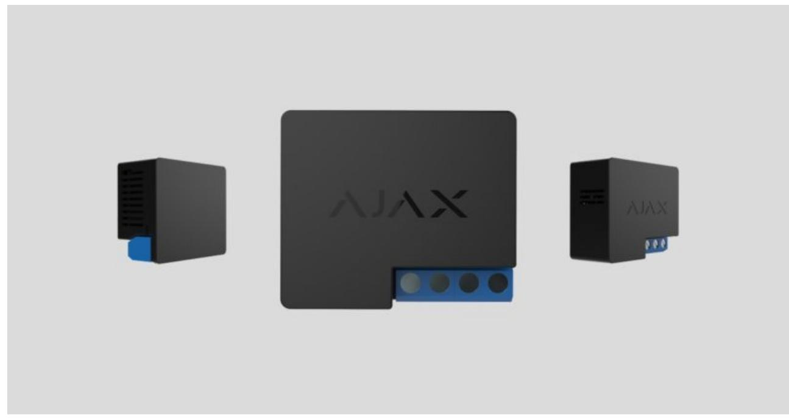
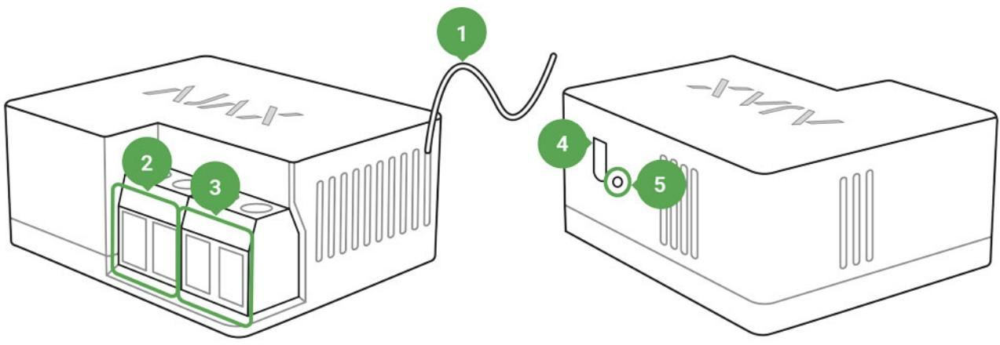
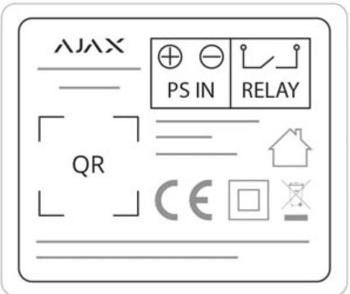
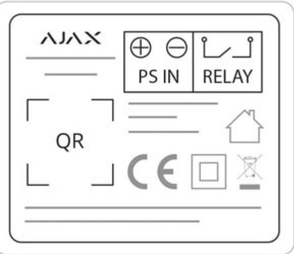

# Relay User Manual

Updated December 8, 2021

**Relay** is a wireless, low-voltage relay featuring potential-free (dry) contacts. Use Relay to remotely switch on/off appliances powered by a 7–24 V DC source. Relay can operate both in pulse and bistable mode. The device communicates with a hub via radio protocol. In the line of sight, the communication distance is up to 1,000 m. Jeweller

The Relay contacts are not galvanically connected to the device itself, so they can be connected to the input control circuits of various equipment to imitate a button, toggle switch, etc.

Relay is compatible only with and does not support connecting via or . Ajax hubs uartBridge ocBridge Plus

Use scenarios to program actions of (Relay, WallSwitch or Socket) in response to an alarm, press or schedule. A scenario can be created remotely in the Ajax app. automation devices Button

#### How to create and configure a scenario in the Ajax security system

The Ajax security system can be connected to the central monitoring station of a security company.

#### Buy low-tension relay Relay

# Functional Elements

- **1.** Antenna
- **2.** Power supply terminal block
- **3.** Contacts terminal block
- **4.** Function button
- **5.** Light indicator

- **PS IN terminals** "+" and "-" contact terminals, 7-24 V DC input power supply.
- **Relay terminals** output potential-free terminals.

# Operating Principle

Do not connect Relay power supply input terminals to a voltage exceeding 36 V or alternate current sources. It creates a risk of fire and will damage the device!

Regardless of the type of electrical circuit, only a qualified electrician should install Relay!

Relay is powered by a 7–24 V DC source. The recommended voltage values are 12 V, and 24 V. Use the to connect and set up Relay. Ajax Security System app

Relay features dry (potential-free) contacts. The contacts are not connected to the device galvanically so that Relay can imitate a button, switch, etc. in electrical circuits of various voltages (sirens, electrical valves, electromagnetic locks). The miniature body makes it possible to install Relay inside a junction box, switchboard, or a switch.

Relay closes and opens the contacts by user command from the app or automatically by scenario.

# **Relay operation modes:**

- **Bistable** Relay opens or closes contact and remains in this state.
- **Pulse** Relay opens or closes contacts for a pre-set time (from 0.5 to 255 seconds) then switches back to the initial state.

# Connecting to the hub

### Before connecting the device:

- **1.** Switch on the hub and check its Internet connection (the logo glows white or green).
- **2.** Install the . Create the account, add the hub to the app, and create at least one room. Ajax app
- **3.** Make sure that the hub is not armed, and it does not update by checking its status in the Ajax app.
- **4.** Connect Relay to 12 or 24 V power supply.

Only users with administrator rights can add a device to the app

# To pair Relay with a hub:

- **1.** Click **Add device** in the Ajax app.
- **2.** Name the device, scan it, or enter the **QR code** manually (located on the case and packaging), select the room.

- **3.** Click **Add** the countdown will begin.
- **4.** Press the functional button.

For detection and pairing to occur, the device should be located in the coverage area of the hub's wireless network (at the same object). The connection request is transmitted only at the moment of switching on the device.

If the device failed to pair, wait 30 seconds and then retry. Relay will appear in the list of hub devices.

The device statuses update depends on the ping interval set in the hub settings. The default value is 36 seconds.

# States

**1.** Devices

- **2.** Relay

| Parameter                | Value                                                                           |
|--------------------------|---------------------------------------------------------------------------------|
| Jeweller Signal Strength | Signal strength between the hub and Relay                                       |
| Connection               | Connection status between the hub and the relay                              |
| Routed Through ReX       | radio signal Displays the status of using a range extender                |
| Active                   | State of the relay contacts (closed / open)                                     |
| Voltage                  | The current input voltage                                                       |
| Temporary Deactivation   | Displays the status of the device: active or completely disabled by the user |
| Firmware                 | Device firmware version                                                         |
| Device ID                | Device identifier                                                               |

# Settings

**1.** Devices

**2.** Relay

**3.** Settings

| Settings                      | Value                                                                                                                                                                                                                     |
|-------------------------------|---------------------------------------------------------------------------------------------------------------------------------------------------------------------------------------------------------------------------|
| First field                   | Device name, can be edited                                                                                                                                                                                                |
| Room                          | Selecting the virtual room to which the device is assigned                                                                                                                                                             |
| Relay Mode                    | Choosing the relay operation mode Pulse Bistable                                                                                                                                                                    |
| Contact State                 | Normal contact state Normally Closed Normally Open                                                                                                                                                                  |
| Pulse duration, sec           | Selecting the pulse duration in the pulse mode: From 0.5 to 255 seconds                                                                                                                                                |
| Scenarios                     | Opens the menu for creating and configuring scenarios Learn more                                                                                                                                                    |
| Jeweller Signal Strength Test | Switches the relay to the signal strength test mode                                                                                                                                                                    |
| User Guide                    | Opens the Relay User Manual                                                                                                                                                                                               |
| Temporary Deactivation        | Allows a user to deactivate the device without removing it from the system. The device will not execute system commands and participate in automation scenarios. All notifications and alarms will be ignored |

|               | Please note that deactivated device will save it's current state (active or inactive) |
|---------------|------------------------------------------------------------------------------------------|
| Unpair Device | Disconnect Relay from a hub and delete its settings                                   |

**Voltage protection** — the contact will open when the voltage exceeds the limits of 6.5–36.5 V.

**Temperature protection** — the contact will be opened when the temperature threshold of 85°С inside Relay is reached.

# **Indication**

The Relay light indicator can light green depending on the device status.

When not paired with the hub, the light indicator blinks periodically. When the functional button is pressed, the light indicator lights up.

# **Functionality Testing**

The Ajax security system allows conducting tests for checking the functionality of connected devices.

The tests do not start immediately but within a period of 36 seconds when using default settings. The test time start depends on the settings of the detector ping interval (the **Jeweller** menu in the hub settings).

Jeweller Signal Strength Test

# Installation of the Device

Regardless of the type of electrical circuit, only a qualified electrician should install Relay.

The communication range with the hub in the line of sight is up to 1,000 meters. Take this into account when choosing the location for Relay.

If the device has a low or unstable signal strength, use a . radio signal range extender

# Installation process:

- **1.** De-energize the cable to which Relay will be connected.
- **2.** Connect the grid wire to the Relay terminals according to the following scheme:

When installing Relay in the box, lead out the antenna and place it under the plastic frame of the socket. The bigger the distance between the antenna and metal structures, the lower the risk of interfering (and impairment) of the radio signal.

Do not shorten the antenna! Its length is optimal for operation within the used radio frequency range!

During the installation and operation of Relay, follow the general electrical safety rules and the requirements of electrical safety regulatory acts.

It is strictly forbidden to disassemble the device. Do not use the device with damaged power cables.

#### **Do not install the relay:**

- **1.** Outdoors.
- **2.** In metal wiring boxes and electrical panels.
- **3.** In places with temperature and humidity exceeding the permissible limits.
- **4.** Closer than 1 m to a hub.

# Maintenance

The device does not require maintenance.

# Tech Specs

| Actuating element                                  | Electromagnetic relay                                                                                                                                         |
|----------------------------------------------------|---------------------------------------------------------------------------------------------------------------------------------------------------------------|
| The service life of the relay                      | 200,000 switchings                                                                                                                                            |
| Supply voltage range                               | 7 – 24 V (DC only)                                                                                                                                            |
| Voltage protection                                 | Yes, min — 6.5 V, max — 36.5 V                                                                                                                                |
| Maximum load current*                              | 5 A at 36 V DC, 13 A at 230 V AC                                                                                                                              |
| Operating modes                                    | Pulse and bistable                                                                                                                                            |
| Pulse duration                                     | 0.5 to 255 seconds                                                                                                                                            |
| Maximum current protection                         | No                                                                                                                                                            |
| Parameter control                                  | Yes (voltage)                                                                                                                                                 |
| Device energy consumption                          | Less than 1 W                                                                                                                                                 |
|                                                    | Jeweller                                                                                                                                                      |
| Radio communication protocol                       | Learn more                                                                                                                                                    |
| Radio frequency band                               | 866.0 – 866.5 MHz 868.0 – 868.6 MHz 868.7 – 869.2 MHz 905.0 – 926.5 MHz 915.85 – 926.5 MHz 921.0 – 922.0 MHz Depends on the region of sale. |
| Compatibility                                      | hubs radio Operates only with all Ajax , and signal range extenders                                                                               |
| Effective radiated power                           | 3.99 mW (6.01 dBm), limit — 25 mW                                                                                                                             |
| Modulation of the radio signal                     | GFSK                                                                                                                                                          |
| Maximum distance between the device and the Hub | Up to 1000 m (any obstacles absent) Learn more                                                                                                             |
| Communication ping with the receiver               |                                                                                                                                                               |
|                                                    | 12 – 300 sec (36 sec default)                                                                                                                                 |

| Operating temperature range | From 0°С to +64°С (ambient)                                                  |
|-----------------------------|------------------------------------------------------------------------------|
| Max. temperature protection | Yes, over 65°C at the place of installation or over 85°C inside the Relay |
| Operating humidity          | Up to 75%                                                                    |
| Dimensions                  | 39 × 33 × 18 mm                                                              |
| Weight                      | 25 g                                                                         |
| Service life                | 10 years                                                                     |

If using inductive or capacitive load, the maximum commutated current decreases to 3 A at 24 V DC and to 8 A at 230 V AC!

### Compliance with standards

# Complete Set

- **1.** Relay
- **2.** Connecting wires 2 pcs
- **3.** Quick Start Guide

### Warranty

Warranty for the "AJAX SYSTEMS MANUFACTURING" LIMITED LIABILITY COMPANY products is valid for 2 years after the purchase.

If the device does not work correctly, you should first contact the support service — in half of the cases, technical issues can be solved remotely!

#### The full text of the warranty

#### User Agreement

Technical support: support@ajax.systems